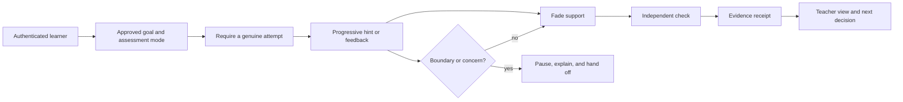

# Education and Tutoring Agent Engineering

This playbook builds a production education agent from a deterministic practice flow into a bounded, observable tutoring capability. Its success condition is not “the learner got an answer.” It is **credible evidence that the learner can do more with less help**, while teachers and institutional systems retain educational authority.

The architecture is deliberately narrow: one authenticated learner, one institution-approved course context, one lesson goal, a finite hint ladder, an independent check when policy allows, and a structured teacher receipt. Expand only after evaluation shows learning value without unacceptable dependency, safety, privacy, accessibility, fairness, or integrity costs.

## What this playbook is for

Use it for learner-facing formative practice that may:

- retrieve teacher-approved examples and questions;
- ask the learner to explain or attempt a step;
- give progressive, policy-bounded hints and feedback;
- adapt the next formative item within an approved goal;
- record evidence with assistance and provenance metadata;
- summarize evidence and uncertainty for a teacher;
- draft an institution-approved guardian communication for human review;
- continue safely after pauses, provider delays, or compacted context.

It does **not** authorize the agent to:

- assign final grades or alter the grade of record;
- decide admission, progression, discipline, diagnosis, disability, eligibility, accommodation, or special-education placement;
- provide protected answers in restricted or high-stakes assessments;
- infer cheating or make surveillance or proctoring decisions;
- replace a teacher, counselor, designated safeguarding lead, guardian, or emergency process;
- build a companion relationship or maximize learner engagement.

## Core outcome model



The distinction that matters is:

| Weak proxy | Better evidence |
|---|---|
| Answer accepted | Reasoning or step independently produced |
| Practice completed with help | Comparable item completed after support fades |
| Model says “mastered” | Multiple relevant evidence events with assistance, freshness, and scoring provenance |
| Long session | Efficient progress without escalating hint dependence |
| Learner returned daily | Learner can perform later without the tutor |

## Learning path

Read in order for a greenfield implementation. Experienced teams can enter at the relevant control but should preserve the contracts introduced earlier.

1. [Mission, boundaries, workload fit, and stages](01-mission-boundaries-workload-fit-and-stages.md) — select the workload, deterministic baseline, smallest loop, authority matrix, and Stage 0–6 gates.
2. [Reference architecture and runtime](02-reference-architecture-runtime-and-integration-map.md) — implement the control, data, and learning planes and the bounded runtime.
3. [Identity, consent, state, events, and continuity](03-learner-identity-consent-course-state-and-continuity.md) — make learner context and replayable state explicit.
4. [Curriculum, pedagogy, adaptation, and assessment](04-curriculum-learning-design-adaptive-tutoring-and-assessment.md) — align goals, build hint ladders, collect evidence, and prevent dependency.
5. [Context, seven memory levels, planning, and compaction](05-context-memory-learner-model-planning-and-compaction.md) — manage personalized context without an uncontrolled profile.
6. [Tools, effects, approvals, reconciliation, and handoffs](06-tools-effects-approvals-reconciliation-and-handoffs.md) — keep external changes deterministic and recoverable.
7. [Security, privacy, accessibility, fairness, and integrity](07-security-privacy-accessibility-fairness-and-integrity.md) — defend tenants and learners, preserve access, and encode assessment boundaries.
8. [Evaluation, observability, SLOs, and incidents](08-evaluation-observability-slos-and-safeguarding-incidents.md) — prove technical and pedagogical behavior and operate safeguarding paths.
9. [Deployment, scale, recovery, and governed evolution](09-deployment-scale-cost-recovery-and-governed-evolution.md) — handle queues, cells, degraded modes, costs, rollout, and drift.
10. [Adapter and provider qualification](10-adapter-and-provider-qualification.md) — qualify LMS, SIS, curriculum, assessment, calendar, messaging, and model adapters.

The evidence and design decisions behind the playbook are recorded in the [research packet](../../research/packets/education-tutoring-agent-blueprint.md).

## Build artifact map

| Artifact | Owner | Required before |
|---|---|---|
| Workload and authority declaration | Product, teacher, policy owner | Any model trial |
| Institution policy bundle | Privacy, safeguarding, assessment, accessibility owners | Learner-facing test |
| Curriculum mapping release | Curriculum owner and teacher | Goal selection |
| Learner context receipt | Identity/consent service | Every run |
| Run, event, evidence, and effect ledgers | Runtime owner | Stateful pilot |
| Hint policy and assessment-mode matrix | Teacher/assessment owner | Formative generation |
| Continuity receipt | Runtime owner | Pause, compaction, or handoff |
| Teacher dashboard and safeguarding route | School owner | Learner-facing pilot |
| Evaluation pack and release gates | Evaluation owner | Shadow/canary |
| Adapter qualification certificates | Integration owner | Provider production use |
| Behavior bundle manifest | Release owner | Every deployment |
| Recovery exercise record | Operations owner | Stage 5 |

## Non-negotiable invariants

1. A run has exactly one tenant, institution, learner subject, course context, active goal, policy bundle, and behavior bundle.
2. Identity comes from an authenticated institutional path. Conversation content cannot change role, age band, enrollment, guardian relationship, or authority.
3. Assessment mode is resolved before content generation. Missing or conflicting policy fails closed.
4. The learner attempts before escalating help unless an approved accessibility accommodation changes the interaction.
5. The tutor never claims that assisted completion proves mastery.
6. Final grades and other excluded decisions have no executable tool in the runtime.
7. Every effect has an intent, semantic idempotency key, authority result, terminal or unknown state, and reconciliation rule.
8. A timeout never means that a provider mutation failed.
9. Long-term learner-model fields are attributable, correctable, deletable, and purpose-bound.
10. Retrieved content, tool results, and learner messages remain untrusted data.
11. Safeguarding concern handling pauses ordinary tutoring and follows the institution’s current human procedure.
12. Raw prompts and outputs are not logged or retained by default.

## Recommended first production slice

Start with a single subject and age band in one institution:

- teacher-authored goals and item bank;
- SSO or validated LTI launch;
- read-only roster and course context;
- open-practice mode only;
- fixed hints plus model-generated rephrasing constrained to cited content;
- at most three hint escalations;
- one unassisted exit item;
- no gradebook, guardian-message, calendar, or assessment writes;
- structured teacher receipt with evidence and uncertainty;
- a static-hint fallback if the model or retrieval provider fails.

This slice is useful without pretending that generation, multi-agent orchestration, or broad tool access is inherently necessary.

## Example run declaration

```yaml
run_id: run_01K...
tenant_id: district_42
institution_id: school_7
learner_subject_id: psn_8f1c
course_context:
  course_id: algebra_1_2026
  section_id: period_3
  role: learner
goal:
  local_goal_id: linear_equations_one_step
  framework_ref: case:example:math:8.EE.C.7
  mapping_release: 2026-fall-r3
assessment_policy:
  mode: open_practice
  policy_version: algebra1-2026-08-15
  maximum_hint_level: 4
  independent_check_allowed: true
authority:
  teacher_id: staff_219
  guardian_contact: human_review_only
  gradebook_write: forbidden
policy_bundle: school7-child-safety-2026-09-01.r2
behavior_bundle: tutor-math-0.3.1
retention_class: formative-evidence-90d
```

## Teacher dashboard minimum

The default dashboard shows a structured receipt, not a full surveillance transcript:

- learner, course, goal, and curriculum mapping version;
- assessment mode and applicable accommodations used;
- attempts, item identifiers, score provenance, and maximum hint level;
- independent, delayed, or transfer evidence separately from assisted work;
- misconception hypotheses with source evidence and expiry;
- repeated answer-seeking, prolonged struggle, accessibility friction, or concern signals;
- unresolved source conflicts, unknown effects, and evidence corrections;
- teacher actions: acknowledge, correct evidence, adjust goal, approve a draft, contact a guardian under policy, or escalate through safeguarding procedure.

Access is role-based and audited. Sensitive excerpts are revealed only when the user has a legitimate purpose and policy permits it.

## How to use the placeholders

Values such as `[TARGET]`, `[RPO]`, `[RTO]`, `[RETENTION]`, and `[MAX_HINTS]` are deliberate. The institution must set them from risk, law, assessment policy, age group, provider behavior, and pilot evidence. Hard safety gates—such as zero cross-tenant disclosures, zero final-grade writes, and zero protected high-stakes answer leaks—are not placeholders.

## Related foundations

- [Cross-cutting blueprint controls](../../research/packets/agent-blueprint-cross-cutting-controls.md)
- [Agent state and event contracts](../../runtime/agent-state-and-event-contracts.md)
- [Durable execution](../../runtime/durable-execution.md)
- [Context engineering](../../context-memory/context-engineering.md)
- [Memory architecture](../../context-memory/memory-architecture.md)
- [Compaction and continuity](../../context-memory/compaction-and-continuity.md)
- [Idempotency and side effects](../../reliability/idempotency-and-side-effects.md)
- [Prompt injection and untrusted data](../../security/prompt-injection-and-untrusted-data.md)
- [Evaluation-driven development](../../evaluation/evaluation-driven-development.md)

## Completion standard

An implementation is not production-ready because it answers correctly in a demo. It must pass the stage gates, adapter qualification, pedagogical boundary tests, security and accessibility checks, failure injection, reconciliation drills, teacher workflow review, safeguarding exercise, rollback exercise, and an institution-approved evidence review. The final question is always: **what reliable learning capability was added, for whom, under whose authority, and how do we know?**
