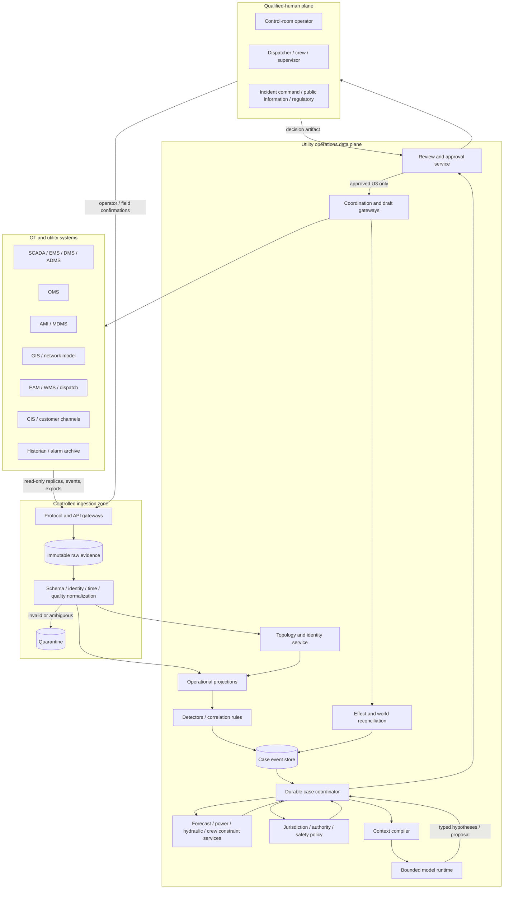
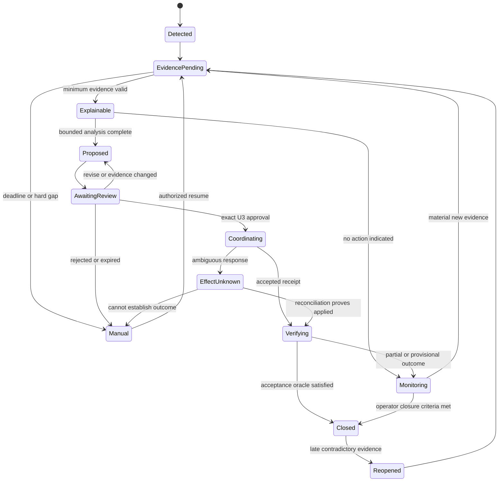

# Reference Architecture and Staged Delivery

> **Last reviewed:** 2026-08-31  
> **Purpose:** select the smallest architecture that survives long incidents, partial failures, OT trust boundaries, and storm-scale load without placing a model in a control loop.

The recommended architecture is a durable, mostly deterministic case coordinator with one bounded model step. It is not a multi-agent control room. The model receives a compiled evidence view, may request approved read tools, and emits a typed analysis or proposal. Deterministic services own ingestion, identity, topology, rules, simulation, policy, approval, effects, reconciliation, and release.

## Reference architecture



There is no arrow from the model or coordination gateway to SCADA control, protection, dispatch, process-control, switching, or safety systems. Where a vendor product exposes reads and controls through the same API, deploy separate endpoints, service identities, routes, proxies, and product permissions; the agent-facing proxy implements reads only.

## Three planes and four truth layers

### Plane responsibilities

| Plane | Owns | Failure posture |
|---|---|---|
| Control | Protection, automatic control, operator HMI, dispatch, switching/valve/process execution, safety interlocks | Continues independently; agent is nonessential and removable |
| Data and coordination | Evidence ingestion, identity, topology, case state, analysis, proposals, review, drafts, reconciliation | Becomes read-only/manual; never bypasses control procedures |
| Field | Damage assessment, job briefing, clearance participation, qualified work, field tests and observations | Uses existing radio/manual procedures when digital coordination fails |

### Truth layers

1. **Declared/engineering truth:** equipment, connectivity, ratings, customers, operating procedures, critical-load registry.
2. **Observed truth:** telemetry, alarms, meter events, customer calls, field reports, weather, lab results.
3. **Operational projection:** deterministic, versioned interpretation of what is currently known, including contradictions and unknowns.
4. **Verified outcome:** independent postconditions accepted by the authorized role.

An OMS prediction or model narrative is neither observed truth nor a verified outcome.

## Components and build-or-buy decisions

| Component | Default implementation | Why |
|---|---|---|
| Ingestion | Existing broker/replica/API gateway plus immutable raw store | Preserves source payload and decouples OT availability from analysis |
| Normalization | Typed adapters with conformance tests | Utility protocols and products differ in quality, sequence, timestamp, and authority semantics |
| Identity/topology | Existing GIS/CIM/ADMS network model exposed through a controlled snapshot/trace service | Avoid duplicating the utility network model inside the agent |
| Detection | Existing OMS/ADMS rules plus deterministic supplemental detectors | Repeatable, explainable, fast under storm load |
| Case state | Append-only events plus rebuildable projection | Handles late/corrected/duplicate evidence and audit |
| Coordination | Durable workflow runtime | Incidents wait hours/days, survive restart, approvals, callbacks, and ambiguous writes |
| Model | One provider-neutral structured-output boundary | Minimizes cost, nondeterminism, and attack surface |
| Simulation | Validated domain tools/digital twin | Feasibility and physics do not belong in natural-language reasoning |
| Policy | Signed rules and operator/jurisdiction packs | Authority cannot live in prompts or model memory |
| Effects | Narrow U3 gateways with read-back | A generic connector hides idempotency and finality |
| Observability | Application audit ledger plus traces/metrics/logs | Diagnostics cannot replace operational evidence or compliance records |

Do not add a vector database, knowledge graph, multi-agent framework, or new event bus unless the operating case demonstrates a gap that existing platforms cannot meet.

## Case coordinator

Use one durable workflow per case aggregate. A fixed macro-state machine constrains model use:



The workflow owns deadlines, waits, case transitions, leases, model/tool budgets, approval expiry, and reconciliation scheduling. The model can select only enumerated local analysis steps. It cannot invent a new state, suppress a mandatory check, or terminalize a case.

## Runtime selection criteria

The coordinator needs:

- durable timers and external-signal waits;
- deterministic or otherwise replay-safe workflow logic;
- idempotent activities and explicit retry policy;
- per-case and per-resource serialization or fenced leases;
- workflow versioning and migration controls;
- searchable but non-authoritative workflow state;
- cancellation propagation and compensation activities;
- history limits with a tested continue/rollover mechanism;
- region/cell recovery and backlog replay controls;
- audit integration without copying sensitive raw OT data into workflow history.

A database-backed worker loop can satisfy these needs if implemented carefully. A durable workflow platform can reduce plumbing. Product choice does not eliminate application-level identity, authority, idempotency, or reconciliation.

## Data-flow rules

1. Store the exact raw source payload or a legally permitted cryptographic reference before normalization.
2. Normalize into typed observations without discarding source quality, timestamps, sequence, warnings, or unknown fields.
3. Resolve identity under the utility/commodity/territory scope; unresolved items go to quarantine.
4. Build deterministic projections from a pinned topology and conflict policy.
5. Detect cases with rules whose version is recorded.
6. Compile a minimal context packet by query; never replay the raw event stream into the model.
7. Verify structured model output against schema, citations, allowed claim types, and hard constraints.
8. Run physics/forecast/crew/policy services outside the model and record their exact status.
9. Route a sealed proposal to the qualified-human system.
10. Coordinate only allowed U3 artifacts and read them back from the authoritative destination.

## Stage 0–6 implementation program

### Stage 0: Contract and deterministic baseline

Deliver:

- operating-unit and authority manifests;
- source/field authority and conflict matrix;
- topology/identity/time/quality contracts;
- case lifecycle and independent completion oracle;
- manual/deterministic baseline metrics;
- threat model and physical control isolation;
- jurisdiction/operator pack and retention schedule;
- historical replay corpus, including false positives and disputed cases.

Exit only after a tabletop shows that loss of the agent has no effect on control or emergency procedures.

### Stage 1: Observe and normalize

Build read-only adapters, raw evidence retention, normalization, quarantine, projections, and deterministic detectors. Run historical and live shadow ingestion.

Measurable gates:

- 100% of accepted observations have utility, source, identity status, event/ingest time, quality, provenance, and schema version;
- duplicate delivery produces one semantic observation;
- late and corrected events rebuild the expected projection;
- no cross-utility or cross-territory retrieval in adversarial tests;
- detector results match the labeled deterministic baseline within the approved tolerance;
- ingestion load shedding preserves control-system and broker health.

### Stage 2: Explain in shadow

Add the context compiler and model for cited timeline, contradiction, hypothesis, missing-evidence, and operator-question output. No proposals or external writes.

Measurable gates:

- every operational claim maps to an included evidence ID or is labeled inference;
- unsupported certainty and source-priority violations are zero in the safety set;
- prompt injection from customer text, work notes, documents, and vendor fields cannot change tools or authority;
- multiple trials meet claim precision, abstention, latency, and operator-usefulness thresholds;
- output remains useful under model unavailability through deterministic evidence summaries.

### Stage 3: Propose in simulation

Add typed scenario catalogs, validated topology traces, weather/forecast services, physics or hydraulic simulators, crew/qualification constraints, and communication drafts.

Measurable gates:

- every option lists prerequisites, hard constraints, uncertainty, expected service impact, critical-load implications, and required owner;
- infeasible, non-converged, stale, or out-of-domain tool results cannot be presented as viable;
- switching, control, safety, or public-health instructions are rejected;
- operator review shows benefit over the baseline without increased cognitive load or anchoring errors.

### Stage 4: Govern reviews

Seal proposal artifacts and integrate identity, on-duty role, segregation of duties, expiry, and approval invalidation. Still no external coordination effect.

Measurable gates:

- any material evidence, topology, policy, simulation, case-scope, owner, or time-window change invalidates approval;
- approval cannot be replayed for another case/resource or after expiry;
- approvers see changes, uncertainty, alternatives, and forbidden actions;
- break-glass cannot add a U4 route or bypass evidence retention.

### Stage 5: Coordinate narrow effects

Allow one or two low-risk U3 operations, such as posting an exact approved case note or placing a communication draft into a review queue. Keep control actions prohibited.

Measurable gates:

- duplicate requests and worker crashes do not duplicate the semantic effect;
- lost responses enter `EFFECT_UNKNOWN` and reconcile before retry;
- cancellation and supersession produce an auditable terminal or forward-recovery state;
- every effect reaches verified, not-applied, superseded, compensated, or manually resolved within its SLO;
- the global/cell write kill switch leaves read-only evidence available.

### Stage 6: Scale and governed evolution

Add case types, utilities, adapters, and regions as separately qualified cells. Run storm-scale capacity, DR, recovery-load, and behavior-drift programs.

Measurable gates:

- critical cases meet reserved-capacity SLOs during tested bursts;
- noisy utilities/case types cannot starve others;
- region loss, queue replay, stale lease, and duplicate callback drills pass;
- behavior, model, prompt, policy, adapter, topology-profile, and forecast versions roll back independently;
- production outcomes enter an offline reviewed dataset, never an automatic self-modification path.

## Promotion manifest

```yaml
release_manifest:
  release_id: euops-electric-outage-2026.08.4
  operating_units: [util_north_01/electric_distribution/district_7]
  case_types: [sustained_feeder_outage]
  behavior_bundle: euops-behavior/4.2.1
  model_route: evidence_synthesis_route/7
  schemas: euops-contracts/3.1.0
  detector_bundle: outage-rules/12.4
  topology_profile: gis-un-v8-to-canonical/5
  adapters:
    adms: adms-reader/6.3.2
    oms: oms-case-reader/4.1.0
    mdms: ami-events/7.0.3
  policy_pack: us_example_electric_dist_2026_08
  simulation_profiles: [opendss-study-profile/3]
  authority_ceiling: READ_ANALYZE_PROPOSE
  u3_effects: []
  evaluation_report: artifact://sha256/...
  approved_by: [utility_operations, safety, ot_security, regulatory, platform]
  rollback_to: euops-electric-outage-2026.07.9
```

Promotion is immutable. Runtime configuration may disable a feature or lower authority, but cannot silently substitute an untested adapter, topology profile, prompt, model, or policy pack.

## Failure containment

Partition by utility and operational authority first, then by region/cell. Each cell has:

- separate service identities and encryption keys;
- scoped raw evidence, case, memory, and audit stores;
- admission control and queue quotas;
- an independent write kill switch;
- declared control-center and field escalation paths;
- pinned adapters and policy pack;
- recovery point and time objectives appropriate to the case;
- a manual-mode runbook.

Shared model, weather, embedding, or observability services receive minimized, tenant-scoped requests. They do not receive control credentials, private keys, full topology, critical-load registries, or raw customer lists unless explicitly justified and approved.

## Architecture anti-patterns

| Anti-pattern | Production failure |
|---|---|
| Chatbot connected directly to ADMS/SCADA | Prompt/model error becomes a cyber-physical control path |
| One “utility API” tool | Hides commodity, product, version, state, quality, finality, and authority semantics |
| Transcript as case state | Restart, compaction, and concurrent updates lose operational truth |
| Model-based outage detector only | Non-repeatable correlation and unverifiable absence claims under telemetry gaps |
| Digital twin treated as live state | A model can be stale, misparameterized, non-convergent, or inapplicable |
| Multi-agent storm swarm | Amplifies load, conflicting hypotheses, coordination errors, and operator noise |
| Shared utility tenant with prompt-only scope | Cross-utility evidence and credential leakage |
| Automatic learning from closed incidents | Poisoned or exceptional outcomes silently alter behavior |

## Primary evidence

- [NIST SP 800-82 Rev. 3, Guide to Operational Technology Security](https://www.nist.gov/publications/guide-operational-technology-ot-security)
- [NIST IR 7628 Rev. 1, Guidelines for Smart Grid Cybersecurity](https://csrc.nist.gov/pubs/ir/7628/r1/final)
- [DOE cybersecurity baselines for electric distribution systems and DER](https://www.energy.gov/ceser/cybersecurity-baselines-electric-distribution-systems-and-der-and-guidance)
- [NIST SP 1800-45, secure OT remote access for water/wastewater](https://www.nist.gov/publications/cybersecurity-water-and-wastewater-sector)
- [IEC 61968-3:2021, interfaces for distribution network operations](https://webstore.iec.ch/en/publication/67251)
- [IEC 61968-100:2022, implementation profiles for utility application integration](https://webstore.iec.ch/en/publication/67766)

Next: [topology, identity, state, event, and effect contracts](03-topology-identity-state-event-and-effect-contracts.md).
