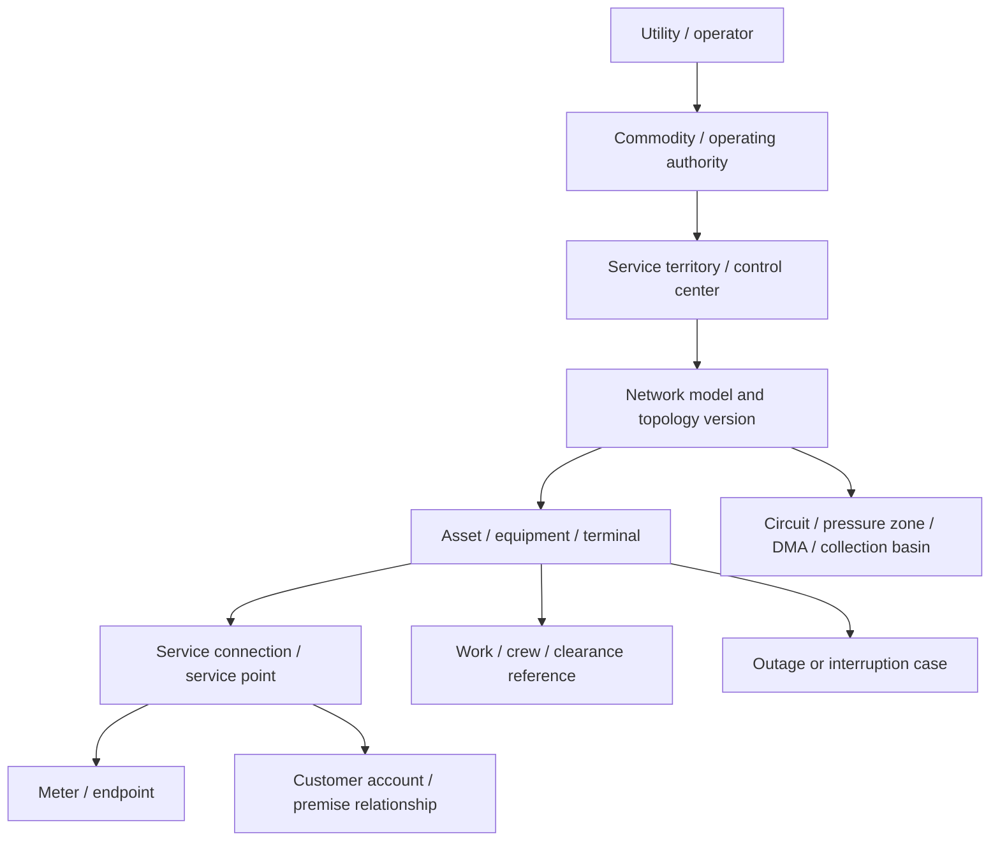

# Topology, Identity, State, Event, and Effect Contracts

> **Last reviewed:** 2026-08-31  
> **Purpose:** prevent false operational conclusions caused by flattened identities, mutable history, stale topology, ambiguous time, and unverified effects.

The canonical model is not a replacement for GIS, SCADA/EMS/DMS/ADMS, OMS, AMI/MDMS, CIS, EAM/WMS, historian, LIMS, or field systems. It is a versioned coordination vocabulary that preserves each source's meaning and supports deterministic projections.

## Identity hierarchy

Every identifier is scoped. A device tag, feeder name, meter number, valve ID, work order, or customer account is not globally unique.



Keep distinct:

- physical asset, functional equipment, logical device, telemetry point, and display alias;
- terminal/connectivity node and geospatial coincidence;
- premise, service point, meter, endpoint, customer/account, occupant, and critical-service classification;
- designed circuit/zone, current energized/pressurized connectivity, outage polygon, and administrative area;
- work order, task, crew assignment, clearance/permit, switching/work plan, and field observation;
- alarm/event ID, outage case ID, incident ID, emergency-management incident, and regulatory report.

## Canonical identity record

```yaml
asset_identity:
  utility_id: util_north_01
  commodity: electric_distribution
  canonical_asset_id: asset_sw_1048
  asset_class: recloser
  authority: gis_un_v8
  source_keys:
    gis_global_id: "{C1A2-...}"
    adms_equipment_id: EQ-44910
    scada_device_tag: NORTH.RCL.1048
    wms_asset_id: A-004811
  terminals:
    - terminal_id: t_source
      phases: [A, B, C]
    - terminal_id: t_load
      phases: [A, B, C]
  effective_interval:
    from: 2026-04-12T02:00:00Z
    to: null
  resolution_status: VERIFIED
  mapping_version: identity-map/42
  provenance: artifact://sha256/...
```

Mappings are temporal, versioned records. Replaced meters, renamed feeders, split pressure zones, phase changes, temporary jumpers, normally open devices, bypasses, and retired assets must not overwrite history.

### Identity conflict states

| State | Meaning | Agent behavior |
|---|---|---|
| `VERIFIED` | Mapping meets current policy and effective time | Use within scope |
| `PROVISIONAL` | Evidence suggests a mapping but steward has not confirmed | Display; exclude from control-impact counts unless policy permits |
| `AMBIGUOUS` | Multiple candidates remain | Quarantine and ask steward/operator |
| `COLLISION` | One source key maps to incompatible canonical identities | Stop affected projection |
| `ORPHAN` | Source identity has no canonical mapping | Preserve raw evidence; no topology inference |
| `RETIRED` | Identity is historical only | Use for historical event time, never current operations |

## Canonical effective-time and correction semantics

The coordination model is bitemporal. `effective_from`/`effective_to` describe when a fact applies in utility operations; `recorded_at` and append-only record versions describe when the platform learned it. A query always declares both an operational `as_of` and a knowledge cut or event watermark. Re-running an old incident with today's corrected GIS or customer mapping is a different query and must not masquerade as the original decision context.

| Object | Scoped identity | Required version and effective-time fields | Correction, conflict, and terminality rule |
|---|---|---|---|
| Utility, commodity, territory, grid/network, topology snapshot | `utility_id` + `commodity` + operating-authority/territory ID; network model and snapshot IDs are never global | Operator/legal entity version; territory boundary version and interval; engineering model generation; operational-overlay cut/watermark; temporary-configuration intervals; snapshot creation, `as_of`, `valid_until`, validation state and digest | Boundary or authority change creates a new version. A later topology correction links to the superseded snapshot; it does not rewrite the snapshot used by a prior decision. Incompatible engineering/operational cuts are `CONFLICT`, not a blended graph. |
| Asset, equipment, device, terminal, telemetry point | Canonical asset ID plus distinct equipment/device/terminal/point IDs under utility and model scope; every native key is namespace-qualified | Mapping version and effective interval; lifecycle state; model generation; phase/terminal; point-list/configuration version; calibration and engineering-unit version where applicable | Replacement, rename, reparenting, phase change or point remap closes the old mapping and opens a new one. Collision/ambiguity quarantines dependent observations. Physical co-location never implies connectivity. |
| Telemetry, measurement, and quality | Immutable observation ID plus native event/sample ID, stream/session and subject point ID | Source/device/event/receive/ingest time; sequence and reset epoch; native and normalized quality; validity deadline; unit, scale, aggregation/deadband and adapter/schema versions; query coverage/watermark | A corrected, substituted or manually entered value is a new observation with `correction_of`/`supersedes`; originals remain visible. Quality never silently upgrades. Absence is usable only with proven query/population coverage. |
| Alarm and event | Native alarm instance/occurrence ID and event ID are distinct from point and case IDs | Alarm-definition/philosophy version; occurrence, activation, acknowledgement, return-to-normal, shelving/suppression intervals as read-only source facts; priority/class at event time | Reclassification or configuration change is a governed source event, not an agent edit. An alarm can return to normal without the underlying incident/case being resolved. Duplicate presentation does not collapse native audit records. |
| Outage/service-interruption case and emergency/incident | Utility case ID, native OMS case ID and incident-command/emergency ID remain separate with explicit links | Aggregate version; detected/opened/declared/merged/split/reopened/operationally closed/administratively final times; owner and operational-period versions | Merge, split, reopen and correction are append-only transitions with lineage. OMS closure, incident demobilization and service restoration are separate states. Only the named owner can accept terminal criteria. |
| Customer, premise, service point, meter and critical load | Separate IDs for person/account, premise, service point, endpoint/meter and critical-service record under utility scope | Relationship and occupancy/service intervals; meter-install interval; registry policy/version, verification time, expiry and access class | Do not infer identity or criticality from name/address/free text. Late mapping corrections cause a new impact calculation and correction trail; they do not erase the count originally released. Customer/account deletion rules do not delete legally retained deidentified operational evidence without owner review. |
| Crew, worker, contractor, resource and qualification | Workforce ID, crew composition ID, resource/equipment ID and qualification/authorization ID; no name-only matching | Roster and assignment versions; on-duty interval; qualification/medical/training/covered-task scope and expiry; fatigue/rest status as-of; resource availability/inspection interval | Qualification, availability and fitness are point-in-time source facts, never remembered preferences. Crew composition or status change invalidates the proposal. Emergency deviations are human-approved records under operator procedure. |
| Work, dispatch, clearance/permit and restoration step | Work order, task, assignment, dispatch request and qualified-plan/step IDs are distinct | Revision/status version; planned, dispatched, accepted, started, observed, completed and verified times; dependency/precondition versions; authoritative actor | Administrative completion is not physical completion or service restoration. The agent stores a reference/status for switching, clearance or field steps but never their executable instructions. Offline changes reconcile as conflicts rather than last-write-wins. |
| Forecast and scenario/study | Forecast/run ID and scenario/study ID scoped to provider, model and operating unit | Provider/model/features/input data versions; issue and `as_of`; horizon/valid interval; revision/supersession; topology/model cut; solver/settings/seed; convergence and applicability | A revision is a new run linked to its predecessor. Scenario feasibility is valid only for its pinned inputs. `UNKNOWN`, non-convergent or out-of-domain never becomes `FEASIBLE` through narrative. |
| Constraint and policy assertion | Constraint ID plus signed policy/procedure pack and clause/reference | Rule/schema version; effective/expiry interval; evaluated-at time; input digest; result and reason | `UNKNOWN` fails closed for hard constraints. Waiver/deviation is a separately authorized, expiring record; the agent cannot synthesize one. A pack update invalidates dependent proposals/approvals. |
| Proposal and approval | Immutable proposal version/digest and approval decision ID; approver role/identity resolved outside the model | Case/evidence/topology/constraint/behavior/adapter versions; created/approved/expiry times; allowed effect types/resources; signature | Any bound material change invalidates approval. Rejection and expiry remain in history. Approval never grants control authority or applies to similar content/resources. |
| Effect, attempt, verification, cancellation and correction | Stable semantic operation ID; unique attempt ID; native operation/resource/audit IDs; correction/retraction has its own semantic ID | Intent/approval/target version; fence; dispatch/accept/apply/verify times; callback/read-back watermarks; cancellation deadline/state; adapter qualification | Transport success is nonterminal. Ambiguity becomes `EFFECT_UNKNOWN`; freeze and reconcile before retry. Partial application is recorded per target. Correction/retraction is a new reviewed forward effect, never mutation of the original. |

Canonical queries reject records whose utility, commodity, authority, territory, effective interval, schema/profile or version lineage cannot be resolved. Rendered “current state” is always a projection over this retained history, never a mutable truth row.

## Topology contract

Utility topology has engineering and operational layers:

```yaml
topology_snapshot:
  topology_snapshot_id: topo_util_north_01_20260831T0900Z_882
  utility_id: util_north_01
  commodity: electric_distribution
  engineering_model:
    authority: gis_un_v8
    model_version: branch-default/gen-99172
    exported_at: 2026-08-31T08:58:12Z
    validation_state: VALID_WITH_WARNINGS
    dirty_areas: 2
  operational_overlay:
    authority: adms_prod
    state_cut: 2026-08-31T09:00:00Z
    sequence_watermark: 884199201
    coverage: 0.982
    stale_devices: [asset_sw_982]
  temporary_configuration:
    authority: operator_log
    records: [temp_jumper_188]
  applicability:
    territories: [district_7]
    valid_until: 2026-08-31T09:00:30Z
  digest: sha256:...
```

The model service reports warnings and uncertainty; it never returns only a graph.

### Required topology relationships

- connectivity by exact terminal and, where applicable, phase;
- containment and structural attachment without confusing them with connectivity;
- source/controller and sink/service relationships;
- normal state versus observed/assumed current state;
- network tier/pressure zone/DMA/basin/circuit membership;
- protective or isolation boundary references;
- meter-to-service-point-to-transformer/pipe/lateral relationship;
- temporary configurations and their expiry;
- model boundary and external-network equivalence;
- version, validation errors, dirty/stale areas, and coverage.

IEC CIM or a vendor utility network improves exchange but does not decide which source is authoritative, whether the current switching/valve state is fresh, or whether a field crew changed the configuration outside the expected digital path.

## Observation contract

```yaml
utility_observation:
  observation_id: obs_01K4...
  utility_id: util_north_01
  commodity: electric_distribution
  subject:
    kind: telemetry_point
    canonical_id: point_rcl1048_pos
    asset_id: asset_sw_1048
  value:
    kind: enum
    value: OPEN
    unit: null
  source:
    system: scada_prod
    native_id: EVT-881922
    adapter: scada-read/6.3.2
    qualification_id: aq-scada-vendorx-2026q3
  time:
    source_event_at: 2026-08-31T09:01:02.112Z
    device_at: 2026-08-31T09:01:02.090Z
    received_at: 2026-08-31T09:01:02.180Z
    ingested_at: 2026-08-31T09:01:02.225Z
    clock_quality: SYNCED
    estimated_skew_ms: 22
  quality:
    code: GOOD
    native_code: "0x00"
    validity_deadline: 2026-08-31T09:01:12.112Z
    substituted: false
  sequence:
    stream_id: rtu_77_session_998
    number: 22881
    gap_before: false
  correction_of: null
  coverage:
    query_complete: true
    population: one_point
  raw_evidence: artifact://sha256/...
```

### Time rules

- Never sort solely by ingest time.
- A clock reset, RTU restart, failover, daylight-saving conversion, timezone mistake, or sequence wrap starts a new ordering segment.
- Preserve source event, device, receive, ingest, record, and effective time when available.
- Display operator-local time only as a rendering; store an unambiguous instant and timezone context.
- A correction is a new linked observation; do not mutate the original.
- Windows used for outage correlation or alarm suppression name the clock and late-arrival policy.

### Quality and coverage rules

`SUSPECT`, `STALE`, `INVALID`, `SUBSTITUTED`, `MANUAL`, and `UNKNOWN` are values about the observation, not decoration. Aggregation must define whether each is accepted. “No matching record” becomes evidence only if source identity, interval, pagination, partition, filters, watermark, and adapter warnings establish complete coverage.

## Events, alarms, and cases

Keep three concepts distinct:

| Concept | Definition | Example |
|---|---|---|
| Event | Attributed occurrence or observation | Breaker position change, AMI last gasp, low-pressure measurement, customer no-water call |
| Alarm | Operator-oriented notification that requires a defined response under an alarm philosophy | SCADA low-low pressure alarm |
| Case | Durable coordination aggregate built from evidence and decisions | Feeder outage or water main-break service interruption |

The agent does not create or reclassify a safety-related alarm. It may correlate alarm records and identify contradictory or missing evidence.

## Operational state projection

```yaml
operational_projection:
  projection_id: proj_feeder_f12_20260831T090105Z
  projection_type: network_service_state
  utility_id: util_north_01
  scope: feeder_f12
  topology_snapshot_id: topo_util_north_01_20260831T0900Z_882
  as_of: 2026-08-31T09:01:05Z
  status: DEGRADED_EVIDENCE
  facts:
    source_device_state: OPEN
    downstream_service: UNKNOWN
    estimated_service_points_interrupted: 4821
  evidence_ids: [obs_01K4a, obs_01K4b]
  conflicts:
    - field: downstream_service
      sources: [ami_aggregate, customer_calls]
      reason: insufficient_meter_coverage
  quality:
    topology: VALID_WITH_WARNINGS
    telemetry: GOOD
    ami_coverage: 0.61
  rule_bundle: projection-rules/14.2
  rebuild_digest: sha256:...
```

The projection says what is known, unknown, or contradictory. It does not erase the underlying evidence.

## Outage and interruption case contract

```yaml
utility_case:
  case_id: case_elec_20260831_1882
  utility_id: util_north_01
  commodity: electric_distribution
  case_type: sustained_feeder_outage
  jurisdiction_pack: us_example_electric_dist_2026_08
  owner:
    control_center: north_dcc
    qualified_role: distribution_system_operator
    on_duty_identity: user_882
  lifecycle:
    state: EVIDENCE_PENDING
    version: 17
    opened_at: 2026-08-31T09:01:04Z
    next_deadline: 2026-08-31T09:03:04Z
  scope:
    topology_snapshot_id: topo_util_north_01_20260831T0900Z_882
    candidate_assets: [asset_sw_1048]
    affected_area_status: PROVISIONAL
  evidence_refs: [obs_01K4a, proj_feeder_f12_20260831T090105Z]
  hypotheses:
    - id: hyp_1
      claim: upstream_protective_operation
      status: UNVERIFIED
      supporting: [obs_01K4a]
      contradicting: []
  constraints:
    policy_bundle: outage-policy/22
    critical_load_snapshot: cl_20260831_0900
  effect_summary:
    pending: 0
    unknown: 0
  continuity_receipt: receipt://case_elec_20260831_1882/v17
```

Case merge and split are explicit events. Preserve parent/child relationships, affected-customer calculation history, communications already released, and work/effect ownership. Never merge solely because two cases share a feeder name or time window.

## Forecast contract

```yaml
utility_forecast:
  forecast_id: wx_outage_utilnorth_20260831_run06
  forecast_type: asset_damage_and_customer_interruptions
  provider: validated_outage_forecast_service
  version: model/9.4+features/12
  as_of: 2026-08-31T06:00:00Z
  horizon:
    start: 2026-08-31T12:00:00Z
    end: 2026-09-01T12:00:00Z
  scope: district_7
  distribution:
    p10: 400
    p50: 2800
    p90: 12000
    unit: interrupted_service_points
  inputs:
    weather_run: nws_official_products_20260831_0600
    asset_snapshot: asset-risk/2026-08-30
    vegetation_snapshot: veg/2026q2
  applicability:
    status: IN_DOMAIN
    known_gaps: [recent_construction_not_in_features]
  calibration:
    report: artifact://sha256/...
    slice: tropical_wind_district_7
    last_evaluated: 2026-06-30
  use_ceiling: staffing_scenario_input
```

The model runtime cannot create forecast probabilities. It may explain a versioned forecast and must preserve quantiles, assumptions, and applicability.

## Proposal and effect contracts

### Sealed proposal

```yaml
restoration_support_proposal:
  proposal_id: prop_case1882_v3
  case_id: case_elec_20260831_1882
  case_version: 19
  topology_snapshot_id: topo_util_north_01_20260831T0900Z_882
  evidence_digest: sha256:...
  scenario_catalog: elec_outage_support/8
  option:
    kind: dispatch_damage_assessment
    target_area: feeder_f12_segment_3
    rationale_evidence: [obs_01K4a, obs_01K4b]
  prerequisites:
    - road_access_check
    - qualified_crew_assignment
  hard_constraints:
    - no_switching_instruction
    - dispatcher_confirms_crew_safety
  expected_information_gain: high
  uncertainty: ami_coverage_low
  required_owner: distribution_dispatch_supervisor
  created_by:
    behavior_bundle: euops-behavior/4.2.1
    model_route: evidence_synthesis_route/7
  expires_at: 2026-08-31T09:15:00Z
  digest: sha256:...
```

### Effect ledger

```yaml
coordination_effect:
  semantic_operation_id: case1882/post-approved-dispatch-note/v1
  case_id: case_elec_20260831_1882
  effect_type: wms_case_note_create
  risk_class: U3
  proposal_digest: sha256:...
  approval_id: appr_7721
  target:
    system: ewms_prod
    resource_id: dispatch_incident_992
  precondition:
    target_version: "41"
    case_version: 19
  desired_postcondition:
    exact_note_digest: sha256:...
  idempotency:
    native_key: case1882-note-v1
    resource_serialization_key: ewms/dispatch_incident_992
  state: DISPATCH_PENDING
  attempts: []
```

The effect ledger contains coordination artifacts only. Executed switching, valve movement, process control, and field safety actions remain records of their authoritative systems and qualified operators, ingested as observations.

## Event envelope

All durable case events use a common envelope:

```json
{
  "event_id": "evt_01K4...",
  "event_type": "CaseEvidenceLinked",
  "schema_version": "3.1.0",
  "utility_id": "util_north_01",
  "aggregate_type": "utility_case",
  "aggregate_id": "case_elec_20260831_1882",
  "aggregate_version": 18,
  "occurred_at": "2026-08-31T09:01:06Z",
  "recorded_at": "2026-08-31T09:01:06.220Z",
  "actor": {"kind": "detector", "id": "outage-rules/12.4"},
  "causation_id": "obs_01K4a",
  "correlation_id": "case_elec_20260831_1882",
  "jurisdiction_pack": "us_example_electric_dist_2026_08",
  "payload": {"evidence_id": "obs_01K4a"},
  "integrity": {"sha256": "..."}
}
```

Require optimistic aggregate versions or fenced ownership. Duplicate event IDs are idempotent; conflicting reuse is a security/consistency incident.

## Projection and reconciliation rules

- Projections are disposable and rebuildable from immutable records plus pinned rule/topology versions.
- Rebuild results must produce a digest; nondeterministic differences fail release tests.
- World reconciliation periodically compares declared topology, operational state, OMS cases, AMI/customer service, WMS completion, and released communications.
- An operator override is an attributed event with reason and expiry, not an in-place data edit.
- A late field report can reopen a closed case without rewriting the original closure.
- Retention/deletion applies to source artifacts, normalized observations, projections, indexes, prompts, traces, and memory according to their separate policies.

## Contract anti-patterns

- `status: outage` with no subject, source, time, quality, scope, or calculation method;
- one ID for premise, account, service point, and meter;
- treating geospatial overlap as electrical/hydraulic connectivity;
- last-write-wins across GIS, SCADA, OMS, AMI, customer, and field sources;
- deleting corrected events;
- calculating “customers restored” from work-order closure alone;
- omitting units, phases, pressure datum, timezone, sequence session, or quality flags;
- using a forecast point estimate without as-of, horizon, version, and applicability;
- placing operator approval or executed switching steps in conversational memory;
- reporting an effect as complete from HTTP `200` or queue acknowledgement.

## Primary evidence

- [IEC 61970-301:2020+A1:2022, Common Information Model base](https://webstore.iec.ch/en/publication/74467)
- [IEC 61968-13:2021, common distribution power-system model profiles](https://webstore.iec.ch/en/publication/34213)
- [IEC 61968-9:2024, meter reading and control interfaces](https://webstore.iec.ch/en/publication/75041)
- [IEC 61968-4:2019, records and asset-management interfaces](https://webstore.iec.ch/en/publication/61452)
- [Esri ArcGIS Utility Network subnetworks, version 3.5 documentation](https://pro.arcgis.com/en/pro-app/3.5/help/data/utility-network/subnetworks.htm)
- [Esri Utility Network editing and branch-version semantics](https://pro.arcgis.com/en/pro-app/3.5/help/editing/edit-a-utility-network.htm)

Next: [telemetry, alarms, outage detection, and forecasting](04-telemetry-alarms-outage-detection-and-forecasting.md).
