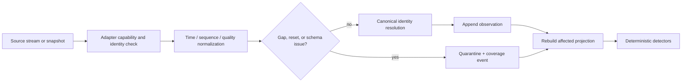
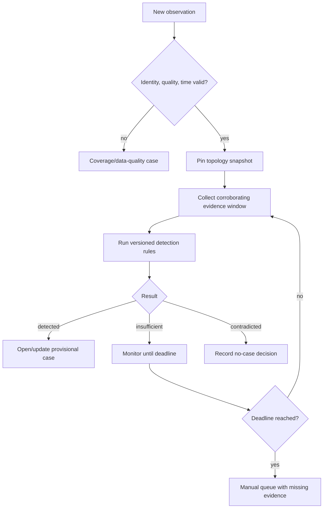

# Telemetry, Alarms, Outage Detection, and Forecasting

> **Last reviewed:** 2026-08-31  
> **Purpose:** build trustworthy service-condition evidence without confusing signals, alarms, inferred outages, forecasts, and verified restoration.

Utility evidence is incomplete by design. SCADA observes selected points; AMI may be delayed, sampled, or disconnected; customer contacts are biased and duplicated; topology can be dirty; work status can lag reality; field radio reports can be partial; and weather forecasts describe uncertainty. The correct result is often `UNKNOWN`, not a confident single state.

## Evidence matrix

| Evidence | Strength | Common failure | Safe use |
|---|---|---|---|
| SCADA/EMS/DMS telemetry | Fast, device/point-specific, quality-coded | Stale/bad quality, RTU failover, clock/sequence gaps, point mapping error | Device state/measurement only within coverage and validity |
| Protection/relay event record | Precise sequence evidence when synchronized | Access delay, clock error, incomplete retrieval, security sensitivity | Qualified engineering analysis; never let model reinterpret settings/action as authority |
| OMS case/prediction | Operationally useful aggregate | Inference based on incomplete topology/calls; manual merge/split lag | Case-management evidence, not physical truth |
| AMI last-gasp/power-up/read | Broad customer-edge evidence | Mesh/backhaul outage, battery behavior, batching, false absence, meter-service mapping error | Probabilistic/corroborating outage and restoration evidence with coverage |
| Customer call/digital report | Direct service experience | Duplicate, address/account mismatch, device-side issue, accessibility/digital bias | Attributed observation; aggregate carefully |
| GIS/network model | Engineering connectivity and asset identity | Dirty topology, delayed as-builts, temporary configuration | Pinned trace with validation status |
| Historian/alarm archive | Time-series and operator-notification history | Compression, deadband, missing quality, retention, replay differences | Trend/evidence analysis under documented semantics |
| Field observation | High-value physical evidence | Free text, delayed entry, location error, changing conditions | Qualified and signed observation with time/location/coverage |
| WMS/dispatch | Assignment and work lifecycle | Administrative completion differs from physical/service state | Coordination state; not restoration proof |
| Weather/provider data | Hazard observations/forecasts | API rate limits, revisions, geospatial mismatch, deterministic misuse | Versioned hazard input and scenario range |
| Model/digital twin | Counterfactual/feasibility evidence | Wrong topology/parameters, non-convergence, simplified physics | Versioned study result; never live truth |

## Telemetry ingestion pipeline



Do not place a model in this path. At storm volume, normalization and rules must continue even when model capacity is exhausted.

### Stream health contract

```yaml
stream_health:
  utility_id: util_north_01
  source: scada_prod
  stream_id: rtu_77_session_998
  as_of: 2026-08-31T09:10:00Z
  state: DEGRADED
  expected_cadence_ms: 2000
  last_sequence: 22881
  sequence_gaps: [{from: 22820, to: 22826}]
  event_time_lag_ms: {p50: 180, p95: 820, max: 12200}
  bad_quality_fraction: 0.018
  identity_orphans: 3
  coverage:
    expected_points: 1840
    reporting_points: 1771
  validity_for_use:
    outage_detection: false
    evidence_display: true
  reason_codes: [SEQUENCE_GAP_EXCEEDS_POLICY]
```

The detector consumes `validity_for_use`, not a generic system-up flag.

## Alarm management boundary

An alarm exists to notify an operator of an abnormal condition requiring a defined response. It is not a generic event, analytic score, or model suggestion. Alarm philosophy, rationalization, priority, shelving/suppression, response, performance monitoring, audit, and management of change remain in the operator's governed alarm-management lifecycle.

The agent may:

- group duplicate representations of the same alarm without hiding the original records;
- assemble related measurements, topology, work, and operating notes;
- flag chattering, stale, standing, or contradictory evidence for the alarm owner;
- show which response-procedure version applies;
- summarize an alarm flood after deterministic priority and safety rules run;
- draft an analysis for formal rationalization or audit.

It must not:

- change a setpoint, priority, classification, deadband, suppression, shelving, or inhibit state;
- decide that a safety-related alarm can be ignored;
- invent a response or reorder safety/operator priorities;
- acknowledge an alarm on behalf of an operator;
- suppress alarms to reduce model context.

IEC 62682:2022 and the ISA-18 series define lifecycle-oriented alarm management for process industries. PHMSA requires written alarm-management provisions for covered pipeline control rooms. Local alarm philosophy and regulation govern; the agent is an evidence consumer.

## Deterministic outage or interruption detection

Detection is a correlation problem with explicit coverage, not a generative classification.



### Electric example rule

```yaml
detection_rule:
  id: feeder_source_open_with_service_loss/12.4
  applies_to: electric_distribution
  trigger:
    point_kind: protective_device_position
    transition: [CLOSED, OPEN]
    accepted_quality: [GOOD]
  correlation_window: 120s
  required:
    - valid_topology_snapshot
    - source_device_identity_verified
  corroboration_any:
    - downstream_voltage_points_below_threshold_count >= 2
    - ami_last_gasp_weighted_coverage >= 0.20
    - customer_no_power_reports_verified >= 3
    - operator_declared_outage
  exclusions:
    - active_test_or_planned_switching_reference
    - telemetry_stream_gap_intersects_window
  outputs:
    detected: PROVISIONAL_OUTAGE
    insufficient: EVIDENCE_PENDING
```

The thresholds are operator-specific examples, not universal recommendations.

### Gas and water examples

For gas, a pressure excursion plus alarm is not automatically a leak or interruption. A safe detector may open an evidence case when quality-valid measurements, topology, work, controller logs, and customer/field reports meet operator-defined conditions, then hand off classification to the qualified controller.

For water, a pressure drop, high flow, acoustic sensor, customer no-water calls, and main-break report may suggest a service interruption. Contamination, water-quality risk, isolation, and public-health actions remain qualified-human decisions using lab, regulatory, and incident protocols.

## Case deduplication, merge, and split

Use deterministic candidate generation and operator-owned decisions:

- candidate duplicate features: shared upstream isolating/protective asset, overlapping trace, event window, field incident, planned work, or native OMS relationship;
- blockers: incompatible topology snapshots, distinct fault indicators, separate work ownership, different jurisdictions, or active nested-outage evidence;
- record merge/split reason, actor, source cases, resulting case, customer-impact history, released communications, and evidence lineage;
- never discard the losing hypothesis or reports;
- re-evaluate on material topology or field evidence.

An LLM may explain why cases appear related. It does not perform the merge.

## Affected-customer and asset calculation

The calculation requires:

1. a pinned topology snapshot and operational overlay;
2. explicit source/isolation boundary assumptions;
3. phase/terminal awareness where applicable;
4. service-point and meter mappings effective at event time;
5. excluded/de-energized/nonserved status rules;
6. critical-load classification snapshot;
7. coverage and unresolved identity counts;
8. calculation method and version.

```yaml
impact_estimate:
  case_id: case_elec_20260831_1882
  as_of: 2026-08-31T09:04:00Z
  topology_snapshot_id: topo_util_north_01_20260831T0900Z_882
  method: downstream_trace/7.3
  service_points:
    likely_interrupted: 4821
    status_unknown: 317
    excluded: 41
  critical_services:
    likely_interrupted: 4
    unknown: 1
  unresolved_identities: 12
  assumptions: [source_device_open, temporary_jumper_188_active]
  status: PROVISIONAL
  confidence_basis: deterministic_coverage_rules
```

Do not manufacture a scalar model “confidence.” Report evidence coverage, disagreement, and rule status.

## Restoration verification ladder

Restoration is a multi-signal state:

| Level | Evidence | Meaning |
|---|---|---|
| R0 | Work/control action reported | An action may have occurred; no service claim |
| R1 | Authoritative device/network state read-back | Intended state appears applied; downstream service unverified |
| R2 | Telemetry/AMI indicates service return for sufficient coverage and stability window | Provisional service restoration |
| R3 | Critical/exception service points checked; nested outages handled; customer and field contradictions resolved | Case-level operational restoration candidate |
| R4 | Qualified operator accepts jurisdiction/operator closure criteria | Verified operational closure |
| R5 | Post-event reconciliation and reporting complete | Administrative finality |

The agent may recommend the next evidence check. Only the authorized role advances operator-owned acceptance.

### Nested outage example

After an upstream feeder is energized, 92% of reporting meters send power-up signals. A lateral remains damaged. The correct projection is “upstream restoration observed, 388 service points remain likely interrupted,” not “feeder restored.” Communications and metrics retain both the upstream restoration time and nested-case impact.

## Forecasting contract and evaluation

Forecast families include weather hazard, load/demand, renewable/DER output, asset failure/damage, customer interruption, crew/work duration, and estimated restoration time. Keep them separate.

Every production forecast must expose:

- provider, model/features/data versions and run time;
- `as_of`, issue time, valid interval, horizon, spatial/asset scope;
- point, quantiles, interval, or distribution with units;
- official advisory/watch/warning identity where applicable;
- calibration, sharpness/error, coverage, and evaluation slice;
- data latency, missingness, and revision policy;
- out-of-distribution/applicability result;
- allowed decision use and fallback;
- supersession relationship.

### Weather adapter rules

The U.S. NWS API provides forecasts, alerts, and observations and has documented rate limits and known upstream issues. CAP alerts contain urgency, severity, certainty, areas, issue/expiry, and update/cancel relationships. Cache by product lifecycle, respect limits, preserve the original alert, process update/cancel semantics, and use resilient official dissemination alternatives when required by the operator. Do not scrape a consumer weather page or use a single deterministic model run as an operational oracle.

### Forecast evaluation

- use rolling-origin/temporal validation, never random leakage across storms or seasons;
- compare against persistence, climatology, operator heuristic, and current production baseline;
- score quantiles/distributions with appropriate proper scores and coverage, not only point MAE;
- slice by territory, hazard, asset class, season, event magnitude, data availability, and horizon;
- measure calibration drift and decision utility, including overstaffing/understaffing and false alert cost;
- evaluate revisions: an excellent final forecast that arrived after mobilization was due is not operationally excellent;
- require applicability and abstention under rare or structurally changed conditions.

## Estimated restoration times

An ETR is a forecast and a communication commitment, not an automatically inferred timestamp. Model separately:

- assessment/crew-arrival estimate;
- damage-class conditional repair-duration distribution;
- network-level restoration scenario;
- customer-facing ETR approved under operator policy;
- actual service-restoration and case-closure times.

An ETR proposal includes dependencies, quantiles/range, update trigger, source, issue time, affected scope, and approver. The agent does not publish or silently roll an ETR forward.

## Storm example

At 08:00, an official hurricane product shifts the wind swath. The outage forecast rises from p50 8,000 to 24,000 customers, but p90 remains 70,000. The agent may:

1. show the two forecast runs and what changed;
2. map the hazard to current asset/vegetation snapshots with declared gaps;
3. request deterministic staffing/logistics scenarios at p50 and p90;
4. identify critical dependencies and data feeds at risk;
5. draft an incident-command briefing.

It may not assert that 24,000 customers will lose power, autonomously mobilize crews, publish an ETR, change system configuration, or substitute a private model for official warnings.

## Data-quality and alarm-flood runbook

1. Record affected sources, streams, points, intervals, quality, gaps, and topology scope.
2. Disable model-driven case creation for invalidated detectors.
3. Keep deterministic safety/alarm systems and operator HMI untouched.
4. Admit only operator-defined priority cases to the evidence compiler.
5. Display a coverage banner and missing-evidence list in every packet.
6. Use alternate validated sources; do not silently substitute them.
7. Create a data-quality case for the owning team.
8. Reconcile observations and cases after recovery before reopening normal detection.
9. Measure false merges, missed nested outages, and timeline changes caused by recovered data.

## Primary evidence

- [IEC 61968-3:2021, distribution network-operations interfaces](https://webstore.iec.ch/en/publication/67251)
- [IEC 61968-9:2024, meter-reading and control integration](https://webstore.iec.ch/en/publication/75041)
- [IEC 62682:2022, management of alarm systems](https://webstore.iec.ch/en/publication/65543)
- [ISA-18 standards and technical reports](https://www.isa.org/standards-and-publications/isa-standards/isa-18-series-of-standards)
- [PHMSA control-room management inspection guidance](https://www.phmsa.dot.gov/pipeline/control-room-management/crm-workshops-and-inspection-guidance)
- [NWS API documentation, updated 2026-03-24](https://www.weather.gov/documentation/services-web-api)
- [NWS CAP alert service documentation](https://www.weather.gov/documentation/services-web-alerts)
- [IEEE 1366-2022 active standard page](https://standards.ieee.org/ieee/1366/7243/)

Next: [restoration planning, field coordination, and communications](05-restoration-planning-field-coordination-and-communications.md).
