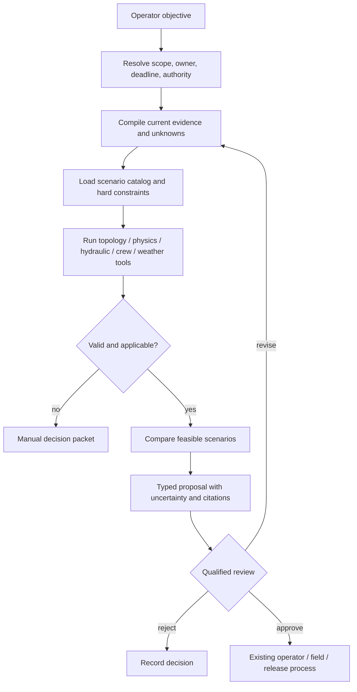
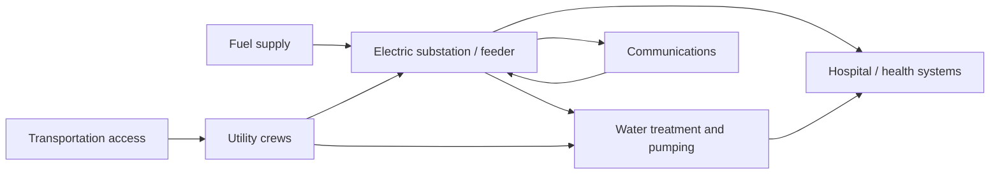

# Restoration Planning, Field Coordination, and Communications

> **Last reviewed:** 2026-08-31  
> **Purpose:** support qualified operators and incident leaders with bounded, evidence-backed choices while keeping control, safety, field execution, and public release human owned.

The agent plans information and coordination, not utility control. It can compare scenarios from approved catalogs, call validated deterministic tools, identify missing prerequisites, and prepare reviewable artifacts. It cannot create an executable switching order, valve sequence, process-control action, clearance, or public-health decision.

## Planning layers

| Layer | Owner | Agent role |
|---|---|---|
| Incident objectives and priorities | Incident commander/utility leadership under approved plans | Summarize evidence and draft alternatives |
| Network/control strategy | Qualified system/pipeline/water operator and engineers | Present validated scenario results; no command sequence |
| Safety/clearance/work protection | Authorized employee, system operator, crew supervisor, safety roles | Show required references and unresolved prerequisites |
| Field logistics and dispatch | Dispatcher/supervisor/mutual-aid leadership | Propose assignments using verified qualifications, access, travel, materials, rest, and priority constraints |
| Customer/public/regulatory communication | Authorized communications, public-health, regulatory, and legal roles | Draft from approved facts; never release or sign |
| Post-event reconciliation | Operations plus regulatory/data owners | Assemble lineage, discrepancies, calculations, and draft report |

## Bounded planning loop



Bound the loop by maximum tool calls, model calls, wall time, evidence age, scenario count, and revision count. A material update restarts from evidence compilation rather than patching an old plan in prose.

## Scenario catalog

The catalog contains coordination choices, not free-form actions:

```yaml
scenario_type:
  id: electric_damage_assessment_dispatch/8
  commodity: electric_distribution
  output_authority: PROPOSAL_ONLY
  parameters:
    target_area: canonical_topology_area
    priority_reason: enum
    requested_by: qualified_role
  prerequisites:
    - current_hazard_and_access_assessment
    - crew_qualification_and_rest_status
    - dispatcher_capacity
    - no_conflicting_assignment
  hard_constraints:
    - no_switching_or_clearance_instruction
    - no_critical_customer_details_outside_need_to_know
    - crew_supervisor_accepts_job
  evaluation_tools:
    - topology_impact_read
    - route_access_read
    - crew_qualification_read
  required_approver: distribution_dispatch_supervisor
  expiry: 15m
```

Separate catalogs by commodity, utility, territory, season, incident mode, and authority. The runtime cannot create a new type during an event.

## Hard and soft constraints

### Hard constraints

- protection, safety interlock, clearance, isolation, and qualified-worker rules;
- voltage/thermal/stability or pressure/hydraulic/water-quality limits as determined by validated tools and qualified engineers;
- public/crew safety, fire/public-health restrictions, and road/access closures;
- critical-facility and cross-lifeline dependencies under current incident policy;
- operator roles, work jurisdiction, covered-task/qualification, union/contract, and fatigue/rest rules;
- crew/equipment/material capability and asset compatibility;
- regulatory notification or coordination deadlines;
- approved work and change windows;
- forbidden U4 operations.

The model cannot relax a hard constraint. `UNKNOWN` is not `PASS`.

### Soft constraints

- expected customers or critical services restored;
- information gained by assessment;
- travel and repair time distributions;
- equitable access and vulnerable-customer communication needs;
- crew continuity and staging efficiency;
- cost and material use;
- communication clarity and update cadence.

Optimization returns status (`OPTIMAL`, `FEASIBLE`, `INFEASIBLE`, `UNKNOWN`, `INVALID`, or product-specific equivalent), objective values, gaps, time limits, and binding constraints. The agent preserves the status and never calls a merely feasible plan optimal.

## Switching and work-plan boundary

The agent may render a proposal summary such as:

> “The validated study profile indicates scenario S-17 could reduce the affected area if the switching authority confirms current topology, clearances, protection readiness, and the approved switching order. No switching steps are included.”

It must not generate or transform this into ordered breaker/valve actions, tag placement, clearance instructions, grounding steps, energization language, or operator commands. Those artifacts remain in qualified planning systems and procedures. Even summarization should exclude step-by-step operational instructions from model context unless a separately approved read-only use case requires it.

OSHA 29 CFR 1910.269 makes qualified employees, designated employees in charge, system-operator actions, de-energization, tagging, testing, and grounding material safety responsibilities. A conversational approval cannot substitute for them.

## Field dispatch coordination

### Assignment proposal

```yaml
field_assignment_proposal:
  proposal_id: fap_case1882_v2
  case_id: case_elec_20260831_1882
  incident_operational_period: op_20260831_day
  work_type: damage_assessment
  target:
    topology_area_id: feeder_f12_segment_3
    map_reference: artifact://sha256/...
  crew_requirements:
    qualifications: [electric_distribution_damage_assessment]
    minimum_people: 2
    equipment: [four_wheel_drive, radio]
    rest_status_policy: FATIGUE-04
  hazard_inputs:
    weather_alerts: [urn:oid:nws-alert-...]
    road_status_as_of: 2026-08-31T09:04:00Z
    known_electrical_hazard: downed_conductor_possible
  criticality:
    priority_class: incident_objective_2
    sensitive_details_ref: restricted://critical-load/...
  conflicts_checked_at: 2026-08-31T09:04:15Z
  required_decisions:
    - dispatcher_acceptance
    - crew_supervisor_job_briefing
  expires_at: 2026-08-31T09:14:15Z
```

The proposal does not assign the crew, declare access safe, perform a job briefing, or authorize work.

### Field observation

```yaml
field_observation:
  observation_id: fld_77291
  case_id: case_elec_20260831_1882
  submitted_by:
    crew_id: crew_42
    user_id: emp_381
    qualification_context: damage_assessment
  observed_at: 2026-08-31T09:42:11Z
  recorded_at: 2026-08-31T09:44:03Z
  location:
    asset_id: pole_7712
    gps: restricted://geo/...
    accuracy_m: 8
  observation_type: conductor_down
  structured_details:
    phase: UNKNOWN
    public_hazard: true
    access_blocked: false
  attachments: [artifact://sha256/...]
  coverage: visual_from_public_right_of_way
  signature: sigstore:...
```

Free text and attachments are untrusted content. Extracted claims remain proposals until the submitter or reviewer confirms structured fields.

## Emergency and incident-command integration

FEMA NIMS distinguishes on-scene tactical activity, EOC incident support, policy guidance, and public communication. Mirror the operator's incident structure; do not create a parallel AI command chain.

The agent can prepare an operational-period packet:

- current objectives and decision owners;
- utility service impact with topology/coverage caveats;
- critical community-lifeline dependencies;
- weather/hazard products and forecast scenarios;
- crews/resources assigned, en route, blocked, or requested;
- safety/public-health constraints as quoted from approved sources;
- unresolved decisions and deadlines;
- customer/public/regulatory drafts awaiting release;
- data-quality, cyber, and platform degradation;
- changes since the previous approved packet.

Every statement has an evidence ID and `as_of`. The packet never declares incident stabilization or service restoration without the authorized role.

## Critical-load and cross-lifeline decisions

FEMA identifies energy and water as community lifelines and emphasizes interdependencies. A prioritization proposal must represent dependencies, not merely rank customer labels:



The agent may identify a dependency loop and request a joint decision. It may not promise priority, disclose sensitive locations broadly, or decide which public service is more important.

## Communication preparation

### Audience-specific contracts

| Audience | Required facts | Prohibited shortcuts |
|---|---|---|
| Customer | Affected area/service, observed/estimated status, safety language from approved template, ETR status, next update | Invented cause, precise restoration promise, critical-customer disclosure |
| Public/media | Incident-approved impact, actions underway, safety/public-health text, update channel | Raw topology, cyber details, unverified casualty/damage/cause |
| Field/mutual aid | Exact scope, task, hazards, qualifications, contact/command path, logistics | Customer personal data beyond need; implied work authorization |
| Regulator | Trigger/threshold, chronology, methodology, counts, corrections, accountable signer | Auto-filing, interpretation, omitted uncertainty or corrected history |
| Inter-utility/RC/TSO/DSO/EOC | Approved operational facts, dependencies, requests, time, owner | Control instruction outside authorized channel |

### Communication artifact

```yaml
communication_draft:
  draft_id: comm_case1882_customer_v4
  case_id: case_elec_20260831_1882
  audience: affected_customers
  channel: outage_map_and_sms
  jurisdiction_pack: us_example_electric_dist_2026_08
  fact_snapshot:
    case_version: 31
    impact_estimate_id: impact_1882_0945
    approved_etr_id: null
  template: outage_update_no_etr/7
  claims:
    - text: Crews are assessing damage in the affected area.
      evidence: [wms_assignment_992, fld_77291]
      claim_type: observed_action
  mandatory_disclaimer: etr_not_yet_available
  prohibited_fields_check: PASS
  release_owner: incident_public_information_officer
  expires_at: 2026-08-31T10:00:00Z
  digest: sha256:...
```

Release systems revalidate case version, facts, expiry, template, audience, and approver. Updating a draft after approval invalidates the approval.

## Regulatory reporting preparation

Keep operational, reliability, emergency, cyber, safety, environmental, and customer-service reports separate. The required trigger, clock, form, recipient, confidentiality, preservation, correction, and signer depend on jurisdiction and operator registration.

The agent may:

- evaluate deterministic trigger rules and show the rule result;
- build a source-linked chronology;
- calculate draft metrics through tested code;
- identify missing required fields and conflicts;
- compare the current draft with prior submissions/templates;
- prepare a correction package when later evidence changes a count.

It cannot determine legal applicability, classify a report as privileged/confidential, sign, submit, or certify.

For U.S. electric examples, DOE-417 and NERC event/cyber reporting have distinct triggers and processes. EIA-861 reliability measures depend on declared IEEE/other methods and major-event/loss-of-supply inclusions. Preserve calculation method; never publish a bare SAIDI/SAIFI/CAIDI value.

## Post-event reconciliation

After operational closure:

1. freeze a reporting snapshot while continuing to ingest late evidence;
2. reconcile GIS/topology changes, SCADA/operational states, OMS cases, AMI/customer status, work completion, field observations, released communications, and effect ledger;
3. resolve nested cases, duplicate/merged cases, excluded customers, and planned/unplanned classification;
4. compute metrics using pinned code, denominator, event inclusion, timezone, and major-event method;
5. document corrections and their impact on prior messages/reports;
6. obtain operator, data, regulatory/legal, customer, and incident-owner review as applicable;
7. create a curated outcome artifact for evaluation only after review;
8. delete or retain source, model, prompt, customer, and sensitive infrastructure data per policy.

## Planning anti-patterns

- an LLM writes a switching order, valve sequence, or treatment procedure;
- crew “availability” ignores qualification, rest, current assignment, access, equipment, or command structure;
- restoration priority is derived from customer value, social visibility, or unverified critical status;
- an optimization result omits infeasible/unknown status and binding constraints;
- an ETR point estimate is published without owner, range, assumptions, and update rule;
- the same generic message is sent to customer, regulator, public safety, and field audiences;
- a work-order close event terminalizes the outage;
- the agent submits a regulatory report because a threshold “looks met.”

## Primary evidence

- [OSHA 29 CFR 1910.269](https://www.osha.gov/laws-regs/regulations/standardnumber/1910/1910.269)
- [PHMSA operator qualification](https://www.phmsa.dot.gov/pipeline/operator-qualifications/about-operator-qualification)
- [FEMA Community Lifelines](https://www.fema.gov/emergency-managers/practitioners/lifelines)
- [FEMA NIMS command and coordination](https://www.usfa.fema.gov/a-z/nims/command-and-coordination.html)
- [EPA incident-action checklists for water utilities](https://www.epa.gov/waterutilityresponse/incident-action-checklists-water-utilities)
- [EPA water-contamination response resources](https://www.epa.gov/waterresilience/water-contamination-response-resources)
- [NERC EOP-005-3, system restoration from blackstart resources](https://www.nerc.com/globalassets/standards/reliability-standards/eop/eop-005-3.pdf)
- [EIA survey page for DOE-417 and EIA-861](https://www.eia.gov/Survey/)

Next: [integrations, adapter qualification, and security](06-integrations-adapter-qualification-and-security.md).
