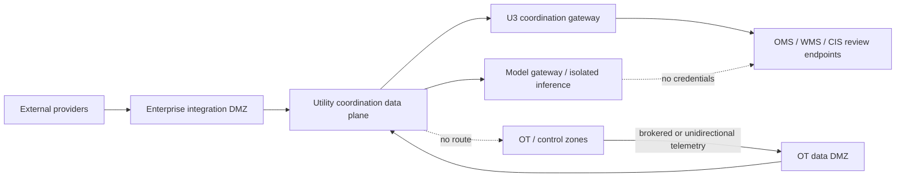

# Integrations, Adapter Qualification, and Security

> **Last reviewed:** 2026-08-31  
> **Purpose:** qualify exact utility interfaces without turning integration convenience into an OT control path or flattening product-specific semantics.

A protocol client, message bus subscription, vendor SDK, JDBC connection, historian query, GIS service, or generic REST connector is not a qualified adapter. Qualification proves identity, data meaning, time/quality behavior, coverage, authority, limits, security, failure semantics, and upgrade compatibility for one exact product/API/profile/deployment.

## Integration inventory

| System/interface | Read purpose | U3 coordination purpose | Permanently prohibited through agent |
|---|---|---|---|
| SCADA/EMS/DMS/ADMS | Telemetry, alarms, operational topology/state, study results through replica/gateway | None by default | Controls, setpoints, dispatch, switching, protection, shed, interlocks |
| OMS | Cases, predictions, affected customers, ETR/release state, chronology | Exact approved case note/draft in mature deployment | Auto-close, switching, unreviewed ETR/publication |
| AMI/head-end/MDMS | Last-gasp/power-up, reads, quality, coverage, meter mapping | None | Remote connect/disconnect, load control, firmware/configuration |
| GIS/utility network | Assets, terminals, connectivity, associations, versions, dirty/error state, traces | Controlled proposal/reference only | Direct production topology edits |
| EAM/WMS/dispatch | Work, crew, qualification, inventory, assignment, field evidence | Exact approved note/request/draft | Work authorization, clearance, safety acceptance, generic dispatch |
| CIS/customer channels | Service-point/account mapping, approved communication status | Put approved draft into release review queue | Autonomous customer contact or sensitive-data export |
| Historian/alarm archive | Time series, quality, alarm/event history | None | Alarm acknowledgement, shelving, suppression, configuration |
| LIMS/water-quality systems | Qualified lab result/status | None | Result alteration, treatment/public-health decision |
| Weather/hazard | Official alerts, forecasts, observations, product updates | None | Public-warning activation |
| Forecast/simulation/digital twin | Versioned scenarios, distributions, feasibility/status | None | Live control or model-to-device path |
| Emergency/regulatory systems | Approved facts, deadlines, status | Draft/staging only if explicitly governed | Filing, certification, signature, emergency declaration |

## Standards are semantic inputs, not safety certificates

### Electric utility interoperability

- IEC 61970 CIM models major utility operational objects and profiles for EMS/grid-model exchange.
- IEC 61968 extends CIM for distribution operations, assets, work, metering, customer support, and network models.
- IEC 61850 provides semantic models, engineering language, and communication services for power utility automation.
- IEC 62351 supplies protocol-specific security, RBAC, key management, monitoring, and related profiles across TC 57 protocols.
- IEEE 1815/DNP3 and IEC 60870-5 variants are common telecontrol protocols; deployment options, security profiles, and vendor behavior must be qualified.
- OPC UA/IEC 62541 can provide modeled industrial data and security services, but endpoint/server/product/profile behavior remains deployment-specific.

A standard message does not establish source authority, live applicability, complete coverage, safe command access, or business finality.

### Current versions pinned at research date

| Standard/profile | Version at 2026-08-31 review | Material point |
|---|---|---|
| IEC 61970-301 | 2020+A1:2022, edition 7.1 | CIM base semantics; does not replace operator source policy |
| IEC 61968-3 | 2021, edition 3.0 | Distribution network operations including topology, outage/trouble, field coordination |
| IEC 61968-9 | 2024, edition 3.0 | Meter/MDMS integration; includes electric and possible gas/water metering applications |
| IEC 61968-13 | 2021, edition 2.0 | Balanced/unbalanced distribution network model profiles |
| IEC 61968-100 | 2022, edition 2.0 | Application-integration profiles; generally not backward compatible with 2013 messages |
| IEC 61970-600-1/-2 | 2021 | CGMES 3.0 structure/rules and exchange profiles |
| ENTSO-E CGMES | v3.0 library; current conformity artifacts tracked separately | Conformance is version/profile/test specific |
| IEC 61850 series | 2026 series catalog reviewed | Individual parts have different editions and amendments |
| IEC 62351 series | 2026 series catalog reviewed | Individual parts/security profiles evolve independently |
| IEC 62682 | 2022, edition 2.0 | Alarm-management lifecycle for process industries |
| IEEE 1366 | 2022 active | Distribution reliability indices and calculation factors |
| NIST SP 800-82 | Rev. 3 final (2023); Rev. 4 only pre-draft call in 2026 | Use Rev. 3 as current final, track revision |

Do not write “supports IEC 61850/CIM” as a qualification result. Record exact parts, editions, profiles, SCL/CIM artifacts, extensions, conformance evidence, and implemented features.

## Qualification dossier

```yaml
adapter_qualification:
  qualification_id: aq-utilnorth-gis-un35-2026q3
  utility_id: util_north_01
  adapter_release: gis-un-reader/5.2.0+sha.91c2
  target:
    product: ArcGIS Utility Network
    pro_documentation_profile: "3.5"
    enterprise_version: "11.5"
    utility_network_version: "8"
    environment: production-read-replica
  transport:
    interface: feature_and_utility_network_services
    authentication: workload_mtls_plus_oauth
    endpoint_scope: utility_north_read_only
  supported_operations:
    asset_read: true
    association_read: true
    named_trace: true
    topology_status_read: true
    edit: false
    control: false
  semantics:
    branch_version: Default
    topology_validation_required: true
    dirty_area_policy: fail_affected_trace
    trace_completion: native_job_complete_plus_result_digest
  limits:
    max_trace_targets: 10
    calls_per_second: 5
    timeout_ms: 15000
  security:
    source_zone: coordination_data_plane
    destination_zone: gis_replica_zone
    credentials_visible_to_model: false
    egress_allowlist: [gis-read.example.internal]
  evidence:
    conformance_suite: euops-adapter-suite/3
    lab_report: artifact://sha256/...
    production_shadow_report: artifact://sha256/...
    verified_at: 2026-08-29T00:00:00Z
    expires_at: 2026-11-29T00:00:00Z
  prohibited:
    - modify_association
    - update_subnetwork_controller
    - edit_default_branch
```

Requalify on product/API/firmware/schema/profile upgrade, topology model migration, auth change, endpoint move, adapter change, new operation, material vendor defect, incident finding, or dossier expiry.

## Operation-level capability manifest

The dossier qualifies a deployment boundary; a signed capability manifest qualifies one operation. There is no adapter-wide inheritance. A read operation on a server does not qualify another read, and neither qualifies a write on the same API, protocol session or product.

```yaml
adapter_operation:
  manifest_version: 2
  operation_id: utilnorth.historian.point_window_read/v3
  qualification_id: aq-utilnorth-historian-opcua-2026q3
  target:
    utility_id: util_north_01
    environment: production-read-replica
    product_release: vendor_historian/2025.2.4
    server_build: 25.2.4.118
    site_configuration_digest: sha256:...
    endpoint_id: hist-replica-02
  interface:
    protocol: OPC_UA
    specification_profile: UA-1.04/Historical-Access-Read
    client_release: opc-reader/4.8.1+sha.91c2
    information_model: utility-points/17
  authority:
    risk_class: U1
    runtime_tier: READ
    identity: spiffe://utilnorth/euops/historian-reader
    allowed_services: [Read, HistoryRead]
    denied_services: [Write, Call, AddNodes, DeleteNodes]
    denied_target_classes: [control, setpoint, alarm_ack, shelving, configuration]
  request_contract:
    required_scope: [utility_id, point_ids, start_at, end_at, max_samples]
    maximum_points: 200
    maximum_window: PT2H
    continuation_policy: exhaust_or_report_incomplete
    consistency: non_atomic_multi_point
  response_contract:
    preserves: [native_node_id, source_time, server_time, status_code, unit, aggregate, continuation_state]
    normalized_status: [COMPLETE, COMPLETE_WITH_WARNINGS, INCOMPLETE, INVALID, UNAVAILABLE]
    empty_requires: [authorized, query_complete, no_continuation, watermark]
  failure_contract:
    timeout_ms: 8000
    retries: safe_read_only_with_jitter
    failover_changes_snapshot: true
    unknown_enum: preserve_and_fail_affected_field
  evidence:
    protocol_conformance: artifact://sha256/...
    site_fixture_report: artifact://sha256/...
    negative_permission_report: artifact://sha256/...
    load_and_failover_report: artifact://sha256/...
  valid_from: 2026-08-29T00:00:00Z
  expires_at: 2026-11-29T00:00:00Z
  signature: sigstore:...
```

The runtime loads manifests by exact `operation_id` and qualification, then verifies target/site digest, declared authority, identity and expiry before network access. A generic URL, SQL, browser, protocol or “call vendor API” tool is forbidden.

### Minimum operation catalog and qualification evidence

| Boundary | Separately manifested operations | Qualification evidence that cannot be skipped | Negative and failure tests |
|---|---|---|---|
| SCADA/EMS/DMS/ADMS | Point snapshot; SOE/event slice; alarm-state read; operational-overlay snapshot; state-estimator/study-result read | Point/equipment/terminal/phase map; scan/event/deadband semantics; source/server clocks; native quality; redundant front-end/failover behavior; estimator convergence and model cut | Attempt select/direct operate, setpoint, tag, inhibit, alarm acknowledge, study-to-live transfer and unrestricted browse; inject RTU reset, sequence wrap, stale substitute and failover conflict |
| Historian and protocol gateway | Point history; event history; bounded subscription; protocol/device health | Exact OPC UA profile/facets or DNP3/IEC 60870-5/IEC 61850 part, edition, device profile/SCL and vendor subset; aggregate/compression/deadband; continuation; session/reconnect; certificate/key/time behavior | Deny OPC UA `Write`/`Call`, DNP3 control function codes, IEC control services and alarm configuration; test continuation loss, duplicate/reordered event, server failover and certificate rollover |
| OMS | Case/prediction read; merge/split lineage read; impact calculation read; approved case-note staging | Native case and prediction versions; nested outage; manual override; ETR types; close/reopen; customer/message state; audit/callback model | Deny auto-close, merge/split, ETR publication and switching; lose response around note write; concurrent native edit; callback duplication/reordering |
| GIS/network model | Asset/terminal/association read; topology snapshot/status; named trace; validation/dirty-area read | Dataset/network/product versions; branch/default generation; controller/tier rules; async job/limit semantics; dirty/error intersection; result digest | Deny edits, association changes and controller updates; trace dirty area; reconcile branch during request; truncate large result |
| AMI/head-end/MDMS | Meter/service mapping; last-gasp/power-up slice; interval/on-demand read status; population coverage | Head-end versus MDMS authority; batching and delivery window; endpoint replacement; mesh/backhaul behavior; event dedup; privacy/retention; query denominator | Deny disconnect/reconnect, load control, demand-response, firmware/key/configuration; inject backhaul loss, delayed batch, meter swap, tamper field and incomplete population |
| EAM/WMS/WFM/mobile | Work/task/crew/resource/qualification read; approved note/request staging; field-observation ingest; sync-status read | Work/status transition map; assignment version; qualification/rest expiry; attachment/signature; device clock; offline sequence/store; conflict and reschedule behavior | Deny work authorization, clearance, generic assignment and completion acceptance; duplicate offline replay; same task edited online/offline; device loss/revocation; partial attachment upload |
| Weather, hazard and geospatial | Product/alert/observation read; polygon/zone intersection; route/access layer read; forecast-run read | Provider/product/version; issue/update/cancel; CRS/datum/geometry repair; units/time; rate/cache/license/redistribution; archive and fallback; forecast applicability | Rate-limit/timeout; stale cache; alert cancellation; antimeridian/invalid polygon; missing zone; provider revision; contract/license denial |
| Customer communication | Approved-template/draft read; release-status read; delivery-status/read-back; at most approved draft staging | Audience/consent/suppression; template and locale; target population cut; carrier/channel statuses; callback authentication; retention/PII; validity/expiry and correction process | Deny direct send/release for this category; duplicate/out-of-order webhook; accepted-but-not-delivered; partial audience; opt-out change; stale ETR; correction after release |
| Approval, incident and workflow | On-duty role read; approval decision read; artifact staging; incident/operational-period status; native job/audit read | Role source and shift cut; SoD/MFA evidence; object/version/status map; asynchronous job finality; cancellation; audit immutability and retention | Approver spoof/replay; shift change; stale digest; partial multi-object change; response loss; cancel/apply race; unauthorized cross-utility resource |

Protocol or product conformance evidence is necessary but insufficient: test the actual server/device build, enabled subset, site configuration, network path, identity, data set and contract. OPC Foundation maintains versioned profiles and a compliance test tool; DNP Users Group documentation includes device profiles and test procedures; those do not prove this deployment's mappings, permissions or operational fitness. Paid/member or licensed artifacts stay in the qualification evidence store and are not copied into model context.

## Required conformance tests

### Reads

- exact target and tenant/utility scope;
- pagination, cursors, partitions, server-side limits, truncation and warnings;
- event/device/record/ingest timestamp parsing and timezone behavior;
- native quality flags, sequence numbers, resets, deadbands, substitutions and stale markers;
- unknown fields and forward-compatible enums;
- empty result versus incomplete/unauthorized/unavailable result;
- snapshot atomicity or lack of it;
- rate limits, backoff hints, bulk limits and maximum query cost;
- failover, duplicate delivery, out-of-order delivery and replay;
- raw evidence capture without secrets or disallowed sensitive data.

### U3 coordination writes

- exact resource and operation semantics;
- native and semantic idempotency;
- optimistic concurrency/version preconditions;
- accepted/pending/applied/final states;
- request timeout before and after possible application;
- callback/webhook authentication, duplicates and reordering;
- read-back oracle independent of the request response;
- cancellation deadline and whether cancellation is advisory;
- partial application and compensation/forward recovery;
- actor/audit attribution and correlation IDs.

No U3 operation is inherited because another endpoint on the same product passed.

## Representative adapter profiles

### SCADA, EMS, DMS, and ADMS

Prefer a read replica, historian, ICCP/data gateway, or brokered northbound interface designed for external consumption. Qualify:

- point/equipment mapping and terminal/phase scope;
- scan versus event values, deadband, quality and substitution;
- device/source timestamp, SOE resolution, time synchronization and failover;
- alarm versus event semantics and acknowledgement state;
- state-estimator/study result status, convergence, model version and solution time;
- operational topology overlay and temporary configuration;
- redundant source conflict and control-center failover;
- strict denial of select-before-operate, direct-operate, setpoint, tag, inhibit, dispatch, or other commands.

Where DNP3, IEC 60870-5, IEC 61850, or OPC UA endpoints support both monitoring and control, a client-side “read only” flag is insufficient. Enforce server permissions, endpoint/route isolation, proxy method filtering, and identity denial; test prohibited operations.

### OMS and customer-service platforms

Qualify native case identity, prediction version, merge/split, affected-customer calculation, nested outage, ETR types, planned/unplanned status, manual overrides, closure/reopen, communication state, callbacks, and audit. An OMS prediction remains attributed OMS evidence.

Oracle Utilities Network Management System is a representative product with OMS/ADMS capabilities and water OMS documentation. Pin the installed release and its security/release notes; do not generalize public product descriptions into API semantics.

### AMI and MDMS

Qualify meter/service-point effective mapping; endpoint/meter replacement; last-gasp and power-up delivery guarantees; batching/window; battery/capacitor behavior; mesh/backhaul dependencies; on-demand-read semantics; quality and tamper/security fields; privacy; retention; and missing-event coverage. The agent-facing identity has no remote connect/disconnect, demand-response/load-control, firmware, key, or configuration permission.

IEC 61968-9:2024 provides enterprise message semantics but intentionally does not specify the underlying meter communication protocol. Product qualification remains necessary.

### GIS and network models

Qualify assets, terminals, connectivity, containment, structural attachment, subnetworks/zones, controllers/sources, tier rules, phases, temporal mappings, branch version, topology enable/validation, dirty/error areas, named traces, asynchronous jobs, and result limits.

Esri ArcGIS Utility Network documents that topology validation and subnetwork update state matter and that edits can occur in named branch versions before reconciliation to Default. Record the exact network/data/product version and never treat a rendered map as the trace oracle.

### EAM, WMS, and dispatch

Qualify asset/work/task identity; lifecycle; planned versus actual time; crew/employee/contractor identity; qualification and expiry; rest/fatigue state; assignment conflict; parts/equipment; location/access; attachments; field signatures; offline sync; cancellation; and administrative versus physical completion. Limit U3 to exact approved note/request types.

### Weather and third-party forecasts

Qualify provider/product identity, official status, issue/update/cancel semantics, geospatial zones/polygons, time, units, missing values, archive, rate limits, cache, SLA, licensing, provenance, model/run version, distribution/quantiles, calibration and fallback. NWS recommends limited polling and resilient CAP sources for high-reliability needs; record the operator's actual dissemination design.

Third-party data never gains utility authority through aggregation. Establish contracts for outage maps, road/access, vegetation, satellite, social/customer, mutual-aid, and vendor forecasts covering permitted use, redistribution, latency, correction, retention, jurisdiction, support, security, and termination.

### Digital twins and simulators

OpenDSS/GridLAB-D can support electric distribution studies; EPA EPANET 2.2 supports hydraulic and water-quality modeling. Pin executable/library, model files, topology/data cut, solver settings, convergence/status, time step, assumptions, test feeder/system validation, hardware, random seed, and known limitations. Keep simulation networks isolated from live controls.

## Normalized adapter result

```yaml
adapter_result:
  request_id: req_9921
  operation: utility_topology_trace_read
  qualification_id: aq-utilnorth-gis-un35-2026q3
  target_scope: util_north_01/district_7
  result_status: COMPLETE_WITH_WARNINGS
  snapshot:
    source_version: branch-default/gen-99172
    observed_at: 2026-08-31T09:00:00Z
    valid_until: 2026-08-31T09:05:00Z
  coverage:
    complete_for_query: true
    dirty_areas_intersecting: 0
  data_ref: artifact://sha256/...
  warnings: [TEMPORARY_CONFIGURATION_EXPIRES_SOON]
  raw_response_ref: artifact://sha256/...
  duration_ms: 821
```

The model sees this normalized result and permitted artifact slices, never endpoint credentials or arbitrary query capability.

## Security architecture

### Segmentation and trust zones



Use defense in depth: segmentation can fail. The agent still lacks control-capable credentials, methods, endpoints, and server permissions.

### Identity and least privilege

- separate read ingestion, workflow, model, simulation, approval, U3 effect, reconciliation, and audit identities;
- short-lived workload credentials issued outside model context;
- exact utility, system, resource and method scope;
- human approval identity resolved through workforce/on-duty systems with MFA as required;
- no shared service accounts across utilities or environments;
- separate credentials for dispatch and reconciliation so a writer cannot forge verification;
- deny interactive shells, generic SQL, browser automation, raw protocol clients, and credential-selection tools in production;
- continuously test negative permissions.

### Utility and tenant isolation

Partition source topics, object paths, databases/rows, encryption keys, queues, caches, vector indexes, model sessions, logs, audit, backups, and deletion jobs. Scope is carried in signed runtime claims and verified by every service. Never rely on a utility name in a prompt.

### Untrusted content and poisoning

Customer messages, field notes, attachments, emails, vendor advisories, weather text, web pages, work descriptions, and retrieved memories are data. They cannot request tools, disclose secrets, change scope, modify policy, or override operator instructions.

Controls:

- preserve raw content separately and label source/trust/sensitivity;
- render/extract in sandboxed services with file-type, malware and decompression limits;
- use schema-constrained extraction with source spans;
- separate instructions from evidence in model messages;
- enforce tools and authority in code;
- quarantine cross-tenant IDs, policy-like text, and anomalous memory candidates;
- keep credentials, topology exports, critical-load/customer lists, security diagrams, and full operating procedures out of model context by default.

## Break glass

Break glass is a human-run access process for restoring the agent platform or approved coordination systems. It cannot create an agent-to-control route or raise the U4 prohibition.

Require:

- declared incident and reason;
- two-person or designated emergency authorization as policy requires;
- time-limited, scoped credential and monitored session;
- separate secured access path;
- real-time notification and immutable audit;
- no prompt/model access to the credential;
- revoke/rotate and reconcile after use;
- mandatory after-action review.

## Supply-chain and upgrade controls

- signed artifacts, SBOM, provenance, dependency and vulnerability review;
- exact model/provider, container, adapter, schema, protocol/profile, and simulator versions;
- vendor secure-development and support/EOL evidence;
- isolated lab plus representative hardware/protocol testing;
- rollback compatibility for schemas and workflow histories;
- staged certificate/key rotation and time-synchronization tests;
- change windows and operator/vendor support plan;
- no direct production auto-update for models, adapters, OT libraries, or prompt/behavior bundles.

CISA's 2025 Secure by Demand guidance for OT emphasizes selecting products that support secure configuration and layered controls. IEC 62351 and NIST/DOE guidance provide sector-specific security foundations, but deployment architecture and operator process remain decisive.

## Adapter release gate

- [ ] Exact product, API/protocol, version, profile, deployment and environment are pinned.
- [ ] Read/control methods and identities are physically and logically separated.
- [ ] Identity, time, quality, coverage, pagination and unknown fields are proven.
- [ ] Load, rate, timeout, failover, duplicate and schema-change tests pass.
- [ ] U3 idempotency, unknown outcome, read-back, cancellation and compensation pass where applicable.
- [ ] Cross-utility, privilege, injection and exfiltration tests pass.
- [ ] Upgrade, rollback, support, expiry and requalification triggers are approved.
- [ ] Operations, vendor/product owner, data owner, OT security, safety and platform owner sign the dossier.

## Primary evidence

- [IEC 61968-100:2022](https://webstore.iec.ch/en/publication/67766)
- [IEC 61970:2026 series catalog](https://webstore.iec.ch/en/publication/61167)
- [IEC 61850:2026 series catalog](https://webstore.iec.ch/en/publication/6028)
- [IEC 62351:2026 series catalog](https://webstore.iec.ch/en/publication/6912)
- [IEC 62351 cybersecurity overview for IEC 61850](https://iec61850.dvl.iec.ch/what-is-61850/technical-principles/61850-cybersecurity/)
- [ENTSO-E CGMES library and current artifacts](https://www.entsoe.eu/data/cim/cim-for-grid-models-exchange/)
- [NIST SP 800-82 Rev. 3](https://www.nist.gov/publications/guide-operational-technology-ot-security)
- [NIST SP 1800-45](https://www.nccoe.nist.gov/publications/practice-guide/cybersecurity-water-and-wastewater-sector-build-architecture-nist-sp)
- [CISA Secure by Demand for OT owners and operators, 2025-01-13](https://www.cisa.gov/resources-tools/resources/secure-demand-priority-considerations-ot-owners-and-operators-when-selecting-digital-products)
- [OpenDSS documentation](https://opendss.epri.com/)
- [EPA EPANET](https://www.epa.gov/water-research/epanet)

Next: [runtime, context, memory, and durable work](07-runtime-context-memory-and-durable-work.md).
