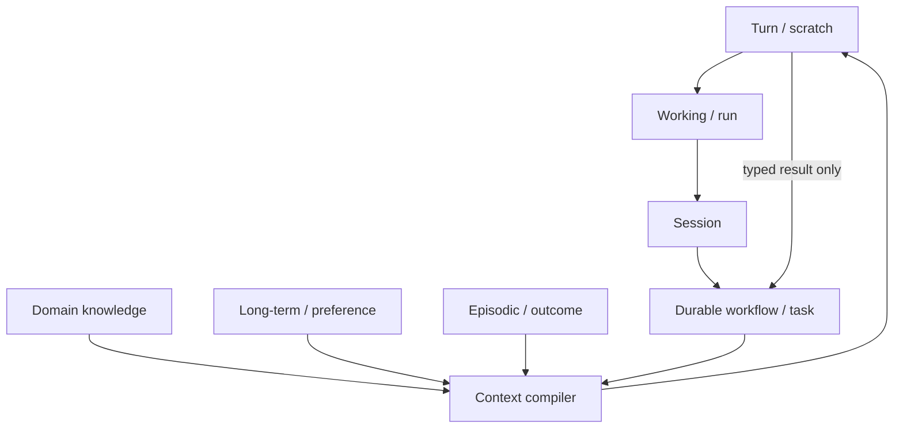
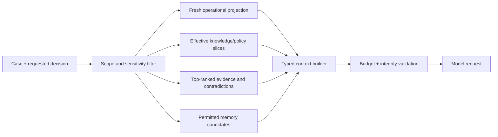

# Runtime, Context, Memory, and Durable Work

> **Last reviewed:** 2026-08-31  
> **Purpose:** define exact state and memory classes, context budgets, loss-aware compaction, and durable recovery for long utility events.

The model context is a temporary computation buffer. It is not the outage ledger, topology, operator log, approval record, effect ledger, regulatory record, or audit trail. A storm may last days, cross shifts, generate millions of observations, and outlive many workers/model sessions. Durable work must reconstruct from authoritative records without transcript continuity.

## State hierarchy



Only the durable workflow/case and authoritative domain systems can drive operational transitions. Other memory supplies untrusted inputs under policy.

## Exact memory classes

| Class | Purpose | Typical contents | Authority | Default retention/deletion |
|---|---|---|---|---|
| Turn/scratch memory | Temporary reasoning inside one model call | Candidate hypotheses, tool-selection notes | None | Discard after validated output; never log hidden reasoning |
| Working/run memory | Bounded data for one analysis attempt | Evidence IDs, query results, scenario statuses, token/tool budget | None | Delete at run end except typed result, citations and minimal diagnostics |
| Session memory | UI continuity for one operator interaction | Display filters, pending questions, acknowledged UI state | None | Short TTL; delete on logout/shift policy; no operational truth |
| Durable workflow/task memory | Resume case coordination | Case state/version, deadlines, waits, decisions, proposals, effect IDs, continuity receipt | Authoritative for workflow only | Utility case/audit policy; append-only events plus projections |
| Domain knowledge memory | Reviewed reusable material | Schemas, glossaries, operating/jurisdiction packs, approved templates, adapter capabilities | Source-dependent; never self-authorizing | Versioned with owner, effective/expiry, legal retention and supersession |
| Long-term/preference memory | Stable user/team presentation preferences | Units, report layout, accessibility, preferred verbosity | Presentation only | Opt-in, minimal, owner-visible, correctable/deletable, expires |
| Episodic/outcome memory | Curated prior-case examples and labels | Reviewed trajectories, outcomes, corrections, lessons | Evaluation/retrieval aid only | Curated subset, deidentified/minimized, expiry and revalidation |

Do not store customer medical/critical status, live topology state, alarm setpoints, credentials, current crew qualification, prior approvals, or incident commands as preference or episodic memory.

## Durable case state

```yaml
workflow_checkpoint:
  workflow_id: euops/case_elec_20260831_1882
  workflow_type: sustained_feeder_outage/v4
  case_version: 31
  state: AWAITING_REVIEW
  operating_unit: util_north_01/electric_distribution/district_7
  jurisdiction_pack: us_example_electric_dist_2026_08
  topology_snapshot_id: topo_util_north_01_20260831T0900Z_882
  evidence_cut:
    projection_id: proj_feeder_f12_20260831T0945Z
    watermark: 884209121
  pending:
    proposal_id: prop_case1882_v3
    approval_id: null
    effects: []
  waits:
    - signal: qualified_operator_decision
      deadline: 2026-08-31T10:00:00Z
  budgets:
    model_calls_used: 1
    model_calls_max: 2
    tool_calls_used: 7
    tool_calls_max: 12
  continuity_receipt: receipt://case_elec_20260831_1882/v31
```

Workflow history stores IDs and state transitions, not large raw telemetry, topology exports, photos, or full prompts. Those remain content-addressed artifacts with access controls.

## Fixed macro-workflow and bounded replanning

The runtime follows the state machine in guide 2. A model may choose only within a phase-specific action catalog:

```yaml
analysis_policy:
  phase: EVIDENCE_ANALYSIS
  allowed_actions:
    - request_existing_evidence_slice
    - request_topology_trace_read
    - identify_contradiction
    - propose_hypothesis
    - request_missing_evidence
    - abstain
  prohibited_actions:
    - create_external_effect
    - change_case_scope
    - merge_case
    - execute_control
    - alter_policy
  limits:
    max_steps: 8
    max_parallel_reads: 4
    max_wall_time_ms: 20000
```

Deterministic code validates every transition. Model output is never executed as a plan language directly.

## Parallelism and resource ownership

Parallelize independent, rate-limited reads by source. Serialize:

- aggregate case transitions by case/version;
- U3 writes by target resource/semantic operation;
- merge/split and communication release decisions;
- topology-dependent calculations against one pinned snapshot;
- memory curation/deletion for a subject/utility;
- incident-scope behavior changes.

Use fenced leases with monotonic tokens where workers can overlap. A timed-out worker cannot commit with an old fence. Per-resource serialization reduces conflicts but does not replace downstream optimistic concurrency.

## Context compiler

Build context by query for the exact turn:



### Context precedence

1. system safety and category authority policy;
2. current signed jurisdiction/operator pack;
3. current workflow/case state and exact requested decision;
4. current topology/operational projection and hard constraints;
5. selected primary evidence with provenance and quality;
6. approved domain knowledge;
7. reviewed episodic examples;
8. presentation preferences;
9. untrusted free text/content.

Lower layers cannot override higher ones.

## Context budget

Define hard budgets in tokens/bytes and item counts, not “include what seems relevant.” Example for a 32k-token model route:

| Segment | Maximum | Content rule |
|---|---:|---|
| Safety, authority, schemas | 3,000 tokens | Immutable bundle, phase-specific |
| Case/workflow state | 2,000 | Typed current state, decisions and deadlines |
| Topology/operational summary | 4,000 | Pinned snapshot, affected subgraph summary, warnings; no full network export |
| Evidence | 10,000 | Highest-value claims with IDs, time, quality, coverage and contradiction |
| Constraints/tool results | 5,000 | Deterministic status and binding constraints |
| Domain knowledge | 3,000 | Only effective procedure/template sections |
| Episodic examples | 1,500 | At most two reviewed, analogous, non-authoritative examples |
| Response/schema reserve | 3,500 | Guaranteed generation space |

If required safety/current-state material cannot fit, stop or use a larger approved route. Do not drop topology version, unknown effects, approval state, critical constraints, or contradictory evidence to fit more narrative.

## Loss-aware compaction

Compaction is an explicit state transition, not a prose summary. Classify fields:

| Class | Handling |
|---|---|
| `MUST_PRESERVE_EXACT` | IDs, scope, case version/state, topology snapshot, policy/version, deadlines, approval/effect status, constraints, quantities/units, critical unknowns, evidence digests |
| `PRESERVE_REFERENCES` | Raw observations, tool outputs, files, maps, photos, prior drafts; retain artifact IDs and access policy |
| `SUMMARIZE_WITH_LOSS` | Discussion, rejected low-risk hypotheses, explanatory narrative; state what was omitted |
| `DROP` | Duplicate renderings, scratch reasoning, expired cache, redundant tool formatting |

### Typed continuity receipt

```yaml
continuity_receipt:
  receipt_version: 1
  receipt_id: receipt_case1882_v31
  case_id: case_elec_20260831_1882
  case_version: 31
  created_at: 2026-08-31T09:47:00Z
  reason: context_budget_rollover
  version_pins:
    behavior: euops-behavior/4.2.1
    jurisdiction_policy: us_example_electric_dist_2026_08
    topology_schema: utility-topology/5
    adapter_capabilities: utility-adapters/2026.08.2
  exact:
    operating_unit: util_north_01/electric_distribution/district_7
    workflow_state: AWAITING_REVIEW
    jurisdiction_pack: us_example_electric_dist_2026_08
    topology_snapshot_id: topo_util_north_01_20260831T0900Z_882
    proposal_digest: sha256:...
    pending_effects: []
    deadlines: [qualified_review@2026-08-31T10:00:00Z]
    forbidden_authority: [control, switching, dispatch, load_shed, safety_decision]
  retained_refs:
    evidence: [obs_01K4a, fld_77291]
    tools: [trace_882, simulation_772]
    prior_receipt: receipt://case_elec_20260831_1882/v22
  approval_refs: []
  active_clocks:
    - {clock_id: qualified-review, due_at: 2026-08-31T10:00:00Z, owner: qualified-operator}
  pending_effect_ids: []
  unknown_effect_ids: []
  summarized:
    - topic: rejected_hypotheses
      summary: Two hypotheses rejected by valid field evidence.
      loss: Exact discussion omitted; source trajectory retained at artifact://sha256/...
  unresolved:
    - ami_coverage_below_restoration_threshold
    - nested_outage_possible
  omitted_item_refs: [artifact://sha256/...]
  next_safe_action: request_qualified_operator_review
  integrity:
    source_event_high_watermark: 884209121
    invariant_hash: sha256:...
    digest: sha256:...
```

The next run verifies the receipt against durable case state. A mismatch triggers reconstruction, never silent continuation.

## Resume protocol

On worker/model/session restart:

1. load workflow ID, case aggregate and latest continuity receipt;
2. validate utility/territory, workflow type/version, case version, policy pack, topology snapshot and deadlines;
3. fence the previous worker and check in-flight activities/effects;
4. reconcile every nonterminal U3 effect before dispatching anything;
5. refresh expired operational evidence and invalidate stale approval/proposal;
6. rebuild projections from durable events if digests disagree;
7. compile a new context packet from queries;
8. state to the operator what changed during the gap;
9. resume at the deterministic state, not the last assistant sentence.

## Domain knowledge

Store each reusable item with:

- utility/commodity/jurisdiction/operator scope;
- owner and qualified reviewer;
- source authority and canonical reference;
- version, effective/expiry and supersession;
- sensitivity, allowed audiences and model-use permission;
- extraction/chunking version and content digest;
- conflict priority and applicability conditions;
- refresh trigger and deletion/legal-hold policy.

Operating procedures are not ordinary RAG documents. Retrieve exact effective sections, preserve numbering and warnings, and prohibit the model from improvising missing steps. High-consequence switching, clearance, treatment, and emergency procedures should generally remain outside generative context.

## Long-term preferences

Allow only low-risk presentation preferences such as units, language, accessibility format, and default report layout. Require explicit owner visibility and correction/deletion. Never infer that an operator “usually approves,” prefers a particular restoration option, tolerates stale data, or waives a check.

## Episodic and outcome memory

Curate only after post-event review. Store a minimized case abstract, validated conditions, trajectory, outcome, corrections, evaluation labels, applicability, owner, expiry, and exclusions. Retrieve it as analogy, never current evidence.

Poisoning controls:

- no automatic write from production transcript or outcome;
- provenance and reviewer signatures;
- de-identification/minimization and cross-utility isolation;
- anomaly and duplication checks;
- exclude cases under investigation, litigation, disputed classification, or incomplete reconciliation;
- revalidate after policy/topology/process change;
- log retrieval and measure whether examples cause anchoring or copying.

## Retention and deletion matrix

| Data | Retention owner | Key controls |
|---|---|---|
| Raw OT/utility evidence | Source/data owner | Security classification, operational/legal need, immutable integrity, restricted export |
| Normalized observations/case events | Utility operations | Replay/audit retention; corrections linked; tenant deletion/hold |
| Workflow history/effect ledger | Platform + operations | Durable recovery, audit, compact payloads, legal hold |
| Model inputs/outputs | AI governance + data owner | Minimize/redact, short default, access log, provider terms |
| Traces/logs/metrics | Platform/security | No secrets/raw customer/topology by default; diagnostic TTL |
| Domain knowledge | Procedure/regulatory owner | Effective/expiry/supersession and periodic review |
| Preferences | User/workforce owner | Opt-in, inspect/correct/delete, short expiry |
| Episodic outcomes | Evaluation governance | Curated, minimized, expiry, poisoning and drift review |
| Embeddings/indexes/caches/backups | Respective platform owner | Scope, encryption, derivative deletion and restore-deletion process |

Deletion must cover derived indexes, caches, prompts, copies, and backups according to approved retention—not only the primary row.

## Runtime failure behavior

| Failure | Required behavior |
|---|---|
| Duplicate queue delivery | Compare event/case version and resume idempotently |
| Worker crash before tool dispatch | New fenced worker may retry safe read |
| Worker crash after possible U3 dispatch | Mark/recover `EFFECT_UNKNOWN`; reconcile first |
| Model unavailable/malformed | Deterministic projection and manual packet continue |
| Context receipt mismatch | Reconstruct from durable state; alert platform |
| Policy/identity service unavailable | Fail closed for proposals/coordination; safe reads may continue |
| Topology/telemetry refresh fails | Mark stale/unknown; invalidate affected plan/approval |
| Memory index unavailable | Continue without optional memory |
| Memory poisoning suspected | Disable episodic/preference retrieval; preserve evidence |
| Workflow code incompatible | Pause affected workflow type; migrate/rollback under release plan |

## Runtime anti-patterns

- send the entire storm transcript back to the model;
- use “memory” as an undifferentiated vector store;
- let summaries omit unknown effects or approval expiry;
- resume from the last natural-language message;
- store credentials, customer lists, or full topology in workflow history;
- allow production outcomes to update prompts or procedures;
- parallelize two writes to the same OMS/WMS case;
- keep an obsolete policy chunk because it ranks semantically well.

## Shared guides

- [Agent state and event contracts](../../runtime/agent-state-and-event-contracts.md)
- [Durable execution](../../runtime/durable-execution.md)
- [Context compaction and continuity](../../context-memory/compaction-and-continuity.md)
- [Memory architecture](../../context-memory/memory-architecture.md)
- [Queues, scheduling, and backpressure](../../operations/queues-scheduling-and-backpressure.md)

Next: [approvals, effects, reconciliation, and recovery](08-approvals-effects-reconciliation-and-recovery.md).
