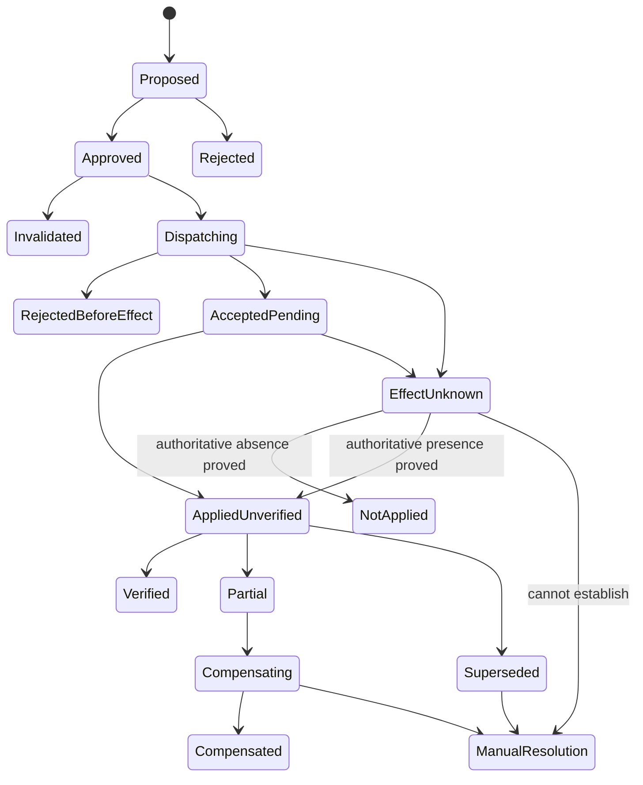

# Approvals, Effects, Reconciliation, and Recovery

> **Last reviewed:** 2026-08-31  
> **Purpose:** ensure that a reviewed proposal cannot become a stale, duplicated, mis-scoped, or falsely completed external coordination effect.

This category has a permanent control prohibition. The only permitted effects at maturity are narrow U3 coordination artifacts such as an approved case note, work-request draft, or communication draft placed in an existing human review process. Qualified operators execute control and safety work through their established systems.

## Approval is a sealed decision artifact

```yaml
approval_decision:
  approval_id: appr_7721
  decision: APPROVE
  proposal_id: prop_case1882_v3
  proposal_digest: sha256:...
  case_id: case_elec_20260831_1882
  case_version: 31
  utility_id: util_north_01
  topology_snapshot_id: topo_util_north_01_20260831T0900Z_882
  jurisdiction_pack: us_example_electric_dist_2026_08
  effect_types: [wms_case_note_create]
  target_resources: [ewms_prod/dispatch_incident_992]
  constraints_digest: sha256:...
  approved_by:
    user_id: emp_882
    on_duty_role: distribution_dispatch_supervisor
    auth_context: mfa_session_...
  approved_at: 2026-08-31T09:48:00Z
  expires_at: 2026-08-31T09:58:00Z
  one_time: true
  signature: sigstore:...
```

Approval binds exact content, case/scope, resources, versions, policy, actor, permitted effect types, constraints and expiry. It does not approve a concept, conversation, future revision, or “similar cases.”

## Approval invalidation

Invalidate before dispatch when any material item changes:

- case version/scope, merge/split/reopen or owner;
- topology/model/operational state or critical-load snapshot;
- evidence digest, forecast/simulation status, constraints or assumptions;
- jurisdiction/operator pack, procedure, template or adapter qualification;
- target resource/version, effect content or idempotency key;
- on-duty role, segregation-of-duties or incident mode;
- deadline/change window/approval expiry;
- a new safety, cyber, data-quality or unknown-effect condition.

The review UI shows a semantic diff and forces a new decision. It never asks “still okay?” against an unseen changed artifact.

## Effect state machine



Transport success is not semantic success. A queue acknowledgement or HTTP response may only prove acceptance.

## Semantic idempotency

Generate a stable operation ID from business intent, not an attempt:

```text
utility_id + effect_type + target_resource + case_id + proposal_digest + semantic_slot
```

Retries reuse the same semantic operation ID and native idempotency key. Attempts receive unique IDs. Store the intent before dispatch, including canonical request digest, preconditions, approval and target.

### Attempt record

```yaml
effect_attempt:
  semantic_operation_id: case1882/post-approved-dispatch-note/v1
  attempt_id: case1882/post-approved-dispatch-note/v1/a1
  fenced_lease: 88217
  adapter_qualification: aq-ewms-2026q3
  request_digest: sha256:...
  target_version_before: "41"
  dispatch_started_at: 2026-08-31T09:49:01Z
  native_request_id: req-99282
  transport_outcome: RESPONSE_LOST
  semantic_outcome: EFFECT_UNKNOWN
  next_action: RECONCILE
```

Never generate a new idempotency key after a timeout merely to “try again.”

## Unknown outcome protocol

1. Persist `EFFECT_UNKNOWN` with attempt and native correlation data.
2. Freeze the same semantic slot/resource and any dependent effect.
3. Query the native operation/job/audit endpoint through the reconciliation identity.
4. Read the current target resource and compare the exact desired postcondition/digest.
5. Distinguish `APPLIED`, `NOT_APPLIED`, `PARTIAL`, `SUPERSEDED`, and `INDETERMINATE`.
6. Retry only if authoritative evidence proves non-application and the approval/preconditions remain valid.
7. If applied, proceed to independent verification without resubmission.
8. If partial or superseded, create a new recovery proposal; never overwrite another actor.
9. If indeterminate by deadline, escalate to the named human and preserve all evidence.

## Reconciliation loops

Keep separate loops:

| Loop | Compares | Cadence and owner |
|---|---|---|
| Workflow | deadlines, waits, leases, case state | Durable runtime; seconds/minutes |
| Effect | intent/attempt ledger versus native operation/resource/audit | Effect service; operation-specific |
| World | GIS/topology, SCADA/operational state, OMS, AMI/customer, WMS/field, communications | Utility data owner; continuous/periodic |
| Reporting | closed case/evidence versus calculations/releases/filings | Operations/regulatory owner; post-event |

Each has a backlog SLO, admission limit, dead-letter/manual queue, and storm recovery plan. The model does not decide whether to retry.

## Verification contract

```yaml
effect_verification:
  semantic_operation_id: case1882/post-approved-dispatch-note/v1
  verified_at: 2026-08-31T09:49:12Z
  verifier_identity: ewms-reconciler
  oracle:
    kind: direct_resource_read_plus_audit
    resource_version: "42"
    native_audit_id: audit_77821
  postconditions:
    exact_note_digest: {expected: sha256:..., observed: sha256:..., status: PASS}
    author_attribution: {expected: euops-coordination-gateway, status: PASS}
  result: VERIFIED
  evidence_ref: artifact://sha256/...
```

Verification for service restoration is separate and uses the ladder in guide 4. A verified note does not verify a field action.

## Cancellation and supersession

Cancellation means “request cancellation,” not “undo.” Record:

- who requested it and why;
- state at request time;
- provider cancellation semantics and deadline;
- acknowledgement versus confirmed terminal state;
- dependent work/messages blocked;
- residual obligations and required human follow-up.

If evidence changes before dispatch, invalidate. If an accepted operation is cancelable, request cancellation with the same ledger. If already applied, create a new reviewed compensation or forward-recovery proposal.

## Compensation and forward recovery

Physical operations are generally not reversible, and this agent does not execute them. For U3 artifacts:

- a draft note can be superseded by an attributed correction, not deleted from history;
- a queued message can be canceled only before release is authoritatively confirmed;
- a released message needs a new correction/retraction under the release owner;
- a work-request draft can be withdrawn only under WMS semantics; downstream assignment may need human action;
- a case merge/split is a new event preserving lineage.

Never call an inverse API and label it rollback without proving semantics and downstream consequences.

## Approval and effect threat controls

- model output cannot select approver identity or approval rule;
- approval tokens are audience/resource/action bound and never exposed to the model;
- effect gateway revalidates all fields and loads canonical content by digest;
- allowlisted methods and destinations are enforced at proxy, network and target;
- effect and reconciliation identities are separate;
- two-person/segregated approval is applied where operator policy requires it;
- approval UI displays utility, territory, target, exact content, uncertainty, source freshness, expiry and consequences;
- suspicious request volume, cross-tenant IDs, digest mismatch or repeated invalidation stops dispatch;
- audit ledger is append-only and independently protected.

## Write kill and degraded modes

Kill controls exist globally, per utility/cell, adapter, effect type, case type and release. Activating kill:

1. blocks new U3 dispatch before network access;
2. does not erase accepted or unknown operations;
3. continues effect reconciliation and safe reads;
4. preserves manual evidence packet generation;
5. signals operators and incident command;
6. requires a reviewed restart checklist and backlog reconciliation.

## Failure matrix

| Failure | Safe response |
|---|---|
| Approval service unavailable | No U3 dispatch; keep proposal/manual workflow |
| Approver changes shift | Invalidate unless policy explicitly transfers a signed decision |
| Adapter timeout after request | `EFFECT_UNKNOWN`; reconcile |
| Callback duplicated/out of order | Idempotent correlation; native state/read-back wins |
| Target version changed | `SUPERSEDED`; do not overwrite |
| Reconciliation API unavailable | Freeze resource; manual resolution by deadline |
| Write kill during dispatch | Record timing; reconcile possible dispatch |
| Model unavailable | No impact to in-flight deterministic effect/reconciliation logic |
| Region fails | Fence old workers; restore ledger; reconcile before queue replay |
| Communication released after stale ETR | Preserve release; prepare reviewed correction |

## Runbook for an ambiguous coordination write

1. Page effect owner when unknown age reaches the operation threshold.
2. Confirm semantic operation ID, utility, case, resource, content digest and approval.
3. Check native operation/audit endpoint without issuing a new write.
4. Read the authoritative resource through the reconciliation identity.
5. Check callbacks, queues and downstream release/assignment state.
6. Classify outcome; attach raw evidence.
7. Retry only proven `NOT_APPLIED` under still-valid approval/preconditions.
8. For `PARTIAL`, `SUPERSEDED`, or `INDETERMINATE`, hand to the designated human and freeze dependencies.
9. After resolution, test whether adapter qualification or timeout/retry policy must change.

## Effect release gate

- [ ] U3 type is explicitly permitted; U4 remains unreachable.
- [ ] Exact approval binding/invalidation and on-duty role checks pass.
- [ ] Stable semantic ID and native idempotency are proven.
- [ ] Precondition, fencing and concurrent-writer tests pass.
- [ ] Response-loss-before/after-application tests pass.
- [ ] Independent read-back distinguishes all normalized outcomes.
- [ ] Cancellation, compensation, supersession and partial failure are rehearsed.
- [ ] Kill, region recovery and reconciliation-backlog drills pass.
- [ ] Manual path is documented and trained.

## Shared guides

- [Idempotency and side effects](../../reliability/idempotency-and-side-effects.md)
- [Durable execution](../../runtime/durable-execution.md)
- [Tool contracts](../../tools/tool-contracts.md)

Next: [observability, evaluation, simulation, and failure injection](09-observability-evaluation-simulation-and-failure-injection.md).
