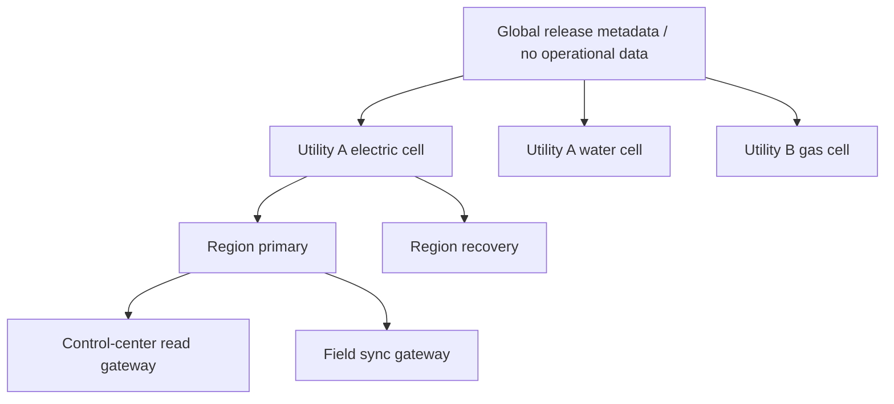

# Deployment, Storm Scale, Incidents, DR, and Evolution

> **Last reviewed:** 2026-08-31  
> **Purpose:** operate a nonessential but useful coordination system through region loss, intermittent field links, queue bursts, provider failures, security incidents, and controlled behavior change.

The agent must fail independently of utility control. Control-room, protection, plant, pipeline, water, field-radio, and emergency procedures continue when every model/runtime component is unavailable.

## Deployment cells

Partition by utility and operational authority; avoid one global blast radius.



Each cell has separate queues, identities, keys, case/effect/audit state, quotas, kill switches, policy packs, adapters, incident owners and recovery plan. Share stateless model gateways only when scope and data controls are proven.

## Edge and control-center placement

Use edge components for deterministic collection, buffering, schema validation, local dashboards, and manual exports when central links are intermittent. Do not place a general-purpose model or broad credential at substations, stations, plants, RTUs, PLCs, IEDs, AMI collectors, or field laptops.

Edge requirements:

- outbound-only/brokered communication where practical;
- bounded encrypted store-and-forward with sequence and expiry;
- signed configuration and offline-safe defaults;
- no control methods/credentials;
- monotonic local event IDs plus device/source time and sync quality;
- disk/CPU/network budgets that protect operational functions;
- backlog prioritization and safe discard policy for redundant low-value data;
- reconnect handshake, duplicate-safe replay and coverage-gap reporting;
- remote disable and forensic preservation.

Field mobile apps preserve original observed time, recorded time, identity, location accuracy, offline sequence and attachment digest. Reconnect does not pretend late evidence was current at ingestion time.

## Queue classes and fairness

| Class | Examples | Priority policy |
|---|---|---|
| P0 safety/control data | Not processed by agent queues | Never compete with agent workloads |
| P1 critical evidence/case | high-impact outage, public hazard handoff, unknown effect reconciliation | Reserved capacity and strict age SLO |
| P2 active operations | normal outage/service cases, operator requests | Weighted fair queue per utility/territory |
| P3 communication/report drafts | approved operational updates | Deadline-aware; stale drafts expire |
| P4 background | enrichment, episodic curation, bulk replay, optional re-analysis | Suspend first during bursts |

Use admission control before expensive retrieval/model work. Apply per-utility, case-type, source, operator and model-route quotas. Coalesce repeated triggers by case/version. Do not drop immutable source evidence; shed optional derived work and rebuild later.

### Backpressure sequence

1. Disable optional memory and low-value enrichment.
2. Serve deterministic evidence packets without model narrative.
3. Reduce repeated model refresh cadence; require material-change triggers.
4. Reserve capacity for critical cases, unknown-effect reconciliation and operator-on-demand work.
5. Expire stale communication/proposal jobs rather than processing them late.
6. Suspend background replay/curation.
7. Move overflow cases to a visible manual queue with age and reason.
8. Scale within tested limits; never overload OMS/ADMS/AMI/GIS or field systems.

## Storm capacity model

Model the full fan-out:

```text
incoming observations
× identity/topology lookups
× detector updates
× cases per incident
× evidence refreshes per case
× model calls per refresh
× operator/draft/reconciliation work
```

Load test at steady, forecast mobilization, first-impact burst, widespread restoration, nested-outage discovery, field reconnect, and post-event reconciliation. The worst database/model demand may occur after communications recover, not at peak outage count.

Capacity plan records:

- source event rate and burst duration;
- case creation/merge/split rate;
- topology trace and simulator concurrency;
- model input/output tokens and cache hit assumptions;
- queue service rates and oldest-age bounds by class;
- third-party/vendor quotas and backoff;
- artifact/log/audit write volume;
- field offline replay volume;
- region-failover and restore throughput;
- operator review capacity and maximum useful notification rate.

Operator attention is usually the scarcest resource. Optimize for fewer, higher-value packets and material-change updates.

## Cost controls

- deterministic rules and templates before model calls;
- small approved route for extraction/classification, larger route only for complex synthesis;
- context budget and artifact references instead of full payloads;
- cache only scoped immutable inputs with digest/version/TTL;
- coalesce case updates and skip narration when no material change;
- token/tool/wall-time budgets per case and operational period;
- suspend optional episodic retrieval and batch analysis in storm mode;
- track cost per accepted packet, resolved contradiction and operator minute saved—not per chat;
- include simulator, GIS, vendor API, storage, egress, observability and human-review costs.

Cost pressure never weakens citations, quality checks, isolation, approval, reconciliation or retention controls.

## Availability and disaster recovery

### Service tiers

| Component | Availability target rationale | Failure mode |
|---|---|---|
| Control/protection/field emergency channels | Outside agent architecture | Continue independently |
| Raw evidence ingestion | High; preserve history and gaps | Buffer at gateway; report coverage |
| Case/projection/deterministic detector | Highest agent tier | Manual evidence view from sources if unavailable |
| Approval/U3/reconciliation | High integrity over availability | Fail closed; reconcile accepted/unknown work |
| Model/simulation/optional memory | Lower tier | Deterministic/manual fallback |
| Analytics/curation | Background | Suspend |

### Recovery objectives

Set per component and utility. Case/effect/audit state normally needs tighter RPO than reproducible projections or diagnostic traces. Raw source systems remain authoritative; the agent must be able to rebuild derived views.

### Region recovery sequence

1. Declare the cell/region unavailable and activate its write kill.
2. Fence old workers, leases and callbacks; revoke/rotate affected credentials.
3. Recover signed release, policy and adapter manifests.
4. Restore case event, approval, effect and audit ledgers to the accepted RPO.
5. Verify integrity/digests and identify any uncertain interval.
6. Reconcile every `DISPATCHING`, `ACCEPTED_PENDING`, `EFFECT_UNKNOWN`, or `APPLIED_UNVERIFIED` effect against targets.
7. Refresh identity, topology and operational projections; invalidate stale proposals/approvals.
8. Admit P1 work first, then fair P2 replay with target-rate protection.
9. Communicate gaps and changed facts to operators.
10. Re-enable U3 only after reconciliation/backlog/identity/policy/security gates pass.

Do not replay the whole queue at maximum speed into recovering utility systems.

### Recovery-load controls

- token-bucket limits per downstream source;
- queue age plus priority, not FIFO alone;
- duplicate/coalescing by observation and case version;
- batch reads where source semantics permit;
- jittered safe-read retries;
- resource serialization for effects;
- dynamic admission based on downstream latency/error;
- explicit reconciliation backlog SLO and human capacity;
- progressive cell reopening.

## Degraded and manual modes

| Mode | Available | Disabled |
|---|---|---|
| Normal advisory | Read/analyze/propose, approved U3 | U4 always |
| Model degraded | Deterministic detection, evidence timeline, templates, manual review | Model analysis/proposals |
| Source degraded | Unaffected sources with coverage warnings | Claims/plans depending on source |
| Storm conservation | P1/P2 evidence, material-change analysis, approved essential drafts | Background, repeated narration, optional memory |
| Security containment | Minimal isolated reads/evidence preservation per incident plan | Model, external providers, U3 and suspect adapters |
| Manual | Existing utility systems, operator/field/emergency procedures | Agent runtime |

Mode changes are signed operational events with scope, reason, actor, effective time and exit criteria.

## Incident taxonomy

- unsafe/unsupported operational claim;
- attempted/reachable prohibited control operation;
- cross-utility or sensitive-data exposure;
- topology/identity corruption or false affected-customer projection;
- duplicate, lost, stale-approved or mis-scoped U3 effect;
- unresolved unknown effect beyond SLO;
- provider/model prompt injection or data exfiltration;
- case/approval/effect/audit integrity failure;
- storm backlog/operator overload;
- region/queue/database failure;
- forecast/model/topology/adapter drift;
- regulatory/customer communication error.

## Incident response

1. Protect life, safety, utility control and field operations; agent response is secondary.
2. Kill/isolate the narrowest affected cell, effect, adapter, model route or behavior bundle; use global kill if scope is unknown.
3. Preserve case/effect/audit records, prompts/outputs allowed by policy, raw adapter evidence, manifests and clocks.
4. Establish whether any U3 effect or released communication is unknown/incorrect; reconcile before retry/correction.
5. Notify utility operations, incident command, OT security, safety, privacy/legal/regulatory and vendors per pack.
6. Provide deterministic/manual continuity.
7. Remediate through a tested versioned release; do not hot-edit prompts as the only control.
8. Reconcile cases, customer impacts, messages and reports.
9. Run after-action review, update eval/failure cases and requalify affected components.

## Behavior bundles

Release behavior as an immutable bundle:

```yaml
behavior_bundle:
  id: euops-behavior/4.2.1
  system_policy: sha256:...
  schemas: euops-contracts/3.1.0
  tool_catalog: euops-tools/5
  context_policy: euops-context/6
  stop_rules: euops-stop/9
  templates: euops-communications/7
  model_routes: [evidence_synthesis_route/7]
  eval_report: artifact://sha256/...
  compatible_workflows: [sustained_feeder_outage/v4]
  authority_ceiling: READ_ANALYZE_PROPOSE
```

Prompts, schemas, tools, context/compaction, model route, policy, adapters and thresholds are one behavior surface. Test them together while versioning them independently for diagnosis/rollback.

## Shadow, canary, and rollback

### Shadow advisory

- receive real scoped evidence but no operator notification/effect;
- compare against actual workflow and deterministic baseline;
- measure false certainty, useful findings, missed constraints, latency/cost and privacy;
- prevent shadow output from leaking into production decisions accidentally.

### Canary

Limit by one utility/territory/case type/shift or randomly assigned cases with trained operators. Start read-only explanation, then proposals, then one U3 type only after separate approval. Define maximum concurrent cases, error/claim/operator-load thresholds, automatic kill and rollback owner.

### Rollback

Rollback behavior/model changes immediately when safe, but in-flight workflows may require compatible code and schemas. Stop new U3, preserve ledger, reconcile effects, invalidate proposals/approvals produced by the bad bundle, regenerate required communications, and document affected cases. Never delete history to make rollback appear clean.

## Drift and controlled feedback

Monitor:

- source/schema/adapter/product drift;
- asset, topology, operating-practice and critical-load drift;
- weather/hazard, forecast calibration and event-severity drift;
- model/provider output, refusal, latency and cost drift;
- retrieval/memory and context truncation drift;
- operator acceptance/correction and automation-bias indicators;
- case mix, storm volume, queue age and reconciliation drift;
- regulation/procedure/standard effective-date drift.

Production feedback flows to an offline review queue. Domain owners label cause, correctness, applicability and sensitivity. Governance approves dataset, prompt/policy/schema/tool/model changes. Re-run the full regression/simulation/failure suite, shadow and canary. No online weight, prompt, policy, memory, priority or threshold self-update.

## Stage 6 exit gate

- [ ] Cells, identities, keys, queues and kill switches isolate utilities and authorities.
- [ ] Steady, storm, reconnect and post-event capacity tests meet queue-age/operator-load SLOs.
- [ ] Model/source/security/manual degraded modes are trained and observed.
- [ ] Backup restore, region loss, stale lease, unknown effect and recovery-load drills pass.
- [ ] Cost limits preserve safety/integrity controls.
- [ ] Behavior bundles, shadow, canary, rollback and affected-case reconciliation are proven.
- [ ] Model, forecast, topology, adapter, policy and operator-feedback drift have owners/thresholds.
- [ ] Controlled offline feedback cannot self-modify production.

## Primary evidence

- [NIST SP 800-82 Rev. 3](https://www.nist.gov/publications/guide-operational-technology-ot-security)
- [NIST SP 1339, OT Backup Quick Start Guide, final 2026-06-17](https://csrc.nist.gov/Projects/operational-technology-security/publications)
- [DOE/CESER response and recovery](https://www.energy.gov/ceser/response-recovery)
- [EPA water utility emergency response](https://www.epa.gov/waterutilityresponse)
- [NERC TOP-001-6](https://www.nerc.com/standards/reliability-standards/top/top-001-6)
- [Repository scaling, capacity, and SLO guidance](../../operations/scaling-capacity-and-slos.md)

Next: [implementation schemas, runbooks, exercises, and acceptance](11-implementation-schemas-runbooks-exercises-and-acceptance.md).
