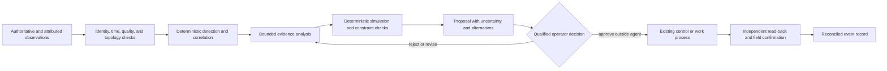
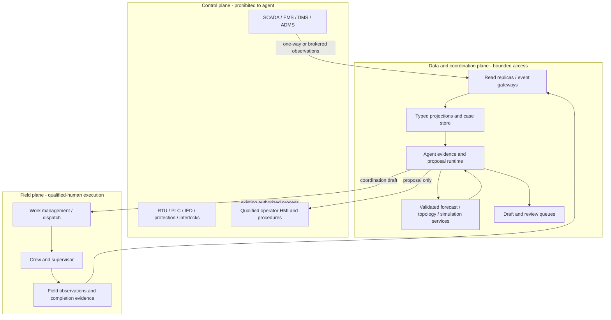

# Energy and Utilities Operations Agent

> **Status:** research-backed production blueprint  
> **Last researched:** 2026-08-31  
> **Scope:** electric, gas, drinking-water, and wastewater network/asset/customer operational evidence; outages and service interruptions; restoration-support proposals; field coordination; communication preparation; reconciliation and reporting  
> **Research packet:** [Energy and utilities operations research packet](../../research/packets/energy-utilities-operations-agent-blueprint.md)

This playbook defines a bounded agent that helps utility operators understand service conditions, investigate alarms and outages, compare restoration choices, coordinate approved work, prepare communications, and reconcile the event record. It is not an autonomous utility controller.

The agent sits outside protection and process-control loops. It has no path to issue SCADA control commands, operate breakers or valves, change relay or safety logic, dispatch generation, shed load, alter treatment chemistry, start or stop plant equipment, grant a clearance, or declare an emergency condition resolved. Those acts remain in deterministic control systems under qualified-human authority and the operator's jurisdiction-specific procedures.

## Production position

Use a model only for work where mixed evidence, ambiguity, or explanation creates real value. Detection rules, topology validation, state estimation, hydraulic or power-flow analysis, crew qualification checks, safety rules, switching-order validation, approval, execution, and regulatory calculations remain deterministic.

The safe operating loop is:



An apparently successful API response is not service restoration. An AMI power-up message is not proof that every downstream customer has stable service. A closed work order is not proof that topology, pressure, voltage, water quality, protection, and customer state agree. Completion requires domain-specific independent evidence and operator-defined acceptance.

## Distinct category boundary

| This category owns | It consumes but does not own | It must never own |
|---|---|---|
| Utility asset/network/customer identity mapping; evidence quality; outage and service-interruption case state; restoration-support proposals; field coordination; customer/regulatory draft preparation; reconciliation and post-event reporting | GIS, SCADA/EMS/DMS/ADMS/OMS, AMI/MDMS, CIS, EAM/WMS, weather, forecasts, digital twins, lab results, operator logs, crew status, emergency-management priorities | Protection, automatic control, dispatch, switching, valve movement, load shedding, process setpoints, interlocks, clearances, energization/de-energization, public-safety determinations, regulatory filing/signature, or final operator judgment |
| Electric distribution and transmission service-impact evidence at a declared operator boundary | Power-flow/state-estimation results and remedial-action catalogs | Generation dispatch, balancing, interchange, relay settings, UFLS/UVLS, remedial action schemes, or blackstart execution |
| Gas network interruption/leak-event coordination evidence and qualified handoff | Pipeline SCADA, integrity, pressure, odorization, leak-management, and controller records | Compressor/valve commands, pressure control, isolation decisions, gas release classification, or covered-task performance |
| Water/wastewater service-impact and incident coordination evidence | Hydraulic/water-quality models, SCADA, LIMS, distribution/collection topology, lab and field sampling | Treatment changes, pump/valve commands, contamination declaration, boil-water decision, discharge decision, or public-health release |

Separate adjacent categories remain authoritative:

- [SRE incident response](../sre-incident-response-agent/README.md) owns the software platform's reliability, not utility network restoration.
- [Network operations](../network-operations-agent/README.md) owns enterprise/telecom routing, DNS, certificates, and connectivity, not electric/gas/water network state.
- Manufacturing or plant operations own production process and equipment control; this playbook accepts published plant availability only.
- Generic field service owns reusable workforce logistics; this category adds utility topology, clearance, qualification, critical-load, and restoration constraints.

## Workload contract

Do not begin with “optimize the grid” or “automate storm response.” Begin with one operating unit and one bounded case type:

```yaml
operating_unit:
  utility_id: util_north_01
  commodity: electric_distribution
  jurisdiction_pack: us_state_example_2026_08
  control_center: north_dcc
  service_territory: district_7
  case_type: sustained_feeder_outage
  authoritative_sources:
    connectivity: gis_un_v8
    operational_state: adms_prod
    outage_case: oms_prod
    customer_service: cis_prod
    meter_events: mdms_prod
    work: ewms_prod
  qualified_decision_role: distribution_system_operator
  allowed_agent_authority: READ_ANALYZE_PROPOSE
  forbidden_capabilities:
    - control_command
    - switching_execution
    - protection_change
    - load_shed
    - safety_clearance
  retention_policy: utility_ops_2026_03
```

The same deployment must not silently mix commodities, utilities, control centers, jurisdictions, or operating authorities. Each is a security, routing, evaluation, and deletion boundary.

## No-agent alternatives

An agent is not the default. Choose the least complex mechanism that meets the operational need.

| Workload | Preferred mechanism | Add a bounded agent only when |
|---|---|---|
| Known alarm threshold or missing heartbeat | Deterministic alarm/event rule | Evidence spans heterogeneous sources and the operator benefits from a cited explanation |
| Connectivity or affected-customer calculation | Validated topology trace | Conflicts need an evidence-backed narrative; never replace the trace with model reasoning |
| Crew assignment under stable rules | Dispatch/WMS optimizer or dispatcher | Exceptions require comparing documented constraints and drafting a proposal |
| Switching or valve sequence | Existing qualified planning tool and operating procedure | At most, summarize an already generated plan; never generate executable control instructions |
| Customer outage update from OMS | Deterministic template and publication workflow | Drafting must synthesize operator-approved facts for multiple audiences |
| Regulatory reliability indices | Tested calculation pipeline | Explain variances and assemble citations; do not calculate authoritative figures in prose |
| Fixed emergency checklist | Runbook/workflow engine | Unstructured evidence must be organized without changing the checklist's authority |

If a rule, query, template, or solver can do the task reliably, prefer it. A model should not be introduced to make a deterministic workflow look more advanced.

## Core invariants

- **Control isolation:** the agent network and identities cannot address control-command endpoints. A prompt, approval token, or break-glass session cannot change this architectural prohibition.
- **Plural truth:** GIS connectivity, operational topology, device telemetry, OMS inference, AMI evidence, field observation, customer contact, and model output remain separately attributed.
- **Time is explicit:** source event time, device time, receive time, ingest time, effective interval, freshness deadline, and clock quality are preserved.
- **Quality is typed:** `GOOD`, `SUSPECT`, `INVALID`, `STALE`, `SUBSTITUTED`, `MANUAL`, and `UNKNOWN` are not flattened to a value.
- **Absence requires coverage:** no event is not proof of no outage, no leak, no contamination, or restoration.
- **Forecasts are not facts:** every forecast has an `as_of`, horizon, version, distribution or quantiles, applicability, and calibration evidence.
- **Proposals cannot confer authority:** operator qualification, clearance ownership, safety status, critical-load priority, and jurisdictional authority are resolved outside the model.
- **Unknown effects stop retries:** any lost response after a potentially mutating request becomes `EFFECT_UNKNOWN` and is reconciled before another attempt.
- **Communications are drafts:** customer, media, mutual-aid, regulator, and public-safety messages require the prescribed owner and release channel.
- **Degradation narrows authority:** stale topology, telemetry gaps, alarm floods, lost field communications, model/solver uncertainty, policy outage, or storm overload moves the system toward read-only/manual mode.

## Control, data, and field planes



The bounded runtime belongs in the data/coordination plane. For high-consequence environments, obtain telemetry through a unidirectional, replicated, or tightly brokered path. Do not “temporarily” co-locate the model beside an HMI or historian with shared credentials.

## Stage 0–6 delivery path

| Stage | Capability | Agent authority | Required exit evidence |
|---|---|---|---|
| 0. Contract | Define operating unit, sources, topology, safety boundary, jurisdiction pack, manual baseline, and case oracle | None | Utility operations, safety, security, legal/regulatory, field, and data owners sign the boundary |
| 1. Observe | Normalize read-only events and data-quality gaps; reproduce deterministic baseline | Read only | Replay proves identity, ordering, quality, late/duplicate/correction, and scope handling |
| 2. Explain | Build cited timelines, contradictions, and hypotheses; abstain on unsupported state | Read only | Grounding, injection, stale-data, alarm-flood, and operator-usefulness gates pass |
| 3. Propose | Compare validated restoration-support scenarios and draft coordination/communications | Proposal only | Constraint, uncertainty, critical-load, safety, simulation, and human-factors gates pass |
| 4. Govern | Seal proposals, bind versions/expiry, route to named qualified decision roles | No execution | Approval invalidation, segregation, evidence preservation, and audit drills pass |
| 5. Coordinate | Send only approved non-control work/communication artifacts through narrow gateways; reconcile | Scoped coordination | Idempotency, cancellation, unknown outcome, read-back, storm-mode, and manual fallback pass |
| 6. Scale and evolve | Add utilities, cases, regions, adapters, and behavior bundles independently | Per operating unit; ceiling unchanged | Cell isolation, capacity, fairness, DR, recovery-load, drift, rollback, and regulator/operator review pass |

Promotion adds evidence, not implicit authority. No stage permits autonomous control, switching, dispatch, load shed, process actuation, protection, or final regulatory decisions.

## Learning path

Read in order for a new deployment:

1. [Mission, boundaries, and workload fit](01-mission-boundaries-and-workload-fit.md)
2. [Reference architecture and staged delivery](02-reference-architecture-and-staged-delivery.md)
3. [Topology, identity, state, event, and effect contracts](03-topology-identity-state-event-and-effect-contracts.md)
4. [Telemetry, alarms, outage detection, and forecasts](04-telemetry-alarms-outage-detection-and-forecasting.md)
5. [Restoration planning, field coordination, and communications](05-restoration-planning-field-coordination-and-communications.md)
6. [Integrations, adapter qualification, and security](06-integrations-adapter-qualification-and-security.md)
7. [Runtime, context, memory, and durable work](07-runtime-context-memory-and-durable-work.md)
8. [Approvals, effects, reconciliation, and recovery](08-approvals-effects-reconciliation-and-recovery.md)
9. [Observability, evaluation, simulation, and failure injection](09-observability-evaluation-simulation-and-failure-injection.md)
10. [Deployment, storm scale, incidents, DR, and evolution](10-deployment-storm-scale-incidents-dr-and-evolution.md)
11. [Implementation schemas, runbooks, exercises, and acceptance](11-implementation-schemas-runbooks-exercises-and-acceptance.md)

For an existing pilot, audit guides 1, 3, 6, 7, and 8 before adding tools or models. Most unsafe pilots fail at authority, identity, topology freshness, or unknown-effect handling—not prompt quality.

## Default decision record

| Decision | Default | Deviation test |
|---|---|---|
| Runtime shape | One durable workflow per case aggregate | Separate agents only for independent trust domains with typed handoff and no shared authority |
| Model role | Evidence synthesis, hypothesis generation, explanation, proposal drafting | Remove it when deterministic rules/templates meet the need |
| Authority | Read, analyze, propose | Never add control authority; coordination writes require a separately sealed artifact |
| Operational truth | Field-specific source matrix plus append-only observations and rebuildable projections | Chat history and embeddings never become operational truth |
| Topology | Versioned equipment/connectivity model plus time-bound operational state | A map display or last successful trace is insufficient |
| Planning | Fixed macro-workflow, bounded local branches, deterministic solvers | No open-ended autonomous replanning during an event |
| Parallelism | Parallel safe reads; serialized case transitions and per-resource writes | Broader concurrency requires proven downstream fencing |
| Learning | Offline, reviewed behavior bundle | Production outcomes never rewrite policy, prompts, thresholds, or memories automatically |
| Degraded mode | Read-only evidence packet and manual queue | Never widen permissions because a primary system is down |

## Definition of production-ready

The category is production-ready only when the team can prove that it:

- preserves identity, topology version, operational state, quality, time, provenance, jurisdiction, and utility scope through restart and compaction;
- detects contradictions and abstains instead of inventing a single “current” state;
- cannot reach prohibited control, protection, dispatch, process, or safety endpoints by identity, route, tool, or prompt;
- binds proposals and approvals to exact evidence, model/simulation versions, constraints, resources, owners, and expiry;
- coordinates no external artifact twice and resolves every ambiguous outcome by independent reconciliation;
- stays useful in read-only/manual mode during model, weather, AMI, OMS, GIS, WMS, policy, queue, region, and communications failures;
- meets steady-state and storm-burst SLOs without starving critical cases or overwhelming operators;
- supports kill, isolation, evidence preservation, rollback, disaster recovery, and post-event reconciliation;
- demonstrates operator benefit and no unacceptable safety, reliability, privacy, cyber, or workload regression in shadow and canary trials.

Anything less is a lab system or advisory pilot, even if its outage summary sounds convincing.

## Shared control companions

Use these repository guides as normative companions:

- [Agent state and event contracts](../../runtime/agent-state-and-event-contracts.md)
- [Durable execution](../../runtime/durable-execution.md)
- [Execution boundaries](../../runtime/execution-boundaries.md)
- [Run controls](../../runtime/run-controls.md)
- [Context compaction and continuity](../../context-memory/compaction-and-continuity.md)
- [Memory architecture](../../context-memory/memory-architecture.md)
- [Tool contracts](../../tools/tool-contracts.md)
- [Idempotency and side effects](../../reliability/idempotency-and-side-effects.md)
- [Agent threat model](../../security/agent-threat-model.md)
- [Trajectory and reliability evaluation](../../evaluation/trajectory-and-reliability-evaluation.md)
- [Queues, scheduling, and backpressure](../../operations/queues-scheduling-and-backpressure.md)
- [Deployment, release, and incident response](../../operations/deployment-release-and-incident-response.md)
