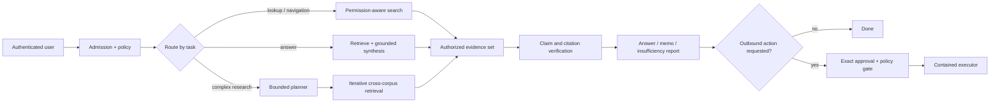
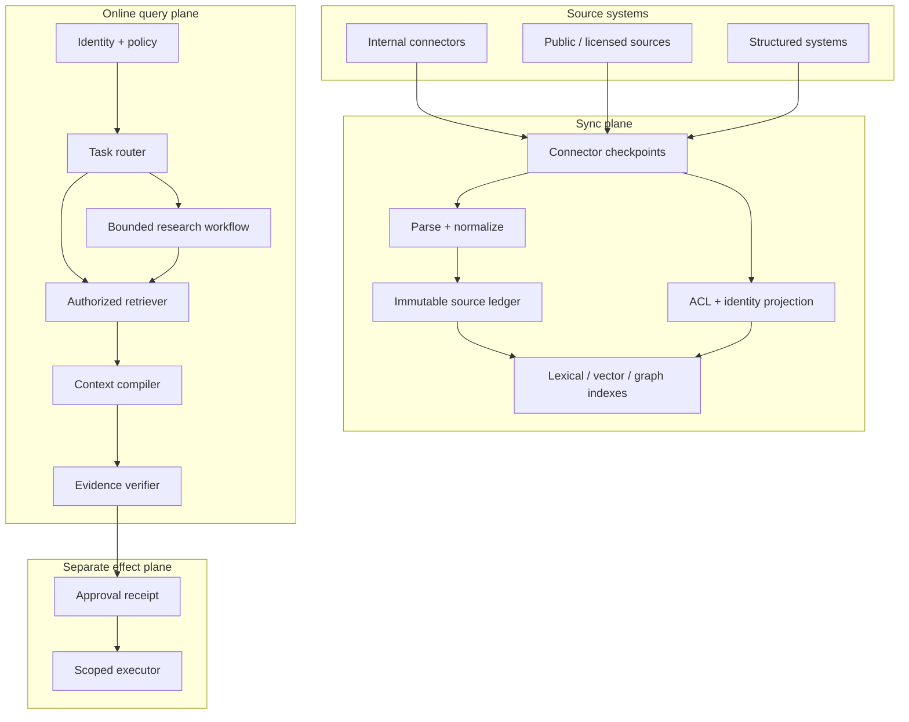

# Enterprise Knowledge and Company-Research Agent Blueprint

> **Status:** Research-backed production blueprint  
> **Research baseline:** 2026-08-31  
> **Scope:** Permission-aware enterprise knowledge discovery, multi-source company research, and evidence-grounded decision support  
> **Evidence:** [Research packet](../../research/packets/enterprise-knowledge-agent-blueprint.md)

An enterprise knowledge agent is not a chatbot placed in front of a vector database. It is a governed research system that can discover, authorize, compare, and explain evidence across changing internal and external sources without widening a user's access.

The recommended production shape is **hybrid and progressive**:

- a non-agent search path handles exact lookup and most single-hop questions;
- permission-aware hybrid retrieval combines lexical, semantic, metadata, and optional graph signals;
- a bounded research loop decomposes only genuinely multi-source or multi-hop questions;
- deterministic application code owns identity, authorization, budgets, state, citations, approvals, and external effects;
- every answer is derived from an evidence ledger with source, version, ACL, time, and claim lineage.

The model proposes queries, decompositions, claims, and actions. It is never the authority for access control, source truth, approval, or audit history.

## What this blueprint is for

Use it for systems that must:

- answer questions across document stores, wikis, tickets, repositories, messages, databases, and approved public sources;
- preserve source permissions, tenant boundaries, legal holds, and retention rules through every derived index;
- investigate companies, markets, suppliers, products, projects, incidents, or policies across heterogeneous evidence;
- decompose comparison, temporal, multi-hop, and corpus-wide questions;
- expose citations, contradictory evidence, freshness, uncertainty, and incomplete coverage;
- produce reusable decision artifacts rather than transient chat prose;
- survive missed webhooks, expired cursors, reindexing, permission churn, model failure, and partial connector outages;
- execute an outbound action only after a separate policy and approval boundary.

Do **not** use this architecture for deterministic reports that SQL can answer, exact navigation that search can answer, a small static FAQ, or a workflow whose steps are already known. A non-agent search application is usually safer, faster, cheaper, and easier to evaluate for those cases.

## Read in this order

| Guide | Production decision |
|---|---|
| [Product contract and workflows](product-contract-and-workflows.md) | Define users, decisions, tasks, non-goals, answer modes, and service objectives |
| [Architecture and stack selection](architecture-and-stack-selection.md) | Choose search-only, retrieval-only, agentic RAG, graph, workflow, or hybrid boundaries |
| [Connectors, ingestion, and corpus sync](connectors-ingestion-and-corpus-sync.md) | Keep content, metadata, permissions, and derived indexes reconciled |
| [Connector qualification and adapter playbooks](connector-qualification-and-adapter-playbooks.md) | Admit and operate Drive, SharePoint, Confluence, Slack, email, object-store, database, search/vector, and MCP integrations |
| [Identity-aware retrieval and ranking](identity-aware-retrieval-and-ranking.md) | Enforce tenant and document authorization while combining lexical, vector, graph, and reranking signals |
| [Research orchestration, state, and context](research-orchestration-state-and-context.md) | Decompose hard questions, manage tools and budgets, and keep long runs coherent |
| [Evidence, citations, freshness, and contradictions](evidence-citations-freshness-and-contradictions.md) | Build claim-level provenance and make uncertainty, time, and disagreement explicit |
| [Security, governance, and outbound actions](security-governance-and-outbound-actions.md) | Contain prompt injection, poisoning, exfiltration, legal risk, and side effects |
| [Reliability, observability, deployment, and cost](reliability-observability-deployment-and-cost.md) | Reindex, recover, scale, trace, cache, and operate the system |
| [Evaluation and acceptance testing](evaluation-and-acceptance-testing.md) | Measure retrieval, answers, research tasks, security, freshness, and repeated reliability |
| [Implementation roadmap](implementation-roadmap.md) | Build the smallest safe system in gated stages with concrete contracts |

## Boundary with adjacent blueprints

This blueprint owns **permission-aware discovery and evidence-grounded answers across an enterprise corpus**. Keep nearby specialties separate so one assistant does not accumulate incompatible authority:

| Adjacent blueprint | It owns | Enterprise-knowledge relationship |
|---|---|---|
| [Deep Research Agent](../deep-research-agent/README.md) | Open-web and mixed-source evidence production for a bounded brief | Reuse its evidence discipline for an investigate route; enterprise knowledge additionally owns internal corpus synchronization and identity-aware retrieval |
| [Document Intelligence Agent](../document-intelligence-agent/README.md) | File intake, OCR/layout understanding, extraction, review, and document effects | Consume its approved document observations; do not duplicate high-risk document processing inside a generic connector |
| [Knowledge Graph and Data-Catalog Stewardship Agent](../knowledge-graph-stewardship-agent/README.md) | Entity/ontology/schema/lineage candidates, curator decisions, and governed graph publication | Consume curated entities and metadata; this blueprint may query a graph but does not merge identities or publish ontology changes |
| [Analytics Agent](../analytics-agent/README.md) | Governed computation, semantic models, metrics, and analytical conclusions | Route deterministic metrics and exploratory analysis there; enterprise knowledge may retrieve approved reports but does not invent metric definitions or free-form production SQL |

Incident-response, security-investigation, sales, and other domain blueprints may use the enterprise corpus. They retain their domain state, authority, actions, and evaluation. This agent returns evidence and bounded decision support; it does not silently become the domain operator.

## Zero-to-production progression

| Stage | Useful outcome | Complexity admitted |
|---|---|---|
| 0 — qualify | Prove the need, policy, corpus, and deterministic baseline | No agent loop; search, SQL, or fixed workflow first |
| 1 — authorized search | Find and open current permitted sources | One reconciled connector and identity-aware lexical search |
| 2 — grounded-answer MVP | Answer a bounded question with verified citations and abstention | One retrieval/synthesis/verification path; no conversational memory |
| 3 — reliable research v1 | Complete multi-source evidence slots and resume safely | Bounded loop, typed state/events, compaction, contradictions, and short-lived run memory |
| 4 — production service | Meet SLOs under load, failure, revocation, deletion, and upgrades | Independent worker pools, capacity controls, tracing, incident response, canary, and rollback |
| 5 — controlled effects | Optionally draft or execute one exact governed action | Separate credentials, policy, preview, approval, idempotency, receipt, and reconciliation |
| 6 — governed evolution | Improve a measured failure without weakening invariants | Behavior bundles, held-out evals, shadow/canary, drift monitoring, failure mining, and reversible release |

Each stage is a valid stopping point. Do not proceed because a framework makes the next capability easy; proceed only when measured user value and an accountable owner justify its risk and operating cost.

## Reference architecture

The three planes fail differently and should not share an implicit trust boundary:

1. The **sync plane** is an eventually consistent projection of source truth. It must detect drift and prioritize revocations and deletions.
2. The **query plane** is user-facing and fail-closed. It must authorize every candidate before it becomes model context.
3. The **effect plane** is optional. It accepts an exact, approved operation—not free-form model intent—and reauthorizes immediately before commit.

## Architecture decision summary

| Workload | Default | Add complexity only when |
|---|---|---|
| Find a document, owner, identifier, or passage | Permission-aware lexical or hybrid search | Semantic recall measurably improves the domain query set |
| Answer one bounded question from a stable corpus | Retrieve, rerank, synthesize, verify | Multi-hop evidence is routinely missed |
| Compare projects, vendors, policies, or companies | Bounded workflow with decomposition and evidence matrix | The subquestions cannot be known or covered in one retrieval pass |
| Explore ownership, dependency, influence, or corpus-wide themes | Text retrieval plus a selective graph projection | Graph evaluation beats the text baseline enough to justify extraction and sync cost |
| Produce the same periodic report | Deterministic workflow with model-assisted extraction and writing | New leads materially change the required steps |
| Send email, update CRM, create a ticket, or publish a memo | Separate exact approval and effect executor | Never give a read/research loop ambient write authority |

## Non-negotiable invariants

A production release fails closed if any mandatory invariant is false:

1. A user can retrieve only evidence authorized for that user, tenant, purpose, and request time.
2. Authorization is evaluated before content enters model context and again before any source drill-down or external effect.
3. Content, ACL, identity, parser, embedding, and index versions are independently observable.
4. A permission revocation or deletion has a measured propagation objective and a repair path.
5. Every material factual claim maps to captured source spans or is labeled as analysis, assumption, or unresolved.
6. Contradictory material evidence remains visible; source repetition does not masquerade as independent corroboration.
7. The context window is a compiled view, not a database, audit log, authorization boundary, or durable memory.
8. Retrieved text and connector output are untrusted data, even when the connector itself is approved.
9. The research loop has explicit search, token, time, cost, tool, and fan-out limits and a bounded insufficiency result.
10. An outbound action requires a typed effect, current authorization, policy approval, idempotency key, and auditable receipt.
11. Indexes, caches, and graph projections can be rebuilt from retained source records and pinned transformations.
12. Security, retrieval, answer, freshness, and task evaluations gate releases; a polished demo does not.

## Version baseline and refresh triggers

This blueprint uses a 2026-08-31 research baseline. Important volatile dependencies include:

- MCP `2026-07-28`, which changed the protocol core to stateless request/response and hardened authorization; negotiate and pin the deployed revision;
- OpenTelemetry GenAI agent conventions, which remain **Development** and should not be the only durable event schema;
- current Microsoft GraphRAG documentation, which describes standard, fast, local, global, and DRIFT approaches but explicitly warns about indexing cost;
- managed search permission features, some of which are preview, have ACL-entry limits, or differ in identity-provider support;
- source APIs, rate limits, change-feed behavior, content licenses, model retention terms, and AI governance requirements.

Refresh the blueprint when a connector changes permission or delta semantics; an embedding, parser, reranker, or model changes; an authorization incident occurs; an evaluation slice regresses; a regulator or data license changes; the MCP or OpenTelemetry revision changes; or a graph/index upgrade requires a rebuild.

## Definition of done

The system is ready for a production cohort only when operators can answer:

- Which source version and permission state produced each returned passage?
- Would the same request from another identity receive a different, correctly filtered evidence set?
- Which evidence supports, contradicts, or supersedes every material claim?
- How stale can content, permissions, group membership, and answer caches become?
- What happens when a webhook is lost, a delta cursor expires, or a reindex is only half complete?
- Which source-specific capability tests prove that each connector preserves identity, access, deletion, and rebuild semantics?
- Can a tenant deletion, legal hold, or source revocation be traced across raw content, chunks, vectors, graph edges, caches, traces, and evaluations?
- Can a failed research run resume without duplicating work or external effects?
- Which measured query classes justify agentic or graph complexity over the search baseline?
- Which behavior bundle produced this result, and can the prior compatible bundle be restored without rolling back new revocations, tombstones, holds, or audit evidence?
- Do repeated, adversarial, and failure-injection evaluations meet release thresholds?

If those answers depend on trusting a model transcript or a vendor dashboard alone, the system is still a prototype.
