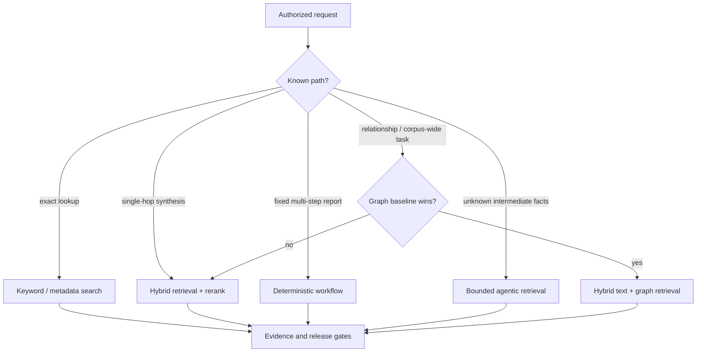
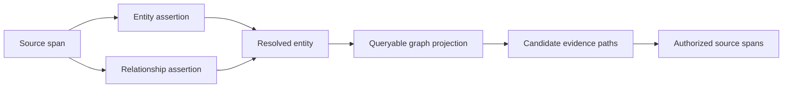

# Architecture and Stack Selection

> **Purpose:** Select the least complex architecture that meets measured query, evidence, authorization, durability, and operational requirements.

## The default: a hybrid application, not an autonomous agent

Most enterprise questions should take the short path. Keep one permission-aware retrieval service and add a bounded research workflow around it for the minority of questions that genuinely require decomposition or iteration.



Agentic behavior is a query strategy, not the system architecture. Identity, policy, ingestion, evidence, storage, observability, and effects remain ordinary software.

## Architecture comparison

| Architecture | Best fit | Strengths | Main failure modes | Operational cost |
|---|---|---|---|---:|
| Search-only | Navigation, known-item lookup, exact identifiers | Fast, inspectable, low hallucination risk | Vocabulary mismatch, no synthesis | Low |
| Retrieval-only RAG | Bounded questions with nearby evidence | Simple grounding and citations | Partial multi-hop context, noisy chunks, false confidence | Low–medium |
| Agentic RAG | Unknown intermediate facts, cross-corpus investigation | Adaptive queries and stopping | Compounding errors, latency, cost, loop drift | Medium–high |
| Knowledge-graph retrieval | Stable entities/relations, ownership, dependency, corpus-wide themes | Explicit traversal, aggregation, relationship queries | Entity collisions, stale edges, expensive extraction | High |
| Deterministic workflow | Known periodic reports or regulated processes | Predictable steps, approvals, durability | Brittle for novel leads | Medium |
| Hybrid | Mixed enterprise workloads | Short fast path plus bounded complexity | More interfaces and version coordination | Medium if staged |

### When a non-agent application is better

Choose search, SQL, analytics, or a fixed workflow when:

- a user needs a source, not a generated answer;
- the relevant system already exposes a structured query or report;
- steps are known and must be auditable;
- latency, determinism, or cost dominates open-ended recall;
- a wrong answer is materially worse than an explicit “not found”;
- the corpus is small and stable;
- authorization cannot safely follow adaptive cross-source exploration;
- evaluation does not show a meaningful advantage from multiple retrieval rounds.

“Can a model do this?” is not the decision criterion. Ask whether adaptive model control produces enough incremental task success to pay for the new failure surface.

## Retrieval architecture

Use a search engine with an inverted index and metadata filtering as the baseline. Add dense vectors, learned sparse retrieval, or late interaction only after measuring domain queries.

| Retrieval layer | Captures | Misses or costs | Use when |
|---|---|---|---|
| BM25 / lexical | Exact names, clauses, error codes, SKUs, acronyms | Paraphrase and semantic mismatch | Always retain as a baseline |
| Dense vector | Paraphrases and conceptual similarity | Rare identifiers, negation, temporal nuance; embedding/index cost | Domain evaluation shows recall gain |
| Learned sparse | Lexical interpretability plus expansion | Model and index complexity | Dense misses vocabulary-heavy queries |
| Late interaction | Fine-grained token matching | Larger index and serving cost | High-value retrieval justifies it |
| Metadata / structure | Tenant, ACL, type, owner, time, hierarchy | Depends on clean metadata | Always, before semantic ranking |
| Cross-encoder rerank | Higher precision over candidate set | Added p95 latency and model cost | Candidate recall is good but ordering is weak |
| Graph traversal | Explicit relationship paths and aggregations | Extraction, entity resolution, ACL propagation | Stable relation questions dominate |

Hybrid retrieval should fuse ranks rather than raw scores when score distributions differ. Reciprocal Rank Fusion is a practical baseline:

```text
RRF(document) = Σ 1 / (k + rank_i(document))
```

The common `k=60` is a starting point, not a domain truth. Tune candidate depths, channel weights, filters, and reranking on the production query set. Preserve per-channel ranks for diagnosis.

## Agentic RAG boundary

Use a bounded loop only when each round can change what evidence is needed:

```text
admit -> decompose -> retrieve -> assess coverage
      -> {refine query | open source | stop}
      -> assemble claims -> verify -> release
```

The loop receives read-only tools and a typed state object. It cannot alter policies, install connectors, widen source scope, modify the corpus, or perform effects. Stop conditions belong to code:

- all required evidence slots satisfied;
- no new material evidence across a configured number of rounds;
- explicit insufficiency or source-access limit;
- search, document, token, cost, or wall-clock budget exhausted;
- policy or security gate triggered.

Multi-agent fan-out is rarely the first optimization. Use it only for independent comparison branches or large breadth where measured wall-clock or recall gains exceed coordination, duplicate retrieval, and synthesis costs.

## Knowledge graph decision

A graph is an additional derived index, not a replacement for source passages. Every node and edge must point back to evidence and inherit authorization and lifecycle rules.



Adopt a graph when representative questions require:

- ownership, reporting, dependency, supplier, control, or event paths;
- stable entity resolution across identifiers and aliases;
- corpus-wide aggregation or theme discovery not served by top-k chunks;
- explicit traversal constraints that search filters cannot express;
- reusable relationships for several high-value workflows.

Avoid or delay a graph when:

- questions are mostly document lookup or local passage QA;
- entities and relations change rapidly or are weakly defined;
- the team cannot maintain entity resolution and ACL propagation;
- graph facts would be LLM-extracted without verification;
- index-time LLM cost and reprocessing delay violate freshness objectives;
- a simple relational table or search facet answers the same query.

Microsoft GraphRAG's published methods are useful references, not a default product choice. Its standard method uses LLM extraction and community summaries; its documentation estimates graph extraction at roughly 75% of indexing cost and describes a cheaper but noisier fast method. Benchmark graph retrieval against the text baseline on the actual corpus.

## Workflow and durable execution boundary

Add a durable workflow engine or equivalent persisted state machine when runs:

- exceed one request lifecycle;
- wait on connectors, humans, or scheduled refreshes;
- must resume after process or provider failure;
- include approval or external effects;
- require per-step retries, compensation, and deadlines;
- must preserve a versioned audit trail.

Do not put nondeterministic model calls or network effects inside replay-sensitive workflow logic. Treat them as activities with timeouts, idempotency keys, persisted inputs and outputs, and explicit retry policy. See the repository's [durable execution guide](../../runtime/durable-execution.md) for general runtime semantics.

## Storage boundaries

One database rarely serves every access pattern well, but do not split before a measured need.

| Store | Owns | Must not be treated as |
|---|---|---|
| Source ledger / object storage | Captured source representations, checksums, parser inputs | Search index |
| Metadata database | Documents, versions, ACL references, checkpoints, claims, runs | Blob archive |
| Search index | Lexical fields, metadata, optional vectors | System of record |
| Authorization service or projection | Subject-object relationships and policy revisions | Static document tag only |
| Optional graph store | Derived entity and relation assertions | Authoritative truth without evidence |
| Cache | Version-keyed reusable computations | Durable state or permission boundary |
| Trace / audit systems | Operational telemetry and security receipts | Unbounded raw-content replica |

For a modest corpus, PostgreSQL plus row-level security, full-text search, and a vector extension may be sufficient. A dedicated search cluster becomes attractive for hybrid ranking, high query volume, large corpora, or richer operational tooling. A vector-only database is not required for RAG and must not replace lexical or metadata retrieval by default.

## Language and runtime choice

Choose the language the operating team already runs reliably. Agent frameworks are not a reason to create a new platform language.

| Runtime | Good fit | Watch for |
|---|---|---|
| Python | Parsing, information retrieval, ML evaluation, graph research | Async/service discipline, packaging, CPU-heavy parser isolation |
| TypeScript / Node.js | Product APIs, connector-heavy integrations, streaming UX | CPU-bound document processing and library quality variance |
| Java / Kotlin or C# | Existing enterprise services, identity and governance integration | Slower access to some experimental retrieval libraries |
| Go | High-throughput connectors, gateways, contained tool services | Smaller model/IR experimentation ecosystem |
| Rust | High-assurance parsers or performance-critical components | Team expertise and development cost |

Start with one runtime. Split a parser worker, embedding service, or connector only when isolation, scaling, or library constraints justify the boundary. See [runtime language selection](../../languages/choosing-an-agent-runtime-language.md) for a broader comparison.

## Model selection

Select models per stage with a pinned evaluation, not by leaderboard reputation.

| Stage | Required behavior | Common economical choice |
|---|---|---|
| Admission / routing | Stable classification and structured output | Rules first, small model for ambiguity |
| Query rewrite | Entity and terminology preservation | Small or medium model |
| Decomposition | Complete, non-duplicative evidence slots | Stronger model on complex route only |
| Extraction | Schema adherence and quote fidelity | Small model plus deterministic validation |
| Reranking | Domain relevance | Dedicated reranker or search-native semantic ranker |
| Synthesis | Multi-source reasoning and calibrated abstention | Strong model with bounded context |
| Verification | Claim-evidence support and contradiction detection | Independently prompted model plus deterministic checks |

Evaluate data residency, provider retention, context limit, structured outputs, tool calling, multilingual quality, throughput, rate limits, SLA, safety controls, and cost. A larger context window does not remove the need for retrieval or context selection; long-context research shows that position and irrelevant content can still degrade use of evidence.

## Tool protocol choice

MCP can standardize discovery and invocation, but it does not supply application authorization, source ACL correctness, safe tool semantics, or approval policy. For MCP deployments:

- pin and negotiate the protocol revision;
- use the `2026-07-28` stateless request model only when clients and servers support it;
- validate token audience and issuer; never pass through unrelated bearer tokens;
- route and authorize on trusted method/name metadata, then validate the body;
- keep connector credentials outside model-visible state;
- expose narrow business operations, not generic HTTP, SQL, filesystem, or shell access;
- map protocol telemetry into an application-owned event schema.

Direct application APIs are simpler when only one service consumes the connector. Adopt a protocol when interoperability benefits exceed the extra trust boundary.

## Build-versus-buy questions

Managed enterprise search can accelerate connectors, ACL filtering, ranking, and operations. It does not remove the need to verify:

- source and identity-provider coverage;
- ACL entry and group-membership limits;
- deletion and revocation propagation;
- preview versus generally available features;
- residency, encryption, retention, and model-provider paths;
- query-time identity semantics and failure behavior;
- export, rebuild, backup, and vendor-exit paths;
- evaluation access to candidates, scores, and traces.

If the managed layer cannot expose enough evidence to test authorization and retrieval correctness, its convenience may be incompatible with the product risk tier.

## Selection checklist

- [ ] A lexical search baseline exists and is evaluated.
- [ ] Dense retrieval and reranking are added only with per-slice gains.
- [ ] The agent route is limited to tasks with unknown intermediate facts.
- [ ] A graph has explicit high-value query classes, an evidence model, and a text baseline.
- [ ] Durable workflow state is used for long runs and effects.
- [ ] Runtime and framework choices follow team operations, not demo popularity.
- [ ] Model routes are pinned to stage-specific evaluations.
- [ ] Search, graph, authorization, and workflow stores have clear systems of record.
- [ ] Managed services have documented limits, preview status, and exit plans.

## Canonical sources

- [Azure AI Search: hybrid ranking with RRF](https://learn.microsoft.com/en-us/azure/search/hybrid-search-ranking)
- [Elasticsearch: reciprocal rank fusion](https://www.elastic.co/docs/reference/elasticsearch/rest-apis/reciprocal-rank-fusion)
- [BEIR retrieval benchmark](https://github.com/beir-cellar/beir)
- [ColBERT repository and papers](https://github.com/stanford-futuredata/ColBERT)
- [Microsoft GraphRAG methods](https://microsoft.github.io/graphrag/index/methods/)
- [From Local to Global: GraphRAG paper](https://arxiv.org/abs/2404.16130)
- [IRCoT: interleaved retrieval and reasoning](https://aclanthology.org/2023.acl-long.557/)
- [Lost in the Middle](https://aclanthology.org/2024.tacl-1.9/)
- [MCP `2026-07-28` release](https://github.com/modelcontextprotocol/modelcontextprotocol/blob/main/blog/content/posts/2026-07-28-spec-ga/index.md)

