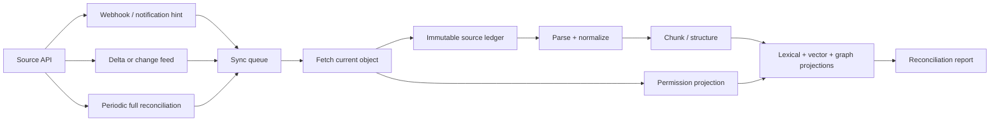
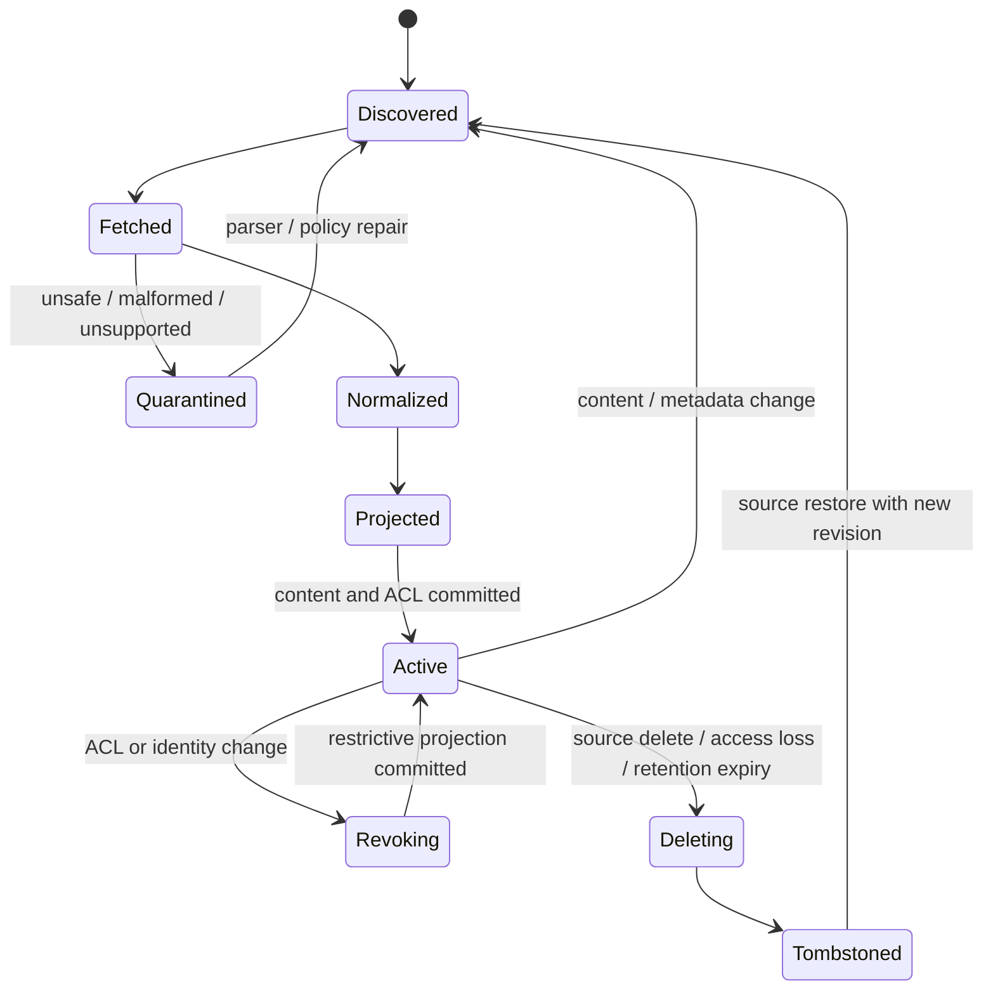

# Connectors, Ingestion, and Corpus Synchronization

> **Purpose:** Build a reconstructable, permission-preserving corpus from source systems whose content, hierarchy, identity, and APIs change independently.

Use this guide for the common replication contract. Use [Connector qualification and adapter playbooks](connector-qualification-and-adapter-playbooks.md) to test the source-specific semantics of Drive, SharePoint, Confluence, Slack, email, object stores, databases, search/vector systems, and MCP before admission.

## A connector is a replication boundary

A production connector is not a file loader. It is a stateful replication client that must model:

- stable source identifiers and revisions;
- content, metadata, hierarchy, labels, and attachments;
- direct and inherited permissions;
- creates, updates, moves, deletes, tombstones, and access loss;
- rate limits, pagination, partial pages, cursor expiry, and replay;
- webhook hints, change feeds, periodic reconciliation, and backfill;
- source terms, licenses, retention, and data residency.

Treat every derived representation as disposable. The retained source ledger and transformation manifests must be sufficient to rebuild normalized documents, chunks, embeddings, lexical indexes, and graph assertions.



Webhooks reduce latency but are not a completeness guarantee. Change feeds reduce work but can expire or omit inherited permission propagation. Periodic reconciliation closes the gap.

## Connector contract

Keep the adapter interface narrow and source-neutral while retaining raw source-specific metadata.

```yaml
source_object:
  tenant_id: tenant_acme
  connector_id: con_sharepoint_finance
  source_type: sharepoint
  source_object_id: "driveItem:01ABC..."
  source_parent_id: "driveItem:01ROOT..."
  source_revision: "etag:{...}"
  observed_at: "2026-08-31T03:12:20Z"
  source_modified_at: "2026-08-31T02:58:04Z"
  operation: upsert       # upsert | delete | access_lost | move
  media_type: application/pdf
  content_uri: "ledger://tenant_acme/sha256/..."
  content_sha256: "..."
  metadata:
    title: "FY27 operating plan"
    labels: ["confidential", "finance"]
    canonical_url: "https://..."
  access:
    inheritance_root: "driveItem:01ROOT..."
    acl_revision: "acl:{...}"
    allow: ["group:finance", "user:42"]
    deny: []
    source_visibility: private
  retention_class: finance_7y
  legal_hold_ids: []
```

The common envelope must not flatten away source semantics. Preserve whether permissions are direct, inherited, link-based, conditional, external, expired, or unavailable.

Keep four identities separate:

| Identity | Purpose | Example |
|---|---|---|
| Source object | Stable identity across rename or move | Drive file ID, SharePoint drive item ID, Confluence content ID |
| Source version | Exact content/metadata observation | Revision ID, version number, generation, transaction/snapshot position, or explicit digest |
| Corpus projection | One reproducible normalized/indexed generation | Parser, chunker, embedding, lexical, graph, and ACL versions |
| Citation representation | The captured span and user-resolvable view cited in an answer | Evidence ID plus source version, offsets/page/section, and current-access check |

Do not use URL, path, title, thread subject, display name, vector point ID, or text hash as the only source identity. They can change, collide, or describe a derived representation. If a source has no stable version token, record observation time and content/metadata/access digests, then reconcile immediately before publication when correctness matters.

## Synchronization state machine



Do not expose a newly indexed content version until its ACL projection is ready. On a restrictive permission change, make the document unavailable before or at the same commit as the new ACL. Favor temporary false negatives over unauthorized disclosure.

## Initial scan, incremental sync, and reconciliation

### Initial scan

1. Capture a source-specific start token or snapshot boundary when available.
2. Enumerate objects by stable ID, not path.
3. Fetch content, metadata, hierarchy, and permission roots with bounded concurrency.
4. Commit idempotently using `(tenant, connector, source_object_id, source_revision)`.
5. Replay changes after the boundary until caught up.
6. Compare counts, hashes, ACL roots, and sampled objects against the source.
7. Enable query traffic only after an authorization-focused acceptance scan.

### Incremental sync

Use notifications as queue triggers and delta feeds as the source of changed IDs. Persist the next-page token after every accepted page and the final delta token only after every page effect is durably recorded.

Microsoft Graph `driveItem: delta`, for example, returns latest object state rather than every intermediate change, can repeat an item, and expects clients to use the last occurrence. Google Drive change entries similarly describe current state rather than a property diff. Connector logic must be idempotent and state-comparing, not event-counting.

### Periodic reconciliation

Run a full or partitioned scan on a source-specific cadence. Compare:

- object existence and revision;
- hierarchy and canonical location;
- content hash and parser outcome;
- ACL root, direct permissions, inherited permission digest, and link visibility;
- retained tombstones and access-loss events;
- index generation, embedding version, and graph extraction version.

Reconciliation repairs silent drift and produces an auditable discrepancy report. It must not blindly resurrect content intentionally deleted by retention or legal policy.

## Permission synchronization

Permission data often changes more dangerously than content.

| Change | Required response | Priority |
|---|---|---:|
| Public or broad access becomes restricted | Remove from broad query visibility before reprocessing | Critical |
| User/group loses access | Invalidate authorization cache and deny affected objects | Critical |
| Parent inheritance changes | Recompute affected descendants or use a live relationship check | Critical |
| Restricted content becomes broader | Update only after source state is confirmed | Normal |
| Group membership changes | Update identity graph/cache with bounded staleness | Critical for removals |
| Sharing link created or removed | Model link scope, expiry, and audience explicitly | High |

Google Drive documents that a permission change on a parent does not create a separate change entry for every descendant; clients must propagate capabilities or refetch children. Microsoft Graph exposes headers for scanning permission hierarchies and changes, but stronger scanning permissions may be required. Test each connector's inherited-permission behavior rather than assuming a universal delta model.

Never copy a source connector's application credential into the query path as a substitute for end-user authorization. The connector may have broad indexing access while the query must preserve user-specific visibility.

## Parsing and normalization

Run parsers in a resource-constrained, network-isolated worker. Inputs can be malformed, adversarial, enormous, encrypted, nested, or designed to exploit parser libraries.

The normalization pipeline should:

- detect media type from content, not filename alone;
- enforce byte, page, nesting, decompression, image, and time limits;
- malware-scan and quarantine where required;
- preserve document structure, reading order, tables, headings, lists, footnotes, and page anchors;
- distinguish visible text, OCR text, comments, speaker notes, formulas, and hidden layers;
- preserve exact source bytes and parser version;
- emit parse confidence and warnings rather than silently dropping sections;
- hash normalized blocks for change detection and reuse;
- avoid following embedded URLs or external references during parsing.

For source-native documents, capture both an API representation and a user-viewable export when permitted. A citation target should resolve to the representation the user can inspect, while the evidence ledger records the exact representation the system processed.

## Structure-aware chunking

Chunks are retrieval units, not source truth. Give each chunk a stable derivation ID and retain its parent structure.

```yaml
chunk:
  chunk_id: chk_01J...
  document_version_id: docv_01J...
  structural_path: ["Section 7", "Data residency", "Exceptions"]
  page_start: 18
  page_end: 19
  char_start: 44120
  char_end: 45882
  text_sha256: "..."
  parser_version: parser_pdf_3.4.1
  chunker_version: section_window_2
  acl_ref: acl_01J...
  valid_time:
    from: "2026-04-01"
    to: null
```

Use natural boundaries first, then bounded windows with overlap only where evaluation supports it. Store titles, headings, table schemas, code symbols, speaker names, or issue fields separately so ranking can weight them. Do not use one chunk size for contracts, chat threads, tables, code, and financial filings.

When content changes, reuse unchanged block hashes but publish a new document version. Never create a “Franken-document” whose chunks silently combine incompatible source revisions.

## External company-research sources

Model each external source by authority, update schedule, identifiers, license, and known gaps.

| Source class | Examples | Production guidance |
|---|---|---|
| Official registry / regulator | SEC EDGAR, Companies House, GLEIF, procurement portals | Prefer APIs/bulk feeds; honor rate and fair-access rules; retain filing or record dates |
| Company primary | Investor relations, official policies, product docs, press releases | Treat claims as first-party statements, not independent validation |
| Licensed intelligence | News, market, risk, patent, or financial data provider | Enforce contract, user entitlements, export, and retention terms |
| Public web | Standards, agencies, technical sources, reputable reporting | Capture canonical URL, access time, publisher, date, content hash, and terms |
| Internal relationship data | CRM, vendor management, incidents, contracts, project systems | Preserve purpose limits and role-based access; avoid employee profiling |

Use stable identifiers when available. GLEIF supplies LEI records, relationship data, and mappings; SEC provides CIK-based submissions and XBRL facts; Companies House uses company numbers. Preserve reporting periods and amendments. A corporate name, domain, or embedding is not a safe primary key.

### Entity resolution contract

```json
{
  "entity_id": "ent_01J...",
  "entity_type": "legal_entity",
  "canonical_name": "Example Holdings plc",
  "identifiers": [
    {"scheme": "LEI", "value": "...", "source": "GLEIF"},
    {"scheme": "CIK", "value": "0000123456", "source": "SEC"},
    {"scheme": "internal_vendor", "value": "V-1042", "source": "ERP"}
  ],
  "aliases": [{"value": "Example", "valid_from": "2020-01-01"}],
  "resolution": {
    "status": "reviewed",
    "method": "identifier_crosswalk",
    "evidence_ids": ["ev_..."]
  }
}
```

Automatic fuzzy matches remain candidates. High-impact merges and splits require deterministic identifiers or review. Preserve predecessor, successor, parent, subsidiary, branch, and brand relations separately.

## Idempotency and ordering

Use an inbox table or equivalent durable queue with a uniqueness key. A worker records its source observation before performing derived writes.

```text
sync_key = tenant_id + connector_id + source_object_id + source_revision

if sync_key already committed:
    acknowledge
else:
    record observation
    fetch and validate current source state
    write source version and ACL version
    build derived projections under target generation
    atomically publish document visibility
    record receipts and checkpoint
```

Out-of-order events are common. Compare source revision or observed state rather than letting the last worker to finish win. If the source does not offer a monotonic revision, use content/metadata hashes and a reconciliation read before publish.

## Deletion, retention, and tombstones

A source delete, access loss, retention expiry, and connector deauthorization are distinct operations.

- **Source delete:** remove query visibility, mark the source version deleted, cascade to chunks, vectors, graph assertions, and caches.
- **Access loss:** assume the connector can no longer prove continued visibility; fail closed until reconciled.
- **Retention expiry:** apply the approved retention policy across every copy, subject to legal hold.
- **Connector removal:** revoke credentials, stop sync, and execute the tenant's data disposition policy.

Keep minimal tombstones with non-sensitive identifiers, deletion reason, time, and cascade receipts so late events cannot resurrect deleted content. Do not retain deleted text “for debugging” outside the approved policy.

## Backpressure and rate limits

Use per-connector and per-tenant concurrency, token-bucket limits, exponential backoff with jitter, and `Retry-After` when provided. Separate:

- discovery and delta polling;
- metadata/ACL reads;
- content downloads;
- CPU-heavy parsing;
- embedding and graph extraction;
- index publication.

Prioritize revocations and deletes over ordinary content updates. A large reindex must not starve the permission queue. Bulk APIs are usually better for initial scans; SEC, for example, offers nightly bulk archives and limits automated access, while Companies House documents its own request window.

## Sync health indicators

| Indicator | Meaning |
|---|---|
| Change-feed lag | Time from source change to durable observation |
| Query-visibility lag | Time from observation to authorized searchable state |
| Revocation lag | Time from source restriction to denial in query path |
| Reconciliation drift | Missing, extra, revision-mismatched, or ACL-mismatched objects |
| Parser coverage | Supported, partial, failed, encrypted, and quarantined bytes/documents |
| Tombstone backlog | Deletes not fully cascaded through derived stores |
| Projection skew | Documents whose lexical, vector, graph, or ACL generations disagree |
| Cursor age | Time since a complete incremental checkpoint |

Page if revocation or deletion objectives are violated, not only when the connector returns errors.

## Failure matrix

| Failure | Safe behavior | Repair |
|---|---|---|
| Webhook lost | Delta poll or reconciliation discovers change | Replay from checkpoint |
| Delta token expired | Mark coverage uncertain and start bounded rescan | Re-establish token after catch-up |
| Partial page committed | Idempotent replay of the page | Advance final cursor only after receipts |
| Parent ACL changed without child events | Temporarily deny affected subtree if known | Recompute descendants or live-authorize |
| Parser upgrade changes layout | Keep old generation serving | Shadow reparse, evaluate, blue/green publish |
| Embedding provider fails | Continue lexical indexing | Backfill vector projection later |
| Source returns 403 after prior access | Remove visibility; do not assume transient | Reauthorize connector and reconcile |
| Reindex interrupted | Old generation remains live | Resume target generation from ledger |
| Duplicate company entity | Keep identities separate until reviewed | Merge via evidence-backed assertion |

## Acceptance checklist

- [ ] Every connector has documented change, permission, deletion, and cursor semantics.
- [ ] Webhooks are hints; delta replay and reconciliation exist.
- [ ] Restrictive ACL changes and deletes have priority queues and objectives.
- [ ] Source bytes, normalized blocks, parsers, chunkers, and projections are versioned.
- [ ] The system can rebuild all indexes without reading from an old vector index.
- [ ] Entity resolution uses stable identifiers and reviewed merge assertions.
- [ ] Parser workers are resource- and network-contained.
- [ ] Retention and deletion cascade through evidence, indexes, caches, traces, and eval artifacts.
- [ ] Initial scan, cursor expiry, inherited ACL changes, and partial-page replay have been tested.
- [ ] The source-specific capability card and admission tests in the connector-qualification guide pass.

## Canonical sources

- [Microsoft Graph `driveItem: delta`](https://learn.microsoft.com/en-us/graph/api/driveitem-delta?view=graph-rest-1.0)
- [Google Drive: track changes](https://developers.google.com/workspace/drive/api/guides/about-changes)
- [Google Drive: retrieve changes](https://developers.google.com/workspace/drive/api/guides/manage-changes)
- [Confluence REST API and webhooks](https://developer.atlassian.com/cloud/confluence/rest/v1/)
- [SEC EDGAR data APIs](https://www.sec.gov/search-filings/edgar-application-programming-interfaces)
- [SEC developer fair-access guidance](https://www.sec.gov/about/developer-resources)
- [Companies House developer guidelines](https://developer.company-information.service.gov.uk/developer-guidelines)
- [GLEIF API](https://www.gleif.org/en/lei-data/gleif-api)
- [GLEIF relationship data format](https://www.gleif.org/en/lei-data/access-and-use-lei-data/level-2-data-relationship-record-rr-cdf-2-1-format)
- [Connector qualification and adapter playbooks](connector-qualification-and-adapter-playbooks.md)
