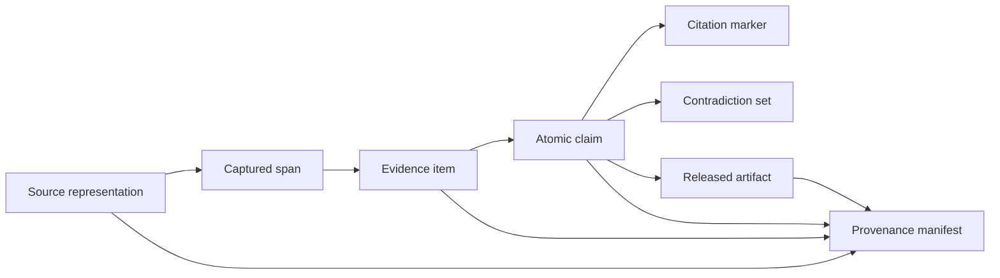
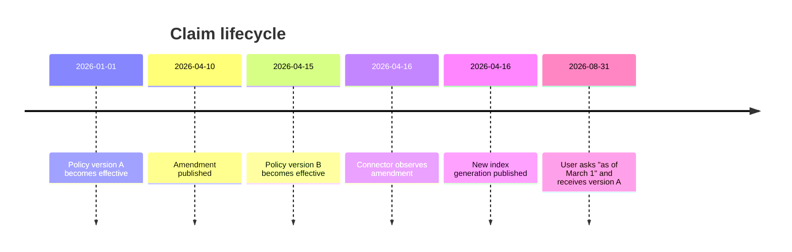

# Evidence, Citations, Freshness, and Contradictions

> **Purpose:** Make answers inspectable, time-aware, conflict-aware, and reproducible at claim level.

## The evidence ledger is the center of the system

Retrieved text is not evidence until the system records which source representation, version, span, identity, and authorization state it used. A URL or document ID alone is insufficient because the target can change.



This structure follows the spirit of W3C PROV: distinguish entities, activities, agents, and derivation. A production schema can be relational or document-based; the important requirement is immutable lineage.

## Evidence schema

```yaml
evidence_item:
  evidence_id: ev_01J...
  tenant_id: tenant_acme
  source:
    connector_id: sec_edgar
    source_object_id: "accession:0000123456-26-000042"
    canonical_url: "https://www.sec.gov/Archives/..."
    publisher: "U.S. Securities and Exchange Commission"
    source_class: regulator_filing
  representation:
    document_version_id: docv_01J...
    content_sha256: "..."
    media_type: text/html
    fetched_at: "2026-08-31T02:10:00Z"
    parser_version: sec_html_2.1
  span:
    structural_path: ["Item 1A", "Cybersecurity risk"]
    char_start: 183220
    char_end: 184101
    text_sha256: "..."
  time:
    published_at: "2026-08-12"
    effective_from: "2026-06-30"
    effective_to: null
    observed_at: "2026-08-31T02:10:00Z"
  access_receipt:
    acl_revision: public
    policy_revision: policy_9f3a
  quality:
    authority: primary
    independence_group: filing_000042
    parse_confidence: 0.99
  status: accepted
```

Do not store a relevance or source-quality score without its rubric and version. Numeric confidence can look calibrated when it is only a model impression.

## Claim schema

Draft from atomic claims, then compose prose. This prevents one citation from being attached to a sentence containing several independently unsupported facts.

```yaml
claim:
  claim_id: cl_01J...
  text: "Northstar reported $420 million in cash and equivalents at 2026-06-30."
  claim_type: factual
  subject_entity_id: ent_northstar
  predicate: cash_and_equivalents
  value:
    amount: 420000000
    currency: USD
  valid_at: "2026-06-30"
  support:
    - evidence_id: ev_01J...
      relation: entails
      verifier: claim_support_v5
  contradicts: []
  status: verified
  materiality: high
```

Separate:

- **fact:** directly supported by evidence;
- **calculation:** derived from cited inputs and an explicit formula;
- **analysis:** reasoned interpretation of supported facts;
- **recommendation:** a proposed decision or action;
- **assumption:** user- or system-supplied premise not established by evidence;
- **unresolved:** disputed or insufficiently supported.

## Citation requirements

A citation must be:

1. **Correct:** the cited span supports the nearby claim.
2. **Complete:** every material factual claim that needs support has a citation.
3. **Precise:** it targets the relevant section, page, row, message, commit, or filing fact.
4. **Stable:** it records the processed representation and a user-viewable target when permitted.
5. **Authorized:** the viewer can open the source or receives a policy-safe explanation.
6. **Current enough:** the evidence meets the claim's freshness policy.
7. **Independent enough:** repeated copies do not masquerade as corroboration.

ALCE separates citation quality from fluency and correctness, a useful reminder that citation count is not evidence quality. Evaluate support and completeness at claim level with calibrated human review.

### Citation rendering

The user-facing marker should map to an evidence ID; display logic resolves a source link or protected preview at request time. Never embed temporary signed URLs in durable artifacts. A private citation should not reveal its title or existence to a user who later loses access.

For a quote, store the exact source bytes or normalized text, location, and normalization policy. Verify quotes deterministically; do not ask a model whether they “look correct.”

## Source quality and independence

Authority is claim-specific. A company is authoritative about what it announced, but not independent evidence that the announcement is effective or successful.

| Dimension | Questions |
|---|---|
| Proximity | Is this the original filing, contract, measurement, code change, or eyewitness record? |
| Authority | Is the publisher responsible or qualified for this claim type? |
| Independence | Does it share an upstream source, corporate owner, press release, or dataset with other evidence? |
| Method | Are data collection, definitions, sample, and limitations visible? |
| Time | Is publication, effective, measurement, and observation time suitable? |
| Integrity | Is the representation complete, signed, amended, retracted, or corrected? |
| Access | Can the intended reviewer inspect it under current permissions? |
| Applicability | Does geography, product, entity, contract, or population match the question? |

Do not create a universal source reputation score. Keep dimension-level judgments and apply a workflow-specific evidence bar.

## Time model and freshness

“Latest” is not a single timestamp. Track at least:

- source publication or filing time;
- source modification time;
- fact effective or valid time;
- connector observation time;
- index publication time;
- query time;
- answer release time.



Freshness is a policy per claim class:

| Claim class | Example policy |
|---|---|
| Static identity | Revalidate on source change or periodic reconciliation |
| Current product availability | Source observed within 24 hours and effective status current |
| Financial figure | Latest required reporting period; preserve restatements |
| Contract obligation | Current executed agreement plus amendments and effective dates |
| Incident state | Live system or incident source within minutes |
| Historical question | Evidence valid at requested date, not simply newest document |

Fetching a stale page today does not make its claim current. Apply freshness to the fact and its authority, not only the HTTP timestamp.

### Supersession

Use explicit relationships:

```text
document_version_B supersedes document_version_A
claim_B supersedes claim_A for (subject, predicate, scope) from effective_time_B
```

Do not delete historical facts needed for “as of” questions. Exclude superseded claims from current answers while preserving lineage. When the system cannot determine supersession, create a contradiction set rather than choosing the last ingested chunk.

## Contradiction handling

Contradictions occur between sources, within a source over time, between extracted text and structured facts, or between model prior knowledge and retrieved evidence. Only the recorded sources count as answer evidence.

```yaml
contradiction_set:
  contradiction_id: con_01J...
  subject: ent_northstar
  predicate: employee_count
  scope: global
  claims: [cl_101, cl_102, cl_103]
  conflict_type: value_disagreement
  possible_explanations:
    - different_effective_dates
    - contractor_inclusion_definition
  resolution:
    status: unresolved
    preferred_claim_id: null
    review_required: true
```

### Resolution order

1. Check entity identity, units, currency, geography, product, population, and time.
2. Check amendment, retraction, correction, and source-version relationships.
3. Check whether sources repeat the same origin.
4. Apply the workflow's declared authority hierarchy.
5. Seek an additional independent primary source if allowed and useful.
6. If conflict remains material, surface competing claims and their evidence.

Do not ask one model to silently “decide which source is true.” Recent conflict benchmarks show that models can identify contradictions yet still struggle to answer content questions over conflicting context, and can be influenced by order or repetition.

## Coverage and sufficiency

Coverage is measured against the evidence-slot plan, not by token count.

```yaml
coverage:
  required_slots: 7
  satisfied_slots: 5
  conflicted_slots: 1
  authorization_limited_slots: 1
  unsupported_material_claims: 0
  citation_completeness: 0.97
  release_decision: complete_with_caveats
```

An answer can have perfect citations and still be incomplete if retrieval missed an entire criterion. Conversely, a concise answer can be complete with few citations if each material claim is supported.

## Calculations and structured data

For comparisons and financial research, compute rather than ask the model to do arithmetic in prose.

```yaml
calculation:
  calculation_id: calc_01J...
  formula: "(current_assets - inventory) / current_liabilities"
  inputs:
    current_assets: {value: 710000000, evidence_id: ev_a, period: "2026-Q2"}
    inventory: {value: 90000000, evidence_id: ev_b, period: "2026-Q2"}
    current_liabilities: {value: 400000000, evidence_id: ev_c, period: "2026-Q2"}
  result: 1.55
  engine: decimal_calc_v2
```

Validate units, reporting periods, accounting taxonomy, amendments, nulls, and currency conversion date. Cite inputs and expose the formula.

## Artifact manifest

Every released answer, memo, or monitor diff receives a manifest:

```yaml
artifact_manifest:
  artifact_id: art_01J...
  request_contract_version: 3
  plan_version: 5
  released_at: "2026-08-31T04:31:00Z"
  as_of: "2026-08-31T00:00:00Z"
  claim_ids: [cl_1, cl_2, cl_3]
  evidence_ids: [ev_1, ev_2, ev_3, ev_4]
  unresolved_contradictions: [con_7]
  corpus_generation: corpus_20260831_03
  acl_generation: acl_20260831_0415
  identity_revision: idgraph_771c
  model_routes: [decompose_v4, synthesize_v8, verify_v5]
  prompts: [plan_v3, memo_v6, claim_verify_v5]
  tools: [search_v7, filing_fact_v2]
  policies: [source_policy_4, freshness_policy_6, release_policy_3]
```

Reproducing from a frozen manifest tests generation and verification. Rerunning against live sources tests refresh behavior; those are different evaluations.

## Verification pipeline

Use deterministic checks first, then calibrated model or human review.

| Check | Method |
|---|---|
| Evidence target exists and hash matches | Deterministic |
| Viewer is authorized | Deterministic policy check |
| Quote matches source | Deterministic normalization and comparison |
| Numbers, units, dates, identifiers preserved | Parser/structured validation |
| Every material factual claim has support | Claim inventory plus verifier |
| Evidence entails claim | Calibrated model and sampled human review |
| Citation is near correct claim | Renderer/claim mapping check |
| Contradictions surfaced | Retrieval and conflict evaluation |
| Freshness policy met | Deterministic time/status rules |
| Recommendation separated from fact | Schema and human rubric |

Do not use the same model call to generate and certify an answer. Independent prompting reduces shared context bias but does not create ground truth; calibrate verifier thresholds against domain experts.

## Failure behavior

| Failure | Release behavior |
|---|---|
| Citation target changed after capture | Show captured-version metadata and refresh status; do not silently retarget |
| User loses access after artifact creation | Reauthorize citation and artifact at view time |
| Exact quote cannot be verified | Remove quote or block release |
| Structured fact conflicts with filing text | Preserve both and escalate parser/taxonomy review |
| Required claim is stale | Refresh, label, or block according to policy |
| Material conflict unresolved | Present both positions and decision impact |
| Source origin duplicated | Count as one independence group |
| Evidence exists only in model prior | Treat as unsupported |

## Acceptance checklist

- [ ] Every material factual claim maps to exact captured evidence spans.
- [ ] Quotes are verified deterministically.
- [ ] Evidence records publication, effective, observation, and index time where applicable.
- [ ] Current and historical claims use explicit supersession rather than destructive replacement.
- [ ] Contradiction sets preserve competing claims, definitions, dates, and sources.
- [ ] Source independence is tracked by origin, not URL count.
- [ ] Calculations cite inputs and expose formulas, units, and periods.
- [ ] Private citations are reauthorized at artifact view time.
- [ ] Frozen-manifest reproduction and live-source refresh are tested separately.

## Canonical sources

- [W3C PROV overview](https://www.w3.org/TR/prov-overview/)
- [W3C PROV primer](https://www.w3.org/TR/prov-primer/)
- [ALCE citation benchmark](https://aclanthology.org/2023.emnlp-main.398/)
- [TREC 2024 RAG track](https://trec.nist.gov/data/rag2024.html)
- [FEVER fact extraction and verification](https://aclanthology.org/N18-1074/)
- [FreshQA paper](https://openreview.net/forum?id=wSvtSOJHRKW)
- [Ragability conflict benchmark](https://aclanthology.org/2026.lrec-1.182/)
- [ConfRAG conflicting-reference benchmark](https://aclanthology.org/2026.acl-long.11/)

