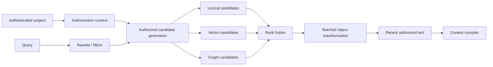

# Identity-Aware Retrieval and Ranking

> **Purpose:** Retrieve high-recall evidence without allowing semantic search, aggregation, caching, or model context to cross authorization boundaries.

## Security trimming is part of retrieval correctness

A relevant unauthorized passage is a retrieval failure, not a result to redact later. Authorization must constrain candidate generation before text, titles, counts, snippets, embeddings, or graph neighborhoods reach the model.



Use two gates for higher-risk deployments:

1. **Candidate gate:** apply tenant, source, purpose, classification, and ACL filters inside the search query.
2. **Evidence gate:** batch-check top object IDs against the current authorization service or source-specific policy before returning text.

The second gate protects against stale projections. It does not justify retrieving an unrestricted global candidate set into the application.

## Authorization context

Derive authorization context from authenticated identity and trusted policy services, never from model-generated filters or user-supplied group claims.

```json
{
  "tenant_id": "tenant_acme",
  "subject_id": "user:42",
  "groups": ["group:finance", "group:managers"],
  "purpose": "supplier_due_diligence",
  "device_trust": "managed",
  "source_entitlements": ["sharepoint:finance", "vendor_db:read"],
  "policy_revision": "policy_9f3a",
  "identity_revision": "idgraph_771c",
  "evaluated_at": "2026-08-31T04:00:00Z"
}
```

Do not put sensitive group names or personal attributes in model-visible prompts. The retrieval service can use opaque authorization handles.

## Enforcement strategies

| Strategy | Advantages | Limitations | Good fit |
|---|---|---|---|
| Source-delegated query | Source evaluates current user permissions | Connector latency, uneven search quality, per-source fan-out | High-risk sources with strong query APIs |
| ACL fields in search index | Fast prefiltering and ranking | Projection and group membership can become stale; ACL size limits | Most enterprise search with reconciliation |
| Relationship authorization service | Expressive ReBAC and current checks | Network dependency and batched-check latency | Hierarchical sharing and complex relations |
| Tenant/source physical partition | Strong coarse isolation and easier deletion | More shards/indexes and operational overhead | Regulatory, residency, or large-tenant isolation |
| Per-user index | Simple query filter | Explosive duplication and slow permission churn | Rarely appropriate |
| Post-filter after top-k | Easy prototype | Low authorized recall and risk of pre-filter leakage | Do not use as the only control |

The production default is often coarse physical tenant isolation, indexed document security filters, and a top-candidate recheck. Choose the consistency window and fail behavior explicitly.

Google Zanzibar demonstrates that relationship-based authorization at very large scale requires consistency semantics, not just tuple storage. Managed search products also have limits: Azure AI Search documents ACL-entry limits and query-time permission enforcement, while Elasticsearch warns that role combinations can widen access and some aggregations or index statistics can leak information even when documents are filtered.

## ACL data model

Keep authorization assertions distinct from document metadata.

```yaml
acl_object:
  acl_id: acl_01J...
  tenant_id: tenant_acme
  source_object_id: driveItem_123
  source_acl_revision: etag_abc
  inherited_from: folder_9
  rules:
    - effect: allow
      subject: group:finance
      relation: viewer
    - effect: allow
      subject: user:42
      relation: owner
    - effect: deny
      subject: group:contractors
      relation: viewer
  link_access:
    scope: organization
    expires_at: null
  observed_at: "2026-08-31T03:12:20Z"
```

Source systems disagree about deny precedence, inheritance, nested groups, public links, guests, dynamic groups, service principals, and conditional access. The connector's policy adapter must reproduce source semantics or intentionally adopt a documented stricter subset.

## Query plan

```yaml
retrieval_plan:
  query_id: qry_01J...
  tenant_partition: tenant_acme
  authorization_handle: authz_01J...
  hard_filters:
    source_ids: [sharepoint_finance, confluence_procurement]
    classification_max: confidential
    valid_at: "2026-08-31T00:00:00Z"
    document_status: active
  channels:
    lexical:
      top_k: 80
      fields: [title^4, heading^2, body, identifiers^5]
    vector:
      top_k: 80
      embedding_version: embed_v7
    graph:
      enabled: false
  fusion:
    method: rrf
    k: 60
  authorization_recheck:
    top_k: 60
    fail_on_unknown: true
  rerank:
    top_k: 30
    return_k: 12
```

The plan is built by trusted application code. A model may propose entities, date ranges, or query variants, but allowed source scope and security filters are intersected with the admitted contract.

## Hybrid candidate generation

Lexical and vector retrieval fail on different queries. Exact identifiers, quoted clauses, negation, numbers, and rare names need lexical matching. Paraphrases and natural-language concepts benefit from dense retrieval. Use both, then analyze failures by query slice.

Recommended pipeline:

1. Normalize query while retaining exact terms, quotes, IDs, and dates.
2. Extract trusted structural filters from the request contract and validated model suggestions.
3. Run lexical and semantic retrieval in parallel under identical authorization filters.
4. Fuse ranks; keep channel ranks and scores.
5. Reauthorize candidate object IDs.
6. Expand parent/child context only if the adjacent spans are authorized.
7. Rerank text with a domain-tuned model or search-native ranker.
8. Diversify by document, source, evidence slot, and independence.
9. Return evidence spans with version and ACL receipts.

Do not compare raw BM25, cosine, and reranker scores as if they share a calibrated scale. Rank fusion is a robust baseline; learned fusion requires a representative, drift-monitored training set.

## Authorization and approximate nearest-neighbor search

Vector engines differ in whether filters run before, during, or after approximate search. A filter that produces too small a candidate pool can reduce recall; a post-filter can return too few authorized results. Test:

- authorized recall at realistic ACL selectivity;
- latency with large group lists or nested relations;
- behavior for users with very broad and very narrow access;
- whether index statistics, debug output, facets, or timing reveal restricted corpus information;
- failure behavior when the authorization projection is unavailable.

Never compensate for low authorized recall by fetching unrestricted candidates and filtering their text in model code.

## Ranking features

| Feature | Use | Guardrail |
|---|---|---|
| Lexical/vector relevance | Core semantic match | Evaluate by domain and language |
| Title/heading/field boosts | Prefer structurally relevant sections | Avoid drowning body evidence |
| Source authority | Prefer official or signed records for factual claims | First-party claims are not independent corroboration |
| Freshness | Prefer current evidence for volatile claims | Do not demote historically relevant evidence |
| Effective-time match | Answer “as of” questions | Separate publication, observation, and validity time |
| Document status | Prefer active, approved, final | Preserve drafts when request asks for them |
| Independence | Avoid repeated syndicated or copied claims | Track origin and corporate relationships |
| Diversity | Cover evidence slots and sources | Do not sacrifice necessary corroboration |
| User interaction | Improve known-item ranking | Do not create opaque access or popularity feedback loops |

Relevance and authority are not the same. A highly relevant marketing page may be weaker evidence than a less semantically similar audited filing.

## Multi-hop and cross-corpus retrieval

One query rarely retrieves a complete evidence chain when an intermediate entity is absent from the original wording. Maintain evidence slots:

```text
Question: Which vendor can host Project Orion in-region and meet its support SLA?

slot_1: identify Project Orion's required region
slot_2: identify candidate vendors and service products
slot_3: find each product's current region availability
slot_4: find contractual support SLA and exclusions
slot_5: compare all facts at the requested date
```

Retrieve each slot under the same authorization contract. The model can generate follow-up queries from accepted intermediate facts, but those facts retain source IDs. A model-generated bridge entity without evidence is not a valid next-hop fact.

Measure **complete-chain recall**, not only passage Recall@k. A response should not claim completion if one required slot is missing.

## Graph retrieval with permissions

Graph traversal can leak restricted topology even if the final passage is authorized. Protect nodes, edges, paths, counts, and community summaries.

- attach every extracted assertion to one or more evidence spans and ACL scopes;
- compute the effective visibility of a path as the intersection required by the query semantics;
- never expose a hidden node name through a path explanation;
- build community summaries per compatible security domain or generate them at query time from authorized assertions;
- invalidate edges and summaries when any supporting source is revoked, deleted, or superseded;
- reauthorize underlying passages before generation.

Global community summaries built from mixed-permission documents are unsafe unless the summary itself has a rigorously derived, usually very restrictive, ACL. Permission-aware query-time assembly is safer but more expensive.

## No-result and aggregate behavior

Return the same external shape for “no authorized result” and “no matching result” unless policy permits a distinction. Do not reveal:

- counts of inaccessible documents;
- titles, snippets, authors, source names, or graph neighbors;
- spelling suggestions learned only from restricted text;
- cache-hit timing correlated with another user's query;
- global term statistics or facets that expose restricted vocabulary.

For authorized users, distinguish operationally between empty retrieval, stale index, connector outage, and incomplete source coverage without disclosing restricted metadata.

## Caching authorization-aware retrieval

Cache keys must include every input that can change visibility or meaning:

```text
cache_key = hash(
  tenant_id,
  subject_or_authorization_set_digest,
  purpose,
  query_plan,
  corpus_generation,
  acl_generation,
  identity_revision,
  policy_revision,
  embedding_and_reranker_versions
)
```

Short-lived per-authorization-set caches can help large group queries. Invalidate on revocation feeds where possible and enforce a maximum staleness below the revocation objective. Shared semantic answer caches are unsafe unless authorization, evidence versions, and freshness classes are part of the key and every cached citation is rechecked.

## Failure behavior

| Failure | Safe response |
|---|---|
| Identity provider unavailable | Reject or use a narrowly bounded previously issued authorization context according to policy |
| ACL projection behind objective | Deny affected source or route to source-delegated authorization |
| Top-candidate recheck times out | Fail closed; do not pass candidates to model |
| Vector search unavailable | Degrade to lexical only if the same filters and quality floor hold |
| Lexical search unavailable | Usually fail; vector-only exact-term quality may be inadequate |
| Reranker unavailable | Use fused rank only if a tested fallback threshold passes |
| Graph projection stale | Disable graph path; use source-backed text retrieval |
| Group expansion exceeds limit | Use relationship-service check or deny; never truncate silently |
| Mixed index generations | Query the last complete generation |

## Retrieval acceptance tests

- [ ] A user losing group membership cannot retrieve old snippets, citations, graph paths, or cached answers.
- [ ] Narrow-access users retain acceptable Recall@k under filters.
- [ ] Exact IDs, acronyms, negation, dates, and quoted clauses are tested separately.
- [ ] Multi-hop tests require the complete evidence chain.
- [ ] Graph paths and community summaries obey the intersection of supporting ACLs.
- [ ] Empty-result timing and facets do not reveal inaccessible documents.
- [ ] Unknown authorization and oversized ACL behavior fail closed.
- [ ] Every result carries content, ACL, identity, policy, and index-generation receipts.

## Canonical sources

- [Google Zanzibar authorization paper](https://research.google/pubs/zanzibar-googles-consistent-global-authorization-system/)
- [NIST Zero Trust Architecture](https://csrc.nist.gov/pubs/sp/800/207/final)
- [Azure AI Search query-time ACL enforcement](https://learn.microsoft.com/en-us/azure/search/search-query-access-control-rbac-enforcement)
- [Google Agent Search data-source access control](https://docs.cloud.google.com/generative-ai-app-builder/docs/data-source-access-control)
- [Elasticsearch document- and field-level security](https://www.elastic.co/guide/en/elasticsearch/reference/current/document-level-security.html)
- [PostgreSQL row security](https://www.postgresql.org/docs/current/ddl-rowsecurity.html)
- [Azure hybrid search ranking](https://learn.microsoft.com/en-us/azure/search/hybrid-search-ranking)
- [Pinecone multitenancy guidance](https://docs.pinecone.io/guides/index-data/implement-multitenancy)

