# Implementation roadmap

Build the smallest trustworthy system first: authorized search over one well-understood corpus with exact evidence links. Add synthesis, investigation loops, graph features, memory, and outbound actions only after measurements show that each layer solves an observed problem.

## Delivery principles

1. Authorization and tenant isolation are prerequisites, not later hardening.
2. Corpus correctness and evidence identity come before model sophistication.
3. Deterministic workflows handle predictable tasks; bounded agents handle open-ended evidence gaps.
4. Every phase ships an operable product with evaluation, telemetry, rollback, and runbooks.
5. New complexity needs a baseline, a hypothesis, a measurable benefit, and an owner.
6. Public company research and internal knowledge use one evidence contract but distinct trust, freshness, and licensing policies.

## Target sequence

```mermaid
gantt
    title Capability sequence (duration is team-dependent)
    dateFormat  X
    axisFormat  Phase %s
    section Foundation
    Product, policy, and evaluation contract :p0, 0, 1
    Authorized corpus and search             :p1, 1, 2
    section Answers
    Evidence-grounded synthesis              :p2, 2, 3
    Multi-source research workflows           :p3, 3, 4
    section Operations
    Reliability and scale                    :p4, 4, 5
    Controlled outbound actions              :p5, 5, 6
    section Evolution
    Governed evolution and optional retrieval :p6, 6, 7
```



The diagram shows dependency order, not calendar duration. A regulated deployment may spend more time on policy and validation than on implementation.

## Phase 0 — product, policy, and evaluation contract

### Phase 0 deliverables

- named owners for product, corpus, identity, security, privacy/legal, reliability, and evaluation;
- supported task families and explicit non-goals;
- tenant, source, data-classification, retention, residency, and model-provider policies;
- initial gold cases, adversarial cases, ACL fixtures, and corpus snapshots;
- measurable objectives for freshness, retrieval, evidence, latency, cost, deletion, and recovery;
- architecture decision records for build/buy, region, authorization model, and initial stack.

### Phase 0 exit criteria

- [ ] The team can state when the system must abstain or return search results only.
- [ ] A deterministic authorization oracle exists for evaluation fixtures.
- [ ] High-risk data and actions are excluded or governed explicitly.
- [ ] Release hard gates and rollback authority are approved.
- [ ] Expected volumes and unit-cost envelope are estimated from real samples.

Do not start with a generic “answer anything about the company” objective. Select a small set such as policy lookup, project status synthesis, or public-company profile research with observable value.

## Phase 1 — authorized corpus and search

### Phase 1 deliverables

- one internal connector or one public corpus with a complete source inventory;
- full scan, delta sync, reconciliation, deletion, and replay-safe checkpoints;
- sandboxed parsing, versioned normalization, deterministic chunk identity, and lineage;
- identity resolution, effective ACL projection, query-time policy enforcement, and citation-time reauthorization;
- lexical search with filters, then vector retrieval and reciprocal-rank fusion if it improves measured recall;
- result pages that link to the exact authorized source location;
- freshness, ACL drift, parser failure, and deletion dashboards.

### Phase 1 exit criteria

- [ ] Full and incremental sync converge under duplicate, missing, and out-of-order events.
- [ ] Cross-tenant and inaccessible-document suites have zero disclosures or existence leaks.
- [ ] Authorized recall meets the task-specific target on a frozen snapshot.
- [ ] Revocation and deletion meet the connector’s documented objective.
- [ ] Search remains useful without any generation model.

This phase is a legitimate production outcome. Stop here if ranked search and source previews satisfy the need.

## Phase 2 — evidence-grounded synthesis

### Phase 2 deliverables

- request routing between search results, simple answer, and unsupported/denied outcomes;
- claim and evidence-ledger schemas with immutable source/version/span identity;
- synthesis from a bounded authorized evidence set;
- inline citations, quote verification, date semantics, supersession, and calculation lineage;
- evidence verifier independent of the generator;
- model gateway, prompt/model versioning, token budgets, content controls, and fallback route;
- artifact manifest and viewer-time citation reauthorization.

### Phase 2 exit criteria

- [ ] Material-claim support and citation gates pass on important task slices.
- [ ] Inaccessible, deleted, or superseded evidence cannot appear as current support.
- [ ] Missing evidence produces calibrated abstention or a scoped limitation.
- [ ] Answers can be reproduced from a frozen manifest.
- [ ] Simple synthesis meets latency and cost objectives under representative load.

Do not add conversational memory until stateless questions are trustworthy. It makes failures harder to reproduce and permissions harder to invalidate.

## Phase 3 — multi-source research workflows

### Phase 3 deliverables

- source registry covering internal systems and approved external registries or filings;
- entity resolution with identifiers, aliases, confidence, and provenance;
- typed question decomposition into evidence slots;
- bounded search/evaluate/refine loop with deadlines, iteration, token, and cost caps;
- durable checkpoints, cancellation, partial results, and workflow replay;
- contradiction sets, freshness policy by claim class, independent-source tracking, and decision-support output;
- short-lived run memory and evidence-based compaction.

### Phase 3 exit criteria

- [ ] Multi-hop and contradiction cases improve materially over fixed retrieval.
- [ ] Each follow-up search closes a named evidence gap.
- [ ] The loop stops correctly on sufficiency, diminishing returns, deadline, and budget.
- [ ] Long investigations recover from worker and provider failure without lost evidence or duplicate work.
- [ ] Public-source licensing, fair-access, and attribution rules are enforced.

Use a deterministic workflow for known research templates. Enable a planner only for questions whose evidence needs cannot be enumerated reliably in advance.

## Phase 4 — reliability, scale, and operations

### Phase 4 deliverables

- isolated online and indexing worker pools, bounded queues, per-tenant admission control, and backpressure;
- dependency timeouts, retry ownership, circuit breakers, and degraded modes;
- correlated traces, quality/freshness/security/cost metrics, SLO dashboards, and burn-rate alerts;
- shadow-index migration, canary rollout, automatic rollback, and compatibility policy;
- backups, tested restore, regional recovery, credential rotation, and incident runbooks;
- privacy-reviewed production feedback loop and recurring evaluation cadence.

### Phase 4 exit criteria

- [ ] Load and fault tests preserve authorization and evidence invariants.
- [ ] Recovery exercises meet RTO/RPO and retain tombstones/legal holds.
- [ ] Model outage falls back safely; authorization outage fails closed.
- [ ] On-call can diagnose stale sources, quality regressions, cost spikes, and stuck workflows.
- [ ] Unit economics are measured per successful supported outcome.

## Phase 5 — controlled outbound actions

This phase is optional. Many knowledge agents should remain read-only.

### Phase 5 deliverables

- separate tool gateway and narrowly scoped schemas;
- least-privilege, short-lived, audience-bound credentials;
- draft-only defaults and action-specific policy rules;
- canonical preview, signed approval bound to exact parameters, expiry, and idempotency key;
- operation-status lookup and immutable receipt handling;
- two-person or prohibited-action policy where risk requires it;
- action-specific adversarial tests, compensating operations, and audit review.

### Phase 5 exit criteria

- [ ] Prompt injection cannot alter tool policy, recipients, or approval requirements.
- [ ] Every write path handles timeout-after-commit without duplicate effects.
- [ ] Material edits invalidate approval.
- [ ] The user sees pending, failed, and completed outcomes accurately.
- [ ] Security, legal, and business owners accept residual risk.

## Phase 6 — governed evolution and optional advanced retrieval

Phase 6 is not “make the agent more autonomous.” It is the recurring production discipline for changing behavior safely. Only add a capability after traces, incidents, reviewed feedback, or evaluation identify a repeated typed failure.

### Phase 6 deliverables

- a versioned behavior bundle covering workflow, models, prompts, tools, connectors, corpus transforms, retrieval/index generations, authorization, context/compaction, memory, verifier, and evaluation gates;
- a privacy-reviewed failure-mining pipeline that preserves original bundle/corpus/policy/evidence identity and explicit reviewer labels;
- held-out evaluation, authorization-safe shadowing, bounded canary, automatic/manual rollback thresholds, and compatibility windows;
- drift monitoring by task, connector, tenant tier, authorization pattern, sensitivity, language, document type, and model route;
- a change proposal record with observed failure, baseline, hypothesis, owner, risk, expected value, test, rollout, rollback, and refresh trigger;
- controlled retirement of stale prompts, models, indexes, memories, connectors, fixtures, and compatibility paths without deleting required lineage or audit evidence.

The live model may propose a query, plan, or improvement candidate. It must not rewrite prompts, tool schemas, policies, memories, evaluators, or release gates. Improvement becomes production behavior only through the normal governed release path.

### Optional capability experiments

Only begin an advanced retrieval experiment after retrieval traces identify a repeated gap.

Candidate experiments:

- knowledge graph for entity relationships, ownership, dependencies, and temporal facts;
- GraphRAG community summaries for corpus-wide thematic questions;
- learned sparse retrieval, late-interaction retrieval, or domain-specific reranking;
- query-adaptive retrieval and model routing;
- precomputed approved briefs for recurring questions;
- longer-term user preferences with explicit scope, expiry, and deletion.

### Adoption gate

```yaml
capability_gate:
  observed_failure: "baseline misses multi-hop ownership relationships"
  baseline_dataset: ownership_eval_v3
  candidate: temporal_acl_filtered_graph
  minimum_quality_gain: "+8 percentage points evidence-slot coverage"
  maximum_p95_latency_change: "+20%"
  maximum_unit_cost_change: "+25%"
  required:
    - no authorization regression
    - reproducible lineage
    - documented rebuild and rollback
    - named operational owner
```

Reject the feature if the gain disappears on held-out cases or a simpler metadata filter, query expansion, or reranker achieves the same result.

### Phase 6 exit criteria

Phase 6 has no permanent “finished” state, but each release closes only when:

- [ ] The observed failure and affected users/task slices are reproducible or explicitly documented as non-reproducible.
- [ ] A simpler deterministic, retrieval, content, or product fix was compared.
- [ ] Hard authorization, deletion, approval, effect, and evidence gates remain unchanged or stronger.
- [ ] Held-out, repeated, adversarial, latency, and cost evaluations pass with adequate slice coverage.
- [ ] Shadow/canary evidence supports widening and the prior compatible behavior bundle remains deployable.
- [ ] Rollback preserves new source observations, tombstones, revocations, holds, audit records, and committed effects.
- [ ] Production drift and incident ownership are assigned for the new capability.

## Recommended initial stack shape

Choose managed or self-hosted products according to policy and operational skill; preserve the interfaces below.

| Capability | Minimal practical choice | Add only when justified |
|---|---|---|
| Request API | Existing service language/framework | Separate gateway service for independent scale/policy |
| Workflow | Database-backed state and queue | Durable workflow platform for long, failure-prone investigations |
| Metadata | Relational database | Specialized event store only for demonstrated need |
| Raw artifacts | Versioned object storage | Content-addressable replication across regions |
| Retrieval | One engine supporting lexical, vector, filters, and RRF | Separate engines if scale or feature evidence demands it |
| Reranking | Small approved reranker | Domain-tuned or late-interaction model |
| Graph | None | Property/RDF graph with temporal and ACL semantics |
| Identity | Existing IdP plus policy service | Relationship-based authorization at scale |
| Model access | Central model gateway | Multi-provider routing after compatibility evaluation |
| Telemetry | OpenTelemetry plus existing backend | Dedicated LLM observability UI if it improves operations |

The application language should match the team and existing platform. Python has the broadest retrieval/model ecosystem; TypeScript is a strong fit for typed service integration; Java/Kotlin, Go, and .NET are suitable when they dominate the company platform. Keep model and tool contracts language-neutral and avoid splitting into many services early.

## Ownership matrix

| Area | Accountable owner | Required partners |
|---|---|---|
| Product contract and value | Product lead | Domain experts, users |
| Connectors and corpus | Data/platform lead | Source owners, records management |
| Identity and authorization | Identity/security lead | Application and connector teams |
| Retrieval and evidence | Search/ML lead | Domain reviewers, evaluation owner |
| Models and orchestration | Application/ML lead | Security, platform, product |
| Privacy, retention, legal hold | Privacy/legal owner | Security, records, infrastructure |
| Reliability and cost | Service owner | Platform, FinOps, providers |
| Evaluation and release gates | Evaluation owner | All owners above |
| Outbound actions | Business-system owner | Security, legal, approvers |

One person may hold several roles in a small team, but the decisions must not be ownerless.

## Decision log template

```markdown
## ADR: Introduce graph retrieval for ownership questions

- Date and owner:
- Status: proposed | accepted | rejected | superseded
- Observed production or evaluation failure:
- Baseline and dataset version:
- Options compared:
- Quality, latency, cost, security, and operational evidence:
- Decision and scope:
- Rollout and rollback:
- Refresh trigger:
```

Keep decisions next to versioned evaluation evidence. Avoid architecture-by-demo: a compelling example is not a measured production case.

## Program risks and mitigations

| Risk | Early signal | Mitigation |
|---|---|---|
| Corpus is incomplete or stale | Users repeatedly cite missing source versions | Source inventory, freshness SLO, reconcile, visible staleness |
| Authorization model is underspecified | Exceptions and manual filters accumulate | Establish policy oracle and inheritance semantics first |
| Agent loop increases cost without quality | More calls, same evidence coverage | Route to fixed workflow; adoption gate for every loop feature |
| Citation UI creates false trust | Many citations but weak entailment | Claim-level verification and source-quality rubric |
| Graph becomes an ungoverned second corpus | Missing ACL/time lineage | Apply same evidence, version, deletion, and auth contracts |
| Model/provider lock-in | Business logic embedded in prompts/SDK | Typed domain contracts, gateway, replayable evals |
| Evaluation set goes stale | Production failures not represented | Refresh cadence and privacy-reviewed incident cases |
| Actions expand faster than controls | Generic tools and ambiguous approvals | Draft-only default; add one action with a complete threat model |

## Production readiness review

- [ ] Product modes, non-goals, risk tiers, and owners are explicit.
- [ ] Source and identity semantics are verified, including deletion and revocation.
- [ ] Architecture is the simplest design that passes current evaluations.
- [ ] Evidence contracts support citations, dates, contradictions, and reproduction.
- [ ] Model loops, memory, and graph features have bounded scope and measured benefit.
- [ ] Authorization, approvals, retention, residency, and audit have deterministic controls.
- [ ] Fault, recovery, deployment, rollback, latency, and cost behavior are tested.
- [ ] Hard release gates pass on every critical slice.
- [ ] Limitations are visible to operators and users.
- [ ] Refresh triggers and a recurring review date are assigned.

## Related guides

- [Product contract and workflows](product-contract-and-workflows.md)
- [Architecture and stack selection](architecture-and-stack-selection.md)
- [Connectors, ingestion, and corpus sync](connectors-ingestion-and-corpus-sync.md)
- [Connector qualification and adapter playbooks](connector-qualification-and-adapter-playbooks.md)
- [Identity-aware retrieval and ranking](identity-aware-retrieval-and-ranking.md)
- [Research orchestration, state, and context](research-orchestration-state-and-context.md)
- [Evidence, citations, freshness, and contradictions](evidence-citations-freshness-and-contradictions.md)
- [Security, governance, and outbound actions](security-governance-and-outbound-actions.md)
- [Reliability, observability, deployment, latency, and cost](reliability-observability-deployment-and-cost.md)
- [Evaluation and acceptance testing](evaluation-and-acceptance-testing.md)

## Canonical sources

- [Anthropic, Building effective agents](https://www.anthropic.com/engineering/building-effective-agents)
- [Google Research, dependable agentic RAG](https://research.google/blog/unlocking-dependable-responses-with-gemini-enterprise-agent-platforms-agentic-rag/)
- [Microsoft GraphRAG methods](https://microsoft.github.io/graphrag/index/methods/)
- [Model Context Protocol 2026-07-28 GA announcement](https://github.com/modelcontextprotocol/modelcontextprotocol/blob/main/blog/content/posts/2026-07-28-spec-ga/index.md)
- [OpenTelemetry generative-AI semantic conventions](https://github.com/open-telemetry/semantic-conventions-genai)
