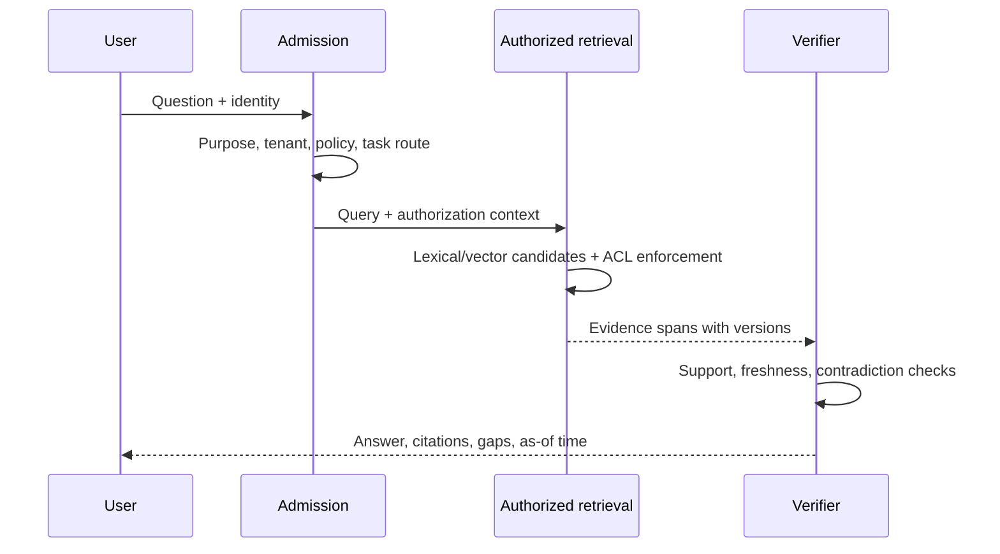

# Product Contract and Decision-Support Workflows

> **Purpose:** Turn “enterprise knowledge agent” into a bounded product contract with measurable outcomes, explicit non-goals, and workload-specific risk tiers.

## Start with the decision, not the chat surface

The same natural-language interface can hide very different products. “Tell me about Acme” might mean navigation, due diligence, competitive analysis, a sales brief, or an instruction to update a CRM. Those tasks have different evidence, freshness, authorization, review, and latency requirements.

Define each product mode before choosing retrieval or orchestration:

| Mode | User outcome | Typical latency | Required evidence behavior | Default implementation |
|---|---|---:|---|---|
| Find | Locate a known document, owner, clause, ticket, identifier, or passage | Subsecond to a few seconds | Show result and source metadata | Search, no generation required |
| Answer | Resolve a bounded question from approved sources | Seconds | Claim-level citations and abstention | Retrieve, rerank, synthesize, verify |
| Investigate | Explore a multi-source question with unknown intermediate steps | Tens of seconds to minutes | Coverage plan, evidence ledger, gaps, contradictions | Bounded agentic RAG workflow |
| Compare | Support a choice among companies, vendors, policies, or projects | Minutes | Stable criteria, evidence matrix, as-of date, uncertainty | Deterministic comparison workflow with adaptive retrieval |
| Monitor | Re-run a saved question when sources change | Scheduled | Diff, change attribution, freshness policy | Durable workflow, not a perpetual chat loop |
| Act | Create, send, update, or publish something | User-dependent | Exact preview, approval, authorization, receipt | Separate effect workflow |

Do not let routing silently increase authority. A request admitted as read-only research stays read-only even if the model decides that “sending the result would be helpful.”

## Product contract

A request becomes executable only after it is bound to a typed contract. Ask clarifying questions only when the answer changes scope, authorization, risk, cost, or output.

```yaml
request_contract:
  request_id: req_01J...
  tenant_id: tenant_acme
  subject_id: user_42
  purpose: supplier_due_diligence
  question: "Compare Northstar and Contoso for a three-year network contract."
  decision_owner: procurement_director
  audience: ["procurement", "security", "legal"]
  as_of: "2026-08-31T00:00:00Z"
  jurisdictions: ["IN", "EU"]
  source_policy:
    allow: ["approved_internal", "official_registries", "licensed_news", "public_web"]
    deny: ["personal_data_brokers", "unlicensed_paywall_bypass"]
    preferred: ["signed_contracts", "regulators", "company_filings", "primary_docs"]
  decision_criteria:
    - security_posture
    - financial_capacity
    - delivery_history
    - data_residency
    - total_cost
  output:
    mode: decision_memo
    max_words: 3500
    include_evidence_matrix: true
  evidence_bar:
    material_claim: "one authoritative primary or two independent credible sources"
    unresolved_conflict: surface
    stale_evidence: reject_or_label
  budgets:
    wall_clock_seconds: 240
    retrieval_rounds: 6
    queries: 30
    documents_opened: 50
    model_tokens: 180000
    estimated_cost_usd: 2.50
  outbound_actions: []
```

The system stores the approved contract and every revision. A later clarification creates a new version; it does not mutate the historical scope of already captured evidence.

## Purpose and non-goals

### Intended purposes

- enterprise navigation and knowledge discovery;
- evidence-grounded answers over authorized internal sources;
- company, supplier, customer, product, and market research from approved sources;
- cross-document policy, contract, incident, and project analysis;
- decision memos, evidence matrices, timelines, and monitored change briefs;
- read-only preparation for a separately approved business workflow.

### Explicit non-goals

- replacing the source system, records-management system, authorization service, or legal archive;
- treating model output as an authoritative company, legal, medical, financial, or security decision;
- inferring sensitive employee attributes or creating hidden performance profiles;
- bypassing paywalls, robots policies, data licenses, or source access restrictions;
- using private knowledge to train or fine-tune a model without a separate approved program;
- autonomously sending messages, changing records, making purchases, or publishing conclusions;
- claiming completeness when source coverage, permission, freshness, or evidence is insufficient;
- creating an enterprise-wide knowledge graph merely because graph tooling is available.

## Workflow patterns

### Internal knowledge answer



The answer path should remain a one-pass workflow unless evaluation shows that a second retrieval step materially improves a defined query slice.

### Cross-corpus company comparison

1. Resolve the legal entities and stable identifiers; do not join only on names.
2. Freeze the comparison criteria and time frame.
3. Search official registries, filings, approved internal records, licensed sources, and public sources independently.
4. Build a per-criterion evidence matrix before drafting a narrative.
5. Detect shared origin, copied claims, corporate relationships, amendments, and reporting-period differences.
6. Surface missing or incomparable evidence instead of normalizing it away.
7. Produce a decision memo that separates fact, interpretation, recommendation, and unresolved risk.

| Criterion | Northstar | Contoso | Evidence status | Decision impact |
|---|---|---|---|---|
| Data residency | Region A documented | Contract language ambiguous | Conflict / gap | Legal review required |
| Financial capacity | Audited filing, current | Parent guarantee, older filing | Comparable with caveat | Medium |
| Delivery history | Three internal projects | One internal project, two references | Uneven evidence | Pilot recommended |

Entity resolution must preserve source-specific identifiers such as LEI, CIK, Companies House number, internal vendor ID, domain, and known aliases. A merge is a reviewed assertion with provenance, not an embedding similarity side effect.

### Incident or root-cause research

This workflow often spans tickets, chat, deployment logs, runbooks, code, and postmortems. The agent may assemble a timeline and hypotheses, but logs and service state remain authoritative.

- bind every event to event time, observation time, source, and actor;
- preserve conflicting timestamps and clock uncertainty;
- label hypotheses and require confirming evidence;
- never let retrieved remediation instructions execute automatically;
- route security-sensitive findings to the incident process rather than publishing broadly.

### Policy and contract comparison

Use structure-aware extraction rather than arbitrary fixed chunks. Preserve document, section, clause, table, appendix, amendment, jurisdiction, effective date, and supersession relationships. A clause extracted from an obsolete amendment should not outrank the currently effective text merely because it is semantically closer.

### Monitoring and change briefs

A monitor stores a versioned question, source policy, baseline claim set, and materiality rules. A new source event is only a hint; the workflow revalidates changed evidence and emits:

- added, changed, superseded, and removed claims;
- source and permission changes;
- materiality assessment with rationale;
- unchanged sections omitted or summarized;
- a clear “no material change” terminal result.

Monitoring is a scheduled workflow. It is not an unconstrained agent that continuously browses.

## Risk tiers and review

| Tier | Example | Release behavior |
|---|---|---|
| R0: navigation | “Open the travel policy” | Search result; no synthesis needed |
| R1: routine knowledge | “What is the expense limit?” | Cite current policy; warn on ambiguity |
| R2: decision support | Vendor comparison or project risk memo | Evidence matrix, limitations, accountable human decision owner |
| R3: regulated or sensitive | Legal, HR, security, financial, health, export-control content | Restricted corpus, specialist review, stronger logging and retention policy |
| R4: external effect | Send, submit, publish, purchase, or modify records | Exact preview, policy gate, fresh authorization, explicit approval, idempotent execution |

The risk tier is computed from source sensitivity, user purpose, claim consequence, audience, and requested effect—not from the apparent politeness or confidence of the request.

## Service objectives by workload

Avoid a single global “answer accuracy” target.

| Dimension | Example target | Important qualifier |
|---|---:|---|
| Search success | 95% of known-item queries find a relevant item in top 5 | Measure per connector and language |
| Complete-chain retrieval | 90% of labeled multi-hop tasks retrieve every necessary evidence item | One relevant chunk is not enough |
| Unauthorized evidence exposure | 0 in deterministic and adversarial tests | Include snippets, counts, caches, and traces |
| Citation correctness | ≥98% of material citations support the nearby claim | Citation presence is weaker |
| Citation completeness | ≥95% of material factual claims cited | Analysis and recommendations labeled separately |
| Freshness compliance | 100% of released claims meet their volatility policy or are visibly stale | Fetch time alone is not validity |
| Contradiction surfacing | ≥95% of material labeled conflicts shown | Do not reward confident forced resolution |
| Useful completion | 95% produce an accepted artifact or legible insufficiency report | A successful HTTP response is not completion |
| p95 latency | Separate budgets for find, answer, and investigate | Include queue and connector time |
| Cost | Cost per accepted answer, memo, and supported claim | Include failed and abandoned runs |

## Admission and routing rules

Use deterministic signals first: requested output, source classes, effect verbs, saved workflow, and task template. A small classifier can help with ambiguous cases, but its route is constrained by policy.

```text
if request asks for a known document or exact identifier:
    route = SEARCH
elif request matches an approved fixed report:
    route = WORKFLOW
elif request needs one bounded synthesis:
    route = GROUNDED_ANSWER
elif request requires unknown intermediate facts across sources:
    route = BOUNDED_RESEARCH
else:
    ask only the clarification that changes the contract

if any outbound effect is requested:
    attach a separate EFFECT_INTENT; do not grant tools to the research route
```

## Failure semantics

The terminal state must be more precise than success or error:

| Terminal state | Meaning | User-visible result |
|---|---|---|
| `complete` | Evidence and release gates passed | Answer or artifact with citations |
| `complete_with_caveats` | Non-critical gaps remain | Result plus prominent limitations |
| `insufficient_evidence` | Required claim support not found | Searches attempted, gaps, next safe step |
| `authorization_limited` | Relevant sources may exist but are inaccessible | Scope statement without revealing restricted content |
| `stale` | Evidence violates freshness policy | Stale facts labeled or release blocked |
| `conflicted` | Material evidence cannot be reconciled | Competing claims and escalation path |
| `budget_exhausted` | Bound reached before evidence sufficiency | Partial evidence, no invented completion |
| `policy_denied` | Purpose, source, or action is prohibited | Concise denial and allowed alternative |
| `operational_failure` | Connector, index, model, or workflow failed | Retry status and safe degradation, if any |

Never use “no results” to imply “the fact is false.” Distinguish absent evidence, inaccessible evidence, stale indexes, and an authoritative source stating absence.

## Product acceptance checklist

- [ ] Every mode has an owner, success metric, latency class, evidence bar, and risk tier.
- [ ] Non-goals include autonomous effects, records replacement, and access expansion.
- [ ] Saved workflows pin criteria, sources, time, and output schema.
- [ ] The UI distinguishes source facts, analysis, recommendation, and uncertainty.
- [ ] Users can inspect evidence without receiving hidden restricted metadata.
- [ ] “Insufficient,” “conflicted,” and “authorization-limited” are first-class outcomes.
- [ ] Human decision owners remain visible for consequential recommendations.
- [ ] The baseline non-agent search product is measured before agentic complexity is added.

## Canonical sources

- [Anthropic: Building effective agents](https://www.anthropic.com/engineering/building-effective-agents)
- [Google Research: enterprise agentic RAG](https://research.google/blog/unlocking-dependable-responses-with-gemini-enterprise-agent-platforms-agentic-rag/)
- [NIST AI Risk Management Framework](https://www.nist.gov/itl/ai-risk-management-framework)
- [NIST Generative AI Profile](https://nvlpubs.nist.gov/nistpubs/ai/NIST.AI.600-1.pdf)
- [GLEIF: LEI data access and relationship data](https://www.gleif.org/en/lei-data/access-and-use-lei-data)
- [SEC: EDGAR data APIs](https://www.sec.gov/search-filings/edgar-application-programming-interfaces)

