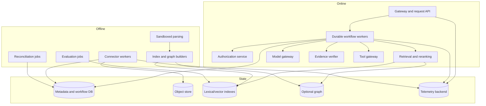
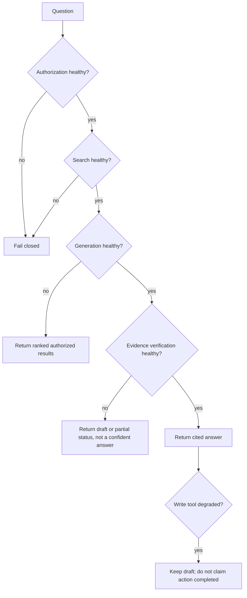
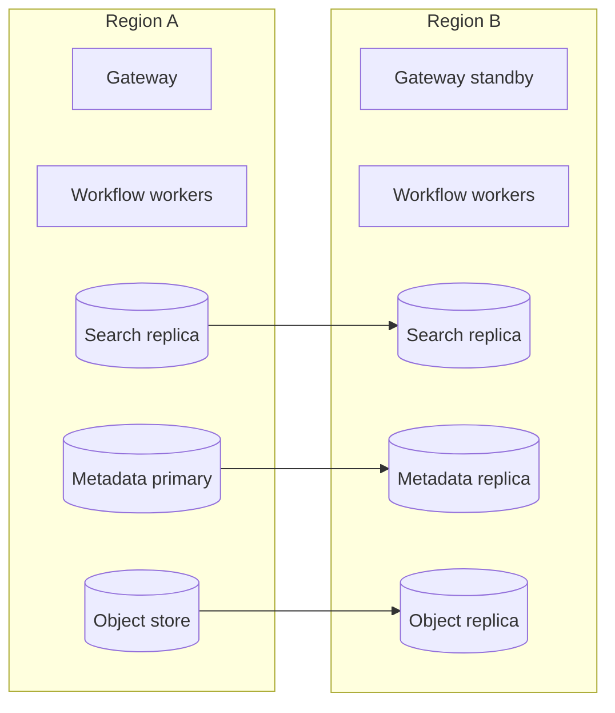
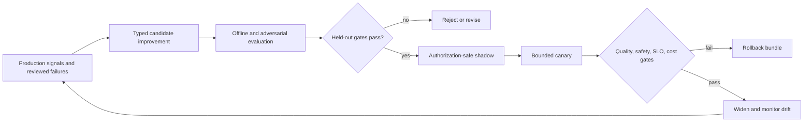

# Reliability, observability, deployment, latency, and cost

The production system is a data service, search service, authorization service, and model workflow at the same time. A good design isolates their failure domains, persists the minimum state needed for recovery, and degrades to safe retrieval or an explicit partial answer instead of improvising through an outage.

## Service decomposition



Keep the online request path independent from large indexing jobs. Use separate queues, worker pools, concurrency limits, and budgets so a connector backfill cannot starve user questions. The model gateway centralizes provider routing, timeouts, rate limits, safety policy, and usage accounting; it must not become an unbounded retry layer.

## Reliability objectives

Define service-level indicators by user-visible outcome, not component uptime alone.

| Indicator | Suggested initial objective | Important exclusions or split |
|---|---:|---|
| Authorized retrieval availability | 99.9% monthly | Measure policy denials separately from failures |
| Simple-answer successful completion | 99.5% | Exclude explicit unsupported questions |
| ACL revocation visibility | 99.9% within 5 minutes | Define per connector; some sources cannot meet this |
| Evidence-manifest completeness | 99.9% of material claims | Zero tolerance for inaccessible citations |
| Read-tool duplicate side effects | Not applicable | Reads should be idempotent |
| Write-tool duplicate business effects | 0 | Enforce idempotency and receipts |
| Index freshness | Per-source p95 target | Report staleness rather than hiding it |
| Disaster recovery | RPO/RTO by tier | Include indexes and authorization state |

These are starting points, not universal promises. Set them from business impact and measured connector behavior. Publish separate latency objectives for simple retrieval, synthesized answers, and long investigations.

## Durable request state

Persist explicit checkpoints after expensive or externally visible steps:

```yaml
run:
  id: run_901
  version: 12
  phase: VERIFY_EVIDENCE
  request_hash: sha256:...
  auth_snapshot_id: auth_771
  plan_version: 3
  completed_steps:
    - retrieve_internal:step_1
    - retrieve_public:step_2
    - rerank:step_3
  evidence_manifest_id: manifest_22
  model_calls:
    - call_id: llm_81
      purpose: decompose
      response_hash: sha256:...
  pending_actions: []
  deadline: 2026-08-31T12:05:00Z
```

Use optimistic concurrency or a workflow engine so two workers cannot advance the same run. Store large evidence bodies in an object store and reference immutable versions from state. A recovered run must reauthorize sources and approvals when their validity window has expired.

### Retry policy

Retry only failures likely to be transient, with exponential backoff, jitter, a deadline, and a small attempt cap.

| Operation | Safe retry rule |
|---|---|
| Search/read | Retry within request deadline; same normalized request and auth context |
| Model inference | Retry transport and explicit capacity errors; avoid retrying deterministic validation failures |
| Index upsert | Stable document/version key makes repeated writes idempotent |
| External write | Reuse idempotency key, then check operation status or receipt |
| Connector delta page | Commit cursor only after all page effects are durable |
| Approval request | Reuse proposal hash; never synthesize approval |

Retries can amplify an outage and cost. Use retry budgets and circuit breakers per dependency and tenant. Do not multiply retries independently at HTTP client, SDK, workflow, and queue layers.

## Timeouts, cancellation, and backpressure

Every operation needs a deadline propagated from the request. A useful budget for an interactive synthesized answer might be:

```yaml
latency_budget_ms:
  gateway_and_auth: 150
  planning: 700
  retrieval_parallel: 900
  reranking: 350
  generation: 2400
  verification: 500
  response_margin: 500
  total: 5500
```

Tune with measurements. Cancel outstanding searches and model streams when the user cancels or the deadline expires. Apply per-tenant admission control, bounded queues, connector quotas, and maximum evidence/token budgets. Prefer a clear `429` or queued investigation to memory exhaustion and cascading timeouts.

## Capacity and scaling model

Size online and offline paths separately. For each workload class, measure arrival rate, service time, concurrency, memory, provider quotas, and downstream amplification:

```text
online_concurrency = peak_requests_per_second * p95_service_time_seconds
queue_clear_time = queued_work_units / sustainable_completed_units_per_second
index_amplification = chunks_per_object * projection_writes_per_chunk
research_amplification = branches * rounds * tools_per_round
```

The equations are planning identities, not a complete queuing model. Validate them with representative filters, document sizes, model latencies, and tenant distributions.

Use separate admission and worker pools for:

- interactive search and grounded answers;
- long investigations and scheduled monitors;
- connector discovery and ACL/revocation work;
- parsing/OCR and embeddings;
- lexical/vector/graph projection and reindex;
- reconciliation, deletion, evaluation, and export.

Reserve capacity for access revocations and deletes. A bulk import or embedding migration must not delay a restrictive permission change. Partition queues by tenant and source where it prevents one large tenant, hot connector, or poisoned document class from monopolizing workers. Enforce maximum in-flight work, source bytes, evidence candidates, graph hops, model tokens, and per-tenant cost before work enters a scarce pool.

Scale on user-impacting signals—queue age versus deadline, oldest revocation, concurrency, dependency quota headroom, memory per worker, and sustained completion rate—not CPU alone. Parsing, vector indexing, and model calls can be memory-, I/O-, quota-, or latency-bound while CPU looks healthy. Downscale only after leases/checkpoints are safe; terminate uncheckpointed long work through cancellation and recovery rather than abrupt duplication.

Run three capacity exercises before production and major expansion:

1. expected peak with representative tenant/ACL selectivity;
2. backfill or reindex plus normal traffic and an injected revocation burst;
3. partial dependency outage with retries, fallback, queue caps, and recovery catch-up.

## Graceful degradation



Never degrade authorization, tenant isolation, approval checks, or citation access validation. Graph search, reranking, query expansion, and optional public-web enrichment can degrade independently if the response reports reduced capability.

## Observability model

Use correlated traces, metrics, and logs, but minimize sensitive payload capture. OpenTelemetry’s generative-AI semantic conventions are still marked Development as of the baseline; pin the schema version in code and expect change.

### Trace shape

```text
request
├── authenticate
├── authorize-request
├── plan
│   └── model.generate
├── retrieve
│   ├── lexical-search
│   ├── vector-search
│   ├── graph-search (optional)
│   ├── authorize-candidates
│   └── rerank
├── synthesize
│   └── model.generate
├── verify-evidence
└── tool.execute (optional)
```

Attach stable identifiers and low-cardinality attributes:

- tenant tier rather than tenant name where cross-tenant telemetry is aggregated;
- workflow, mode, model route, prompt version, retriever version, corpus snapshot;
- authorized candidate count, filtered candidate count, evidence count, and citation count;
- token counts, cache use, retry count, deadline, and outcome class;
- policy decision and approval identifiers, without tokens or raw sensitive content.

Do not put document text, full prompts, user email, access tokens, or unrestricted query text in ordinary telemetry. OpenTelemetry baggage can propagate to downstream services and outside the process; do not place sensitive identity or document data in baggage.

### Core metrics

| Area | Metrics |
|---|---|
| Traffic | request rate, concurrency, queue age, completion and cancellation |
| Latency | end-to-end and per-stage p50/p95/p99; time to first token |
| Retrieval | candidate counts, zero-result rate, recall proxy, reranker lift, ACL-filter ratio |
| Quality | supported-claim rate, citation correctness/completeness, contradiction detection, abstention quality |
| Freshness | source lag, delta-cursor age, reconcile drift, tombstone backlog |
| Security | denied actions, cross-tenant invariant failures, injection alerts, approval mismatches |
| Models | tokens, calls, error codes, fallback rate, output-validation failures |
| Tools | success, latency, timeout-after-commit, duplicate-prevention hits |
| Cost | cost per completed answer/investigation, per tenant, per stage, per connector |

Alert on user-impacting burn rate and hard invariants, not every transient provider error. Examples: sustained SLO burn, authorization dependency unavailable, deletion backlog above objective, stale high-priority corpus, evidence verifier bypass, or any duplicate external effect.

## Cost model and controls

Calculate cost from measured units:

```text
monthly_cost = ingestion_compute
             + parser_and_ocr
             + embedding_tokens
             + search_storage_and_queries
             + graph_extraction_and_storage
             + model_input_and_output_tokens
             + reranking
             + workflow_and_queue
             + telemetry_and_retention
             + evaluation_runs
             + engineering_on_call
```

Report unit economics by outcome, not just model call:

```yaml
unit_cost:
  simple_answer_usd_p50: 0.012
  investigation_usd_p50: 0.41
  cost_per_supported_claim_usd: 0.008
  wasted_cost:
    retries: 0.03
    unused_retrieved_tokens: 0.07
    abandoned_runs: 0.02
```

The values above are illustrative schema values, not benchmarks.

Cost controls, in preferred order:

1. route lookup and simple questions to deterministic search or a smaller model;
2. cache immutable parsing, embeddings, entity normalization, and query-independent features;
3. retrieve small, diverse evidence before expanding;
4. cap loop iterations, tool calls, tokens, graph depth, and public-web sources;
5. summarize only selected evidence and reuse validated evidence manifests;
6. batch offline work and deduplicate source versions by content hash;
7. use graph extraction only for validated use cases; standard GraphRAG extraction can dominate indexing cost;
8. sample routine evaluation and telemetry payloads while retaining all security/audit events required by policy.

Never share answer caches across authorization contexts. A cache key must include tenant, effective permission or authorization version, corpus version, request normalization, retriever/model/prompt versions, and freshness mode.

## Deployment topology



Choose regional placement from residency and latency requirements. Active-passive is simpler for authoritative workflow state; active-active requires conflict rules, globally unique idempotency keys, and tested authorization consistency. Search indexes are derived state and should be reproducible from immutable source versions and metadata, but recovery time may justify snapshots.

### Release strategy

- Version connector adapters, parsers, chunkers, embedding models, retrieval features, prompts, policies, and output schemas independently.
- Build a shadow index for incompatible schema or embedding changes; validate it, then atomically switch a search alias.
- Run offline regression, security tests, and a small authorization-safe shadow sample before canary traffic.
- Compare canary quality, latency, cost, abstention, and policy behavior; use automatic rollback thresholds.
- Preserve the previous compatible index, workflow code, and prompt/model route for the rollback window.
- Do not mix old and new embedding vectors in a field unless the representation is demonstrably compatible.

### Behavior bundles and governed evolution

Release one named behavior bundle even when its components are deployed independently:

```yaml
behavior_bundle:
  id: enterprise_knowledge_2026_09_04_1
  request_schema: 4
  workflow: research_state_machine_8
  model_routes: model_policy_17
  prompts: prompt_set_31
  tool_registry: tool_contracts_14
  connector_capabilities: connector_manifest_22
  parser_chunker: corpus_transform_19
  retrieval_ranking: retrieval_27
  index_generations: [lex_44, vec_31, graph_9]
  authorization_policy: policy_63
  context_compactor: context_policy_12
  memory_policy: memory_policy_7
  evidence_verifier: verifier_20
  evaluators_and_gates: eval_bundle_18
  rollback_compatibility: enterprise_knowledge_2026_08_21_2
```

Attach the bundle ID to run state, evidence manifests, traces, evaluation results, artifacts, and effects. Releasing “the prompt” while an embedding, ACL representation, connector schema, or grader changed makes a regression irreproducible.

Evolution is a controlled product loop:



Mine controlled failure candidates from explicit user corrections, unsupported confident answers, repeated abstentions, citation failures, contradiction misses, stale-source incidents, high-cost traces, connector drift, and security events. Privacy review and minimize each case before it becomes evaluation data. Preserve the original bundle, corpus/policy snapshot, evidence manifest, outcome, reviewer label, and failure taxonomy.

Do not let the running model rewrite prompts, policies, tool schemas, memories, or release gates. It may propose a change; named owners approve a versioned candidate after held-out evaluation. Hold back unseen incidents and periodically retire leaked or overfitted cases. Monitor slice drift by task family, connector, tenant tier, sensitivity, language, document type, model route, and authorization pattern.

Rollback the behavior bundle, not only the model alias. If a new corpus transform or ACL projection is incompatible, switch serving to the last compatible generation and continue preserving raw source observations for later repair. Never roll back tombstones, legal holds, revocations, audit records, or already committed external effects.

## Backup and disaster recovery

Back up authoritative metadata, workflow state, source manifests, audit records, policy configuration, connector cursors, and encryption metadata. Treat indexes and graph projections as rebuildable only if the rebuild path, source availability, credentials, and recovery duration have been tested.

Run recovery exercises that cover:

- restoring a consistent metadata snapshot and index version;
- replaying connector events without duplicate effects;
- rotating compromised credentials and encryption keys;
- rebuilding authorization material before serving search;
- resuming or terminating in-flight workflows deterministically;
- proving legal holds and tombstones survive recovery;
- restoring in a permitted region within RTO and RPO.

## Failure matrix

| Failure | Detection | Recovery | User behavior |
|---|---|---|---|
| Model provider outage | Circuit breaker/error budget | Route approved fallback or retrieval-only | Label degraded mode |
| Search shard unavailable | Health and query errors | Replica/failover | Fail if authorization-filtered search cannot be trusted |
| Graph index stale | Version lag | Disable graph route; rebuild | Use hybrid search and report limitation |
| Connector cursor invalid | Source response/reconcile drift | Scoped full scan from checkpoint | Show source freshness warning |
| Parser regression | Canary corpus diff | Roll back parser; reprocess affected versions | Quarantine suspect documents |
| Workflow worker crash | Heartbeat/lease expiry | Resume durable checkpoint | No duplicate tool action |
| Provider commits then times out | Missing receipt response | Status lookup by idempotency key | Report pending until confirmed |
| Telemetry backend fails | Exporter queue/drop metrics | Buffer within bound, sample routine traces | Do not block core serving; retain audit separately |
| Authorization service fails | Dependency health | Fail closed | Explain temporary access verification failure |
| Cost spike | Unit-cost and token alerts | Tighten budgets, disable expensive route | Preserve correctness; queue deep work if needed |

## Incident response and learning

Declare incidents on user harm or violated invariants, not only outages. Examples include suspected cross-tenant disclosure, inaccessible citation, delayed revocation/deletion, poisoned corpus, compromised connector or tool, silent stale index, incorrect high-impact claim, duplicate effect, runaway cost, or inability to reconstruct a released artifact.

Use this response order:

1. **Contain:** disable the affected route, connector, index generation, tool, tenant partition, or behavior bundle. Fail closed for authorization uncertainty and prefer source links/search-only for generation uncertainty.
2. **Preserve evidence:** freeze relevant run/event/effect records, bundle IDs, policy/corpus versions, manifests, low-risk traces, receipts, and provider status without copying unnecessary sensitive payload.
3. **Scope by stable identity:** identify tenants, principals, source objects/versions, ACL versions, queries, citations, artifacts, caches, and effects. Do not scope only by text search.
4. **Eradicate and recover:** rotate credentials, quarantine poisoned sources, repair ACL/deletion/index state, invalidate caches/artifacts, rebuild projections, and reconcile ambiguous writes.
5. **Verify:** rerun deterministic authorization/deletion oracles, affected task slices, adversarial cases, and source-to-index reconciliation before reopening.
6. **Communicate and review:** follow the organization's security/privacy/legal/customer process, document uncertainty, and assign corrective owners and deadlines.
7. **Convert learning:** add a privacy-reviewed replay case, detector/metric where justified, runbook improvement, and explicit release gate; do not merely add a prompt warning.

| Incident | Immediate safe mode | Evidence needed before restoration |
|---|---|---|
| Cross-tenant or ACL leak | Stop affected retrieval generation/partition; revoke shared caches | Policy oracle passes, cache/index scope reconciled, impacted artifacts enumerated |
| Connector poisoning or injection | Quarantine source/partition; disable outbound tools for affected runs | Clean checkpoint identified, projections rebuilt, security cases pass |
| Deletion or revocation lag | Deny affected subtree/tenant source | Source-to-derivative receipts complete within approved exception policy |
| Evidence-quality regression | Retrieval-only or draft-only | Held-out claim/citation/freshness gates pass for corrected bundle |
| Duplicate or ambiguous effect | Disable action; query target by idempotency identity | Authoritative read-back and business-owner reconciliation complete |
| Cost/queue runaway | Admit only high-priority bounded work | Root amplification removed; retry ownership and queue-clear test verified |

Keep audit evidence and observability separate. Audit records prove governed decisions and effects under stricter retention/access; operational traces help diagnose behavior and may be sampled or redacted. A missing vendor trace must not prevent incident reconstruction from application-owned records.

## Operational acceptance checklist

- [ ] Online and indexing pools have independent queues and resource limits.
- [ ] Every dependency has explicit timeout, retry ownership, circuit breaker, and deadline behavior.
- [ ] Durable recovery is tested at every external side-effect boundary.
- [ ] Retrieval-only and draft-only degraded modes are exercised.
- [ ] Authorization, approval, and tenant controls never degrade open.
- [ ] Dashboards expose quality, freshness, latency, cost, and security together.
- [ ] Telemetry field policy prevents confidential payload and credential capture.
- [ ] Shadow-index migration, canary, rollback, backup, and regional recovery are rehearsed.
- [ ] Cost budgets are enforced per request, tenant, route, and offline job.
- [ ] Runbooks name owners, diagnostic queries, safe mitigations, and escalation paths.
- [ ] A behavior bundle identifies every material behavior and has a compatible rollback path.
- [ ] Privacy-reviewed production failures enter a controlled evaluation loop; the live model cannot self-modify.
- [ ] Incident exercises cover authorization leakage, poisoning, deletion lag, evidence regression, ambiguous effects, and cost overload.

## Canonical sources

- [OpenTelemetry signals](https://opentelemetry.io/docs/concepts/signals/)
- [OpenTelemetry generative-AI semantic conventions](https://github.com/open-telemetry/semantic-conventions-genai)
- [OpenTelemetry baggage security considerations](https://opentelemetry.io/docs/concepts/signals/baggage/)
- [Kubernetes Horizontal Pod Autoscaling](https://kubernetes.io/docs/concepts/workloads/autoscaling/horizontal-pod-autoscale/)
- [Elasticsearch atomic alias updates](https://www.elastic.co/docs/api/doc/elasticsearch/operation/operation-indices-update-aliases)
- [Qdrant snapshots](https://qdrant.tech/documentation/concepts/snapshots/)
- [Microsoft GraphRAG indexing methods](https://microsoft.github.io/graphrag/index/methods/)
- [Anthropic, Building effective agents](https://www.anthropic.com/engineering/building-effective-agents)
