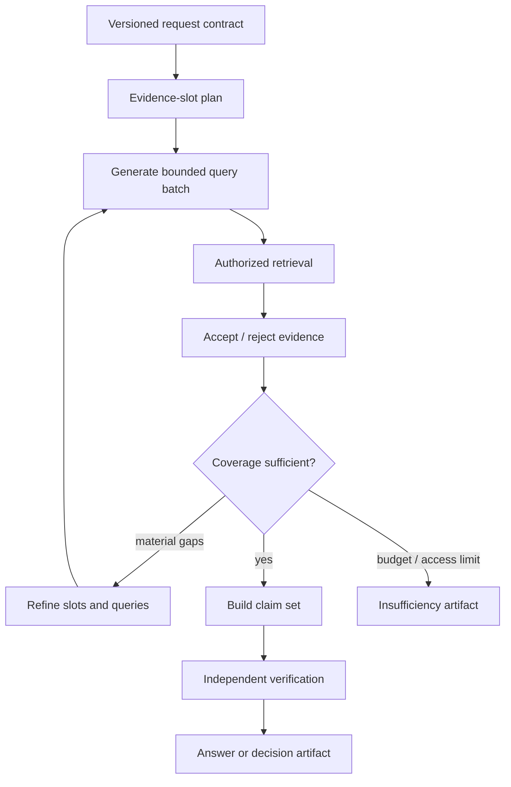
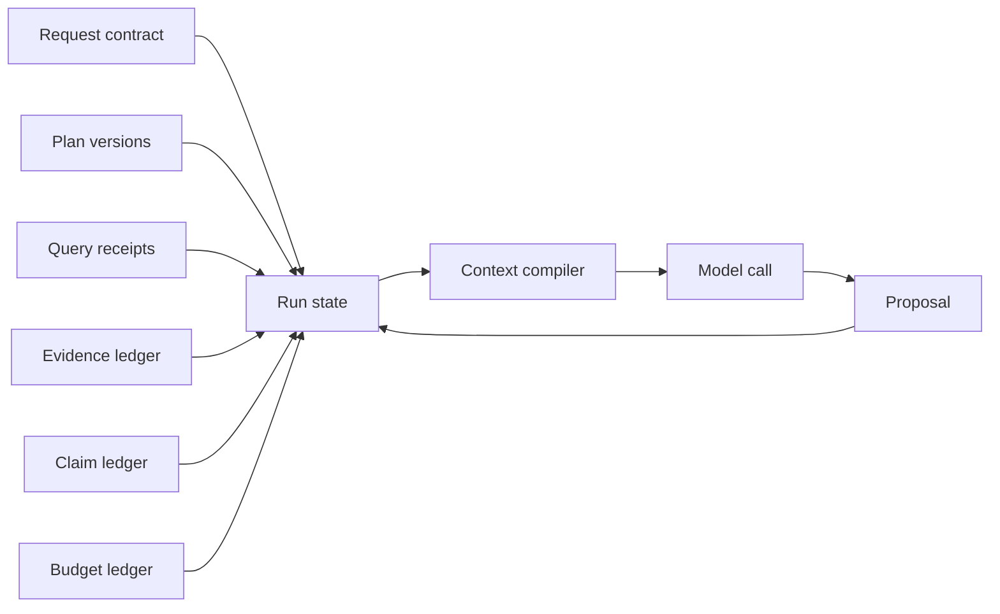

# Research Orchestration, State, Memory, and Context

> **Purpose:** Add adaptive research without turning model context into the workflow engine, database, or policy authority.

## Route complexity; do not agentify every question

The router should choose among four paths:

1. **Search:** return sources or passages.
2. **Grounded answer:** one retrieval and one verified synthesis.
3. **Known workflow:** fixed steps with model-assisted extraction or writing.
4. **Bounded research:** adaptive decomposition and iterative retrieval.

Only the last path needs a research loop. It is justified when the question contains multiple evidence requirements, unknown bridge facts, heterogeneous sources, temporal comparisons, or a coverage problem that cannot be expressed as one query.



## Decompose into evidence slots

A plan is not prose about what the model intends to do. It is a typed coverage contract.

```json
{
  "plan_id": "plan_01J...",
  "request_version": 3,
  "slots": [
    {
      "slot_id": "financial_capacity",
      "question": "What current evidence shows each vendor can sustain the contract?",
      "required": true,
      "source_preferences": ["audited_filing", "credit_assessment"],
      "time_policy": "latest_reporting_period",
      "minimum_support": "one_authoritative_primary",
      "status": "open"
    },
    {
      "slot_id": "delivery_history",
      "question": "What comparable delivery outcomes exist?",
      "required": true,
      "source_preferences": ["internal_project_record", "customer_reference"],
      "status": "open"
    }
  ],
  "dependencies": [["legal_entity_resolution", "financial_capacity"]]
}
```

Good decomposition:

- maps directly to the user's decision criteria;
- states what evidence would satisfy each slot;
- preserves the requested comparison set, date, geography, and exclusions;
- expresses dependencies and calculations;
- avoids a fixed number of cosmetic subquestions;
- allows “not applicable,” “not found,” “not authorized,” and “conflicted.”

The plan can evolve, but changes are versioned with a reason. Newly discovered work cannot silently broaden the source or purpose contract.

## Research loop

```text
while not terminal:
    open_slots = policy.select_open_slots(state)
    proposals = model.propose_queries(open_slots, accepted_evidence_summaries)
    queries = policy.validate_and_bound(proposals)
    candidates = authorized_retriever.search(queries, authorization_context)
    evidence = verifier.accept_relevant_source_spans(candidates, slots=open_slots)
    state.record(evidence, query_receipts, failures)

    coverage = coverage_engine.measure(state.plan, state.evidence)
    if coverage.required_slots_satisfied:
        terminal = "ready_for_synthesis"
    elif budgets.exhausted or coverage.no_material_gain:
        terminal = "insufficient_evidence"
```

The model never decides that policy, authorization, or a hard budget no longer matters. The coverage engine can use model judgments, but deterministic checks validate required slots, source classes, citations, and bounds.

## Query generation and retrieval policy

Use query families rather than arbitrary free-form search:

| Query family | Example | Guardrail |
|---|---|---|
| Exact entity / identifier | LEI, CIK, project code, clause ID | Preserve exact token and source scope |
| Attribute | Current region availability for product | Bind entity and effective date |
| Bridge | Server ID found in project document → asset database | Bridge value must come from accepted evidence |
| Comparison | Same criterion for each candidate | Use symmetric queries and evidence bars |
| Temporal | State at date versus current state | Search both versions; track valid time |
| Contradiction | Evidence for and against claim | Avoid leading wording that forces agreement |
| Completeness | Missing required slot | Stop if the source class is exhausted or unauthorized |

Record every query, returned candidate ID, rank, filter, and rejection reason. This makes low recall, bad decomposition, and ranking failures distinguishable.

## Tool design

Expose task-level, read-only tools with narrow schemas:

```json
{
  "name": "search_authorized_corpus",
  "description": "Search sources already approved in the request contract. Results are authorization-filtered and contain evidence handles, not unrestricted raw objects.",
  "input": {
    "query": "string, max 500 characters",
    "slot_id": "existing plan slot",
    "source_classes": "subset of approved classes",
    "date_range": "optional validated range",
    "limit": "integer 1..30"
  }
}
```

Prefer `get_company_filings(entity_id, form_types, date_range)` over generic HTTP; `fetch_evidence(evidence_handle)` over arbitrary URL fetch; and `run_readonly_report(report_id, parameters)` over free-form SQL. The service validates arguments and authorization independently of the model.

MCP is useful when several clients need the same tool contract. Pin the protocol and keep application authorization at the server boundary. A model-visible tool description is not a security policy.

## Durable state model



Persist at least:

- request and plan versions;
- run status, deadlines, cancellation, and ownership;
- query proposals, validated queries, ranks, and tool receipts;
- evidence references and rejection reasons;
- claim candidates, support, contradiction, and verifier decisions;
- connector, model, prompt, policy, parser, index, and evaluator versions;
- budget debits and stop decisions;
- approval or effect state in a separate workflow.

The model transcript is diagnostic input, not the canonical state machine. Resume from typed records and reconcile in-flight operations before retry.

Keep state, events, artifacts, and effects distinct:

| Record | Authority | Required property |
|---|---|---|
| Request/plan/run state | Current workflow control state | Versioned transition under optimistic concurrency or a single durable owner |
| Domain event | Immutable fact that a transition or observation occurred | Event ID, run/tenant IDs, prior/new version, actor, time, schema, causation, correlation, payload reference |
| Evidence/artifact | Captured source observation or produced deliverable | Stable identity, source/derivation versions, authorization class, retention, integrity digest |
| Effect intent | Proposed external read/write with exact parameters | Risk tier, policy decision, idempotency key, preconditions, deadline; not proof of execution |
| Effect receipt | Provider result or reconciliation observation | Provider operation ID, attempt, result digest, committed/failed/ambiguous state, read-back evidence |
| Telemetry | Operational observation | Correlates to the records above but cannot mutate or reconstruct authority by itself |

An application-owned event envelope remains stable even if the workflow engine or telemetry schema changes:

```yaml
event:
  event_id: evt_01J...
  event_type: evidence.accepted
  schema_version: 2
  tenant_id: tenant_acme
  request_id: req_01J...
  run_id: run_01J...
  run_version_before: 17
  run_version_after: 18
  actor: worker:evidence_verifier
  occurred_at: "2026-08-31T04:18:10Z"
  recorded_at: "2026-08-31T04:18:11Z"
  correlation_id: req_01J...
  causation_id: evt_01H...
  payload_ref: artifact://evidence_decision/ev_0189
  payload_sha256: "..."
```

Transitions validate the expected run version, append the event, update the current projection, and enqueue downstream work through a transactional outbox or equivalent atomic boundary. Consumers deduplicate by event/effect identity. Event order is meaningful only within its declared aggregate or partition; global wall-clock order is not an authorization or causality oracle.

Keep outbound actions in a separate workflow even when the knowledge route is read-only today. The research workflow may produce a typed `effect_intent`; it cannot hold write credentials or mark the effect complete. The effect service verifies current identity, policy, proposal digest, target version, approval, expiry, destination, and idempotency key immediately before commit. After a timeout or crash it looks up status or reads the target; it never asks the model whether the action probably succeeded. See [Agent state and event contracts](../../runtime/agent-state-and-event-contracts.md) and [Tool contracts](../../tools/tool-contracts.md) for the canonical cross-cutting patterns.

## Context compiler

The context compiler creates the smallest authorized, high-signal view for the next model call.

```yaml
context_budget:
  total_tokens: 48000
  instructions: 3000
  request_and_plan: 4000
  current_slot_state: 3000
  evidence_spans: 30000
  contradiction_sets: 4000
  tool_schemas: 2000
  output_reserve: 2000
```

Selection policy should:

- include only evidence authorized for the current subject and purpose;
- prefer exact spans with stable evidence IDs over whole documents;
- cover every required slot before adding redundant support;
- diversify by source origin and document;
- include time, status, and source authority alongside text;
- keep contradictory spans adjacent and labeled;
- cap evidence per source to prevent repetition from dominating;
- place critical instructions and evidence deliberately; do not rely on uniform long-context attention;
- record which evidence was supplied to each model call.

Long context can reduce retrieval pressure, but it is not a reason to append the entire corpus. “Lost in the Middle” and later work show that effective use depends on position, task, and model. Evaluate context size and ordering with ablations.

## Compaction

Compaction is a lossy transition. Preserve raw history and durable evidence, then compact only the working view.

```yaml
compaction_artifact:
  compaction_id: cmp_01J...
  input_event_range: [evt_120, evt_388]
  created_at: "2026-08-31T04:20:00Z"
  request_version: 3
  plan_version: 7
  auth_snapshot_id: auth_771
  policy_version: policy_19
  context_manifest_before: ctx_044
  retained:
    - approved request assumptions
    - current plan and open evidence slots
    - accepted claim/evidence IDs
    - unresolved conflicts and failures
    - budgets and stop conditions
  omitted:
    - duplicate search results
    - rejected candidate text
    - verbose tool output already captured in receipts
  summary_sha256: "..."
  compactor_model: model_route_v4
  compactor_prompt: compact_research_v3
  invariants_checked:
    evidence_ids_preserved: true
    open_slots_preserved: true
    contradictions_preserved: true
    budgets_monotonic: true
    no_new_claims: true
  validator: deterministic_plus_review_v2
  validation_outcome: pass
  context_manifest_after: ctx_045
```

Never compact away:

- source spans needed to verify a released claim;
- ACL and policy receipts;
- exact quotes and locations;
- unresolved contradictions;
- approval, effect, or audit records;
- raw state needed to reproduce the artifact.

Test repeated compaction cycles. A one-cycle summary evaluation does not prove long-run coherence.

## Memory policy

Use the following explicit lifecycle. Several rows are intentionally **not** learned memory.

| Class | Scope and lifetime | Authoritative store | Production policy |
|---|---|---|---|
| Turn context | One model call | Context manifest | Compiled, authorization-filtered, disposable; retain the manifest and IDs, not an implicit prompt as state |
| Working memory | Current reasoning step or evidence slot | Typed run projection plus temporary context | Holds open slots, candidate evidence IDs, constraints, and budget; compaction may rewrite the view but not the durable records |
| Session memory | One user interaction across turns | Session record under a declared retention policy | Preserve clarifications and UI continuity; reauthorize referenced evidence each turn; never treat prior prose as source truth |
| Durable workflow state | One request/run across process restarts | Transactional state/event store | Mandatory for resumable work; versioned transitions, deadlines, leases, receipts, cancellation, and recovery; this is state, not semantic memory |
| Domain memory | Governed enterprise facts and artifacts | Source systems, source ledger, approved evidence/artifact store | Connectors and domain owners write it; answers and extracted claims remain derived candidates unless a separately governed workflow publishes them |
| Long-term user memory | Explicit preference reused across sessions | User-governed preference store | Reject by default. Add only for named low-risk preferences with consent, provenance, scope, expiry, inspection, correction, deletion, and tenant binding |
| Episodic memory | Prior runs used to help a new run | Privacy-reviewed case/evaluation store | Do not retrieve arbitrary transcripts. Reuse approved templates, failure signatures, or evidence-backed artifacts with purpose, authorization, freshness, and contamination controls |
| Semantic learned memory | Generalized assertion learned from outputs | None by default | Reject automatic writes. If justified, route a candidate through source/knowledge stewardship with evidence, review, versioning, invalidation, and deletion |
| Prompt/result cache | Performance window | Expiring cache | Key by tenant, subject/effective authorization version, request, corpus, policy, prompt/model/retriever, and freshness mode; never use as durable truth |

Default rejection rules:

- no hidden cross-session profile inferred from questions, clicks, sentiment, or sensitive attributes;
- no shared “team memory” unless its readers, writers, retention, source authority, and revocation behavior are explicit;
- no generated answer, summary, embedding, or model reflection promoted into the enterprise corpus;
- no episodic recall across tenants, purposes, legal holds, or expired authorization;
- no preference or artifact reused after its source, permission, policy, or freshness contract becomes invalid;
- no context summary accepted as evidence for a new factual claim.

A user correction should update an explicit preference or open a source-governed correction proposal. A model-produced entity, relationship, or reusable lesson remains a candidate linked to evidence until the [Knowledge Graph and Data-Catalog Stewardship Agent](../knowledge-graph-stewardship-agent/README.md) or another named source owner accepts it.

## Question answering versus decision support

Decision support should produce structured intermediate artifacts:

- criteria and weights supplied by accountable users;
- evidence matrix per candidate and criterion;
- calculation inputs and formulas;
- source-quality and freshness annotations;
- risk, sensitivity, and missing-data analysis;
- recommendation clearly labeled as analysis;
- alternatives and conditions that would change the recommendation.

The model should not invent weights or conceal that candidates have incomparable evidence. For regulated decisions, the system may stop at evidence organization and require a human-owned scoring process.

## Stopping and budgets

Use several stopping signals:

| Signal | Rule |
|---|---|
| Coverage | Every required slot meets its evidence bar |
| Marginal gain | No new material evidence or slot progress over N rounds |
| Source exhaustion | Approved routes searched to configured depth |
| Contradiction | Material unresolved conflict requires review |
| Access | Required source exists but current subject is not authorized |
| Risk | Request crosses policy or sensitive-data boundary |
| Budget | Time, query, document, token, cost, or fan-out limit reached |
| User cancellation | Propagate cancellation to all workers and tools |

An evaluator model can advise whether context is sufficient, as current agentic-RAG research explores, but it must not override hard bounds or convert absence into certainty.

## Parallelism

Parallelize independent branches such as one company per worker or separate evidence criteria. Give each worker:

- a disjoint or explicitly overlapping slot set;
- the same immutable request and authorization contract;
- per-worker budgets and deadlines;
- a structured return contract of evidence IDs, claims, conflicts, and gaps;
- cancellation and duplicate-suppression behavior.

Do not pass secrets or the full evidence set to every worker by default. The orchestrator merges typed results, not prose summaries alone. Cap fan-out and measure duplicate query rate, evidence overlap, merge errors, and cost.

## Failure and recovery

| Failure | Recovery |
|---|---|
| Model timeout before proposal persisted | Retry with same call key if provider semantics allow; otherwise record a new attempt |
| Tool succeeded but response lost | Reconcile by operation/query receipt before retry |
| Connector unavailable | Mark affected slots blocked; continue independent sources if policy permits |
| Worker crashes | Resume from last durable slot/evidence state |
| Compaction loses a key constraint | Detect via state-to-summary invariant checks; regenerate |
| Query loop repeats | Deduplicate normalized queries and stop on no material gain |
| User changes scope | Version request and plan; do not mix incompatible evidence silently |

## Acceptance checklist

- [ ] The router keeps simple queries on a non-agent path.
- [ ] Plans contain evidence slots, dependencies, and satisfaction rules.
- [ ] Model proposals pass deterministic source, authorization, schema, and budget gates.
- [ ] Tool interfaces expose narrow read operations, not generic infrastructure access.
- [ ] Run state is typed and durable; transcripts are not the system of record.
- [ ] Context compilation is authorization-aware, diversified, and recorded.
- [ ] Compaction preserves evidence and state invariants and is tested across cycles.
- [ ] Cross-session memory is explicit, user-governed, and not automatic factual truth.
- [ ] Parallel workers have bounded scope, budgets, and structured merge contracts.

## Canonical sources

- [IRCoT: interleaving retrieval with reasoning](https://aclanthology.org/2023.acl-long.557/)
- [Self-RAG](https://openreview.net/forum?id=hSyW5go0v8)
- [Google Research: enterprise agentic RAG](https://research.google/blog/unlocking-dependable-responses-with-gemini-enterprise-agent-platforms-agentic-rag/)
- [Anthropic: effective context engineering](https://www.anthropic.com/engineering/effective-context-engineering-for-ai-agents)
- [Lost in the Middle](https://aclanthology.org/2024.tacl-1.9/)
- [MCP `2026-07-28` changelog](https://github.com/modelcontextprotocol/modelcontextprotocol/blob/main/docs/specification/2026-07-28/changelog.mdx)
