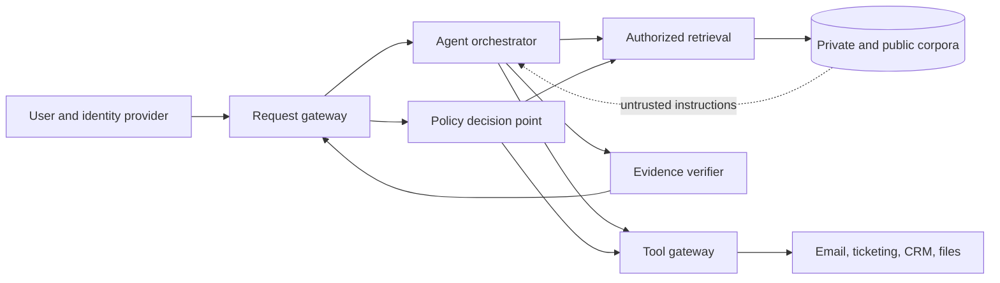
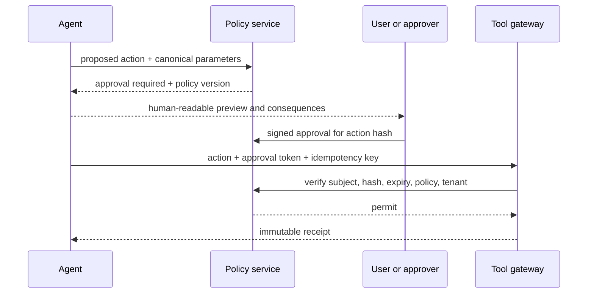
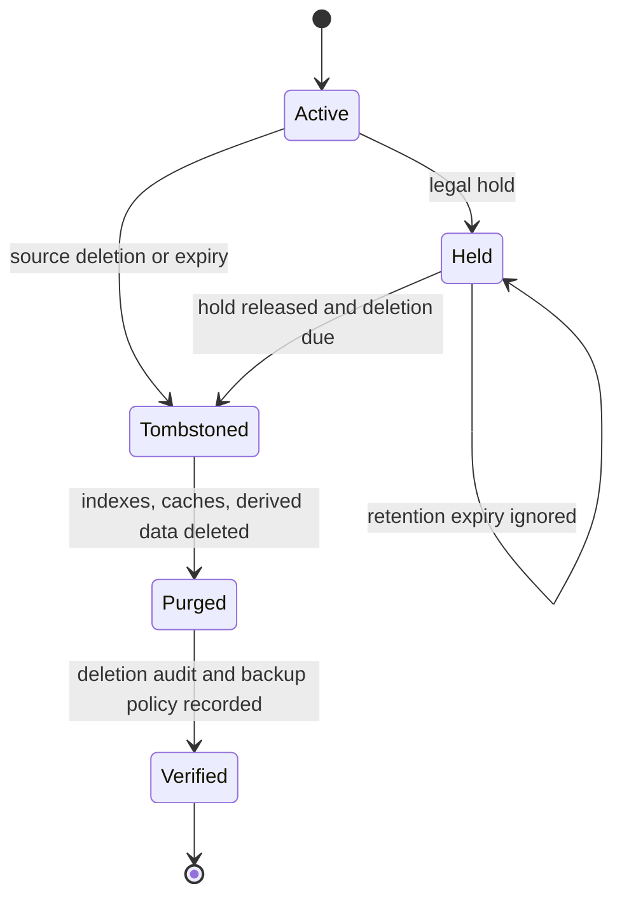

# Security, governance, and outbound actions

An enterprise knowledge agent crosses three trust boundaries at once: it reads untrusted content, handles confidential content, and can invoke tools. Treat retrieved text as data, never as authority. Authorization must be enforced by deterministic services outside the model, and outbound side effects must pass a separate policy and approval path.

## Threat model



Protect these assets:

- document content, metadata, embeddings, summaries, query logs, and citations;
- user identity, group membership, delegated credentials, and tenant boundaries;
- tool credentials and the authority to communicate, modify, delete, or purchase;
- audit trails, legal holds, retention policy, and evidence manifests;
- the system prompt, policy configuration, evaluation data, and security controls.

Assume an attacker may control a document, web page, connector record, file name, OCR text, hidden markup, tool response, or quoted conversation. Also assume an authorized insider may try to infer inaccessible records through counts, timing, error differences, embeddings, summaries, or graph relationships.

## Trust hierarchy

The runtime should apply a fixed hierarchy that content cannot rewrite:

1. code-enforced platform and tenant policy;
2. authenticated user intent and explicit approval;
3. system-owned workflow configuration;
4. typed tool results and authorized evidence;
5. retrieved or uploaded content, always untrusted;
6. model-generated plans and text, never a source of authority.

Prompt wording is useful defense in depth, but it is not an authorization control. Instructions such as “ignore previous rules,” encoded payloads, or requests to reveal secrets in retrieved text must remain ordinary evidence content.

## Indirect prompt-injection defenses

Use independent controls at each stage.

| Stage | Required control | Why it matters |
|---|---|---|
| Ingestion | MIME verification, parser sandbox, active-content removal, size limits, malware scanning | Prevent parser exploitation and obvious executable payloads |
| Normalization | Preserve source boundaries; label author, origin, and trust class | Stops content from masquerading as system instructions |
| Retrieval | ACL filtering, tenant partitioning, domain allowlists for web research | Limits the content and blast radius |
| Planning | Separate evidence from instructions; allowlisted typed tools | Prevents text from inventing capabilities or parameters |
| Execution | Policy check, least-privilege credentials, destination validation, rate and budget limits | Makes model compliance unnecessary for core safety |
| Output | Citation validation, secret and DLP scanning, recipient reauthorization | Reduces disclosure through generated artifacts |
| Detection | Canary records, anomaly signals, security evals, incident replay | Reveals attacks that bypass preventive controls |

Example normalized evidence envelope:

```yaml
evidence:
  id: ev_0189
  content: "...retrieved text..."
  origin: confluence
  source_principal: user_394
  trust: untrusted_content
  tenant_id: acme
  effective_acl_hash: sha256:...
  content_type: text/markdown
  active_content_removed: true
  detector_labels:
    - possible_instruction_in_content
```

Do not let a detector become the only barrier. Prompt-injection classifiers have false positives and false negatives; use them to quarantine, downgrade, or require review, while the tool gateway and authorization service remain decisive.

### Exfiltration-resistant tool design

- Give each tool a narrow purpose and typed schema. Avoid generic shell, arbitrary HTTP, SQL, or “run code” tools in the serving plane.
- Separate read credentials from write credentials. Mint short-lived, audience-bound credentials only after policy approval.
- Resolve resources and recipients server-side. Do not accept raw callback URLs, cloud object URLs, or unrestricted email destinations from model output.
- Limit response size and redact secrets before data returns to the model.
- Bind every tool invocation to `tenant_id`, `subject_id`, `request_id`, policy decision, and idempotency key.
- Reject credential forwarding and token passthrough. A tool must not accept a token intended for another audience.
- Prevent server-side request forgery with URL parsing, DNS/IP checks, redirect revalidation, egress allowlists, and private-address denial.

## Corpus and memory poisoning

Prompt injection tries to influence a current model call; corpus poisoning tries to make malicious or false material persist, rank highly, or reappear later. The attacker may create many near-duplicate pages, edit trusted metadata, compromise a connector identity, hide instructions in OCR/attachments, manipulate timestamps or authority labels, submit malicious feedback, or cause a generated summary to be indexed as if it were source truth.

Use independent controls:

- bind every item to source tenant, object, version, author/actor when available, connector identity, observation time, and transformation lineage;
- keep source authority, publisher identity, popularity, freshness, and model-assessed relevance as separate ranking features;
- detect sudden volume, duplication, source-trust, link, entity, ACL, language, embedding-cluster, and retrieval-share shifts per connector/partition;
- quarantine newly compromised or anomalous partitions without deleting investigation evidence;
- prevent generated answers, summaries, model reflections, user corrections, and prior transcripts from automatically entering the corpus or long-term memory;
- require source-governed review for a learned fact, entity merge, policy interpretation, or reusable cross-session memory;
- canary high-value facts and authorization boundaries, then alert when retrieval or source identity changes unexpectedly;
- preserve a last-known-good source checkpoint and rebuild every derived projection after compromise.

A detector score must not silently delete legitimate dissenting evidence or establish truth. It can reduce ranking, quarantine for review, or force abstention while operators inspect source provenance and access. Recovery closes only after source credentials are rotated if needed, affected identities/versions are enumerated, projections and caches are rebuilt, derived artifacts are invalidated or relabeled, and the poisoning case becomes an adversarial evaluation.

## MCP and third-party integration boundary

Treat each MCP server, SaaS connector, search provider, parser, embedding service, and model endpoint as a separate data processor and failure domain. Admission records its owner, tenant binding, scopes, destinations, retention/training terms, region, schema/capability version, quotas, logging, incident route, and removal procedure.

For MCP over HTTP, validate the dated protocol, authorization issuer and audience, resource/server identity, and redirect behavior. Never pass through a token minted for another resource. Filter advertised tools/resources by the current subject where supported, but keep the application's own allowlist and policy; server metadata and tool descriptions are untrusted configuration. Pin or hash tool schemas, contract-test changes, bound response sizes, redact secrets, and apply timeouts/rate limits before results enter model context.

The 2026-07-28 protocol removes protocol-level sessions. Use explicit application handles bound to tenant, subject, purpose, policy, expiry, and server; do not treat a transport connection, conversation, or model-provided handle as authorization continuity. A third-party read still needs source/citation identity and a third-party write still needs the exact approval/effect protocol below.

## Tool and action risk tiers

```yaml
tool_policy:
  search_corpus:
    risk: read
    approval: none
    credential: delegated_read
  create_draft:
    risk: reversible_write
    approval: none
    credential: service_draft_writer
  send_external_email:
    risk: external_commit
    approval: explicit_user
    credential: minted_after_approval
  delete_record:
    risk: destructive
    approval: two_person_for_high_sensitivity
    credential: break_glass_scoped
```

| Tier | Examples | Default behavior |
|---|---|---|
| Read-only | Search, fetch, compute, compare | Execute within user authority; audit |
| Draft-only | Prepare email, ticket, CRM update | Store as draft; make no external commitment |
| Reversible write | Add label, create unpublished note | Policy-check; show result; retain undo path |
| External commitment | Send message, publish, submit filing, open vendor case | Require a preview and explicit approval immediately before execution |
| Destructive or regulated | Delete, revoke, trade, pay, change access, legal submission | Strong authentication, role policy, often two-person approval; agent may be prohibited |

### Approval is a protocol, not a chat phrase



The approval token should bind:

- exact action type and canonical parameter hash;
- tenant, requester, approver, and required role;
- recipients or external destinations;
- policy version, expiry, and maximum executions;
- a non-reusable idempotency key.

Any material change after preview—recipient, attachment, amount, visibility, or content—invalidates approval. “Yes” elsewhere in a conversation is not approval.

## Identity, tenant, and data-boundary controls

- Authenticate at the gateway and derive tenant server-side; never trust a model-provided tenant.
- Enforce resource authorization at retrieval and again when presenting citations or exporting artifacts.
- Prefer per-tenant physical or logical indexes where operationally feasible. Shared indexes require mandatory tenant predicates injected below the model.
- Namespace caches, queues, object storage, encryption keys, metrics, and evaluation fixtures by tenant.
- Prohibit cross-tenant graph edges unless an explicit public or contractual relationship is represented in a separate approved dataset.
- Revoke sessions and invalidate authorization caches when employment, group, guest, or document permissions change.
- Record policy decision identifiers without logging raw access tokens or unnecessary document text.

## Data classification and minimization

Define a classification policy before ingestion.

| Class | Examples | Retrieval and model policy |
|---|---|---|
| Public | Published filings, public website | Standard controls; preserve provenance |
| Internal | General internal policies | Workforce identity and tenant boundary |
| Confidential | Strategy, contracts, customer records | Need-to-know groups; restricted model region and logs |
| Highly restricted | Credentials, health, payment, privileged legal material | Exclude by default or use a dedicated approved workflow |

For every class, document permitted connectors, regions, model providers, retention, export destinations, and logging fields. Exclude secrets and unnecessary personal data at ingestion rather than depending on output redaction. Embeddings and summaries inherit the source classification because they can reveal source meaning.

## Legal hold, retention, deletion, and residency

Retention is a lifecycle spanning raw blobs, normalized text, chunks, embeddings, graph nodes, summaries, caches, traces, evaluation datasets, backups, and exported artifacts.



Implement deletion by stable source identifier and lineage, not text search. A deletion job should enumerate derivatives, purge serving indexes, invalidate caches, schedule backup expiry or cryptographic erasure according to policy, and emit a signed result. Legal hold must win over ordinary expiry without silently restoring content to search visibility.

Residency controls must cover inference endpoints, telemetry, support access, backups, disaster recovery, and model-provider retention—not only the primary database. Obtain counsel for jurisdiction-specific requirements; engineering documentation should state the implemented mechanism and avoid pretending to provide legal advice.

NIST SP 800-88 Revision 2 is the current NIST media-sanitization publication as of this guide’s baseline and supersedes Revision 1. Map its program guidance to the actual storage medium and cloud-provider deletion guarantees rather than claiming immediate physical erasure.

## Audit design

An audit event should be structured and append-only:

```json
{
  "event": "tool.action.executed",
  "time": "2026-08-31T12:03:04Z",
  "tenant_id": "acme",
  "subject_id": "user_42",
  "request_id": "req_81",
  "action": "send_external_email",
  "parameter_hash": "sha256:...",
  "policy_decision_id": "pdp_902",
  "approval_id": "apr_65",
  "idempotency_key": "act_091",
  "outcome": "succeeded",
  "receipt_id": "mail_783"
}
```

Store sensitive content separately with stricter access and shorter retention. Integrity controls can include write-once storage, hash chaining, signed export manifests, and monitored administrator access. Audit logs themselves are sensitive because query text and source identifiers may reveal confidential work.

## Security failure matrix

| Failure | Detection | Safe response |
|---|---|---|
| Retrieved document instructs agent to send data | Content/instruction boundary signal or unusual plan | Ignore instruction; block unapproved tool; record security event |
| Stale group cache grants access | Permission-version mismatch or revocation feed | Fail closed, invalidate cache, reauthorize source and citation |
| Shared-index tenant predicate missing | Query-plan invariant check | Reject query before index execution |
| Model invents a recipient or URL | Schema and destination policy failure | Reject and require user-specified approved destination |
| Approval reused after edit | Action hash mismatch | Reject; render new preview and approval request |
| Tool times out after committing | Missing response but same idempotency key | Query receipt/status; never blindly replay |
| Sensitive text enters telemetry | DLP scan or field policy violation | Quarantine trace, rotate affected access, fix instrumentation |
| Source deletion leaves embeddings | Lineage reconciliation discrepancy | Remove all derivatives and block document until verified |
| Aggregation leaks inaccessible existence | Authorization-aware aggregation test | Disable or compute only over the authorized candidate set |
| Compromised connector floods poisoned content | Ingestion anomaly and trust-score shift | Quarantine connector partition and rebuild from last good checkpoint |

## Security acceptance tests

- [ ] Cross-tenant query, cache-key, citation, graph-edge, and artifact tests fail closed.
- [ ] ACL revocation propagates within the documented objective and invalidates cached answers.
- [ ] Direct and indirect prompt-injection suites cannot trigger writes or secret disclosure.
- [ ] Encoded, multilingual, OCR, metadata, image-alt-text, and tool-response attacks are covered.
- [ ] Corpus and feedback poisoning cannot promote generated content to truth; quarantine and last-good rebuild are exercised.
- [ ] Every MCP and third-party adapter pins capabilities/schemas, validates tenant and token audience, and has a removal/data-disposition test.
- [ ] SSRF tests cover redirects, DNS rebinding, IPv4/IPv6 private ranges, and user-info parsing.
- [ ] Approval tokens fail on edit, expiry, tenant change, approver-role change, and replay.
- [ ] Tool retries demonstrate exactly-once business effects through idempotency and receipts.
- [ ] Retention, legal hold, subject deletion, and backup-expiry flows are exercised end to end.
- [ ] Logs and traces pass data-classification and secret-scanning tests.
- [ ] Break-glass access is time-bound, justified, monitored, and reviewed.

## Canonical sources

- [NIST SP 800-207, Zero Trust Architecture](https://csrc.nist.gov/pubs/sp/800/207/final)
- [NIST AI Risk Management Framework](https://www.nist.gov/itl/ai-risk-management-framework)
- [NIST AI 600-1, Generative AI Profile](https://nvlpubs.nist.gov/nistpubs/ai/NIST.AI.600-1.pdf)
- [NIST SP 800-88 Revision 2, media sanitization](https://csrc.nist.gov/pubs/sp/800/88/r2/final)
- [OWASP vector and embedding weaknesses](https://genai.owasp.org/llmrisk/llm082025-vector-and-embedding-weaknesses/)
- [Google’s layered defenses for indirect prompt injection](https://security.googleblog.com/2025/06/)
- [Anthropic containment architecture](https://www.anthropic.com/engineering/how-we-contain-claude)
- [Model Context Protocol 2026-07-28 authorization](https://modelcontextprotocol.io/specification/2026-07-28/basic/authorization)
- [GDPR Article 17](https://eur-lex.europa.eu/eli/reg/2016/679/art_17/oj/eng)
