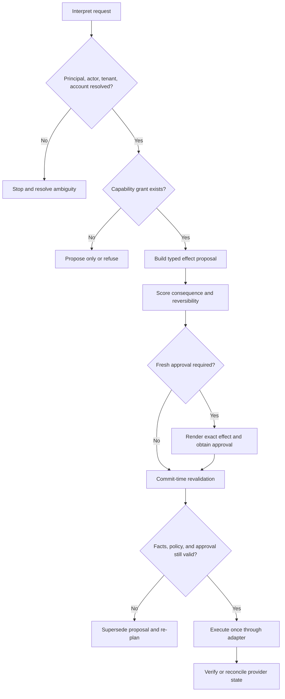

# Purpose, Operating Model, and Autonomy

An executive operations agent should reduce coordination work while preserving the executive's control over identity, relationships, commitments, and money. The best production target is **bounded initiative**: the system notices, prepares, reminds, and follows up proactively, but crosses an external or consequential boundary only through explicit policy and, where required, fresh human approval.

## What the agent is for

The agent is well suited to work that combines interpretation with a clear operational contract:

- summarize inbox and meeting state with citations to source items;
- identify likely priority, deadlines, dependencies, and unanswered threads;
- draft messages, agendas, briefs, tasks, document changes, and itineraries;
- coordinate availability and propose meeting options;
- maintain durable follow-up items and escalate when evidence changes;
- perform approved writes through narrow provider capabilities; and
- reconcile the provider state after every consequential effect.

It is not a substitute for executive judgment, legal authority, financial controls, HR decision-making, information-governance policy, or provider delivery guarantees.

## When not to use an agent

Agentic planning is justified only when the request requires language interpretation or trade-off reasoning that cannot be captured safely in a small decision table. Start with the least complex mechanism that achieves the outcome:

| Need | Prefer | Why an agent is unnecessary or unsafe |
|---|---|---|
| Route newsletters, receipts, alerts, or known senders | Provider mail rules, labels, folders, and allow/deny lists | Stable predicates are cheaper, testable, and do not expose message content to a model |
| Protect focus time or add standard buffers | Calendar working hours, focus-time rules, booking pages, and deterministic buffer logic | The policy is explicit; a model adds scheduling variance |
| Send a recurring internal reminder | Provider reminder, task recurrence, or workflow scheduler | Exact timing and recipient lists should not be reinterpreted every run |
| Produce a fixed weekly report | Scheduled query and template | Inputs, aggregation, and output format are deterministic |
| Arrange a meeting with one known attendee and fixed constraints | Booking link or finite slot-intersection algorithm | No open-ended planning is required |
| Draft a standard acknowledgement | Approved template with typed variables | Wording and recipients can be exhaustively validated |
| Change bank details, payroll, compensation, legal terms, signatures, or security settings | Authorized human using the system of record and a second-person control | Consequence, fraud, and authority dominate any language benefit |
| Resolve a sensitive relationship, personnel matter, conflict, or ambiguous commitment | Human conversation and documented decision | Inferring intent or relationship status from private communications is unacceptable |
| Operate where the provider lacks a stable API, receipt, or reconciliation path | Manual provider UI with a recorded handoff | Browser mimicry cannot create reliable transaction semantics |

Use a model-assisted workflow—not an autonomous loop—when one bounded interpretation step is sufficient. Use a read-only agent when synthesis across permitted sources is valuable but write authority is not. Keep a human-only path for exceptional, sensitive, legally binding, or materially irreversible work.

Before approving any agent use case, record the deterministic and manual baselines, their completion time and error rate, and the specific ambiguity the model resolves. If the agent does not beat those baselines on verified outcomes after review and incident cost, do not deploy it.

## The core separation

Three kinds of work must remain distinct:

| Plane | Good use of probabilistic reasoning | Must remain deterministic or externally verified |
|---|---|---|
| Understanding | Intent, tone, topic, urgency clues, entity extraction, synthesis | Source identity, account, tenant, ACL, resource version |
| Planning | Candidate next steps, scheduling options, draft wording, prioritization rationale | Allowed capability, approval requirement, budget, recipient allowlist |
| Execution | Tool selection within an already authorized typed plan | Preconditions, idempotency, commit, provider receipt, reconciliation |

This division prevents an eloquent model response from silently becoming an authorization decision.

## Autonomy ladder

Autonomy is granted per workflow, capability, principal, tenant, and risk condition—not as a single global level.

| Level | Agent behavior | Examples | Default |
|---|---|---|---|
| 0 — Observe | Read and explain only | Morning brief, conflict report, unanswered-thread list | Allowed with scoped read access |
| 1 — Propose | Create a local proposal or provider draft | Reply draft, draft task, suggested itinerary | Recommended launch mode |
| 2 — Reversible personal write | Change low-impact state that is easily undone | Apply a private label, create a private task, place a clearly marked tentative hold | Explicit policy; easy undo required |
| 3 — External commitment | Affect another person or expose data | Send mail, invite attendees, share a document, change a meeting | Fresh confirmation by default |
| 4 — High impact | Spend money, alter legal/identity posture, record people, or destroy data | Purchase travel, accept fees, sign, record/transcribe, permanent delete | Fresh confirmation plus stronger controls; some remain human-only |
| 5 — Forbidden | Outside delegable machine authority | Reveal secrets, bypass consent, approve its own escalation, open-ended spend, cross-tenant action | Never allowed |

Level 2 is not automatically safe. A tentative hold can expose a meeting title, block a critical time, or notify someone if the wrong calendar or API flags are used. Risk depends on the exact effect.

## Authority is a capability, not a persona

“Act as my chief of staff” is a useful interaction metaphor and a dangerous security model. Operational authority must be represented as a capability grant such as:

```yaml
grant:
  principal: "oidc:https://issuer.example:subject-123"
  actor: "delegate:employee-456"
  provider_connection: "google-workspace:tenant-a:user@example.com"
  capability: "calendar.event.create"
  constraints:
    calendar_ids: ["primary"]
    external_attendees: false
    visibility: "private"
    allowed_hours: "08:00-19:00 Asia/Kolkata"
    maximum_duration_minutes: 60
  approval: "required"
  expires_at: "2026-09-01T18:30:00+05:30"
```

The user-facing role may be broad; the machine-enforced grant should be narrow.

## Decision policy

Use this sequence for every requested effect:



The stop path is a feature. If “email Alex,” “move the review,” or “book the usual flight” resolves to more than one credible identity, calendar, trip, or constraint set, the safe outcome is a compact clarification or a non-committing proposal.

## Approval design

A confirmation such as “yes” is only meaningful when attached to a stable approval object. The confirmation screen should show:

- acting identity and visible `From`/organizer identity;
- provider, tenant, account, and target resource;
- complete recipients, attendees, external domains, or share principals;
- exact action and material content or a digest with a visible preview;
- time zone, recurrence scope, notification behavior, and privacy setting;
- amount, currency, taxes and fees, cancellation/refund terms, and traveler names;
- source versions and how old the underlying facts are;
- why approval is required, expiration, and the available safer alternative; and
- the rollback boundary—what can and cannot be undone.

Approval must be invalidated when a new recipient appears, a thread receives a materially relevant reply, a calendar event version changes, a price or fare rule changes, a document revision or ACL changes, the principal/account changes, or the approval expires.

Use a confirmation ladder rather than a single `needs_confirmation` flag:

| Rung | Interaction | Eligible effects | Escalation trigger |
|---|---|---|---|
| Inform | Show what was observed; no write | Read-only brief, conflict or anomaly report | Any request to alter state |
| Propose | Produce a local proposal or provider draft | Draft message, itinerary, task, redline | External visibility or commitment |
| Confirm | Dedicated effect-bound approval | Invite, send, comment, exact-principal share | New identity, external domain, recurrence, sensitive source, or material drift |
| Step up | Reauthenticate and approve the exact effect | Spend, cancel with penalty, broad disclosure, e-sign send, recording | Assurance timeout, unusual device/location, policy exception, or high impact |
| Dual control | Two independent authorized humans approve | Financial-account change, large spend, sensitive mass disclosure | Organization-defined threshold or BEC indicator |
| Human only | Agent prepares evidence and hands off | Signature, regulated attestation, employment/legal judgment, identity recovery | Always; the agent cannot complete the effect |

Silence, message opening, calendar acceptance, previous similar behavior, seniority, urgency, and model confidence are never confirmation.

## Operating roles

The product should distinguish at least four actors:

| Actor | Responsibility | Cannot do |
|---|---|---|
| Executive principal | Owns data, intent, and delegable authority | Delegate authority prohibited by provider, law, or organization policy |
| Human delegate | Operates within an explicit grant; reviews or approves where permitted | Become the principal merely because they can access a mailbox |
| Agent service | Interprets, proposes, executes allowed capabilities, records evidence | Create new authority, conceal acting identity, approve itself |
| Administrator or security operator | Configures tenant policy, connections, keys, retention, incident controls | Read private content by default or approve business intent without authorization |

Provider semantics matter. Microsoft Exchange separates Full Access, Send As, and Send on Behalf; Google mailbox delegation exposes delegate behavior differently. The internal model must preserve these differences rather than flattening them into `can_email=true` ([Exchange mailbox permissions](https://learn.microsoft.com/en-us/exchange/recipients-in-exchange-online/manage-permissions-for-recipients), [Gmail delegate settings](https://developers.google.com/workspace/gmail/api/guides/delegate_settings)).

## Workflow selection: deterministic first

Use rules or ordinary software when the task has a stable decision table:

- suppressing already-processed webhook IDs;
- checking an ETag or sync-token age;
- mapping provider error codes;
- enforcing an attendee-domain allowlist;
- renewing a subscription before expiration; or
- calculating approval expiration.

Use the model when language or trade-offs are genuinely ambiguous. A workflow can call a model without becoming an autonomous loop. Anthropic's agent guidance distinguishes predefined workflows from model-directed agents and recommends starting with the simplest approach that works; this blueprint applies that restraint to the authorization boundary ([Building effective agents](https://www.anthropic.com/engineering/building-effective-agents)).

### Admission record

Every candidate workflow should enter the backlog with a small evidence record:

```yaml
workflow_candidate: schedule_external_review
current_baseline: human_calendar_ui
baseline_sample: 50
baseline_median_minutes: 7.4
baseline_material_error_rate: 0.02
ambiguity_requiring_model: "trade off five calendars, travel buffers, and ranked attendee preferences"
proposed_authority_ceiling: propose_only
forbidden_effects: [send_without_confirmation, infer_private_event_details]
success_gate: "lower median handling time with no increase in material errors"
owner: executive-operations-product
review_by: 2026-09-30
```

Reject the candidate if its ambiguity statement can be replaced by a stable rule or if success cannot be verified from authoritative provider state.

## Success and non-goals

Measure success as fewer dropped commitments and less coordination effort **without** unsafe effects. Good product outcomes include reduced time to prepare, fewer duplicate tasks, higher follow-up closure, accurate scheduling, and high human acceptance of drafts.

Explicit non-goals for the initial system:

- replacing the executive's inbox or calendar as system of record;
- maintaining a hidden personality dossier;
- making legal, hiring, compensation, medical, or investment decisions;
- buying travel or other services without current, itemized confirmation;
- treating meeting transcripts as authoritative decisions;
- attempting exactly-once semantics where the provider does not support them; and
- increasing “autonomy” merely because a new model performs better on a generic benchmark.

## Production checklist

- [ ] Every action maps to a named capability and reversibility class.
- [ ] Every capability is scoped to a principal, actor, tenant, provider connection, and resource set.
- [ ] Untrusted content cannot alter grants or approval policy.
- [ ] External communications and scheduling start in draft/confirm mode.
- [ ] High-impact actions use fresh, effect-specific approval.
- [ ] Ambiguity produces a proposal or clarification, never identity guessing.
- [ ] Commit-time revalidation and post-commit verification are implemented.
- [ ] The product explains acting identity and rollback limits in plain language.
- [ ] Autonomy expansion requires workflow-specific production evidence and a rollback switch.
- [ ] A deterministic, read-only, and manual baseline was measured before adding model autonomy.
- [ ] The confirmation ladder is explicit and silence or prior behavior cannot authorize an effect.

## Related guides

- [Identity, authority, and approvals](03-identity-authority-and-approvals.md)
- [Tool contracts, idempotency, and reconciliation](07-tool-contracts-idempotency-and-reconciliation.md)
- [Security, privacy, tenancy, and audit](08-security-privacy-tenancy-and-audit.md)
- [Canonical delegation and handoffs](../../orchestration/delegation-handoffs-and-shared-state.md)
