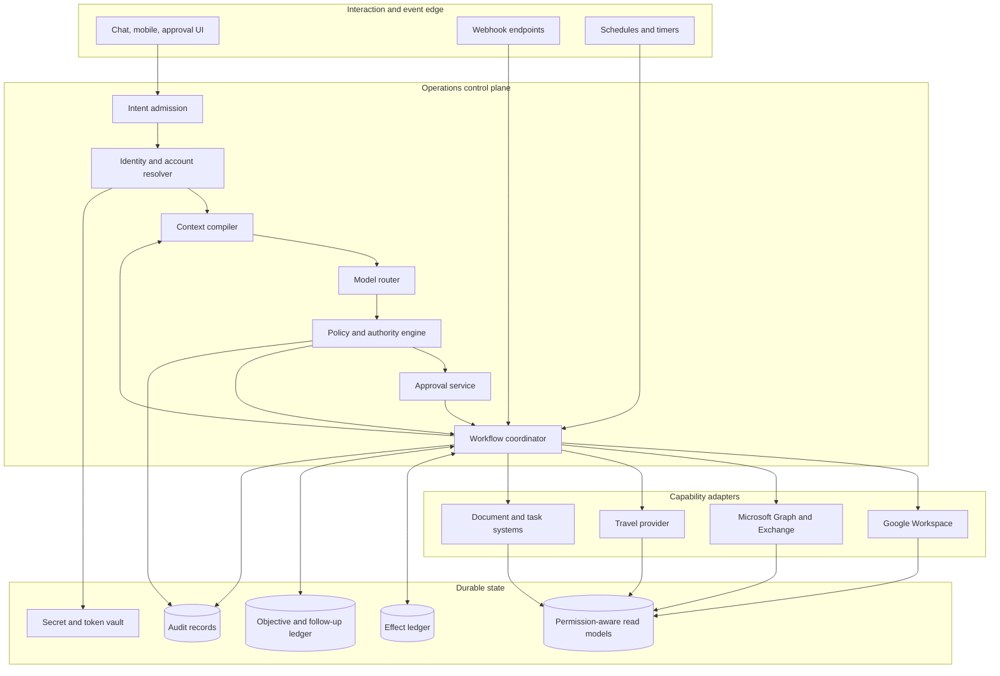
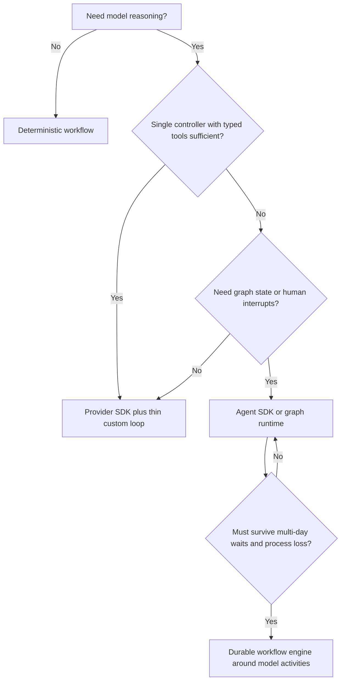

# Reference Architecture, Runtime, and Technology

The recommended architecture is a small, explicit control plane around provider APIs. The LLM is one replaceable reasoning component. Identity resolution, policy, persistence, approvals, commits, and reconciliation remain ordinary software with inspectable state transitions.

## Reference architecture



### Component responsibilities

| Component | Owns | Does not own |
|---|---|---|
| Intent admission | Request normalization, origin, session, user-visible cancellation | Authority inference |
| Identity/account resolver | Issuer-subject identity, delegate, tenant, provider connection, send identity | Natural-language intent |
| Sync/read-model service | Webhooks, delta/full sync, normalized resources, versions, freshness | Business decisions |
| Context compiler | Minimum permission-filtered facts and provenance for one decision | Long-term truth or credentials |
| Model router | Task classification, model selection, typed proposal generation | Permission or transaction commit |
| Policy engine | Capability grants, risk, freshness rules, budget, approval requirements | Creative planning |
| Approval service | Effect preview, hash binding, signer, expiry, revocation | Rewriting the proposal after approval |
| Workflow coordinator | State transitions, timeouts, retries, interrupts, callbacks | Assuming provider success |
| Capability adapter | Provider-specific preconditions, API call, receipt normalization | Broad generic access to the provider |
| Effect ledger/reconciler | Deduplication, attempt state, verification, ambiguous outcomes | User preference memory |
| Objective ledger | Durable commitment, owner, due state, evidence, escalation | Replacing provider records |

## Event ingestion: notifications are hints

Do not let webhook payloads drive actions directly. Google Calendar push notifications contain no changed resource and can arrive before the `watch` response; message numbers increase but are not sequential. Microsoft Graph can retry notifications, marks slow endpoints, and recommends delta query to recover missed changes. Gmail `watch` expires and history IDs can become unusable ([Google Calendar push](https://developers.google.com/workspace/calendar/api/guides/push), [Gmail push](https://developers.google.com/workspace/gmail/api/guides/push), [Microsoft Graph webhook delivery](https://learn.microsoft.com/en-us/graph/change-notifications-delivery-webhooks)).

Use this ingestion pattern:

1. authenticate the provider callback and capture its subscription/channel metadata;
2. acknowledge within the provider deadline after durable enqueue;
3. coalesce notifications by account and resource family;
4. run incremental sync from the last committed cursor;
5. transactionally update read models and the cursor;
6. schedule bounded full sync when the cursor is invalid; and
7. evaluate affected objectives only from the refreshed read model.

The read-model row should carry `provider_resource_id`, immutable ID where available, version/ETag, sync cursor lineage, observed time, provider modified time, ACL projection, and tombstone status.

## Runtime shape

### Default: thin controller plus queue

For a first product, use:

- an HTTP/API process for interaction, OAuth callbacks, and webhooks;
- a relational database for identities, grants, approvals, read models, effect records, objectives, and audit metadata;
- a durable queue for sync, model, execution, verification, and scheduled follow-up jobs;
- an encrypted secret store for refresh tokens and provider credentials; and
- stateless workers with bounded retry policies.

This is sufficient when waits are short, job semantics are simple, and each state transition is explicitly persisted.

### Add a durable workflow engine when evidence requires it

Use Temporal, LangGraph persistence, or an equivalent durable coordinator when the product has multi-day approvals, callback races, complex compensation, many concurrent waits, or a demonstrated recovery burden. Temporal's model is useful for crash-resilient workflows, while LangGraph checkpoints and interrupts can preserve graph state around human review. Both still require idempotent activities or reconciliation around external side effects ([Temporal documentation](https://docs.temporal.io/), [LangGraph persistence](https://docs.langchain.com/oss/python/langgraph/persistence), [LangGraph interrupts](https://docs.langchain.com/oss/python/langgraph/interrupts)).

Do not introduce a workflow engine merely because the system uses an LLM. A database state machine and queue are easier to operate until long-lived orchestration becomes the measured problem.

## Language and service boundaries

Choose the team's strongest production language. The architecture does not depend on one language.

| Context | Practical default | Why |
|---|---|---|
| Integration-heavy web product | TypeScript/Node.js | Strong API/webhook ergonomics, shared UI types, broad provider SDK support |
| Evaluation/data/NLP-heavy team | Python | Mature model/evaluation ecosystem and data tooling |
| Existing JVM/.NET platform | Existing stack | Identity, operations, and provider correctness matter more than agent-fashion consistency |

Keep one deployable application until scaling or regulatory boundaries justify separation. Logical modules are enough: `identity`, `sync`, `planning`, `policy`, `approval`, `effects`, `objectives`, `audit`, and provider adapters. Separate the webhook receiver or high-volume workers only when traffic isolation is needed.

## Model strategy

Do not select a model from a public leaderboard alone. Run a private bakeoff against the system's own typed proposals, untrusted-content cases, ambiguity, and failure states.

Use at least two routing classes:

- a lower-cost model or deterministic pipeline for classification, extraction, deduplication suggestions, and constrained summaries; and
- a stronger reasoning model for multi-source briefings, scheduling trade-offs, travel comparison, or repairing a failed plan.

For each route, pin the model snapshot or deployment version, prompt bundle, tool schema version, reasoning budget, timeouts, and fallback. Structured output reduces parsing ambiguity but does not make the contents authorized or correct. OpenAI's current model guidance recommends structured outputs, stable prompt prefixes, explicit tool-side-effect documentation, and preserving completed actions and tool outcomes during compaction ([OpenAI model guidance](https://developers.openai.com/api/docs/guides/latest-model)).

### Model selection gates

Reject a candidate route unless it meets all of these on repeated trials:

- high typed-schema validity without repair loops;
- zero severe unauthorized effects in the safety set;
- conservative behavior under identity, recipient, and account ambiguity;
- correct use of freshness and provider-version evidence;
- bounded tool calls, latency, and cost;
- stable results under paraphrase, long context, and adversarial content; and
- acceptable human edit/accept rates on real drafts.

## Framework choice



The OpenAI Agents SDK offers code-first tools, sessions, handoffs, guardrails, and tracing; it can reduce harness work without replacing the application's policy or effect ledger ([OpenAI Agents SDK](https://developers.openai.com/api/docs/guides/agents)). Model Context Protocol can improve tool interoperability, but the production boundary should still expose narrow capabilities, validate schemas, bind tokens to the intended resource, and forbid token passthrough ([MCP authorization](https://modelcontextprotocol.io/specification/2025-11-25/basic/authorization)).

Avoid multi-agent orchestration by default. Separate model roles increase context, authorization, and attribution complexity. Use additional agents only when isolated context or parallel specialist reasoning produces measured value; they receive no independent write authority.

## Data stores

| Store | Contents | Retention principle |
|---|---|---|
| Identity and connection registry | Issuer/subject, tenant, account IDs, scopes, token references | Until disconnect plus necessary audit |
| Read models | Minimum normalized provider data, version, ACL, freshness, provenance | Short and purpose-bound; refresh from provider |
| Effect ledger | Proposal digest, approval, attempts, receipts, verification | Long enough for disputes, dedupe, and incident response |
| Objective ledger | Commitment, owner, due, state, evidence pointers | Until closed plus configured business retention |
| Preference store | Explicit, scoped preferences with provenance and expiry | Reviewable and deletable; no inferred dossiers by default |
| Audit store | Who/what/when/where/policy/result metadata | Separate access controls and retention schedule |
| Trace/debug store | Redacted operational diagnostics | Short; never a shadow archive of private content |

A vector database is not an architectural prerequisite. Add retrieval embeddings only for a measured corpus-search need after ACL filtering, deletion propagation, provenance, freshness, and tenant partitioning are solved.

## Capability adapter contract

Each adapter should expose a business-semantic operation, not a raw provider client:

```typescript
type ExecuteEffect = {
  effectId: string;
  principalId: string;
  actorId: string;
  connectionId: string;
  capability: "mail.send" | "calendar.event.create" | "document.share";
  target: { resourceId?: string; version?: string };
  preconditions: { notAfter: string; policyVersion: string };
  idempotencyKey?: string;
  payload: unknown;
};

type EffectReceipt = {
  providerRequestId?: string;
  providerResourceId?: string;
  acceptedAt?: string;
  outcome: "confirmed" | "rejected" | "unknown";
  verificationRequired: boolean;
};
```

Provider-specific code owns ETags, immutable IDs, transaction IDs, notification flags, retry classification, and verification queries. The model never supplies credentials, arbitrary URLs, raw HTTP headers, or an unrestricted method name.

### Operation-level capability manifest

Qualify an operation, not a vendor logo or a generic connector. `gmail.messages.list` and `gmail.messages.send` have different scopes, cost, consequence, and retry rules; one cannot inherit the other's approval. Keep the reviewed manifest in a registry deployed with the policy engine:

```yaml
manifest_version: capability-manifest.v1
capability_id: google-calendar.events.insert.v3
provider_api: google-calendar-rest-v3
operation: POST /calendars/{calendarId}/events
stability: ga
identity:
  modes: [delegated_user, domain_wide_delegation]
  represented_subject_required: true
  tenant_and_account_binding: required
authorization:
  least_scopes: [https://www.googleapis.com/auth/calendar.events]
  disallowed_fallbacks: [https://www.googleapis.com/auth/calendar]
effect:
  class: external_commitment
  visible_actor: organizer
  notification_controls: [sendUpdates]
resource_semantics:
  identity: provider_event_id_plus_calendar_id
  version: etag
  create_dedupe: client_supplied_event_id
  concurrency_precondition: If-Match
outcome:
  success_response: created_resource
  timeout: unknown
  verifier: fetch_by_event_id_and_compare_material_fields
events:
  wakeup: push_channel
  convergence: events.list_sync_token
limits:
  dimensions: [project, user_per_project, calendar_operational_limits]
  retry_source: provider_error_and_backoff_guidance
policy:
  approval: exact_attendees_time_recurrence_visibility_notifications
  prohibited_uses: [silent_external_invite, model_selected_organizer]
qualification:
  test_suite: google-calendar-insert-v3-q4
  tested_tenant_classes: [workspace_test, consumer_test]
  reviewed_at: 2026-08-31
  source_refs: [google-calendar-insert, google-calendar-scopes, google-calendar-quota]
```

The registry must also record payload and batch limits, data classification and retention, regional/national-cloud availability, SDK/API version, webhook authentication and replay behavior, idempotency-key retention, cancellation/compensation path, sandbox fidelity, provider terms or prohibited automation, and a kill-switch owner. An absent or expired manifest means the capability is unavailable, not “best effort.”

### Qualification gates

An operation may move from unavailable to read, proposal, reversible write, or external effect only when evidence passes every applicable gate:

1. **Contract:** the exact stable endpoint, fields, API/SDK version, account edition, cloud/region, and deprecation horizon are recorded; preview behavior is isolated.
2. **Identity:** a test proves the represented principal, delegate/service actor, tenant, account, visible sender/organizer, and resource scope; broad app authority cannot substitute silently.
3. **Least privilege:** the smallest scope/permission set is tested in a fresh tenant, including negative tests for missing scope, wrong mailbox, wrong workspace, and revoked access.
4. **Resource semantics:** IDs, move/copy behavior, versions, ETags, recurrence, threading, membership, partial response, and deletion/tombstone behavior are contract-tested.
5. **Effect safety:** preconditions, provider idempotency, internal dedupe, ambiguous timeout, verification query, cancellation, compensation, and manual escalation are demonstrated with process-death injection.
6. **Event convergence:** signature/secret validation, duplicate/out-of-order delivery, subscription renewal, cursor/token expiry, gap recovery, and bounded full resync are demonstrated. A webhook without a recovery feed is a wake-up only.
7. **Limits:** rate dimensions, concurrency, batch/size limits, `Retry-After`, burst policy, quota ownership, and backpressure behavior are load-tested below provider ceilings.
8. **Data and policy:** minimization, model exposure, retention/deletion, DLP, consent, audit, marketplace/certification, and provider prohibited-use terms have owners and tests.
9. **Operations:** sandbox/test fidelity, dashboards, SLOs, support escalation, runbook, kill switch, canary cohort, and rollback are ready.

Requalify after a provider version, scope, marketplace classification, tenant policy, data-use term, rate model, or visible-author identity change. Named products in this blueprint are concrete qualification examples, not endorsements.

### Minimum provider qualification catalog

The initial registry should cover the precise operations used, never an entire product:

| Surface | Read/sync operations to qualify | Write/effect operations to qualify separately | Critical proof |
|---|---|---|---|
| Gmail | `history.list`, message/thread get/list, `watch` | draft create/update, draft/message send, label mutation | Restricted-scope review, per-method quota units, history expiry/full sync, sender alias, no blind send retry |
| Google Calendar | free/busy, event list/get, watch/sync token | insert, occurrence/series update, cancel/delete, attendee response | Calendar/account identity, ETag, client event ID, timezone/recurrence, notification limitations |
| Microsoft mail/calendar | folder-scoped message delta, calendar-view delta, immutable-ID reads | draft/create, `sendMail`, event create/update/cancel | Delegated vs application permission, Exchange send rights, mailbox-scoped limits, `transactionId`, `202` acceptance |
| Slack | conversations/history/replies, Events API | `chat.postMessage`, update/delete | Bot vs user authorship, workspace/install identity, Marketplace-sensitive history limits, channel rate, impersonation/delete limitation |
| Microsoft Teams | chat/channel reads and change notifications | post chat/channel message, activity notification | Delegated-only normal send, migration-only application send, tenant/chat scope, polling prohibition, lifecycle notifications |
| Travel | offer search, price/reprice, order/booking lookup, supplier events | hold, book/order, add service, cancel/refund | Offer expiry, traveler identity, price/terms, payment boundary, `200/202` pending semantics, duplicate-order prevention |
| Expense | transaction/reimbursement/receipt read and state events | receipt upload, mileage/reimbursement draft, approve/pay only if provider contract and organization allow | Employee/business binding, amount/currency, OCR uncertainty, approval state machine, write idempotency, finance separation of duties |
| CRM | object read/search, change events/webhooks | create, external-ID upsert, conditional update, batch mutation | Org/portal/object/record identity, field-level access, change replay window, partial batch failure, relationship merge rules |
| Document storage | file/item and ACL read, revision/delta/change feed | edit, comment, move, permission invite/update/delete | Drive/site/container identity, revision/ETag, inherited ACL, partial invite, notification and ownership-transfer effects |
| E-signature | template/agreement/envelope status and provider events | create draft, send for signature, void/correct | Sender/impersonated user, exact document hash/recipients/order/auth, provider-hosted signing, transaction lookup, webhook recovery |
| Tasks | list/task read and event/sync token | create/update/complete/move/delete | Provider ID migration/move behavior, due semantics, assignment authority, create idempotency, event loss/full crawl |
| Communications | inbound message/status callback and consent state | SMS/WhatsApp/voice initiation, schedule/cancel | Account/subaccount/sender, recipient consent and opt-out, channel registration, delivery-state limits, spend/throughput controls |

Provider facts and current source annotations are maintained in the [research packet](../../research/packets/executive-operations-agent-blueprint.md). The registry is still the runtime authority: documentation prose cannot enable a capability.

## Behavior bundle and configuration lineage

Treat the executable behavior as one signed bundle even when components deploy independently:

```text
behavior_bundle_id = hash(
  model deployment and fallback graph,
  prompt/system-instruction bundle,
  context compiler and compactor,
  tool schemas and capability manifests,
  identity/policy/approval rules,
  adapter and workflow versions,
  memory/retention policy,
  graders and release thresholds
)
```

Every run, approval, effect, compaction receipt, trace, and handoff records this bundle ID plus its component pins. A provider or model switch creates a new bundle, triggers compatibility and regression gates, and cannot inherit a canary result merely because the tool schema appears unchanged.

## Availability and scaling

Partition queues and rate limits by provider, tenant, connection, and capability. One executive's mailbox resync should not starve approval commits. Recommended worker lanes are:

- webhook admission;
- incremental and full sync;
- interactive planning;
- approved effects;
- verification/reconciliation; and
- scheduled follow-up.

Approved effects have higher priority than background summaries but stricter concurrency: serialize writes when provider resources conflict, and rate-limit per account. Apply provider-aware backoff with jitter. Do not spend the entire retry window inside one request; persist the next attempt.

Apply backpressure in this order: coalesce redundant change hints; defer low-priority summaries; reduce context/model routes; slow initial/full sync; reject new optional work with a visible retry time; preserve admission for cancellation, approved-effect reconciliation, token revocation, and security controls. Never drop an accepted effect, approval expiry, provider callback needed to resolve an unknown outcome, or user cancellation to protect a briefing SLO.

## Build-versus-buy boundaries

Buy or use managed services for OAuth brokering, vaults, queues, databases, and durable workflow execution when they meet tenant and compliance needs. Own the pieces that encode product trust:

- identity/account binding;
- capability and approval policy;
- effect previews and hashes;
- provider semantic normalization;
- ambiguous-outcome reconciliation;
- objective/follow-up logic; and
- evaluation and audit evidence.

These are not generic plumbing; they are the system's correctness model.

## Production checklist

- [ ] Webhooks are authenticated, durably queued, and treated as sync hints.
- [ ] Cursor invalidation has a bounded full-resync path.
- [ ] The LLM can only return versioned typed proposals.
- [ ] Provider adapters expose narrow capabilities and own provider semantics.
- [ ] Model, prompt, tool schema, and routing configurations are pinned.
- [ ] Workflow/runtime complexity is justified by actual wait and recovery requirements.
- [ ] The relational schema supports effect and objective state machines.
- [ ] Secrets never enter model context or general logs.
- [ ] Model routes pass repeated system-level and adversarial evaluations.
- [ ] Queue isolation and provider/account rate limits prevent noisy-neighbor failures.
- [ ] Every enabled operation has a current manifest and qualification evidence; provider name alone grants nothing.
- [ ] Behavior-bundle IDs are attached to runs, effects, receipts, traces, and handoffs.
- [ ] Backpressure preserves cancellation, revocation, approved-effect reconciliation, and security lanes.

## Related guides

- [State, memory, priorities, and follow-up](04-state-memory-priorities-and-follow-up.md)
- [Tool contracts, idempotency, and reconciliation](07-tool-contracts-idempotency-and-reconciliation.md)
- [Custom loop vs framework vs workflow engine](../../comparisons/custom-loop-vs-framework-vs-workflow-engine.md)
- [Durable execution](../../runtime/durable-execution.md)
