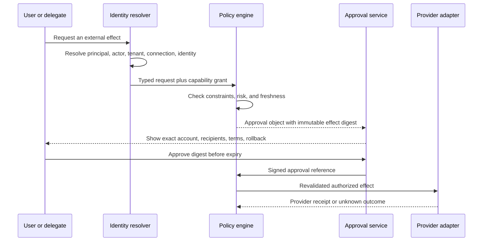

# Identity, Authority, and Approvals

Identity is the primary safety boundary for an executive operations agent. A technically valid API token is not proof that the current person intended an action, that a delegate may perform it, or that the selected mailbox and tenant are correct.

## Identity model

Represent identity as a tuple, not an email address:

```text
human principal = (identity issuer, immutable subject)
delegated actor = (issuer, subject, delegation grant)
service actor   = (workload identity, deployment, key version)
connection      = (provider, provider tenant, provider account, granted scopes)
execution       = (principal, actor, service actor, connection, capability)
```

OpenID Connect defines the locally unique user identity from the issuer and subject; display names and email addresses are mutable attributes, not durable keys ([OpenID Connect Core](https://openid.net/specs/openid-connect-core-1_0.html)). Persist provider-native immutable tenant and account identifiers alongside this tuple.

Never collapse:

- the executive and an executive assistant;
- the application service principal and the represented human;
- a provider tenant and a verified email domain;
- mailbox access and authority to send;
- calendar write scope and organizational authority to invite; or
- account discovery and user selection.

## Canonical identity and version semantics

Every reference in a plan, approval, effect, memory record, trace, or handoff resolves to a canonical typed identity. Display names, email addresses, subjects, titles, and approximate times are search attributes, never primary keys.

| Entity | Canonical identity | Version/change marker | Merge, reuse, and invalidation rule |
|---|---|---|---|
| Principal | Internal `principal_id` mapped to `(issuer, immutable subject)` and verified provider identities | Identity-link set version, account status, and authentication assurance timestamp | Never merge on email/name. Reauthentication or account recovery does not silently create a new principal; conflicting issuer-subject evidence requires administrator review. |
| Delegate | `delegation_grant_id` plus actor `principal_id`, represented principal, tenant, connection/resource scope, capabilities, and validity interval | Grant generation, revocation version, `valid_from`, `expires_at`, and provider grant evidence version | A provider token or mailbox access is not the grant. Revoke queued work and approvals when any bound generation changes. |
| Intent | Immutable `intent_id` for one admitted user/delegate instruction, channel event, and interpretation generation | Source event/message version, clarification sequence, interpreter bundle, and supersession pointer | Editing or clarifying creates a new generation. Similar text or the same conversation does not reuse authority. |
| Contact | Internal `contact_id` linked to one or more provider-directory records, verified addresses/numbers, organization, and provenance | Per-source record version/modified time plus link-set generation | Do not merge by display name, title, avatar, email similarity, message frequency, or model judgment. Ambiguous resolution blocks effects. |
| Attendee | `attendance_ref = event_scope + contact_id/provider_participant_id + occurrence_id` | Event version plus attendee response timestamp/version | An attendee is a role in one event, not a contact synonym. Resource rooms, distribution lists, guests, organizers, and optional attendees remain distinct. |
| Calendar | `(provider, tenant, account/mailbox, calendar_id)` | Calendar metadata/ACL version, owner/delegate grant version, sync lineage | `primary` is connection-relative. Same visible name in another account is another calendar. |
| Event | `(calendar identity, provider event ID, recurrence identity/occurrence ID)` plus internal `event_ref` | ETag/change key, updated time, recurrence master version, sync watermark | Copy/move/import may create a new identity. An occurrence, series master, and exception are not interchangeable. |
| Message | `(provider, tenant, mailbox/account, immutable message ID mode)` plus internet message ID only as a correlation attribute | Provider ETag/change key, labels/folder projection, observed sync watermark | Outlook mutable IDs require immutable-ID mode or move lineage. MIME `Message-ID` is not globally trustworthy or sufficient for authorization. |
| Thread | `(provider, tenant, mailbox/account, provider thread/conversation ID)` plus internal thread generation | Member-message high watermark and participant/material-content digest | Provider thread models differ; do not merge by subject. A new participant, relevant reply, or account move invalidates draft approval. |
| Task | Internal `work_item_id` linked to `(provider, tenant, account, list/project, provider task ID)` and source commitment | Internal state generation, provider ETag/modified time, source version, merge/split lineage | Keep internal identity stable across provider ID changes or moves; never deduplicate on title alone. |
| Trip | Internal `trip_id` containing travelers, purpose/policy scope, and linked booking/order references | Trip itinerary generation and latest supplier observation watermark | A trip is a planning container, not proof of a booking. Changed travelers or purpose create a new approval generation. |
| Booking | `(supplier/agency, tenant/account, provider order/PNR/booking ID)` plus client request/idempotency correlation | Offer/quote version, supplier `updated_at`/sync time, ticket/payment/cancellation state versions | Offer ID, PNR, order, ticket, and payment are distinct. Provider/supplier state is authoritative; uncertain creation remains unknown. |
| Expense | Internal `expense_id` linked to provider transaction/reimbursement/receipt IDs, employee, business entity, and accounting period | Provider state/approval/sync generation, receipt revision, amount/currency digest | OCR output is proposed data. A card transaction, receipt, reimbursement, approval, payment, and ERP sync are separate states. |
| Document | `(provider, tenant, drive/site/container, file/item ID)` with optional native-document ID | Revision/version/ETag, ACL generation, parent/container generation, content digest when available | Copy, export, and move semantics are provider-specific. A URL or filename is not identity; changed ACL invalidates derived access. |
| Approval | Immutable `approval_id` bound to effect digest, signer, assurance, identity tuple, source/resource versions, policy, and expiry | Approval generation and status transition sequence; never updated in place | Any material drift supersedes it. Denial, expiry, revocation, or use is terminal; approval cannot authorize a sibling effect. |
| Relationship | Internal `relationship_id` between canonical principals/contacts, with explicit type, scope, source, sensitivity, owner, and permitted uses | Statement generation, provenance/version, review/expiry, correction history | Create only from explicit user/admin declaration or authoritative directory role. Never infer friendship, family, influence, trust, romance, health, politics, or priority from content/frequency. |
| Effect | Immutable `effect_id` plus execution `generation` and canonical payload digest | Append-only lifecycle sequence, attempt numbers, provider receipt and verification versions | The same logical effect reuses the ID and provider key; changed material payload creates a new generation/proposal, not a hidden retry. |
| Handoff | Immutable `handoff_id` binding objective/work item, source and destination owner/queue, authority ceiling, evidence manifest, clocks, and acknowledgement protocol | Offer generation, accepted/declined/expired state, destination acknowledgement, source-state watermark | Transfer custody, not authority. Until acknowledgement, the source retains ownership; after acceptance, only one owner may commit effects. |

Maintain provider-native IDs alongside internal identities. Canonicalization is loss-aware: if two provider records cannot be proven equivalent, preserve both and carry the ambiguity to the UI.

## Authority and impersonation boundaries

Use the intersection of four independent grants:

```text
effective authority =
  human delegation grant
  INTERSECT provider token scopes/permissions
  INTERSECT provider-native resource rights
  INTERSECT tenant capability and risk policy
```

The narrowest result wins. A delegate's organizational role, calendar visibility, mailbox read access, historical behavior, or ability to obtain an application token cannot enlarge this intersection.

| Boundary | Required rule |
|---|---|
| Principal versus delegate | Record both. The delegate cannot approve where policy requires the principal, redelegate, change the grant, or conceal their involvement. |
| Delegated versus app-only | Never fall back from a revoked/missing user token to app-only authority. App-only/domain-wide modes are separately deployed, resource-scoped, and audited with the impersonated subject. |
| Access versus representation | Reading a mailbox/calendar/document does not imply Send As, organizer, commenter, signer, or disclosure authority. |
| Provider right versus business authority | A technically permitted API call can still be denied by organizational policy, separation of duties, budget, consent, relationship sensitivity, or approval requirements. |
| Account and tenant | Bind facts, grants, tokens, context, approval, effect, receipts, and audit to the same tenant/connection. Cross-account synthesis cannot fund or authorize a write in another account. |
| Session and channel | Authentication on one device/channel does not prove approval on another. Step-up and approval services bind signer session, assurance, and anti-replay state. |
| Handoff | The receiving human/service gets only the stated custody and authority ceiling. It must reauthorize any action outside that ceiling. |

Never label app-only execution as “the user did it.” Preserve the human requester, human approver, represented principal, delegated actor, workload identity, token subject, and provider-visible actor as separate audit dimensions.

## Authentication and token choices

### Interactive personal use

Use authorization code flow with PKCE, incremental consent, exact redirect URI checks, and state/nonce protections. Request the minimum scopes for the next capability, display the provider account being connected, and verify the scopes actually granted. OAuth 2.0 Security Best Current Practice requires modern mix-up defenses and deprecates insecure grant patterns; it also recommends audience-restricted and sender-constrained tokens where supported ([RFC 9700](https://www.rfc-editor.org/rfc/rfc9700.html)).

### Enterprise delegated access

Prefer delegated access on behalf of the signed-in user. Application permissions, Google domain-wide delegation, and equivalent service-wide authority are exceptional deployment modes because they can reach far beyond one user.

Microsoft distinguishes delegated permissions—bounded by both the app grant and the signed-in user's authority—from application permissions, which act without a user and require administrator consent ([Microsoft permissions and consent](https://learn.microsoft.com/en-us/entra/identity-platform/permissions-consent-overview)). For Exchange application access, use resource-scoped Application RBAC; legacy Application Access Policies have been replaced ([Exchange Application RBAC](https://learn.microsoft.com/en-us/exchange/permissions-exo/application-rbac)).

Google domain-wide delegation requires a super administrator to authorize scopes and the service account to explicitly impersonate a user. Service accounts are not normal organization members and can bypass assumptions that hold for user accounts, so deployment policy must compensate ([Google service-account delegation](https://developers.google.com/identity/protocols/oauth2/service-account)).

### Token storage and use

- Store refresh tokens in a dedicated vault; database rows hold opaque references.
- Encrypt by tenant and connection; rotate wrapping keys independently.
- Bind access-token caches to provider, tenant, account, scopes, audience, and expiry.
- Never pass upstream tokens through MCP or another tool server. MCP authorization requires audience/resource binding and prohibits token passthrough ([MCP authorization](https://modelcontextprotocol.io/specification/2025-11-25/basic/authorization)).
- Revoke and delete token material on disconnect, employee departure, tenant suspension, or incident containment.
- Treat scope loss, consent revocation, password reset, and conditional-access failure as normal runtime states.

DPoP can sender-constrain OAuth tokens when provider and client support it, but it is not authentication by itself ([RFC 9449](https://www.rfc-editor.org/info/rfc9449/)). Token exchange can express subject and actor in compatible infrastructures; never assume a SaaS provider supports RFC 8693 simply because the internal system does ([RFC 8693](https://www.rfc-editor.org/info/rfc8693/)).

## Connection and tenant resolution

Before context retrieval or effect planning, resolve:

1. signed-in human principal;
2. any human delegation grant and its current status;
3. organization/tenant context;
4. exact provider connection and account;
5. requested send/organizer identity;
6. capability scopes and resource policy; and
7. data residency and retention policy for that tenant.

If two connected accounts could satisfy “my calendar” or “send from work,” stop or present an explicit account choice. Never select by most recent use for a consequential action.



## Delegation semantics

Maintain an internal grant that is no broader than both the provider and organizational grant:

```json
{
  "grant_id": "dg_01K5V3R6M8N2Q4T7X9YB0C1D2E",
  "principal_id": "principal_exec",
  "actor_id": "principal_ea",
  "connection_id": "conn_m365_exec",
  "capabilities": ["mail.draft", "calendar.propose", "calendar.create"],
  "resource_constraints": {"mailbox_ids": ["mailbox_exec"]},
  "external_recipient_policy": "approval_required",
  "valid_from": "2026-08-01T00:00:00Z",
  "expires_at": "2026-11-01T00:00:00Z",
  "revocation_version": 4
}
```

Provider distinctions must remain visible:

| Provider capability | Important semantic |
|---|---|
| Exchange Full Access | Read/manage mailbox; does not by itself grant send rights |
| Exchange Send As | Message appears as mailbox owner; higher impersonation risk |
| Exchange Send on Behalf | Recipient can see delegate and represented mailbox |
| Gmail delegation | Delegate can read, send, and delete under provider rules; delegate identity is associated with sent mail |
| Gmail send-as alias | Separate verification, `From`, reply-to, and SMTP rules |

Do not let the model choose or change the `From` identity. The policy layer derives it from the approved connection and capability, and the approval UI renders exactly how the recipient will perceive it ([Gmail send-as settings](https://developers.google.com/workspace/gmail/api/reference/rest/v1/users.settings.sendAs), [Exchange mailbox permissions](https://learn.microsoft.com/en-us/exchange/recipients-in-exchange-online/manage-permissions-for-recipients)).

### Relationship and contact non-inference

Executive communications contain unusually sensitive social structure. The system may use an explicit directory role such as `board_member`, `direct_report`, `assistant`, `legal_counsel`, or `vendor_owner` only within its declared scope. It must not promote message frequency, calendar co-attendance, tone, private nicknames, travel, document co-access, CRM scores, or model-generated summaries into a durable relationship fact.

Special restrictions apply to family and personal contacts, health/accessibility contacts, legal counsel, journalists, regulators, political or religious associations, employee relations, compensation, board/M&A participants, whistleblowers, and security-incident contacts:

- default to no cross-workflow retrieval and no priority inference;
- disclose neither the existence nor the reason for a private conflict to other attendees;
- require an explicit purpose and exact-recipient approval before external sharing;
- suppress these attributes from telemetry, model grading, and generalized preference learning; and
- support correction, expiry, and deletion without erasing narrowly required effect/audit evidence.

“Alex is important,” “book with my usual contact,” or “share with the team” is unresolved until a canonical identity or explicit group has been selected. Recent or frequent interaction is only a search-ranking hint and must not decide the recipient.

## Capability and risk matrix

| Capability | Typical consequence | Default control |
|---|---|---|
| `mail.read`, `calendar.read` | Private-data disclosure | Scoped consent, ACL checks, minimal context |
| `mail.draft` | Private reversible artifact | Policy grant; no send |
| `mail.send` | External speech in principal's identity | Exact-recipient/content approval; reconcile unknown outcomes |
| `calendar.hold.private` | Personal availability change | Narrow preauthorization possible |
| `calendar.invite` | External commitment and disclosure | Approval; notification and organizer semantics visible |
| `task.create.private` | Personal reversible write | Preauthorization possible with provenance |
| `document.comment` | External communication | Approval unless narrow internal policy |
| `document.share` | Data disclosure and access grant | Exact-principal approval; ACL revalidation |
| `meeting.record` | Consent, privacy, retention, legal impact | Human-only start under organization policy |
| `travel.book` | Financial and contractual commitment | Fresh itemized approval; tokenized payment; reprice |
| `delete.permanent` | Irreversible data loss | Separate high-friction workflow or prohibited |

## Effect-bound approval

Hash a canonical representation after identity, recipients, content, and terms have been resolved:

```json
{
  "approval_id": "apr_01K5V3S1B7C9D2F4G6H8J0K2M4",
  "effect_digest": "sha256:7e99a410c9f4a7f823db2227ce5e50531823691e87d3077ba9d6ab7e8c423de8",
  "principal_id": "principal_exec",
  "actor_id": "principal_exec",
  "connection_id": "conn_google_work",
  "capability": "calendar.event.create",
  "display": {
    "organizer": "executive@example.com",
    "attendees": ["partner@external.example"],
    "when": "2026-09-03 16:00-16:30 Asia/Kolkata",
    "notifications": "all attendees",
    "visibility": "private"
  },
  "resource_versions": ["availability-snapshot:481"],
  "policy_version": "calendar-policy:12",
  "expires_at": "2026-08-31T13:10:00Z"
}
```

The UI approval is accepted only for the digest shown. Content edits, recipient expansion, account switching, policy change, data-version drift, or expiration creates a new proposal.

### Do not use conversational confirmation alone

“Go ahead” in a long chat is ambiguous. The approval service should present a dedicated control tied to one effect. If conversational approval is supported, the backend still resolves it to a single pending approval, repeats the material effect, and rejects it when multiple candidates exist.

### Approval manipulation defenses

- Do not show approval text generated solely by the model; render from typed fields.
- Display external domains, BCC, aliases, organizer identity, recurring scope, and fees prominently.
- Keep approval and denial controls outside untrusted document/email rendering.
- Require recent authentication or a step-up factor for high-impact actions.
- Rate-limit repeated prompts and never convert silence into approval.
- Record signer identity, session/device assurance, timestamp, digest, and policy version.
- Provide an obvious cancel and revoke-pending-action path.

## Revocation and break-glass

Revocation must propagate to:

- active sessions and refresh-token use;
- cached capability decisions;
- queued effects not yet committed;
- approval objects;
- scheduled follow-ups; and
- provider subscriptions where the connection is removed.

Break-glass access is for incident containment, not routine executive assistance. Require a named operator, reason, time-bound scope, strong authentication, separate audit stream, and post-event review. Prefer disabling writes or a connection over exposing message content.

## Failure handling

| Failure | Safe response |
|---|---|
| Account/tenant ambiguity | Ask or offer a non-committing preview |
| Missing scope | Explain the exact capability unavailable; do not request broader unrelated scopes |
| Revoked consent | Stop queued writes, preserve non-sensitive audit state, reconnect explicitly |
| Delegate grant expired | Downgrade to proposal-only or refuse; never fall back to service-wide authority |
| Approval expired | Rebuild from fresh state and request a new approval |
| Sender/organizer differs from preview | Block before commit |
| Provider accepts request under surprising semantics | Surface mismatch, contain capability, and review adapter tests |
| Relationship/contact ambiguity | Return candidates with provenance or require manual selection; never infer from frequency or sensitive content |
| Handoff not acknowledged | Source remains owner, clocks continue, and no destination effect may commit |

## Production checklist

- [ ] Principal keys use issuer plus immutable subject, not email.
- [ ] Actor, service principal, tenant, connection, and visible send identity are separately recorded.
- [ ] OAuth uses current BCP controls and minimum incremental scopes.
- [ ] Application-wide authority is exceptional, resource-scoped, and administratively reviewed.
- [ ] Tokens are vaulted, audience-bound where supported, and never sent to the model or passed through tools.
- [ ] Capability grants carry constraints, expiry, revocation version, and provenance.
- [ ] Provider-specific delegation semantics remain visible in policy and UI.
- [ ] Approval binds to a canonical effect digest and fresh resource versions.
- [ ] Revocation cancels approvals and queued effects.
- [ ] High-impact actions use step-up authentication and never self-approve.
- [ ] Every domain entity uses the canonical identity/version semantics and preserves provider-native lineage.
- [ ] Effective authority is the intersection of human, provider, resource, and tenant grants.
- [ ] Sensitive relationships are explicit, purpose-bound, non-inferred, and excluded from generalized learning.
- [ ] Handoffs transfer custody with acknowledgement and never expand authority.

## Related guides

- [Purpose, operating model, and autonomy](01-purpose-operating-model-and-autonomy.md)
- [Security, privacy, tenancy, and audit](08-security-privacy-tenancy-and-audit.md)
- [Permissions, sandboxing, and secrets](../../security/permissions-sandboxing-and-secrets.md)
