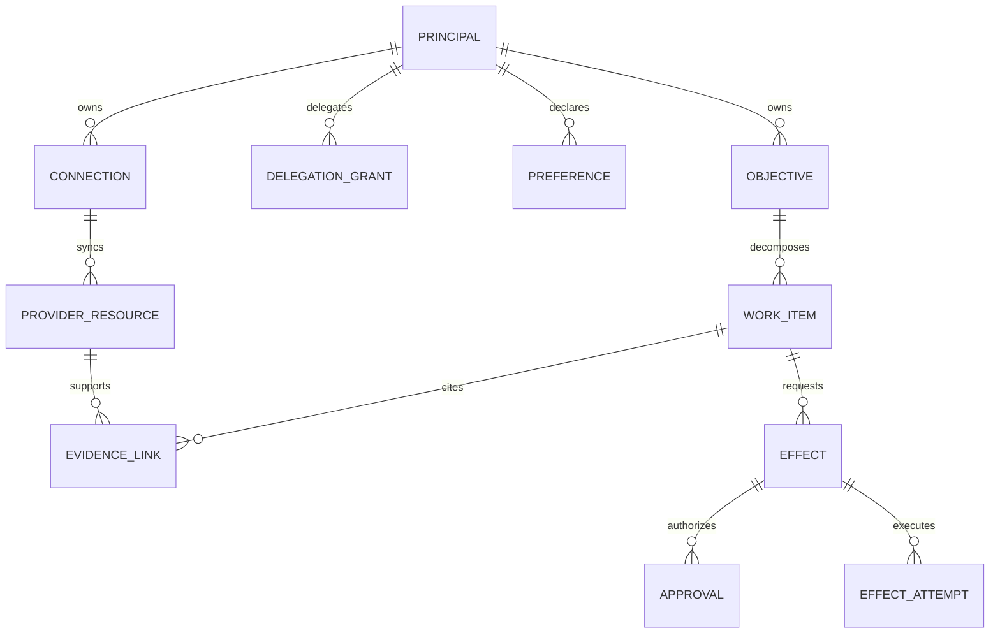
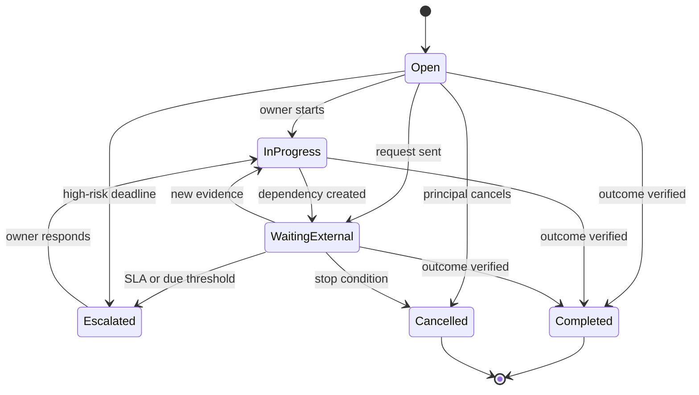

# State, Memory, Priorities, and Follow-Up

Executive operations span minutes, months, and multiple systems of record. A chat transcript is not an adequate state model. The system needs explicit facts, preferences, objectives, provider cursors, approvals, and effect outcomes—each with provenance, scope, freshness, and deletion behavior.

## State hierarchy

Use the most authoritative available source for each decision:

| State class | Examples | Authority | Rules |
|---|---|---|---|
| Provider record | Message, event, task, ACL, booking | Provider API | Fetch/revalidate versions before effects |
| Effect record | Proposal, approval, attempt, receipt, verification | Effect ledger | Append transitions; never infer completion from model text |
| Objective | “Get Q3 review scheduled,” owner, due, blockers | Objective ledger | Durable until closed/cancelled; evidence-linked |
| Explicit preference | Home airport, working hours, preferred meeting length | User/administrator | Scoped, reviewable, expiring where appropriate |
| Derived observation | “Usually avoids Friday evening flights” | Inference | Advisory only; show provenance/confidence; never authorize spend |
| Summary/embedding | Thread summary, meeting synthesis | Generated cache | Regenerate on source/version change; not authoritative |
| Session context | Current request and pending proposal | Interaction runtime | Short-lived; bind to principal and account |

Memory should improve recall, not manufacture authority.

## A practical data model



### Objective record

```yaml
objective_id: obj_01K5V3T8N2P4Q6R7S9W1X3Y5Z7
tenant_id: tenant_a
principal_id: principal_exec
title: "Schedule Q3 operating review"
desired_outcome: "Confirmed 60-minute meeting with required leaders"
owner: principal_ea
state: waiting_external
priority:
  band: P1
  rationale_codes: [executive_commitment, deadline_soon]
  last_reviewed_at: 2026-08-31T07:00:00Z
due:
  value: 2026-09-05
  timezone: Asia/Kolkata
dependencies:
  - type: email_thread
    resource_ref: google:thread:abc
next_check_at: 2026-09-01T04:00:00Z
escalation_policy: executive-commitment-v3
stop_conditions: [meeting_confirmed, principal_cancelled]
```

The record is small on purpose. Store pointers and digests rather than copying entire mail threads or documents.

## Context compilation

Build context just in time for one decision:

1. resolve principal, actor, tenant, connection, and capability;
2. load the objective and current work item;
3. retrieve only resources the current principal can access;
4. verify resource versions/freshness and mark stale or partial sources;
5. include explicit preferences separately from inferred observations;
6. render untrusted content in data-delimited form;
7. include prior completed effects, provider receipts, open blockers, and approval status;
8. provide business timezone and temporal anchor explicitly; and
9. enforce a context budget and record provenance for every source.

```json
{
  "decision": "draft_reply",
  "identity": {"principal": "principal_exec", "connection": "conn_m365_work"},
  "time": {"now": "2026-08-31T11:30:00+05:30", "business_timezone": "Asia/Kolkata"},
  "objective": {"id": "obj_01K", "state": "waiting_external"},
  "facts": [
    {"source": "graph:message:immutable-id", "version": "etag-7", "observed_at": "2026-08-31T09:30:00Z", "trust": "untrusted_content"}
  ],
  "preferences": [
    {"key": "reply_tone", "value": "concise", "provenance": "user_explicit", "scope": "work_mail"}
  ],
  "completed_effects": [
    {"effect_id": "eff_12", "outcome": "confirmed", "provider_receipt": "graph:event:AAMkADk2YzY1"}
  ]
}
```

Do not dump an entire mailbox, drive, or transcript into a prompt. Besides cost and privacy, broad context makes cross-tenant and prompt-injection failures harder to control.

### Loss-aware selection

Context compilation is a controlled lossy transform. The compiler must classify every candidate item before omission:

| Class | Examples | Omission rule |
|---|---|---|
| Invariant | Principal/actor/tenant/account, authority ceiling, policy, approval digest | Never omit; fail closed if unavailable |
| Commit boundary | Confirmed/unknown effects, provider receipts, cancellation, idempotency key | Never omit from operational state; prompt may contain a compact reference only |
| Active clock | Approval/offer expiry, next check, cancellation window, deadline, lease, retry-after | Never omit; use absolute instant plus business timezone |
| Decision fact | Current participants, amount, recurrence scope, source version, ACL | Include if it can change the next permitted action; otherwise keep a typed reference |
| Supporting evidence | Earlier message, document span, itinerary alternative | May summarize with citations, trust label, and source-version coverage |
| Redundant prose | Repeated explanation, abandoned candidate, style discussion | Omit and record only when it may be needed for audit or user review |
| Prohibited content | Secrets, raw payment data, unrelated tenant data, hidden reasoning | Reject before compilation; do not list its value in an omission receipt |

The budget algorithm reserves space in that order. It cannot truncate invariants or effects to preserve conversational fluency. Each generated summary declares the source set and highest source version it covers, material disagreements, unresolved entities, and facts it did not preserve. If the compiler cannot fit all decision-critical facts, the next action is to fetch less, split the decision, or hand off—not to guess.

## Memory layers

Do not use “memory” as one undifferentiated vector store. The following is the canonical policy table; it defines all and only the seven supported lifetimes.

| Canonical lifetime | Use; reject | Retention and deletion | Poisoning controls | Evaluation controls |
|---|---|---|---|---|
| Turn/scratch memory | Use for one-call parsing, candidate entities, and temporary calculations. Reject secrets, effect proof, grants, and durable facts. | Discard after the call; retain only separately approved typed outputs. Erasure is immediate. | No direct persistence; untrusted spans are labeled; tool/account/recipient selection is constrained outside the model. | Assert zero post-call retrieval, zero secret capture, schema validity, and conservative ambiguity handling. |
| Working/run memory | Use for one bounded run's objective reference, evidence pointers, budgets, tool receipts, and pending proposal. Reject unrelated history and unverifiable reasoning. | Delete at terminal run plus short debug window; promote only validated typed records with provenance. | Compare-and-set run state, trusted-field allowlist, source/version labels, size/step limits, and no content-originated policy changes. | Crash/replay tests, stale-source tests, tool-result poisoning, budget exhaustion, and exact terminal-stop reason. |
| Session memory | Use for one authenticated interaction's clarified intent, selected connection, channel state, and unresolved proposal. Reject reuse after logout, principal/account switch, assurance expiry, or ambiguous approval. | Expire on idle/absolute TTL, logout, revocation, or account switch; user can clear it; derived caches follow deletion. | Session/principal/tenant binding, anti-replay token, dedicated approval objects, and no cross-session promotion without validation. | Session fixation/swap tests, cross-account canaries, expired-confirmation rejection, and deletion propagation checks. |
| Durable workflow/task memory | Use for objectives, work items, owners, blockers, clocks, stop conditions, approvals/effects references, and handoffs. Reject free-form chat as completion evidence. | Retain through outcome and configured business/audit window; cancel/delete derived content while preserving minimal required effect lineage. | Typed state machine, append-only transitions, idempotency, authority checks on every wake, source refresh, and single-owner leases. | Restart/provider-outage drills, duplicate wakeups, clock jumps, cancellation races, handoff recovery, and terminal/owned-manual-state SLO. |
| Domain knowledge memory | Use for versioned policy, directories, provider read models, travel/expense rules, and permission-filtered organizational knowledge. Reject stale copies as provider truth and data without ACL lineage. | Source-specific freshness/retention; invalidate on ACL/source/version change; full purge or tombstone on disconnect/deletion as policy requires. | Signed/approved policy publication, trusted-source allowlists, ACL-first retrieval, tenant partitioning, and source conflict visibility. | Staleness/ACL regression, poisoned document and directory entries, policy rollback, source disagreement, and full-resync correctness. |
| Long-term/preference memory | Use only for explicit, scoped convenience defaults with provenance, review date, and expiry. Reject inferred authority, consent, relationship sensitivity, budget, signature, or payment permission. | User-visible edit/delete; category-specific TTL and periodic review; deletion cascades to features, summaries, and retrieval indexes. | Explicit-write path, sensitive-category denylist, two-source or human confirmation where policy requires, anomaly/change-rate detection, and no untrusted-content promotion. | Preference-source attribution, poisoned-promotion attempts, stale/cross-context use, correction latency, and complete deletion tests. |
| Episodic/outcome memory | Use for selected completed outcomes, corrections, incidents, and verified lessons linked to source/effect evidence. Reject hidden reasoning, full mail/transcript archives, and unreviewed model conclusions. | Curate for a declared future purpose; expire or aggregate; retain minimal incident/effect evidence separately; honor source deletion where permitted. | Admission requires terminal verified outcome or reviewed incident, immutable provenance, sensitivity filter, and correction/rollback lineage. | Counterfactual retrieval, false-success exclusion, incident contamination, outcome drift, membership inference, and benefit-versus-privacy ablation. |

Retrieval indexes and summaries are derived access paths, not additional lifetimes. They inherit the source record's tenant, ACL, expiry, and deletion; a cache without that lineage is ineligible. Audit and effect ledgers are governed records, not personalization memory, and use separate access and retention policy.

The [canonical memory architecture](../../context-memory/memory-architecture.md) explains broader patterns. This agent adds two requirements: a preference never grants capability, and resource summaries are invalidated when provider versions or ACLs change.

## Priority is a policy-supported recommendation

The agent may propose priority using transparent signals:

- explicit executive or delegate instruction;
- committed deadline and lateness;
- external dependency or blocked person;
- consequence of delay;
- strategic project tag;
- relationship/role rules explicitly configured by the user;
- travel or meeting lead time; and
- waiting duration and previous follow-up attempts.

Avoid a single opaque “importance score.” Store a band, reason codes, and the input versions. Separate urgency from importance and confidence:

```text
priority_band = policy(explicit_priority, deadline, consequence, dependency, strategic_tag)
confidence     = evidence_completeness and identity resolution
```

A low-confidence high-consequence item should be escalated for review, not quietly deprioritized.

### Priority failure modes

- Overweighting senior-sounding senders enables social-engineering escalation.
- Reading emotional language as urgency biases toward manipulation.
- Treating unread as important floods the queue.
- Repeated automated follow-ups can amplify a mistaken objective.
- Cross-account signals can reveal private commitments or distort work priorities.

Mitigate with explicit policy signals, per-account partitions, human correction capture, duplicate detection, rate limits, and daily/weekly review surfaces.

## Task identity and deduplication

Tasks need provenance and stable identity across provider limitations:

```text
internal work_item_id
provider + tenant + account + list + provider_task_id
source_type + source_resource_id + source_version
normalized owner + due date/time semantics
dedupe fingerprint + human merge/split history
```

Do not deduplicate only by title. “Send board deck” may legitimately occur in several periods. Use the source commitment, owner, target outcome, temporal window, and relationship to an objective.

Provider semantics constrain normalization. Google Tasks' `due` field records a date and discards its time portion; the date is a visibility/scheduled date rather than a reliable deadline. Some assigned tasks cannot be modified like ordinary tasks. Microsoft To Do application permissions are not supported for task creation, and an item ID can change when moved between lists ([Google Tasks resource](https://developers.google.com/workspace/tasks/reference/rest/v1/tasks), [Microsoft To Do create task](https://learn.microsoft.com/en-us/graph/api/todotasklist-post-tasks?view=graph-rest-1.0)). Keep the internal ID stable and preserve provider-specific fields rather than pretending all task systems share one schema.

## Durable follow-up loop



Each wake-up is an evidence check, not permission to repeat the previous action:

1. lock the work item and load its last evaluated version;
2. refresh affected provider resources;
3. evaluate stop conditions and objective outcome;
4. update priority, due risk, and blockers;
5. propose the next action under current policy;
6. reuse prior authorization only if the exact grant permits it and facts remain within its bounds;
7. otherwise request a new approval; and
8. schedule the next check with a maximum attempts/time horizon.

### Follow-up policy example

```yaml
policy: external-email-follow-up-v2
initial_wait: P2D
subsequent_wait: P3D
maximum_automated_drafts: 2
maximum_sends_without_new_approval: 0
escalate_before_due: P1D
stop_on:
  - relevant_reply_received
  - objective_completed
  - principal_cancelled
  - thread_participants_changed
  - privacy_or_policy_hold
```

The default is to prepare another draft, not repeatedly email someone.

## Temporal correctness

- Store instants in UTC and original IANA timezone where business meaning depends on local time.
- Preserve date-only values separately from instants.
- Re-evaluate daylight-saving transitions, local holidays, and travel location at scheduling time.
- Never infer that “tomorrow morning” uses the server timezone.
- Store recurrence rules and instance identity; do not flatten recurring series into one event.
- Expire relative-time proposals quickly.

## Compaction and continuity

When model context is compacted, preserve operational facts:

- objective and work-item IDs;
- resolved identity, tenant, account, and capability;
- source resource IDs, versions, and freshness;
- completed effects and provider outcomes;
- pending effect/approval IDs and expiration;
- blockers, next check, retry budget, and stop conditions; and
- user corrections and explicit preferences relevant to the objective.

Discard redundant prose and speculative reasoning. Never reconstruct whether an email was sent or trip booked from a summary; load the effect ledger and provider state. See [compaction and continuity](../../context-memory/compaction-and-continuity.md).

Persist a loss-aware compaction receipt so a resumed worker can prove which state was preserved and what must be reloaded:

```yaml
receipt_version: context-receipt.v2
objective_id: obj_01K
source_event_high_watermark: 247
identity_binding:
  principal_id: principal_exec
  actor_id: principal_ea
  tenant_id: tenant_work
  connection_ids: [conn_m365_work]
version_pins:
  behavior_bundle: execops-bundle-2026-08-31.4
  objective_state: 18
  policy: calendar-policy:12
  context_compiler: ctx-exec-v8
  model_route: reasoning-route-v5
  provider_api: microsoft-graph-v1.0
approvals:
  - approval_id: apr_7
    effect_digest: sha256:345bf744aa566844490b32fe4f225311f594920993c58c04c5f3c9b39c03c79c
    expires_at: 2026-08-31T13:10:00Z
    status: active
active_clocks:
  - kind: next_check
    at: 2026-09-01T03:30:00Z
  - kind: approval_expiry
    at: 2026-08-31T13:10:00Z
pending_or_unknown_effects:
  - effect_id: eff_12
    generation: 1
    status: unknown
    provider_request_ref: graph-request:redacted
invariants:
  authority_ceiling: propose_only
  single_effect_owner: true
  provider_state_is_authoritative: true
invariant_hash: sha256:98da1f86f4bf75119caa29fe9382cb1489f914dda3d0df398c5605009ce7d554
omitted_item_references:
  - ref: graph:thread:abc
    covered_through_version: etag-7
    reason: summarized_supporting_evidence
next_safe_action:
  type: rehydrate_and_reconcile
  target_effect_id: eff_12
receipt_digest: sha256:22caab8bf1d32a83d725b2ea79c33f58862ef0138ace2fe1b860dfa15d21ea28
```

The receipt is a restart index, not state authority. The continuity validator reloads the identity/connection registry, grants and policy, objective/effect/approval/handoff ledgers, all active clocks, and provider resources referenced by the next decision. It recomputes the invariant hash, checks that the source event stream has no unprocessed entry above the watermark, reconciles every pending or unknown effect, and refetches omitted items if their summaries no longer cover the current version. Any mismatch downgrades to read/propose, blocks commit, and creates an owned recovery item.

### Restart and provider-switch protocol

On process restart, regional recovery, model failover, or model-provider switch:

1. verify the receipt signature/digest and deserialize only a supported receipt version;
2. authenticate the current principal/actor/session and resolve the bound tenant/accounts again;
3. load authoritative ledgers and replay durable events above the recorded watermark;
4. refresh provider resources, ACLs, directory identities, tokens/scopes, subscription health, and current policy;
5. reconcile provider state for every non-terminal effect before allowing any retry or new conflicting write;
6. reconstruct clocks from absolute instants, applying missed-deadline policy rather than replaying every elapsed timer;
7. compare behavior-bundle and component pins; a provider/model switch requires the target bundle's compatibility and safety gate;
8. compile fresh context and permit only the recorded next safe action or a more conservative one; and
9. emit a new receipt after the first validated transition.

Never resume from a vendor conversation token, serialized model object, transcript summary, or checkpoint alone. If authoritative state cannot be rehydrated, transfer to human review with the provider records and uncertainty; do not reconstruct success from prose.

## Privacy and deletion

Every stored preference, inference, summary, and retrieval chunk needs:

- tenant and principal ownership;
- source and creation method;
- purpose and allowed workflows;
- sensitivity classification;
- review/edit/delete controls;
- expiration or retention rule; and
- propagation behavior when a source or account is deleted.

Deletion is a state transition with downstream invalidation: remove retrieval chunks, summaries, cached features, and pending objectives that cannot operate without the deleted data, subject to narrow legal/audit retention.

## Production checklist

- [ ] Provider records, effects, objectives, preferences, and summaries have separate schemas.
- [ ] Every context fact includes tenant, source, version, freshness, and trust label.
- [ ] Explicit preferences are distinguishable from inferred observations.
- [ ] Memory cannot grant authority or override policy.
- [ ] Priority stores reason codes and supports human correction.
- [ ] Internal task identity survives provider ID changes and list moves.
- [ ] Follow-up has explicit owner, outcome, stop conditions, next check, and attempt budget.
- [ ] Context compaction preserves IDs and outcomes, not hidden reasoning.
- [ ] Date-only, instant, timezone, and recurrence semantics remain distinct.
- [ ] ACL changes and deletion invalidate derived data.
- [ ] The canonical policy table contains exactly seven lifetimes with use/reject, retention/deletion, poisoning, and evaluation controls.
- [ ] Compaction receipts carry version pins, approvals, clocks, effect uncertainty, invariant hash, omissions, and a next safe action.
- [ ] Restart and provider/model switch rehydrate authoritative state before any write resumes.

## Related guides

- [Inbox, calendar, tasks, and documents](05-inbox-calendar-tasks-and-documents.md)
- [Travel, meetings, and high-impact boundaries](06-travel-meetings-and-high-impact-boundaries.md)
- [Context engineering](../../context-memory/context-engineering.md)
