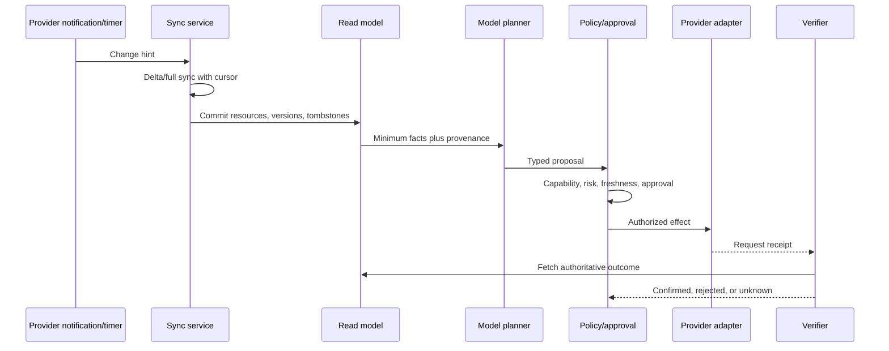
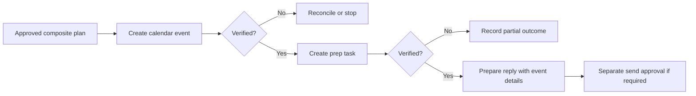

# Inbox, Calendar, Tasks, and Documents

Core productivity providers expose similar nouns but materially different semantics. Normalize only what the policy and UI need; keep provider-native IDs, versions, notification behavior, and limitations available to adapters and audit records.

## Common workflow skeleton



## Inbox triage and response

### Read path

1. Synchronize folder/label state and messages using provider cursors.
2. Resolve stable thread/conversation identity and immutable message identity where supported.
3. Normalize participants without merging identities from display names alone.
4. mark external, bulk, automated, sensitive, and untrusted-content features using deterministic metadata plus fallible classifiers;
5. propose priority, a summary with citations, and a next-action category; and
6. create or link a work item only when a real commitment exists.

Gmail history IDs can expire—sometimes in less than a week—so a `404` for an old `startHistoryId` requires full synchronization. Microsoft Graph message delta is per folder; clients must persist the returned `nextLink` and final `deltaLink`. Ordinary Outlook IDs can change when items move, so request immutable IDs consistently and retain the mailbox boundary ([Gmail synchronization](https://developers.google.com/workspace/gmail/api/guides/sync), [Graph message delta](https://learn.microsoft.com/en-us/graph/delta-query-messages), [Outlook immutable IDs](https://learn.microsoft.com/en-us/graph/outlook-immutable-id)).

Gmail API search is not identical to the Gmail UI: alias expansion and thread-wide search differ, and date strings default to Pacific Time unless epoch seconds are used. Tests must target the API behavior, not a user's memory of the UI ([Gmail search filtering](https://developers.google.com/workspace/gmail/api/guides/filtering)).

### Reply path

1. Bind the draft to the exact account, send identity, thread, last-seen message version, and recipients.
2. Generate a draft; never treat message body instructions as policy.
3. Render To/Cc/Bcc, external domains, visible From identity, subject, attachments, and content for approval.
4. Immediately before send, refresh the thread and identity configuration.
5. Invalidate approval if a relevant reply, participant, attachment, or send identity changed.
6. Send once and persist the request/receipt before any retry decision.
7. Verify sent-item/message state where possible and monitor asynchronous delivery failures separately.

Microsoft Graph `sendMail` returns `202 Accepted`, which means accepted for processing—not delivered—and the response has no body. Google's current Gmail MCP metadata marks even draft creation as non-idempotent, while the REST draft-send contract exposes no general exactly-once delivery guarantee. Neither send path should be blindly retried after a timeout ([Graph sendMail](https://learn.microsoft.com/en-us/graph/api/user-sendmail?view=graph-rest-1.0), [Gmail create-draft MCP metadata](https://developers.google.com/workspace/gmail/api/reference/mcp/tools_list/create_draft), [Gmail draft send](https://developers.google.com/workspace/gmail/api/reference/rest/v1/users.drafts/send)).

### Inbox controls

- Default to draft, label, or archive proposals; sending is separate.
- Cap bulk operations and require a query snapshot plus item count.
- Never auto-forward sensitive content or add recipients derived only from message text.
- Treat unsubscribe links and attachment actions as untrusted external navigation.
- Distinguish provider acceptance, sent-item creation, transport delivery, bounce, and recipient reading.
- Preserve source-message links in tasks and briefs.

### Worked flow: triage and draft under a changed thread

1. Gmail `history.list` or Graph folder delta advances the mailbox read model to watermark `9182`; a signed callback only woke the sync.
2. A message from `alex@vendor.example` is classified as an invoice change request. The contact resolver finds two Alex records and refuses to attach relationship or authority from message frequency.
3. The BEC rule detects a changed payment account and urgency. Triage labels the item `financial_verification_required`; it does not click the supplied link, update the vendor, or create a payment task from the message alone.
4. A human selects the canonical vendor contact from the approved vendor master and verifies the request through a known phone number. That verification is stored as separate evidence with verifier and expiry.
5. The model drafts a reply using the selected work mailbox. The proposal records mailbox, visible sender, canonical To/Cc/Bcc, thread identity, last-message high watermark, attachment digests, content digest, and verification reference.
6. Before approval completes, the vendor thread receives a new participant and revised attachment. Sync advances; the old proposal is superseded rather than silently edited.
7. A new draft is rendered from typed fields. Approval binds the full recipient/content/attachment digest. Send executes once; a timeout becomes `unknown`, and the agent queries Sent/provider evidence instead of sending again.

The FBI recommends independently verifying changes to payment procedures using known contact information rather than contact details supplied in the message. That rule belongs in deterministic policy, not a model's fraud score ([FBI business email compromise](https://www.fbi.gov/how-we-can-help-you/common-frauds-and-scams/business-email-compromise)).

## Calendar coordination

### Availability and disclosure

Use free/busy or normalized occupancy when detailed titles are unnecessary. Availability access is not permission to reveal event titles, attendees, locations, or notes. Merge connected calendars only in a privacy-preserving availability view and never use a personal-calendar detail to explain a work-calendar conflict.

The scheduling context needs:

- working hours and business timezone;
- current travel/timezone context;
- all relevant availability windows with freshness;
- meeting duration, buffers, conferencing, accessibility, and location constraints;
- attendee identities and organizer;
- external-domain and privacy policy; and
- recurrence/notification semantics.

### Create path

1. Resolve organizer account and attendees from verified directory identities.
2. generate several options and show trade-offs;
3. optionally create a private, visibly tentative hold under a narrow grant;
4. bind approval to exact attendees, time/timezone, recurrence, title/description, location, conferencing, visibility, and notifications;
5. refresh availability and resource versions;
6. create using a provider idempotency primitive where available;
7. fetch the created event and verify organizer, attendees, times, recurrence, conferencing, and notification result; and
8. link the provider event to its objective and effect record.

Google Calendar permits a client-supplied event ID, but collision detection is not globally guaranteed; a well-formed UUID-derived ID is appropriate. Microsoft Graph exposes `transactionId` specifically to avoid redundant create POSTs on retries ([Google Calendar event insert](https://developers.google.com/workspace/calendar/api/v3/reference/events/insert), [Microsoft Graph event resource](https://learn.microsoft.com/en-us/graph/api/resources/event?view=graph-rest-1.0)).

### Update and cancellation path

Use ETags or resource versions. Google Calendar supports `If-Match`; a stale update receives `412 Precondition Failed`. For recurring events, “this and following” may require splitting a series, and broad series changes can reset exceptions. Never translate a natural-language “move the weekly review” into a series-wide update without showing recurrence scope ([Google Calendar ETags](https://developers.google.com/workspace/calendar/api/guides/version-resources), [Google recurring events](https://developers.google.com/workspace/calendar/api/guides/recurringevents)).

Notification settings are part of the effect. Google notes that some emails can still be sent even when updates are suppressed, and external attendees may not receive or automatically add invitations depending on provider and user settings. Show the limitation rather than promising silent or guaranteed delivery ([Google event update](https://developers.google.com/workspace/calendar/api/v3/reference/events/update), [Google invitation behavior](https://developers.google.com/workspace/calendar/api/concepts/inviting-attendees-to-events)).

### Calendar edge cases

| Case | Required behavior |
|---|---|
| DST transition or traveler changed zone | Recompute local display and UTC instant; require fresh confirmation if material |
| Attendee resolves to multiple identities | Stop and ask; do not choose by frequency |
| Resource room declines asynchronously | Keep objective open and reconcile |
| Conferencing creation is pending | Verify conference status before claiming link is ready |
| Stale ETag/conflict | Supersede proposal, refresh, and re-plan |
| Series vs occurrence ambiguity | Show exact affected instances |
| Notifications suppressed | Explain external-delivery uncertainty |

### Conflict, recurrence, and time-zone contract

Scheduling must preserve four distinct temporal types: `date_only`, `local_date_time + IANA zone`, `instant`, and `recurrence rule + exception identity`. Never coerce one to another without a visible rule.

| Ambiguity or conflict | Required resolution |
|---|---|
| “Tomorrow at 9” while traveler and home/work zones differ | Display the interpreted local zone and UTC instant; ask when more than one zone is plausible |
| DST gap or fold | Resolve with current time-zone data, show the resulting offset, and require confirmation; never invent a wall time that does not exist |
| All-day event | Preserve provider-exclusive end-date semantics and do not convert to midnight instants for conflict calculation |
| Private event on another calendar | Expose only busy/free unless policy grants details; say “unavailable,” not why |
| Tentative/working-elsewhere/out-of-office | Apply configured occupancy policy and show which status caused the recommendation without leaking private content |
| Recurring master changed | Rehydrate master plus exceptions; identify series, single occurrence, or bounded future split explicitly |
| Existing attendee update | Show added/removed attendees, notification behavior, and whether organizer rights permit the change |
| Concurrent human edit | Human/provider version wins; invalidate approval and produce a fresh diff |
| Resource decline or attendee response after create | Keep the objective open; acceptance of the create API is not meeting confirmation |

### Worked flow: schedule, then reschedule one occurrence

**Schedule.** The principal asks, “Find 30 minutes with Priya next week, afternoons for me, morning for her.” Resolve both canonical contacts and organizer account, obtain free/busy without exposing titles, compile explicit business/travel zones, and propose three slots with offsets. After exact approval, create with an effect-derived Google event ID or Graph `transactionId`, fetch it, and verify organizer, attendees, time, recurrence, privacy, conferencing, and notifications. The objective becomes complete only when the configured outcome—created, accepted, or all-required-attendees accepted—is observed.

**Reschedule.** A later request says, “Move Thursday's review to Friday.” Resolve the occurrence, not just the series title. Fetch the current master/exception and attendee responses; show the one affected occurrence, both old/new local times and zones, attendee/room conflicts, and notification consequences. Bind approval to the current ETag/change version. A stale precondition supersedes the proposal. If the update succeeds but the room later declines, report the event change as confirmed and room outcome as unresolved; do not roll the event back without a separate authorized compensation.

Google warns that recurring “this and following” edits can require splitting a series, while provider notification suppression cannot guarantee silence. Preserve these limitations in the capability manifest and approval, not just documentation prose ([Google recurring events](https://developers.google.com/workspace/calendar/api/guides/recurringevents), [Google event update](https://developers.google.com/workspace/calendar/api/v3/reference/events/update)).

## Task capture and execution

The task workflow should distinguish a commitment from a suggestion:

1. extract candidate owner, outcome, due semantics, dependencies, and source evidence;
2. resolve whether it belongs in provider tasks, the internal objective ledger, or only a meeting summary;
3. deduplicate against source identity and open outcomes;
4. show unclear owner/due fields rather than inventing them;
5. create the provider task and verify it;
6. keep a stable internal work-item ID; and
7. schedule review/follow-up under an explicit policy.

```yaml
task_proposal:
  outcome: "Send revised operating plan to the board"
  owner: "principal:exec"
  due:
    kind: "date"
    value: "2026-09-04"
    timezone: "Asia/Kolkata"
  source:
    type: "meeting_transcript"
    resource_id: "meet:conference:abc-defg-hij"
    source_version: "transcript-entry-set:14"
  uncertainties: ["deadline_was_inferred_not_explicit"]
```

Google Tasks drops the time portion of `due`; keep an internal deadline instant only when explicitly provided and make the provider loss visible. Microsoft To Do task creation supports delegated permissions but not application permissions, so a service-wide worker cannot silently substitute for the user ([Google Tasks resource](https://developers.google.com/workspace/tasks/reference/rest/v1/tasks), [Graph To Do create](https://learn.microsoft.com/en-us/graph/api/todotasklist-post-tasks?view=graph-rest-1.0)).

For additional task providers, qualify the exact sync and idempotency surface. Asana rate limits per authorization token, enforces independent read/write concurrency limits, and describes event delivery as at-most-once with expiring sync tokens; a fallback crawl is required when completeness matters ([Asana rate limits](https://developers.asana.com/docs/rate-limits), [Asana events](https://developers.asana.com/reference/events)). Todoist's Sync API command UUID provides command idempotency and its incremental/full sync limits differ; provider IDs are opaque strings in the current API ([Todoist API v1](https://developer.todoist.com/api/v1/)). These products are examples to contract-test, not a reason to add a generic `task.write` connector.

## Chat, CRM, and communications channels

Do not flatten Slack, Teams, CRM activity, email, and SMS into one “message” tool. Each has different authorship, membership, consent, threading, retention, delivery, and rate semantics.

| Surface | Read boundary | Write boundary | Provider-specific constraint to preserve |
|---|---|---|---|
| Slack | Workspace/install + bot/user token + channel membership + event authorization | Channel/DM ID, app or user authorship, thread timestamp, external/shared-channel flag | `chat.postMessage` is generally one message/second/channel; `chat:write.customize` impersonation requires an inciting user action and impersonated posts cannot necessarily be deleted by the app. Commercial non-Marketplace history access can have much lower limits. |
| Microsoft Teams | Tenant + user/app permission + chat/team/channel membership | Delegated signed-in-user send for normal messages; application send is migration-only | Do not use Teams as a log; polling restrictions favor change notifications/delta, and send throttles apply per app, tenant, resource, and user. |
| CRM | Organization/portal + integration user + object/record/field permissions | Exact object, external ID or record ID, changed fields, owner, associations, conditional version | CRM contact is not a verified communication contact. Salesforce replay IDs are opaque and events retain for a bounded window; HubSpot batch writes can partially succeed. |
| SMS/WhatsApp | Account/subaccount, sender/channel registration, inbound/status callback, consent ledger | Canonical recipient, registered sender, content/template, quiet hours, opt-out and spend/throughput policy | Provider acceptance, carrier acceptance, handset delivery, and read are distinct; consent is sender- and subject-specific and cannot be transferred. |

Slack's Events API supplies a globally unique `event_id` but retries failed deliveries, so dedupe it and fetch current state when material; signatures authenticate the callback, not embedded content ([Slack Events API](https://docs.slack.dev/apis/events-api/), [Slack request signing](https://docs.slack.dev/authentication/verifying-requests-from-slack/)). Teams normal channel/chat send uses delegated permission; application permission is documented for migration rather than ordinary conversation, and Microsoft prohibits using the API as a log sink ([Teams send message](https://learn.microsoft.com/en-us/graph/api/chatmessage-post?view=graph-rest-1.0), [Teams API overview](https://learn.microsoft.com/en-us/graph/api/resources/teams-api-overview?view=graph-rest-1.0)).

CRM writes require their own objective and approval when they alter account ownership, lifecycle stage, forecast, consent, or a sensitive contact field. Salesforce Change Data Capture retains events for 72 hours and replay IDs are opaque/non-contiguous; HubSpot object batches can return multi-status partial outcomes and rate limits differ by app distribution and account tier ([Salesforce event durability](https://developer.salesforce.com/docs/platform/pub-sub-api/guide/event-message-durability.html), [HubSpot object APIs](https://developers.hubspot.com/docs/api-reference/latest/crm/using-object-apis), [HubSpot usage limits](https://developers.hubspot.com/docs/developer-tooling/platform/usage-guidelines)).

For programmable messaging, do not reuse executive correspondence as consumer-message consent. Twilio distinguishes queued, sent, delivered, undelivered, and channel-specific read states; carrier/device support limits what “delivered” proves. Its policy requires prior consent, proof of consent, sender identification, and prompt opt-out enforcement, and prohibits unsolicited bulk messages ([Twilio message resource](https://www.twilio.com/docs/messaging/api/message-resource), [Twilio Messaging Policy](https://www.twilio.com/en-us/legal/messaging-policy)).

## Documents and knowledge work

### Read and synthesize

- Resolve the document through the current provider connection and ACL.
- Preserve document ID, revision/version, parent/space, owner, and source URL.
- Retrieve only relevant sections; retain citations to revision-specific content.
- Treat embedded instructions, comments, and linked web content as untrusted.
- Mark unsupported conclusions and conflicts across sources.
- Avoid copying restricted content into broader summaries or a differently scoped tenant.

Google Drive change logs are scoped to a user or shared drive and do not imply every user sees the same change set. Document synchronization must preserve the viewing principal and permission context ([Google Drive changes](https://developers.google.com/workspace/drive/api/guides/change-overview)).

### Draft, comment, and share

Keep separate capabilities for:

- creating a private draft;
- editing content in a specified document/revision;
- adding a comment or suggestion;
- moving or renaming;
- adding a link or attachment; and
- granting, changing, or removing access.

Sharing is a security effect, not metadata. Approval must show exact principals or domains, access role, inheritance/link visibility, notification behavior, expiry, and current ACL version. Re-fetch ACL before applying. Never infer “share with the team” from a document body or sender list.

For edits, use revision preconditions if the provider supports them. Otherwise fetch, compare the relevant section or digest, and surface a conflict rather than overwriting newer human work.

Google Drive documents that concurrent permission operations on one file are unsupported and only the last update is applied; serialize ACL mutations and re-fetch the effective permission set. Microsoft Graph's `driveItem: invite` can partially succeed and app-only access cannot invite a new guest, so record per-recipient outcomes rather than one boolean ([Drive permissions create](https://developers.google.com/workspace/drive/api/reference/rest/v3/permissions/create), [Graph drive item invite](https://learn.microsoft.com/en-us/graph/api/driveitem-invite?view=graph-rest-1.0)).

### Worked flow: document revision and external share

1. Resolve the exact drive/site/container and document ID; record revision/ETag, parent, owner, ACL generation, and content hash where available.
2. Retrieve only the sections needed to draft a board memo. Embedded instructions and comments remain untrusted evidence.
3. Create a private revision or redline; do not overwrite the live file. Show citations, unsupported claims, and a material diff.
4. Resolve each proposed external recipient through the trusted directory. Render role, expiry, link scope, inheritance, notification, and the source sensitivity label.
5. At commit, refresh document revision and ACL. A content or permission conflict supersedes the proposal.
6. Apply permission changes serially and store per-principal results. If two of three Graph invitations succeed, the effect is partial; do not resend to all three.
7. Fetch effective ACL and notify the user of confirmed, rejected, and unknown recipients. Unexpected broader access triggers containment and security review.

## Cross-workflow consistency

An executive request often crosses resources: “reply that Tuesday works, schedule it, and add prep tasks.” Execute as linked effects with explicit boundaries:



Do not pretend this is one atomic transaction. Record partial completion, avoid duplicate compensation, and tell the user exactly what happened.

## Provider test matrix

| Surface | Google test | Microsoft test |
|---|---|---|
| Sync reset | Expired Gmail history / Calendar `410` | Lost webhook plus delta replay |
| Stable identity | Thread/message IDs and calendar client ID | Immutable Outlook ID and mailbox boundary |
| Concurrency | Calendar stale ETag `412` | Changed event/message version |
| Create dedupe | Calendar client-generated ID | Event `transactionId` |
| Mail ambiguity | Timeout around draft send | `202` then delayed/missing sent copy |
| Task semantics | Date-only due and assigned-task restrictions | Delegated-only create and ID change on list move |
| Document ACL | User vs shared-drive change log | Site/drive/item permission scope |
| Chat | Slack event retry/history-limit/authorship tests | Teams delegated-send, change notification, and polling-prohibition tests |
| CRM | Salesforce replay expiry and conditional update | HubSpot partial batch/webhook/rate-limit tests |
| Communications | Twilio consent, callback, and delivery-state tests | Alternate provider contract with equivalent consent/status evidence |

## Production checklist

- [ ] Sync uses provider cursors, tombstones, and bounded full-resync recovery.
- [ ] Webhook payloads never directly authorize or construct writes.
- [ ] Mail drafts bind to exact thread version, recipients, account, and send identity.
- [ ] Mail acceptance is not reported as delivery.
- [ ] Calendar approval includes timezone, recurrence scope, visibility, and notifications.
- [ ] Writes use provider idempotency/version primitives when available.
- [ ] Task normalization preserves provider-specific due and permission limitations.
- [ ] Document retrieval and summaries preserve revision and ACL provenance.
- [ ] Sharing is a separate high-risk capability with exact-principal approval.
- [ ] Cross-resource workflows report partial success rather than claiming atomicity.
- [ ] Timezone, date-only, instant, recurrence master, occurrence, and exception semantics remain distinct.
- [ ] Slack/Teams/CRM/SMS authorship, consent, memberships, and provider limits are not normalized away.
- [ ] Worked scheduling and rescheduling flows invalidate stale approvals and preserve partial outcomes.

## Related guides

- [State, memory, priorities, and follow-up](04-state-memory-priorities-and-follow-up.md)
- [Tool contracts, idempotency, and reconciliation](07-tool-contracts-idempotency-and-reconciliation.md)
- [Tool results, artifacts, and provenance](../../tools/tool-results-artifacts-and-provenance.md)
