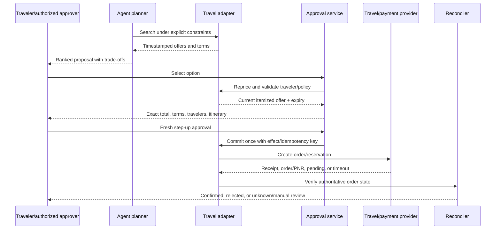
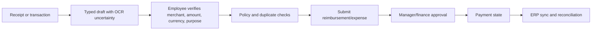

# Travel, Meetings, and High-Impact Boundaries

Travel booking and meeting capture combine private data, third-party terms, external communications, and sometimes regulated payment or consent. They should use the same proposal–policy–approval–commit–verify architecture as email and calendar, with stricter freshness and authority boundaries.

## Travel operating boundary

Split travel into four capabilities:

| Capability | Examples | Default autonomy |
|---|---|---|
| Research | Search routes, compare policies, summarize options | Read-only; cite retrieval time and source |
| Itinerary proposal | Rank options against explicit preferences and constraints | Proposal only |
| Reservation/booking | Create passenger/order/PNR and accept terms | Fresh, itemized approval; provider-specific commit |
| Post-booking operations | Monitor changes, propose rebooking/cancellation, update calendar | Read/notify automatically; changes require policy/approval |

A good system can automate most research and preparation without owning purchasing authority.

## Travel profile and sensitive data

Keep a dedicated, encrypted travel profile outside model prompts. It may reference:

- legal traveler name and verified traveler identity;
- loyalty program identifiers;
- known traveler/redress references;
- passport or visa document references and expiry metadata;
- accessibility and assistance requirements;
- explicit seat, cabin, airline, hotel, and ground-transport preferences;
- employer travel-policy attributes; and
- provider payment token reference.

The model receives only the minimum derived constraints needed for the current comparison. It must never see raw card numbers, card security codes, passwords, MFA secrets, or full identity-document images. PCI SSC states that sensitive authentication data such as card verification codes must not be stored after authorization even if encrypted ([PCI SSC FAQ 1533](https://www.pcisecuritystandards.org/faqs/1533/)). Use a payment-provider-hosted surface, virtual card, or tokenized corporate travel provider.

Health, accessibility, citizenship, and identity-document information require especially narrow purpose, access, logging, and retention controls. Do not infer these attributes from mail or documents and silently promote them into a reusable profile.

## Search, price, and availability are snapshots

Every option should include:

- provider and offer/quote identifier;
- exact itinerary, local dates/times, operating and marketing carriers;
- traveler count and identities;
- cabin/fare family, baggage, seat and change restrictions;
- base price, taxes, fees, currency, and exchange-rate basis;
- cancellation/refund and ticketing deadlines;
- retrieved and expires timestamps; and
- whether availability and price were revalidated.

Never phrase a search result as booked, held, guaranteed, or even currently available unless the provider contract supports that state.

## Booking workflow

Amadeus' documented flight flow illustrates an important general pattern: search, price confirmation, order creation, and order management are separate operations, and ticketing may involve additional commercial arrangements. Other travel suppliers differ, so the adapter must implement the actual contract rather than a universal “book” tool ([Amadeus API guides](https://developers.amadeus.com/self-service/apis-docs/guides/developer-guides/), [Amadeus FAQ](https://admin.developers.amadeus.com/self-service/apis-docs/guides/developer-guides/faq/)).

Duffel is another qualified-example candidate, not an endorsement. Its current v2 contract exposes offer expiry, order state, supplier freshness, and webhook events; order creation may return `200` or `202` while the full order is still pending. The provider explicitly warns not to retry an accepted create because a duplicate booking may result, and documents test cases for asynchronous failure ([Duffel response handling](https://duffel.com/docs/api/overview/response-handling), [Duffel orders](https://duffel.com/docs/api/orders), [Duffel integration testing](https://duffel.com/docs/api/overview/test-your-integration)). A production adapter must test the selected commercial account and payment mode rather than inherit these semantics across travel suppliers.

### Approval contents

Bind the approval to:

- traveler legal identities;
- complete segments and local/UTC times;
- supplier, fare/rate plan, cabin/room, and included services;
- total, currency, taxes, resort/carrier fees, and exchange-rate basis;
- change, cancellation, no-show, refund, and ticketing terms;
- loyalty use and corporate-policy exception;
- payment-token reference—not credentials;
- traveler contact information shared with suppliers;
- offer identifier/version and expiration; and
- maximum acceptable price drift, normally zero for unattended commit.

Reprice immediately before commit. Any material change supersedes the approval. Never let the agent accept a more expensive, non-refundable, or different itinerary because it is “close enough.”

### Booking outcome and recovery

Persist the provider request identifier and attempt before/with the commit boundary where possible. After a timeout:

1. query by client/idempotency key, order reference, traveler plus itinerary, or provider request ID;
2. check provider account/order history;
3. classify as confirmed, rejected, or still unknown;
4. retry only when the provider contract proves the first attempt could not commit or a safe idempotency key guarantees dedupe; and
5. route unresolved financial ambiguity to a human.

Do not create a second booking as “recovery.” Duplicate tickets can be costly and difficult to unwind.

### Post-booking follow-up

Monitor schedule, terminal, seat, ticketing, cancellation windows, and required documents using provider-authoritative state. Notify automatically; draft rebooking/cancellation options. Any change that alters price, route, traveler, contractual terms, or refund requires fresh approval. Calendar updates should cite the booking/order version and remain separate effects.

### Worked flow: book, observe uncertainty, then cancel

1. The trip record names two travelers and corporate policy. Search returns six offers with provider IDs, expiry, exact local/UTC segments, operating carrier, baggage, total/currency, and fare rules.
2. The model ranks options but does not reinterpret a red-eye prohibition or infer traveler accessibility needs. The user selects one offer.
3. The adapter reprices immediately before approval. Approval shows traveler legal identities, offer expiry, full price/fees, refund/change rules, payment-token reference, ticketing deadline, supplier/agency, and maximum price drift of zero.
4. Commit returns an asynchronous accepted response. Persist `unknown/pending`; block a second booking; monitor the provider event stream and order list using the original offer/client correlation.
5. The provider later confirms one order and ticket state. Only then mark booking confirmed and create a separate calendar effect.
6. The user asks to cancel. Fetch current `available_actions`, ticket/void window, cancellation quote, net refund, credits, and deadline. If supplier self-service cannot cancel after ticketing, prepare a human/TMC handoff rather than call an invented endpoint.
7. Fresh approval binds the exact booking, travelers, net refund/credit, fees, expiration, and downstream calendar effects. Cancel once, then verify order/ticket/refund states separately. A confirmed cancellation with pending refund remains a partially complete objective.

## Expense operations

An executive agent may assemble an expense packet, but accounting classification, approval, payment, and ERP posting remain distinct controlled states.

Canonical expense state must preserve employee, business entity, provider transaction/reimbursement/receipt IDs, original and converted amount/currency, transaction/accounting dates, merchant identity, category and policy version, receipt revision/OCR provenance, approvers, payment trace, and ERP sync state. Do not infer business purpose, attendees, allocation, tax treatment, or reimbursability from a receipt alone.

Ramp's current developer API is a useful qualification example: reimbursement state and accounting-sync state are parallel; receipt and reimbursement uploads expose write-specific scopes, and receipt upload accepts an idempotency key. OAuth scope, business/account identity, employee authority, and approval policy still need local enforcement ([Ramp reimbursements](https://docs.ramp.com/developer-api/v1/reimbursements), [Ramp reimbursement API](https://docs.ramp.com/developer-api/v1/api/reimbursements), [Ramp authorization](https://docs.ramp.com/developer-api/v1/authorization/scopes)). Its default API limit and 60-second timeout are documented separately and must be load-tested for the target integration ([Ramp rate limits](https://docs.ramp.com/developer-api/v1/rate-limiting)).

### Worked flow: receipt to reimbursable draft

1. The employee explicitly selects a receipt and target expense account. Malware scanning and file validation run before OCR; the model sees only required fields.
2. OCR proposes merchant, date, amount, tax, currency, and line items with field-level confidence and source coordinates. It does not create a relationship, business purpose, or attendee list.
3. Deterministic matching searches existing card transactions/reimbursements by provider IDs, amount/currency/date window, and receipt digest; uncertain duplicates are shown, not auto-merged.
4. The employee corrects the draft and supplies purpose/cost center. Policy identifies missing evidence and any approver conflict.
5. Upload/submit uses the same idempotency key on safe retry and verifies the returned provider object. If the response is unknown and no documented dedupe primitive applies, reconcile by digest/employee/time window before retry.
6. The agent monitors approval, reimbursement/payment, and ERP-sync states without approving on behalf of the employee or finance. Rejection creates an editable draft; payment failure creates a finance handoff with provider trace, never a second reimbursement.

No agent may approve its own expense, alter policy to make an expense compliant, split amounts to avoid a threshold, or change bank/payment details. Those operations require the finance system's separation of duties and BEC verification.

## Meeting lifecycle

### Preparation

Build a brief from permission-checked sources:

- verified participant identities and roles;
- objective, agenda, prior decisions, open actions, and conflicts;
- source citations with revisions and freshness;
- sensitive-content labels and distribution constraints; and
- explicit unknowns or inconsistent records.

Do not infer private relationship history or expose one attendee's restricted material to another.

### Join, record, and transcribe

Recording and transcription are not passive read operations. They affect participant consent, notice, retention, discovery, and organizational policy. The agent should not join or activate recording based on an email instruction, calendar description, default preference, or model judgment.

Require:

- organization and meeting policy allow the operation;
- the principal has the provider role to initiate it;
- required notices/consent are obtained through the provider or approved process;
- participants, external guests, minors, jurisdiction, and sensitive-meeting restrictions are addressed;
- storage location, access, retention, and deletion are known; and
- a human initiates or freshly approves the action at meeting time.

Microsoft Teams supports explicit recording-consent policy and stores artifacts in OneDrive/SharePoint under provider permissions. Google Meet transcripts and recordings are separate artifacts; transcript entries exposed through the API can be deleted after 30 days and may not match later edits in the generated Google Docs transcript ([Teams recording](https://learn.microsoft.com/en-us/microsoftteams/meeting-recording), [Teams recording and transcription overview](https://learn.microsoft.com/en-us/microsoftteams/recording-transcription-overview), [Google Meet artifacts](https://developers.google.com/workspace/meet/api/guides/artifacts)).

The system must expose those lifecycle limitations instead of promising a permanent or verbatim record. Local laws and employment policies vary; obtain organization-specific legal review before enabling capture.

### From transcript to action

Treat transcript text as untrusted, noisy evidence—not a decision register.

1. ingest only after provider artifact readiness and access checks;
2. preserve meeting/artifact ID, participant information, timestamps, and retrieval version;
3. extract candidate decisions, commitments, owners, dates, and unresolved questions;
4. cite the relevant transcript span and mark uncertainty/attribution issues;
5. ask owners or the meeting principal to confirm consequential actions;
6. create tasks and follow-up drafts as separate effects; and
7. apply artifact retention and access changes to all derived summaries and retrieval indexes.

Speaker diarization errors, overlapping speech, jokes, hypotheticals, and edited transcripts make fully automatic task assignment unsafe.

## Document and e-signature boundary

Editing a document, sending an agreement for signature, and applying a legal signature are three different authorities. The agent may prepare a revision and, under exact approval, create/send a provider envelope or agreement. It must not apply the principal's signature, accept terms, choose an undisclosed signer-authentication method, or treat provider delivery as signature completion.

### Worked flow: approved document to human signature

1. Resolve the source document, template, drive/container, exact revision/contents hash, and current ACL. Complete legal/business review outside the agent where required.
2. Resolve each signer/recipient canonically; preserve role, routing order, email/identity, authentication method, access code delivery channel, and any witness/notary requirement. Never derive signers from document prose alone.
3. Build a provider draft. Approval renders document hash/title, sender or impersonated user, recipients/order, fields/tabs, reminders/expiry, authentication, disclosure/consumer-consent settings, and provider account/region.
4. Re-fetch the document and recipient identities. A new revision, recipient, field, or sender supersedes approval.
5. Create/send once with a transaction correlation where supported. On timeout, look up the envelope/agreement by that correlation or provider events; do not create a second request.
6. The human signs in the provider-hosted experience. The agent cannot click or call the signature action for them.
7. Webhooks wake reconciliation; fetch authoritative status and completed documents/certificate under current permissions. Distinguish sent, delivered, viewed, signed by some, completed, declined, expired, voided, and delivery failure.
8. If the wrong document or signer was sent, contain further access, void/correct through a separately approved effect where legally appropriate, notify owners, and preserve incident evidence.

DocuSign JWT impersonation requires both `signature` and `impersonation` consent for the represented user; its envelope `transactionId` can locate an asynchronously created envelope but is retained for a limited window. Connect notifications should use HMAC and failed deliveries have retry/replay handling ([DocuSign JWT consent](https://www.docusign.com/blog/developers/oauth-jwt-granting-consent), [DocuSign transaction ID](https://www.docusign.com/blog/developers/common-api-tasks-use-transactionid-to-find-the-envelope-you-created), [DocuSign Connect HMAC](https://www.docusign.com/blog/developers/manually-authenticating-hmac-signatures-docusign-connect-webhook-configurations)). Acrobat Sign differentiates `self`, `group`, and `account` OAuth scope modifiers, processes agreements asynchronously, recommends webhooks over polling, and can throttle by endpoint, user, document load, and service load ([Acrobat Sign OAuth/scopes](https://opensource.adobe.com/acrobat-sign/developer_guide/gstarted.html), [Acrobat Sign API usage](https://opensource.adobe.com/acrobat-sign/developer_guide/apiusage.html)). Qualify one provider and account plan explicitly; do not abstract these authority and lifecycle differences away.

## Consequence matrix

| Action | Reversible? | External visibility | Financial/legal/privacy impact | Required boundary |
|---|---:|---:|---:|---|
| Compare flight options | Yes | No | Sensitive profile use | Scoped read and provenance |
| Hold a fare/room | Sometimes | Supplier | Terms or temporary charge | Exact policy; usually approval |
| Book travel | Often costly to reverse | Supplier/traveler | Payment and contract | Fresh step-up approval and reconciliation |
| Cancel/refund | Sometimes irreversible | Supplier/traveler | Fees and lost entitlement | Show net refund and terms; approve |
| Prepare meeting brief | Yes | No until shared | Confidential data | ACL-filtered sources |
| Share agenda externally | Yes, but disclosure persists | Attendees | Confidentiality | Exact-recipient approval |
| Start recording/transcription | Cannot erase exposure | All participants | Consent, privacy, retention | Human-at-meeting control and policy |
| Create tasks from transcript | Usually reversible | Assignee/provider | Misattributed commitment | Owner confirmation or draft mode |
| Sign or accept legal terms | Often binding | Counterparty | Legal | Human-only or separately governed signing system |
| Submit expense draft | Reversible before approval | Finance system | Financial/private | Employee verification and idempotent provider write |
| Approve/pay expense | Sometimes irreversible | Employee/finance | Financial and separation of duties | Authorized finance approver; never the agent's own approval |
| Send e-sign envelope | Disclosure and legal workflow | Signers/provider | Legal/identity | Exact document/recipient approval; human signs in provider surface |

## Financial and legal red lines

The agent must not:

- request or store raw card security data;
- route payment details through chat, prompts, logs, or general tool arguments;
- split purchases to evade a limit;
- infer budget authority from role, title, or past purchases;
- accept materially changed terms without new approval;
- represent itself as a lawyer, travel agent of record, or authorized signer unless the organization has separately established that legal role;
- sign contracts, waivers, attestations, visa declarations, tax forms, or health declarations; or
- conceal that a delegate or service performed an operation.

PCI DSS v4.0.1 is the current PCI baseline; systems that can impact a cardholder-data environment can themselves be in scope even if they do not directly store card data ([PCI DSS v4.0.1 publication](https://blog.pcisecuritystandards.org/just-published-pci-dss-v4-0-1), [PCI SSC FAQ 1579](https://www.pcisecuritystandards.org/faqs/1579/)). Architecture and vendor scope need qualified compliance review.

## Failure matrix

| Failure | Safe behavior |
|---|---|
| Offer expires before approval | Reprice and issue a new approval object |
| Supplier returns timeout after commit | Reconcile; block duplicate booking |
| Traveler identity incomplete/mismatched | Stop before provider commit |
| Currency or fee changes | Supersede approval |
| Calendar update succeeds but booking fails | Report partial result and remove/update provisional calendar item only under policy |
| Transcript absent or still processing | Keep meeting follow-up pending; do not invent content |
| Transcript edited or deleted | Invalidate/mark derived summaries and retain only permitted audit metadata |
| Consent not established | Do not record or transcribe |
| Provider artifact ACL broadens unexpectedly | Contain sharing and alert security/owner |
| Expense OCR or duplicate match is uncertain | Keep draft, show evidence, require employee correction |
| Expense submit succeeds but response is lost | Reconcile provider object/idempotency key before any retry |
| E-sign send times out | Lookup by transaction/reference and provider events; never create a second envelope blindly |
| One signer declines or delivery fails | Preserve partial state; route correction/void decision to authorized human |

## Production checklist

- [ ] Travel research, proposal, booking, and post-book operations are separate capabilities.
- [ ] Offers carry provider IDs, terms, retrieval time, and expiration.
- [ ] Booking approval is itemized and invalidated by price, itinerary, traveler, or term drift.
- [ ] Payment collection is hosted/tokenized and outside model context.
- [ ] Unknown booking outcomes enter reconciliation, never blind retry.
- [ ] Meeting capture requires organization policy, consent/notice, role, storage, and retention checks.
- [ ] Transcripts are untrusted evidence with artifact/version provenance.
- [ ] Extracted decisions and tasks require human confirmation proportional to consequence.
- [ ] Derived meeting data follows source ACL and deletion changes.
- [ ] Legal, compliance, and supplier-specific boundaries are reviewed before production enablement.
- [ ] Expense drafting, submission, approval, payment, and ERP sync are distinct states with separation of duties.
- [ ] E-sign sending is separate from the human signature action and uses exact document/recipient/version binding.
- [ ] Travel cancellation verifies net refund/credit and supplier capability before a fresh approval.

## Related guides

- [Identity, authority, and approvals](03-identity-authority-and-approvals.md)
- [State, memory, priorities, and follow-up](04-state-memory-priorities-and-follow-up.md)
- [Security, privacy, tenancy, and audit](08-security-privacy-tenancy-and-audit.md)
