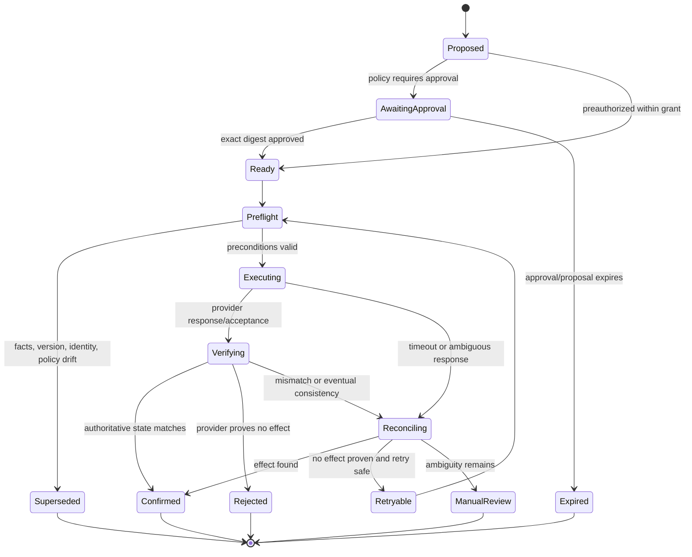

# Tool Contracts, Idempotency, and Reconciliation

Tool calls are the transaction boundary of an executive operations agent. The contract must make authority, freshness, side effects, retry safety, and observable outcome explicit. A schema-valid tool call is not necessarily authorized, current, or successful.

## Design rules

1. Expose business capabilities, not arbitrary provider HTTP access.
2. Separate reads, proposals, reversible writes, external effects, and high-impact effects.
3. Resolve identity and connection outside the model; do not accept free-form account IDs from prompts.
4. Require preconditions and proposal expiration for consequential writes.
5. Use a durable effect ID before the provider call.
6. Represent `unknown` as a first-class outcome.
7. Verify provider state after commits.
8. Make retry semantics capability- and provider-specific.
9. Return evidence and redacted receipts, not reassuring prose.
10. Version schemas and policy independently from prompts.
11. Reject calls whose operation-level capability manifest is absent, expired, or unqualified for the current tenant/account class.
12. Preserve partial success per target; never collapse a batch or compound workflow to one success boolean.

## Typed effect envelope

```json
{
  "schema_version": "effect.v1",
  "effect_id": "eff_01K5V3V1B3C5D7F9G1H3J5K7M9",
  "request_id": "req_01K5V3V4N6P8Q0R2S4W6X8Y0Z2",
  "objective_id": "obj_01K5V3V7B9C1D3F5G7H9J1K3M5",
  "principal_id": "principal_exec",
  "actor_id": "principal_ea",
  "service_actor_id": "svc_ops_prod_eu_3",
  "tenant_id": "tenant_a",
  "connection_id": "conn_google_exec",
  "capability": "calendar.event.create",
  "risk_class": "external_commitment",
  "target": {
    "provider": "google-calendar",
    "resource_scope": "calendar:primary"
  },
  "proposal": {
    "digest": "sha256:4734375269d68d33e3a27c4a3f91bff981cf61cf28ea884dcbb21c2a20ef7af0",
    "created_at": "2026-08-31T08:30:00Z",
    "expires_at": "2026-08-31T08:40:00Z"
  },
  "preconditions": {
    "policy_version": "calendar-policy:12",
    "availability_snapshot": "snapshot:481",
    "resource_versions": [],
    "approval_id": "apr_01K5V3W2N4P6Q8R0S2W4X6Y8Z0"
  },
  "idempotency": {
    "key": "tenant_a:eff_01K5V3V1B3C5D7F9G1H3J5K7M9",
    "provider_primitive": "client_event_id"
  },
  "payload": {
    "start": "2026-09-03T16:00:00+05:30",
    "end": "2026-09-03T16:30:00+05:30",
    "timezone": "Asia/Kolkata",
    "attendee_ids": ["directory_contact_42"],
    "send_updates": "all"
  }
}
```

The adapter resolves directory identities to provider addresses only after policy checks. It does not accept arbitrary `To`, organizer, payment token, or permission principal fields from untrusted model output.

## Tool description requirements

Every model-visible capability description should state:

- what it reads or changes;
- external visibility and reversibility;
- required approval and preconditions;
- provider account selection behavior;
- whether provider idempotency exists;
- what timeout/unknown means;
- maximum items, recipients, or monetary limits;
- error categories the model may handle; and
- fields the model cannot set.

Example:

```yaml
name: prepare_calendar_invitation
side_effect: none
returns: typed proposal only
constraints:
  - organizer is derived from the selected connection
  - attendee identities must resolve through the directory service
  - recurrence scope must be explicit
  - proposal expires after availability freshness threshold
next_step: deterministic policy and approval; this tool never creates an event
```

OpenAI's current function/tool guidance supports strict structured schemas and explicit tool definitions, but strictness validates shape rather than truth or permission ([Responses API](https://developers.openai.com/api/reference/cli/resources/responses/methods/create), [Function calling](https://developers.openai.com/api/docs/guides/function-calling)).

## Effect lifecycle



Persist every transition with compare-and-set semantics. Only one worker may own `Executing` for an effect generation. A retry re-enters preflight and consumes a bounded attempt budget.

## Idempotency taxonomy

| Class | Example | Retry rule |
|---|---|---|
| Pure read | Get event, search messages | Retry with bounded backoff; still respect rate and snapshot semantics |
| Naturally idempotent set | Set label to present, update known resource to exact version | Retry only with version/precondition semantics |
| Client-keyed create | Google Calendar client event ID, Graph event `transactionId` | Reuse the same key; verify returned/existing resource |
| Provider-keyed request | Some booking/order APIs | Reuse provider key exactly under documented retention window |
| Non-idempotent create/send | Mail send or provider operation without dedupe | Never blind retry after unknown; reconcile or ask |
| Compensation-capable | Tentative private hold | Commit is still not atomic; compensation is a separate authorized effect |
| Financial/contractual | Travel order, cancellation/refund | Strong key plus provider lookup; unknown requires manual review |

An internal key prevents the application from launching the same logical request twice, but it cannot deduplicate two provider commits unless the provider accepts and enforces that key.

### Provider primitives

- Google Calendar accepts a client-generated event ID; use a stable, valid UUID-derived value and verify by ID. Collision detection is not globally guaranteed ([event insert](https://developers.google.com/workspace/calendar/api/v3/reference/events/insert)).
- Microsoft Graph event `transactionId` is a client identifier intended to avoid redundant create POSTs ([event resource](https://learn.microsoft.com/en-us/graph/api/resources/event?view=graph-rest-1.0)).
- Google conferencing creation has its own `requestId`; reusing it causes the request to be ignored, so it must be unique to the intended conference operation ([Calendar event resource](https://developers.google.com/workspace/calendar/api/v3/reference/events)).
- Gmail draft send and Microsoft `sendMail` do not provide a general exactly-once delivery guarantee. Graph `202` is acceptance only ([Gmail draft send](https://developers.google.com/workspace/gmail/api/reference/rest/v1/users.drafts/send), [Graph sendMail](https://learn.microsoft.com/en-us/graph/api/user-sendmail?view=graph-rest-1.0)).
- Google Tasks insert exposes no application-supplied idempotency key in the documented request; use internal dedupe plus provider reconciliation and avoid unknown-outcome retry ([Tasks insert](https://developers.google.com/workspace/tasks/reference/rest/v1/tasks/insert)).

## Preflight and commit-time validation

Run preflight in deterministic code immediately before the effect:

```text
assert current principal/actor/session assurance
assert connection active and token scope sufficient
assert capability grant and policy version current
assert approval digest, signer, and expiry valid
assert target tenant/account/resource scope unchanged
assert resource ETags/versions and data freshness acceptable
assert recipient/attendee/share principal set unchanged
assert amount/currency/terms or time/recurrence unchanged
assert effect has no confirmed or executing sibling
reserve execution generation using compare-and-set
```

The adapter should fetch authoritative current state rather than rely solely on a cached read model for high-impact effects.

## Response contract

Normalize provider responses without hiding uncertainty:

```typescript
type EffectOutcome =
  | { status: "confirmed"; resource: ResourceRef; verifiedAt: string; receipt: ReceiptRef }
  | { status: "rejected"; category: ErrorCategory; retryable: boolean; detailRef: string }
  | { status: "unknown"; reason: "timeout" | "ambiguous_acceptance" | "verification_mismatch"; reconciliationId: string };
```

Error categories should include at least `auth_revoked`, `scope_missing`, `policy_denied`, `stale_precondition`, `validation`, `rate_limited`, `provider_unavailable`, `provider_rejected`, `unknown_outcome`, and `security_hold`. Do not expose raw provider error bodies to the model if they can contain private or adversarial text.

## Reconciliation strategies

| Capability | Evidence of success | Evidence of no effect | Ambiguous path |
|---|---|---|---|
| Mail send | Sent item/immutable ID plus provider trace; later delivery status is separate | Provider explicitly rejects before acceptance | Search by draft/header/conversation and request time; human review if duplicates possible |
| Event create | Fetch client ID/transaction-correlated event and compare fields | Provider returns definitive validation failure | Query ID/time/organizer; do not create a second invite |
| Task create | Provider task linked to effect/source fingerprint | Definitive rejection | Search target list/window; present duplicates for merge |
| Document share | Current ACL contains exact principal/role | Definitive permission failure and unchanged ACL | Refresh ACL/audit; contain unexpected broader permission |
| Travel booking | Order/PNR/ticket with matching traveler/offer and provider receipt | Provider proves order absent/rejected | Query orders and supplier support; block retry/manual review |

Reconciliation must be independently scheduled. A crashed interactive request must not leave an `Executing` effect forever. Track `reconcile_by`, last evidence, attempts, and manual owner.

### Partial writes and compensation

Provider batches, composite workflows, and multi-recipient operations are rarely atomic. Store one parent plan and a child effect per independently observable commit.

| Partial outcome | Do | Do not |
|---|---|---|
| Event created; room declined later | Mark event confirmed and room unresolved; propose another room/update | Claim the meeting failed or silently delete the event |
| Two of three document invites succeed | Record recipient-level receipts; retry/reconcile only the unresolved recipient if safe | Reissue the whole invite list |
| Booking confirmed; calendar write fails | Preserve booking and retry/reconcile the calendar child under its own contract | Cancel a paid booking automatically to restore apparent atomicity |
| Expense submitted; ERP sync fails | Keep financial state authoritative; create finance-sync recovery item | Create another reimbursement |
| E-sign envelope sent; one recipient delivery fails | Preserve envelope and recipient states; authorized human chooses correction/void | Send a second envelope with the same document |
| CRM batch returns mixed results | Store input-level trace IDs/status; repair only failed records after version refresh | Repeat the entire batch |

Compensation is a new effect with its own authority, cost, expiry, preconditions, approval, and receipt. It may reduce harm but does not erase disclosure, message delivery, signature requests, booking fees, or audit history. Choose among `complete_remaining`, `leave_partial`, `compensate`, and `human_decision`; never equate rollback with database transaction rollback.

## Concurrency and ordering

- Serialize conflicting writes by `(provider, account, resource)` or a narrower provider-safe key.
- Use optimistic concurrency (ETag/version) for edits.
- Preserve causal relationships between compound effects but do not claim atomicity.
- Coalesce notification storms while never skipping cursor-based sync.
- Use an outbox pattern when database state must enqueue work reliably.
- Deduplicate callbacks by provider notification identifier where available, then reconcile with delta state.
- Treat later human edits as authoritative; never “repair” them back to an old model proposal.

## Cancellation and interrupts

Cancellation stops future work; it cannot reliably cancel a provider request already committed. On cancel:

1. mark the objective/work item cancelled;
2. revoke pending approvals and unsent effects;
3. let in-flight provider calls finish or time out;
4. reconcile their outcome;
5. propose compensation only if authorized and useful; and
6. report the final provider state.

If using a graph or durable workflow runtime, place idempotent or safely repeatable work before human interrupts. LangGraph explicitly warns that resumed nodes restart from the beginning, so side effects before an interrupt must be idempotent or isolated into separate tasks ([LangGraph interrupts](https://docs.langchain.com/oss/python/langgraph/interrupts)).

### Worked flow: unknown send, user cancellation, and late provider success

1. The approved mail effect enters `Executing`; the adapter persists attempt `1` and calls the provider.
2. The client times out after the provider may have accepted the message. State becomes `Reconciling`, not retryable.
3. The user presses Cancel. The objective and any unsent sibling effects are cancelled, the approval is revoked, and a cancellation request is recorded. The system explains that the in-flight send cannot be guaranteed cancelled.
4. Reconciliation searches the exact mailbox/thread/sent window and provider request/correlation evidence. It finds the sent item after eventual consistency.
5. The effect becomes `Confirmed`; cancellation remains `too_late_for_effect`. The system reports that the message was sent and cancels only future follow-up. It does not delete the sent item and claim recall.
6. If no authoritative evidence emerges by the reconciliation deadline, state becomes owned manual review. The operator sees identities, exact content digest/preview, provider request reference, attempt timing, searches performed, and safe next options.

This flow is correct even though it does not produce the user's preferred outcome. Falsely reporting cancellation or blind retry would be worse.

## Human handoff protocol

A handoff is a durable state transition, not a prose summary or notification. Use it when authority is missing, provider outcome stays unknown, legal/financial judgment is required, a relationship is sensitive, the incident exceeds automation policy, or recovery attempts approach their budget.

```yaml
handoff_id: hof_01K5V3X1B3C5D7F9G1H3J5K7M9
handoff_version: 3
tenant_id: tenant_a
principal_id: principal_exec
objective_id: obj_01K5V3V7B9C1D3F5G7H9J1K3M5
work_item_id: wi_42
source_owner: reconciler:travel
destination_owner: human_queue:travel_support
reason_code: booking_outcome_unknown
authority_ceiling: investigate_and_report
evidence_manifest:
  effect_id: eff_91
  attempt_ids: [att_1]
  provider_request_refs: [duffel:redacted]
  source_versions: [offer:off_7:v12]
  approvals: [apr_55]
  receipt_ref: ctxr_18
active_clocks:
  supplier_support_deadline: 2026-09-01T09:00:00Z
  cancellation_window_end: 2026-09-01T10:30:00Z
safe_actions: [lookup_order, contact_supplier, report_state]
forbidden_actions: [create_second_booking, change_traveler, spend]
acknowledgement_required: true
```

Lifecycle: `offered -> accepted | declined | expired`, with `recalled` allowed only before acceptance. The source remains owner and clocks continue until the destination atomically acknowledges. Acceptance records destination human/service identity, assurance, time, queue/SLA, and the state watermark received. Exactly one owner may commit an effect. The destination rehydrates authoritative provider and ledger state; it does not trust the summary as truth. Completion returns a typed resolution and evidence, not just “handled.”

### Worked flow: provider escalation and takeover

1. A booking create remains unknown past the automated lookup window. The reconciler creates a handoff limited to investigation; it cannot book or cancel.
2. The travel operator accepts. The ownership compare-and-set succeeds; the automated worker loses its lease and may only append new provider events.
3. The operator opens the supplier system using their own authorized identity, finds an order, and records provider ID and status through the handoff resolution form.
4. The system verifies the provider record independently, marks the effect confirmed, and closes the ambiguity. If cancellation is desired, it creates a new proposal and approval rather than treating operator custody as cancellation authority.
5. If the operator cannot resolve it before a fare/void deadline, the clock escalates to the named principal with the exact uncertainty and options. No unattended retry occurs.

## Failure injection cases

Test all of these against a fake or sandbox provider:

- duplicate, missing, delayed, and out-of-order webhooks;
- invalid/expired sync cursor and full-resync interruption;
- timeout before commit, during commit, and after provider commit;
- process death after provider success but before ledger update;
- stale ETag or resource version;
- OAuth revocation and scope reduction during approval;
- concurrent human edit or duplicate action;
- provider eventual consistency and a delayed sent item/order;
- rate limit plus retry-after parsing;
- poison provider content in error/result fields;
- reconciliation worker crash and repeated manual resolution; and
- policy or delegation revocation while an effect is queued.
- partial multi-recipient/batch success followed by process death;
- cancellation racing with late provider success;
- handoff offer, acknowledgement, owner crash, stale receipt, and duplicate operator acceptance; and
- model/provider switch while an effect is unknown.

## Production checklist

- [ ] Every write has a durable effect ID, generation, and typed lifecycle.
- [ ] Identity/account selection is outside model-controlled arguments.
- [ ] Tool descriptions disclose side effects, approval, and retry safety.
- [ ] Preflight checks policy, approval, resource freshness, and duplicate state.
- [ ] Provider idempotency keys are reused exactly and never regenerated on retry.
- [ ] Internal idempotency is not misrepresented as provider exactly-once behavior.
- [ ] `unknown` triggers reconciliation and blocks unsafe duplicate work.
- [ ] Reconciliation has a deadline, attempt budget, and manual owner.
- [ ] Compound workflows expose partial completion.
- [ ] Failure-injection tests cover crashes around the external commit boundary.
- [ ] Partial outcomes are recorded per independently committed child effect.
- [ ] Compensation is a new authorized effect and never presented as erasing an irreversible consequence.
- [ ] Cancellation reports late success honestly and only stops work still under system control.
- [ ] Handoffs transfer single-owner custody through acknowledgement, preserve clocks/evidence, and do not expand authority.

## Related guides

- [Reference architecture, runtime, and technology](02-reference-architecture-runtime-and-technology.md)
- [Inbox, calendar, tasks, and documents](05-inbox-calendar-tasks-and-documents.md)
- [Canonical idempotency and side effects](../../reliability/idempotency-and-side-effects.md)
- [Canonical tool contracts](../../tools/tool-contracts.md)
