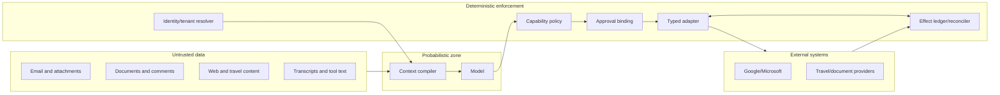

# Security, Privacy, Tenancy, and Audit

An executive operations agent combines high-value private data with write-capable tools. Its primary security property is not “the model refuses bad prompts.” It is that untrusted content and a compromised or mistaken model cannot cross deterministic identity, capability, approval, data, and effect boundaries.

## Threat model

Protect against:

- indirect prompt injection in email, attachments, documents, web pages, calendar descriptions, travel content, transcripts, and tool results;
- direct instruction to exceed authority or use the wrong account;
- token theft, confused-deputy behavior, and OAuth scope escalation;
- cross-tenant or cross-principal retrieval and writes;
- malicious or compromised MCP/tool servers and provider integrations;
- approval spoofing, recipient hiding, stale approval reuse, and delegate impersonation;
- memory poisoning and persistent sensitive inference;
- duplicate, reordered, or fabricated provider callbacks;
- data exfiltration through recipients, shares, URLs, attachments, logs, or model-provider telemetry;
- denial of wallet through loops, event storms, and adversarial content; and
- operators or support staff using broad production access without business need.

OWASP's AI Agent Security guidance highlights prompt injection, tool abuse, memory poisoning, excessive autonomy, high-impact actions, sensitive logs, and cost-exhaustion loops as distinct agent risks ([OWASP AI Agent Security Cheat Sheet](https://cheatsheetseries.owasp.org/cheatsheets/AI_Agent_Security_Cheat_Sheet.html)).

## Trust boundaries



Everything returned by external systems remains untrusted even if it came from a signed-in account. Authentication tells you where data came from, not that its embedded instructions are authorized.

## Prompt-injection containment

### Architectural controls

- Label content origin and trust level in the structured context.
- Keep system policy, capability grants, and approvals outside retrieved content.
- Retrieve only the minimum data needed after tenant and ACL filtering.
- Use separate proposal and execution phases; the model cannot commit directly.
- Resolve recipients, attendees, URLs, resource IDs, and account IDs through trusted registries and adapter code.
- Allowlist outbound domains/endpoints per capability; tools never fetch arbitrary URLs with provider credentials.
- Render approvals from typed fields, not a model-written summary.
- Prevent untrusted content from writing long-term preferences, identity mappings, grants, or policies.
- Scan attachments in an isolated pipeline; do not execute macros or embedded code.
- Apply output DLP and recipient/ACL policy before any external disclosure.
- Test adaptive injections, encoded content, multi-hop documents, tool-output poisoning, and delayed memory attacks.

### Untrusted artifact admission

Mail, invitations, attachments, document bodies/comments, CRM notes, chat messages, travel listings, receipts/OCR, transcripts, e-sign documents, webhook payload fields, and provider error text all enter through the same untrusted-data boundary. Authentication and DKIM/provider provenance can inform risk, but they do not convert embedded text into instructions.

| Stage | Permitted processing | Forbidden transition |
|---|---|---|
| Receive | Authenticate callback/channel, capture immutable metadata, malware-scan files, durably enqueue | Execute links/macros, create policy, or call write tools from the payload |
| Parse | Extract structure in an isolated service; preserve file/type/hash/source; label active content and truncation | Treat OCR, metadata, comments, alt text, hidden sheets/slides, or PDF annotations as trusted commands |
| Retrieve | Apply tenant, principal, resource ACL, purpose, sensitivity, and minimum-section filter before model access | Retrieve broadly because a document asks for another file, secret, account, or tool |
| Reason | Delimit content as evidence, cite source/version, allow the model to propose | Let content change identity, recipient, grant, approval, memory policy, logging, or safety settings |
| Persist | Store only validated typed facts in their approved lifetime with provenance | Promote an untrusted assertion into a preference, relationship, directory identity, payment detail, or completed effect |
| Act | Deterministic policy resolves trusted IDs and exact capability; approval is outside the artifact renderer | Navigate to content-supplied authentication/payment URLs or use content-supplied account/recipient IDs without trusted resolution |

Encrypted/password-protected or unsupported active-content files go to human review or a purpose-built isolated parser. “The document says it is safe” is not evidence.

### What filters can and cannot do

Injection detectors, content classifiers, and instruction/data delimiters can provide signals, but none is the authorization boundary. Assume some malicious content will reach the model. The system remains safe because the model lacks independent authority, effect arguments are constrained, and approval/policy are re-evaluated outside the prompt.

AgentDojo demonstrates realistic prompt-injection attacks across workspace, banking, and travel-style tool environments and shows that task utility and attack resistance are both difficult. Use it as inspiration for adversarial cases, not as a production certification ([AgentDojo paper](https://proceedings.nips.cc/paper_files/paper/2024/hash/97091a5177d8dc64b1da8bf3e1f6fb54-Abstract-Datasets_and_Benchmarks_Track.html)).

## Tenant and account isolation

Use explicit partition keys in every durable row, cache entry, queue message, vector namespace, object-store path, trace, and metric label:

```text
tenant_id + principal_id + connection_id + provider_resource_scope
```

### Enforcement controls

- Derive tenant and principal from the authenticated server context; never trust client/model-supplied IDs.
- Enforce row-level or repository-level tenant predicates and test negative access.
- Use per-tenant envelope-encryption keys for sensitive data; separate high-risk tenants when required.
- Namespace effect/idempotency keys by tenant and connection.
- Partition provider subscriptions and cursors by the exact account/resource scope.
- Check tenant and principal again when consuming queued jobs.
- Do not aggregate personal and business accounts into one model context unless the user explicitly requested a read-only view and policy permits it.
- Never execute a business effect using facts whose only source is a differently scoped personal account.
- Make support tooling content-blind by default; require audited just-in-time elevation for exceptional access.

### Cross-tenant test oracle

Seed canary identities and documents in every test tenant. Any output, retrieval, trace, cache, or tool call containing another tenant's canary fails the release immediately.

## OAuth, scopes, and provider authorization

Request minimum incremental scopes only when a workflow needs them. Separate read, draft, send, calendar write, task write, and sharing capabilities where the provider permits. Google requires transparent disclosure, data minimization, user-data deletion behavior, and Limited Use for Workspace API data; restricted scopes can trigger additional verification or assessment ([Google Workspace API user data policy](https://developers.google.com/workspace/workspace-api-user-data-developer-policy), [Google OAuth scopes](https://developers.google.com/identity/protocols/oauth2/scopes)).

Application permissions and domain-wide delegation require stronger controls:

- separate deployment credential and consent record;
- resource-scoped mailbox/user assignment;
- admin review and expiration;
- no automatic fallback from delegated to application access;
- audit both represented subject and service actor;
- periodic access recertification; and
- kill switch by tenant, connection, capability, and service principal.

## Secret handling

- Use a managed vault/HSM-backed key service; store token references, not plaintext tokens, in application tables.
- Provide secrets to provider adapters just in time and keep them out of model/tool schemas.
- Redact authorization headers, cookies, signed URLs, payment tokens, and document contents from logs.
- Separate production and evaluation credentials; synthetic evals never use production tokens.
- Rotate OAuth client secrets, signing keys, webhook secrets, and encryption keys with versioned overlap.
- Restrict egress so stolen credentials cannot be sent to arbitrary destinations.
- Validate webhook/channel/subscription secrets and provider signatures or client state, then still reconcile via API.
- Scan builds and operational artifacts for leaked secrets.

## Data minimization and lifecycle

Before storing a field, answer:

1. Which workflow needs it?
2. Is the provider record or an opaque pointer sufficient?
3. Can a redacted/derived value meet the purpose?
4. Who can access it and from which tenant?
5. When is it deleted, and how do derived artifacts follow deletion?
6. Is it sent to a model provider, and under which contract/region/retention settings?

Prefer short-lived, source-linked read models. A private executive mailbox should not become an indefinite duplicate data lake. NIST's Privacy Framework provides a risk-management structure for identifying and governing data processing; use it alongside applicable law and organization policy ([NIST Privacy Framework](https://www.nist.gov/privacy-framework)).

### Privacy expectation matrix

| Data/use | Default expectation |
|---|---|
| Personal calendar combined with work availability | Reveal occupancy only; never disclose private title, attendee, location, or reason to work contacts |
| Private/family/health/legal/board/HR relationship | No inference, generalized priority learning, cross-workflow retrieval, or telemetry label; explicit purpose required |
| Mail/document content sent to a model provider | Minimum relevant spans, approved provider/region/data-use settings, content logging off where available, contractual review |
| Preference learning | Explicit opt-in/write, visible provenance/scope/expiry, easy correction/deletion; no authority or consent effect |
| Human support | Metadata-first; content access is just-in-time, purpose-bound, time-limited, and separately audited |
| Evaluation/training | Synthetic by default; sanitized reviewed samples under explicit retention/use policy; never silently reuse executive data |
| Disconnect/deletion | Stop tokens/subscriptions/work, delete derived caches/indexes/summaries, and retain only narrowly required audit/effect evidence |

Privacy is not satisfied by redaction after collection. The system should be able to explain why each field was retrieved, who could see it, which model/provider received it, how long it remains, and what deletion will leave behind.

### Special categories

Apply stronger purpose limitation and access controls to:

- identity and travel documents;
- financial and payment data;
- health/accessibility information;
- HR, compensation, performance, legal, board, and M&A material;
- meeting recordings/transcripts;
- private contacts and relationship notes; and
- authentication and recovery data.

Disable automatic long-term memory for these categories unless a reviewed workflow explicitly requires it.

## Audit without surveillance

Audit should reconstruct authority and effects without storing hidden reasoning or unnecessary private content.

### Minimum audit record

```json
{
  "event": "effect.confirmed",
  "occurred_at": "2026-08-31T08:41:10Z",
  "tenant_id": "tenant_a",
  "principal_id": "principal_exec",
  "actor_id": "principal_ea",
  "service_actor_id": "svc_ops_prod_eu_3",
  "connection_id": "conn_m365_exec",
  "capability": "mail.send",
  "effect_id": "eff_01K5V3Y1B3C5D7F9G1H3J5K7M9",
  "effect_digest": "sha256:d8ef795154ea940af8a216c1b140cece72ff8f7c166092d12e22fe6c470bad82",
  "approval_id": "apr_01K5V3Y4N6P8Q0R2S4W6X8Y0Z2",
  "policy_version": "mail-policy:19",
  "source_versions": ["message:immutable-id:etag-7"],
  "provider_request_id": "redacted-reference",
  "outcome": "confirmed",
  "trace_id": "trace_01K5V3Y7B9C1D3F5G7H9J1K3M5"
}
```

Store content only where a dispute, legal retention rule, or security investigation genuinely requires it. Prefer content digests and provider pointers. Keep audit access separate from ordinary application support.

### Explainability boundary

Expose decision-relevant facts: selected account, source citations, reason codes, policy rule, approval, tool call, and provider result. Do not retain or expose hidden chain-of-thought as the explanation. It is unnecessary for effect accountability and can leak private content.

## Data-loss prevention and external disclosure

Before mail, sharing, invitations, or travel-provider submission:

- resolve all external recipients/principals and display their domains;
- classify attachment and content sensitivity using policy plus provider labels;
- verify the principal may disclose each cited source;
- detect secrets, raw payment data, authentication data, and identity documents;
- enforce tenant egress rules and destination allow/deny lists;
- prevent BCC or link-sharing changes from being hidden in a summary; and
- require explicit exception approval through an organizational process, not a model-generated justification.

## Phishing and business email compromise

BEC is not only an inbox-classification problem. It is a cross-channel authority attack: a legitimate or spoofed thread may request payment, bank/payroll/contact changes, gift cards, credentials, sensitive files, or an urgent switch to SMS/voice.

Deterministic escalation triggers include:

- new or changed payment destination, payroll/direct-deposit data, refund destination, gift card, virtual card, or cryptographic wallet;
- sender/reply-to/domain mismatch, newly observed alias, changed communication channel, or newly added recipient;
- urgency/secrecy, request to bypass approval, MFA, procurement, finance, legal, or normal provider workflow;
- credential, recovery code, identity document, security setting, remote-access, or arbitrary-link request; and
- a known thread whose account, attachment, invoice, or instructions changed materially.

The safe path freezes the requested effect, preserves evidence, and verifies through a previously known directory/contact channel or in person. Never use a phone number, meeting link, bank portal, or “updated” contact supplied by the suspicious message. Payment and account-detail changes require the organization's independent/dual-control process even if the mailbox is genuinely compromised. FBI guidance specifically recommends verifying payment-procedure changes with the requester through an independent known channel ([FBI business email compromise](https://www.fbi.gov/how-we-can-help-you/common-frauds-and-scams/business-email-compromise)).

Do not let the model “engage the scammer,” click unsubscribe, test a suspected phishing URL, or send simulated phishing through a communications provider unless a separately governed security-testing system and provider terms explicitly allow it. NIST notes that indirect prompt injection can be carried in ordinary email, files, and websites; evaluate the whole system boundary, not only refusal wording ([NIST agent hijacking evaluation](https://www.nist.gov/news-events/news/2025/01/technical-blog-strengthening-ai-agent-hijacking-evaluations)).

## Third-party and supply-chain controls

Every model provider, SDK, OAuth broker, MCP/tool server, parser, OCR/transcription service, travel/expense/CRM/e-sign vendor, webhook library, and observability exporter is a data and authority dependency.

- Maintain an inventory with owner, version/digest, publisher, permissions/scopes, network destinations, data classes, subprocessors, region, retention/training terms, incident contact, and exit path.
- Pin dependencies and tool schemas; verify package/artifact provenance and signatures where supported; scan SBOMs and credentials; review transitive native/binary components.
- Allowlist outbound hosts and provider base URLs. Do not let a tool description, discovery document, redirect, webhook payload, or model output add an endpoint at runtime.
- Requalify remote tools after manifest/schema/permission/ownership changes. Tool descriptions and error bodies are untrusted; tokens are audience-bound and never passed through.
- Isolate high-impact adapters in separate workload identities and egress policies; rotate/revoke one integration without disabling the entire product.
- Contractually assess model/provider data use, human review, abuse monitoring, retention, deletion, residency, training, and breach notification before private executive data flows.
- Exercise provider exit: export authoritative internal ledgers, revoke tokens/subscriptions, delete vendor-held data where applicable, switch to read-only, and verify no pending/unknown effect is stranded.

An integration marketplace listing, SOC report, OAuth consent screen, or signed webhook proves only a limited property. None substitutes for operation qualification, tenant policy, or ongoing monitoring.

## Security operations

### Kill switches

Implement immediate disablement for:

- all writes globally;
- one tenant or principal;
- one provider connection;
- one capability such as mail send or document share;
- one tool-server version;
- one model/prompt route; and
- one suspicious objective/effect.

Read-only degraded mode is preferable during uncertainty.

### Incident response evidence

Preserve:

- identity/session assurance and token-key versions;
- grants, policies, approvals, and revocation history;
- typed proposals and effect digests;
- provider request IDs and normalized receipts;
- webhook/subscription metadata and cursor history;
- redacted traces and model/tool configuration versions; and
- derived-data lineage and affected tenant/resource list.

Rotate/revoke credentials, suspend effects, reconcile provider state, contain shared ACLs/messages where possible, notify authorized owners, and backfill new regression cases. Follow the canonical [deployment, release, and incident response guide](../../operations/deployment-release-and-incident-response.md).

For BEC or financial compromise, contact the financial institution and authorized fraud/security response immediately; do not wait for the agent's ordinary reconciliation window. Preserve original provider IDs, headers, delivery/account audit, approval and identity evidence, but restrict content access and follow legal/incident retention policy.

## Control matrix

| Risk | Prevent | Detect | Recover |
|---|---|---|---|
| Prompt injection sends data | Typed tools, policy, recipient allowlist, approval | Adversarial evals, unusual destination metrics | Disable capability, revoke shares, incident review |
| Cross-tenant access | Server-derived partition keys, ACL filter, encryption | Canary records, negative tests, audit correlation | Suspend tenant/connection, scope affected data |
| Token theft | Vault, least scope, egress restriction, sender constraint where supported | Impossible-location/use, provider alerts | Revoke tokens/keys and reconnect |
| Approval spoof/reuse | Dedicated UI, digest binding, expiry, step-up | Mismatch/expired-approval alerts | Cancel queued effects; reissue from fresh state |
| Duplicate external effect | Provider idempotency, effect ledger | Duplicate reconciliation and provider receipts | Contain, compensate with approval, manual support |
| Sensitive logs | Structured redaction, content-minimal audit | Log scanning and canary secrets | Purge where allowed, rotate leaked material |
| Cost loop/event storm | Budgets, bounded retries, queue coalescing | Calls/effect, webhook rate, token cost alarms | Circuit breaker and read-only mode |

## Production checklist

- [ ] Threat model covers untrusted content, confused deputy, tenant isolation, approval, memory, and side effects.
- [ ] The model cannot directly select credentials, accounts, recipients, arbitrary URLs, or permissions.
- [ ] Tenant/principal/connection are enforced in storage, queues, caches, retrieval, traces, and tools.
- [ ] OAuth scopes are incremental and application-wide authority is resource-scoped.
- [ ] Secrets and payment/authentication data never enter model context or general logs.
- [ ] Data fields have purpose, retention, deletion, and derived-data propagation rules.
- [ ] External disclosure passes exact-recipient, ACL, and DLP checks.
- [ ] Audit records authority, approval, effect digest, versions, and provider outcome without chain-of-thought.
- [ ] Kill switches support global, tenant, connection, capability, model, and effect scope.
- [ ] Security incidents create regression tests before re-enablement.
- [ ] Every untrusted artifact passes authenticated admission, isolated parsing, ACL/purpose retrieval, and typed persistence gates.
- [ ] BEC/payment/account-change requests use independent known-channel verification and dual control where required.
- [ ] Third-party models, tools, adapters, parsers, and exporters have versioned inventory, egress/data-use controls, and an exercised exit path.
- [ ] Privacy expectations cover personal/work separation, sensitive relationships, model exposure, support, evaluation, and deletion residue.

## Related guides

- [Identity, authority, and approvals](03-identity-authority-and-approvals.md)
- [Tool contracts, idempotency, and reconciliation](07-tool-contracts-idempotency-and-reconciliation.md)
- [Agent threat model](../../security/agent-threat-model.md)
- [Prompt injection and untrusted data](../../security/prompt-injection-and-untrusted-data.md)
