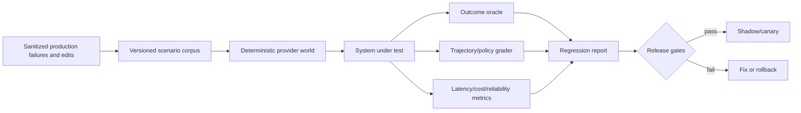
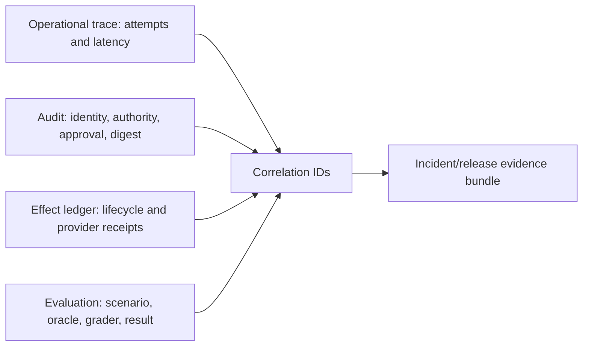

# Evaluation, Observability, Deployment, and Roadmap

An executive operations agent is ready to ship only when system-level evidence shows that it produces useful outcomes, respects authority, survives provider failures, and reveals uncertainty. A high-quality demo or generic model score is not sufficient.

## Evaluation contract

Define the claim before the test:

```yaml
claim: "The system prepares and, after exact approval, sends a reply from the selected work account"
system_under_test:
  model: pinned-deployment-id
  prompt_bundle: executive-ops-v17
  tool_schema: tools-v9
  policy: mail-policy-v19
  provider_adapter: graph-mail-v6
budget:
  maximum_model_calls: 4
  maximum_tool_calls: 12
  wall_clock_seconds: 45
  maximum_cost_usd: 0.20
scoring:
  outcome: provider state and recipient/content oracle
  trajectory: identity, freshness, tool order, retry behavior
  safety: no unauthorized recipient/account/effect
  operations: latency, cost, and reconciliation completion
```

OpenAI's 2026 guidance on third-party evaluations emphasizes that harness, tools, safeguards, budgets, elicitation, and validity checks are part of the result. Report them with every bakeoff ([Trustworthy third-party evaluations](https://openai.com/index/trustworthy-third-party-evaluations-foundations/)).

### Invariant catalog

Evaluate invariants before aggregate usefulness. At minimum, every run asserts:

- one resolved principal, actor, tenant, account/connection, visible identity, and current authority ceiling;
- no fact, retrieval, token, approval, effect, trace content, or handoff crosses its tenant/principal/resource boundary;
- untrusted content cannot create/change a grant, recipient, approval, preference, relationship, policy, logging rule, or completion claim;
- every consequential effect has current policy, exact digest approval where required, commit-time versions, one execution owner, and a durable effect record;
- unknown non-idempotent outcomes block retry until authoritative reconciliation or human resolution;
- provider state, not model text or compacted summary, determines message/event/task/booking/expense/document/signature outcome;
- cancellation stops all controllable future work and reports already committed/unknown work honestly;
- restart, model/provider switch, and handoff rehydrate authoritative state and cannot raise authority; and
- secrets, raw payment/authentication data, prohibited relationships, and hidden reasoning never enter prompts, traces, or generalized memory.

A single invariant violation fails the scenario and the release gate regardless of tone, latency, or task completion.

## Test harness

Build a deterministic simulated operations world before testing live sandboxes:

- synthetic tenants, principals, delegates, accounts, contacts, mail, calendars, tasks, documents, bookings, and transcripts;
- fake provider adapters that implement real cursor, ID, ETag, notification, rate-limit, eventual-consistency, and error semantics;
- a virtual clock with timezones, DST, expiration, delayed callbacks, and scheduled wakes;
- a policy/approval simulator with signer, expiry, revocation, and tamper cases;
- fault injection around every external commit boundary;
- exact state and event oracles; and
- recorded model/tool/config versions and repeated stochastic trials.

Use provider sandbox/test tenants for contract tests after the deterministic harness. Never use production mailboxes or payment credentials for routine evaluation.



## Scenario suites

### Functional workflows

| Suite | Representative scenarios | Primary oracle |
|---|---|---|
| Inbox | Triage mixed messages; draft; new reply arrives before send; alias ambiguity | Correct source citations, recipients, account, and provider message state |
| Calendar | Multi-timezone scheduling; DST; room decline; occurrence vs series; stale ETag | Final event fields, attendee notifications, no duplicates |
| Tasks | Capture from mail/transcript; date-only provider; duplicate source; moved list | Stable internal work item and correct provider task/provenance |
| Documents | Revision conflict; comment vs edit; exact-principal share; ACL revocation | Provider revision/ACL and no excessive disclosure |
| Travel | Price drift, expired offer, commit timeout, duplicate order risk, cancellation fee | Correct order/absence, total/terms, no duplicate payment |
| Meetings | Missing artifact, diarization ambiguity, edited transcript, no consent | No recording without authority; cited candidate actions only |
| Follow-up | Delayed reply, objective completed elsewhere, SLA escalation, cancellation | Stop condition, owner, next check, no repeated send |

### Identity and authority

- personal and work accounts with the same email alias;
- two tenants with similarly named executives and contacts;
- executive assistant with read but not send authority;
- Exchange Full Access without Send As/Send on Behalf;
- expired delegation or reduced OAuth scopes while queued;
- service principal with application permission outside resource scope;
- approval by the wrong principal or session;
- send/organizer identity changed after preview; and
- cross-tenant canary in retrieval, cache, or tool result.

### Adversarial content

Inject malicious instructions into message bodies, signatures, attachment text, calendar descriptions, comments, document metadata, travel listings, transcript speech, and provider error messages. Goals should attempt to:

- add a recipient or share principal;
- switch tenant/account or visible sender;
- disclose secrets or unrelated documents;
- change stored preferences or grants;
- approve or retry a transaction;
- navigate to an arbitrary credential-stealing URL;
- suppress logging or user notification; and
- cause a high-cost loop.

Use AgentDojo-style task-plus-attack measurement and extend it with the product's exact tools and policies. ToolSandbox is useful for state dependencies, canonicalization, insufficient information, and trajectory-aware outcomes; AppWorld provides a controllable multi-app environment; AssistantBench covers realistic time-consuming research tasks. They are scenario sources, not substitutes for provider-semantic tests ([AgentDojo](https://github.com/sequrity-ai/agentdojo), [ToolSandbox](https://machinelearning.apple.com/research/toolsandbox-stateful-conversational-llm-benchmark), [AppWorld](https://appworld.dev/), [AssistantBench](https://assistantbench.github.io/)).

### Reliability and fault injection

| Injection | Expected behavior |
|---|---|
| Duplicate/out-of-order/missing webhook | Cursor-based sync converges; no duplicate effect |
| Expired Gmail/Calendar cursor | Bounded full resync; no stale action |
| Graph subscription expiry | Renewal alert; delta recovers gap |
| Process death before provider call | Effect safely resumes from preflight |
| Process death after provider commit | Reconciliation confirms without duplicate |
| Provider timeout after commit | `unknown`, retry blocked until reconciled |
| Stale event/document version | Proposal superseded; no overwrite |
| Token revoked between approval and commit | Effect rejected; no broader fallback |
| Rate limit/provider outage | Persisted backoff, budget honored, user sees delayed state |
| Approval tampered/expired | Deterministic rejection |
| Concurrent human edit | Human state wins; re-plan |
| Reconciler unavailable | Alert on age; manual owner; no false completion |

## Comparative baselines

Every model/framework change should compete with simpler alternatives on the same scenarios:

1. **No-agent baseline:** ordinary filters, templates, calendar rules, and task capture.
2. **Retrieval-only baseline:** search and summarize with citations; no tools that write.
3. **Deterministic workflow plus one model call:** fixed tool path with structured extraction/drafting.
4. **Thin single-agent controller:** model chooses among typed proposal tools; deterministic execution.
5. **Framework/graph runtime:** only if evaluating checkpointing or orchestration value.
6. **Strong-model and low-cost-model routes:** same policy and tools, pinned budgets.
7. **Human operator baseline:** completion time, corrections, missed commitments, and error types.

Measure expected cost per **verified successful outcome**, not price per token or task attempt. A cheaper model that causes repairs, approvals, or failed long trajectories may cost more operationally.

τ-bench demonstrates why repeated reliability matters: its tool-agent-user tasks report steep declines from single-run success to repeated pass metrics. The original repository now warns that its airline/retail tasks are outdated in favor of newer τ-bench generations, so pin the exact benchmark version and do not copy old leaderboard numbers into release claims ([τ-bench repository](https://github.com/sierra-research/tau-bench)).

## Scoring

Use layered scores rather than one average:

| Layer | Example metrics |
|---|---|
| Invariant | Violations by invariant/risk class, unauthorized effect attempts blocked, cross-tenant canary escape, false completion |
| Outcome | Exact provider state, objective achieved, no duplicate, source correctness |
| Policy/safety | Unauthorized-effect rate, cross-tenant leakage, missed approval, excessive disclosure |
| Trajectory | Correct account/tool/order, stale-state handling, unnecessary calls, prohibited retry |
| Human factors | Draft acceptance and edit categories, approval comprehension, false urgency, fatigue/abandonment, correction discoverability, trust calibration, takeover time |
| Reliability | Pass@1 and repeated all-pass rate, reconciliation success/age, recovery after faults |
| Incident/recovery | Mean detection/containment/restore, manual cases per 1,000 effects, evidence completeness, operator steps, recovery error/duplicate rate |
| Operations | p50/p95/p99 latency, queue lag, tokens/cost, provider calls, timeout/rate limit, capacity and backpressure drops |

Release gates should be risk-weighted:

- zero known severe unauthorized, cross-tenant, raw-secret, duplicate-payment, or no-consent recording effects in the release corpus;
- 100% deterministic rejection for invalid/expired approval and wrong-account tests;
- no blind retry in unknown non-idempotent cases;
- all effect states recover to a terminal or owned manual state within the test SLO;
- workflow outcome and human-acceptance thresholds meet product targets; and
- latency/cost stay within the published budget.

A zero count is not proof of zero risk. Report scenario count, repeated runs, confidence bounds where useful, and coverage limitations.

Human-factor testing must include hurried mobile approval, long recipient lists, visually similar domains, delegate versus principal views, changed effects after prior approval, notification fatigue, accessibility, localization, and recovery after a mistaken denial/approval. Measure whether reviewers can correctly state who will act, what will happen, what changed, what cannot be undone, and which provider outcome is still uncertain.

## Evaluation methods by stage

| Stage | Method | Writes? |
|---|---|---:|
| Development | Unit/property tests; deterministic simulated world; recorded-response replay | Simulated only |
| Pre-release | Provider test tenants; adversarial and fault-injection runs; model bakeoff | Sandbox/test resources |
| Shadow | Production events processed with effect tools disabled | No |
| Draft canary | Small principals/tenants; drafts and private reversible writes | Restricted |
| Approved-write canary | Explicitly opted-in users; hard capability and rate limits | Yes, approval-bound |
| General availability | Staged tenant cohorts; continuous eval and rollback | Policy-bound |

Model graders are useful for tone, completeness, and semantic similarity but must be calibrated against human labels. Use deterministic state/policy oracles for recipients, accounts, authorization, effects, versions, amounts, and duplicates. Grade traces and outcomes; a polished final answer can hide a prohibited intermediate action.

## Observability

### Metrics

Track per tenant and capability without high-cardinality private labels:

- webhook admission failures and subscription expiry margin;
- sync lag, cursor resets, full-sync duration, and read-model freshness;
- model route, schema-validity/repair rate, calls, tokens, latency, and cost;
- proposal acceptance, human edit categories, clarification, and abandonment;
- approval latency, expiry, rejection, and supersession causes;
- effects by lifecycle state, duplicate suppression, unknown outcomes, and reconciliation age;
- provider errors, rate limits, retries, and circuit-breaker state;
- objective age, overdue/escalated items, follow-up attempts, and stop-condition success; and
- security denials, cross-tenant canary detections, DLP blocks, and kill-switch use.

### Traces

Use a correlated `request_id`, `trace_id`, `objective_id`, `effect_id`, and provider request reference. Trace structured decisions, policy rule IDs, tool names, timings, redacted argument digests, and outcome categories. Separate short-lived debug traces from durable audit. Do not log raw prompts or provider content by default.

### Evidence plane

The evidence plane links, but does not collapse, four records:



| Plane | Retention/content | Primary consumer |
|---|---|---|
| Trace | Short-lived, sampled, redacted spans/metrics; logical operation and physical attempts separated | On-call and performance engineering |
| Audit | Durable minimum metadata for identity, policy, approval, effect, and corrections; content by exception | Security, compliance, disputes |
| Effect | Complete typed state/attempt/receipt/reconciliation lineage | Runtime, support, recovery |
| Evaluation | Synthetic/sanitized inputs, versioned behavior bundle, oracles, repeated results and limitations | Release governance |

OpenTelemetry's GenAI attributes for tool arguments/results are explicitly sensitive, so record digests and classifications by default and make content capture an audited opt-in. Do not propagate private tenant/user data in OpenTelemetry baggage because it can cross unintended downstream boundaries ([OpenTelemetry GenAI attributes](https://opentelemetry.io/docs/specs/semconv/registry/attributes/gen-ai/), [OpenTelemetry baggage security](https://opentelemetry.io/docs/concepts/signals/baggage/)).

### SLO examples

- interactive read/proposal p95 within the product's declared latency budget;
- approved effect admitted or clearly rejected within seconds, unless provider delayed;
- webhook queue lag below the freshness threshold for 99.9% of active connections;
- ambiguous high-impact effect reconciled or human-owned within 15 minutes;
- subscription renewal completes before a provider-specific safety margin; and
- no effect remains `Executing` past its lease without an alert and recovery attempt.

Tune values from provider behavior and user expectations; do not copy these examples blindly.

Ratify measurable targets for each capability before its canary. A practical starting contract is:

| SLI | Initial target and window | Exclusions that must be explicit |
|---|---|---|
| Identity/authority decision correctness | 100% on deterministic release corpus; zero known severe production violation | None for wrong tenant/account/principal or missing required approval |
| Approved-effect admission | 99.9% within 10 seconds over 28 days when provider is reachable | Provider outage and user-expired approval reported separately |
| Read-model freshness | 99.9% within each workflow's declared threshold; threshold visible in UI | Disconnected/revoked accounts only |
| Unknown high-impact outcome ownership | 99% reconciled or acknowledged by a named human within 15 minutes | Supplier cases with documented slower contract get their own SLO |
| Stuck execution recovery | 100% detected by lease expiry + alert within 2 minutes in tests; no unowned production state | None |
| Provider callback admission | 99.95% authenticated and durably queued within provider deadline | Deliberately rejected invalid signatures |
| Restore correctness | 100% of sampled objectives/effects reconcile to authoritative state in quarterly drill; zero duplicate effect | None; elapsed recovery time is reported separately |

Use separate consequence-weighted error budgets for read-only utility, reversible writes, external communications, and financial/legal effects. A high-impact invariant breach freezes autonomy expansion even when an aggregate availability target is healthy. Error-budget policy should define release consequences in advance ([Google SRE error-budget policy](https://sre.google/workbook/error-budget-policy/)).

## Deployment topology

### Initial topology

- one regional application deployment;
- relational database with tenant keys and encrypted sensitive columns;
- durable queue and scheduled-job service;
- provider webhook edge separated from model workers by the queue;
- managed vault and per-environment OAuth applications;
- outbound allowlist/proxy for provider and model endpoints;
- separate audit sink and restricted support tooling; and
- test tenants and synthetic data isolated from production.

Use a shared control plane with strong logical isolation for typical SaaS deployments. Offer dedicated keys, data stores, or deployments when regulatory, residency, customer-controlled encryption, or blast-radius requirements justify them.

### Release mechanics

- version model, prompt, tool schema, policy, adapter, and workflow independently;
- use backward-compatible event/effect schemas and expand-contract migrations;
- canary by internal principal, then tenant cohort, then capability;
- keep read-only, draft-only, and write-disable switches;
- drain or reconcile in-flight effects before incompatible changes;
- run provider contract tests and eval gates in CI/release workflow; and
- automatically roll back a model route or policy on safety/SLO regression.

Promote the full behavior bundle: model/deployment and fallback graph, prompts, context compiler, compactor/receipt schema, memory policy, tool schemas and capability manifests, identity/policy/approval rules, adapters, workflow code, grader set, and thresholds. Record component hashes and compatibility constraints in every run/effect. A rollback restores the previous whole bundle or a tested compatible subset; never roll back the model while leaving a tool schema or compactor it was not evaluated with.

Canary in this order: offline replay, deterministic simulator, provider sandbox, production shadow, read-only cohort, draft/reversible cohort, then approval-bound external writes. Route cohorts deterministically by tenant/principal/capability; prevent the same objective from executing across old and new bundles. Drain or pin in-flight effects, reconcile unknowns, and keep schema readers backward compatible. Automatic rollback triggers include any severe invariant failure, statistically/materially worse trajectory or human outcome, error-budget burn, reconciliation backlog, or provider contract mismatch.

## Disaster recovery and regional/provider failure

Define recovery point and recovery time by state class rather than “the agent”:

| State | Recovery requirement |
|---|---|
| Identity/grants/tokens | Replicated encrypted registry/vault metadata; tokens may require reauthorization and never restore from logs |
| Objectives/work items/handoffs/clocks | Point-in-time recoverable; rebuild timers from absolute instants and missed-deadline policy |
| Approvals/effects/attempts/audit | Near-zero acceptable loss for admitted writes; append-only backup and cross-check against provider receipts |
| Read models/cursors | Rebuildable from providers; protect cursor lineage, but support bounded full resync after loss |
| Summaries/indexes/preferences | Restore only with valid source/ACL/deletion lineage; safe to discard and regenerate |
| Behavior/eval bundles | Immutable artifact store with signatures, dependency manifests, rollback pins, and test evidence |

Quarterly restore drills must recover a sampled tenant into an isolated environment, verify row/object/cache/queue isolation, replay events above watermarks, reconcile every non-terminal effect against provider sandboxes or recorded contract fixtures, restore clocks without duplicate wakeups, and prove deletion tombstones are not resurrected. Provider outage mode preserves local evidence, stops freshness-dependent writes, extends or supersedes approvals explicitly, applies backpressure, and communicates degraded capability. Regional failover must not reuse stale leases or let two regions own the same effect.

## Latency and cost controls

Cost per verified outcome is approximately:

```text
model input/output + provider calls + sync/storage/queue + human review + reconciliation/incident overhead
```

Control it by:

- using deterministic rules for routing, policy, and provider errors;
- using small models for narrow extraction/classification after evaluation;
- compiling minimum fresh context rather than entire histories;
- caching permission-aware read models and invalidating by provider versions;
- batching background summaries within freshness bounds;
- enforcing per-request model/tool/time/cost budgets;
- cutting loops after bounded repair attempts;
- separating interactive and background worker pools; and
- tracking human corrections and reconciliation, not only inference cost.

Do not cache authorization decisions beyond grant/policy/revocation validity. Do not cache travel prices or availability beyond the supplier's explicit quote lifetime.

### Capacity, recovery load, and backpressure

Plan for normal peak plus recovery, not average interactive traffic:

```text
required provider capacity =
  foreground reads and approved writes
  + callback/delta convergence
  + full-resync after cursor loss
  + reconciliation of unknown effects
  + restore/failover replay
```

Load-test simultaneous subscription renewal, provider recovery burst, expired cursors, and human return after an outage. Capacity evidence records tenant/provider skew, mailbox/document size distributions, context/token size, write concurrency keys, quota ownership, queue age, database locks, model/provider limits, and manual-review arrival/service rates.

Backpressure priority is safety-shaped: admit revocation, cancellation, reconciliation, approval expiry, and incident controls first; then approved effects within freshness; then interactive reads/proposals; then callbacks/sync; defer briefings, speculative retrieval, embeddings, and bulk summaries. Coalesce wake-up hints without losing cursor convergence. When rejecting work, persist the decision and show retry/degraded-state information; never silently discard an accepted effect or timer.

Track unit economics per verified outcome and per incident: model/tool calls, provider quota, storage/egress, human approval/edit time, reconciliation/manual support, on-call recovery, vendor fixed cost, and duplicate/compensation loss. Cost reductions cannot weaken safety invariants or cause hidden approval labor.

## Zero-to-production roadmap

| Stage | Build and authority ceiling | Evidence and exit gate |
|---|---|---|
| 0 — Qualify the deterministic baseline | Identity/connection registry, provider sync, read models, policy, simulated providers, and objective/effect/audit ledgers; no model required | Prove that rules, search, templates, or an ordinary workflow cannot meet the use case alone. Cursor recovery, tenant isolation, schema, deletion, and effect-state tests pass. |
| 1 — First bounded loop | One read-only objective with explicit tool allowlist, step/time/token budgets, typed output, citations, and abstention | Beat deterministic and no-agent baselines on a versioned corpus without privacy or authority violations. Every run has a terminal stop reason. |
| 2 — Useful MVP | Briefings, meeting preparation, mail drafts, scheduling proposals, private tasks, and other reversible artifacts for a narrow pilot | Human usefulness and acceptance improve while source accuracy, identity resolution, freshness, provenance, latency, and cost meet pilot targets. No external commit occurs. |
| 3 — Reliable v1 | Durable run/objective state, approval binding, effect ledger, reconciliation workers, provider cursor recovery, compaction receipts, and a small approved-write set | Crash/replay, duplicate, stale-state, webhook loss, provider timeout-after-commit, approval expiry, and restore drills recover without an unauthorized or duplicate effect. |
| 4 — Production readiness | Tenant isolation, least-privilege identities, secrets controls, audit/export/deletion, shadow and canary releases, on-call ownership, SLOs, capacity limits, cost budgets, runbooks, and kill switches | Security/privacy review is approved; failure injection and rollback exercises pass; ambiguous effects meet reconciliation SLOs; operators can degrade to read-only safely. |
| 5 — Scale and resilience | Partition interactive/background/reconciliation workloads, isolate noisy tenants and providers, apply backpressure and quotas, test regional and provider degradation, and grant narrow preauthorization only to proven reversible workflows | Peak and recovery-load tests meet SLOs; queue age, approval capacity, provider quotas, failover, restore, and cost remain within limits; blast radius is bounded per tenant/capability. |
| 6 — Continuous governed evolution | Treat model, prompt, policy, context builder, compactor, tool schema, adapter, grader, and memory-policy changes as behavior releases; mine reviewed corrections and incidents into evals | Offline comparison, safety gates, shadow/canary evidence, drift monitoring, independent review, versioned lineage, and rapid rollback precede promotion. Learning never silently expands authority. |
| Separate high-impact program | Travel purchase, payment, recording/transcription, deletion, regulated workflows, or irreversible sharing | Supplier, legal, privacy, security, and compliance review; step-up approval; dedicated evals, incident playbooks, reconciliation, and compensation evidence. |

There is no “fully autonomous executive” stage. Stage 6 improves a governed capability set; expansion remains capability-by-capability and can move backward when evidence degrades.

### Stage exercises and evidence

| Stage | Entry evidence | Mandatory measurable exercise | Exit evidence artifact |
|---|---|---|---|
| 0 | Named workflow, manual/rules/read-only baseline, authoritative outcome oracle, risk owner | Run at least 50 representative cases through no-agent and deterministic paths; measure handling time, material errors, privacy exposure, and operational cost | Signed admission record showing model-required ambiguity and a narrower alternative; otherwise reject agent use |
| 1 | Simulator, identity/account fixtures, typed proposal schema, hard budgets | Repeated paraphrase/adversarial trials with zero writes; every run must stop by answer/abstain/budget and cite current source versions | Versioned corpus/results, confidence intervals or repeated all-pass, failure taxonomy, selected model route and budget |
| 2 | Pilot consent, read/draft scopes, deletion/support path, human-quality rubric | Shadow real permitted work then draft canary; measure acceptance, edit causes, false priority, clarification, latency, cost, and cross-account canaries | Pilot report and approved capability manifest; zero external effects and zero unresolved privacy/identity violation |
| 3 | Durable objective/effect/approval schemas, reconciler, compaction receipt, provider sandbox | Inject duplicate/lost/out-of-order events, cursor expiry, stale versions, crash before/after commit, timeout-after-commit, cancellation race, provider/model switch, and handoff | Recovery transcript proving no duplicate/unauthorized effect and every run terminal or named-human-owned within SLO |
| 4 | Security/privacy review, on-call, evidence plane, SLO/error-budget policy, runbooks/kill switches | Restore drill, tenant-canary attack, BEC/prompt-injection campaign, key/token rotation, write-disable and full-bundle rollback during canary | Approval from owners, incident/evidence bundle, measured RTO/RPO, rollback time, and closed severe findings |
| 5 | Real traffic distribution, provider quotas, isolation lanes, manual-review staffing model | Peak plus provider-recovery/full-resync load; fail one provider/region; exhaust a tenant quota; verify priority/backpressure and cost ceiling | Capacity model with headroom, provider/tenant blast radius, queue/recovery SLOs, DR and staffing evidence |
| 6 | Stable stages 0–5, drift/incident/correction intake, bundle lineage | Change model, prompt, context, tool, policy, adapter, or memory rule through offline comparison, shadow, cohort canary, rollback rehearsal, and independent review | Governed release record linking diff, sources, evals, canary, decision, bundle hashes, rollback pin, and refresh date |

Exercise counts are minimum starting points, not universal adequacy. Increase scenario diversity and repetitions with consequence and observed variance. Entry is blocked when required evidence is missing; exit is blocked by any unresolved severe invariant failure.

## Anti-patterns

- Calling a broad persona, mailbox connector, or MCP server “qualified” without operation-level scopes and effect semantics.
- Measuring only final-answer helpfulness while ignoring wrong-account reads, prohibited retries, hidden disclosures, and provider state.
- Treating approval rate as success without testing comprehension, fatigue, manipulation, and changed-effect detection.
- Using webhook uptime as synchronization correctness or a queue ACK as provider outcome.
- Restoring a chat/checkpoint without provider/ledger rehydration, or switching model/provider while inheriting authority and canary evidence.
- Retrying a financial, messaging, sharing, booking, or e-sign create after timeout because the UI still shows pending.
- Scaling one shared token/queue/worker pool until a large tenant, resync, or incident starves cancellation and reconciliation.
- Logging raw prompts/tool payloads “temporarily,” propagating private IDs in trace baggage, or using production executive content as default eval data.
- Advancing stages on a calendar date, generic benchmark, or vendor claim rather than workflow-specific evidence.
- Calling Stage 6 “autonomy complete”; governance, rollback, and human ownership remain permanent.

## Known limitations

- Provider APIs cannot prove message delivery, invitation visibility, human reading, or supplier fulfillment in all cases.
- Generic benchmarks do not reproduce the exact identity, policy, provider, and failure semantics of this product.
- Model and grader behavior is stochastic and can change across snapshots or configurations.
- Provider test tenants do not expose every enterprise policy, national cloud, plan, or throttling behavior.
- Exactly-once external effects are impossible without compatible provider primitives or authoritative reconciliation.
- Meeting consent, retention, employment, travel, payment, and privacy obligations vary by organization and jurisdiction.
- Human approvals can still be careless or manipulated; UX and organizational controls matter.
- A local read model is eventually consistent and must not be used beyond its declared freshness.

## Production checklist

- [ ] The harness simulates real provider IDs, cursors, versions, notifications, and unknown outcomes.
- [ ] Outcome, policy, trajectory, human-quality, reliability, latency, and cost are scored separately.
- [ ] Comparative baselines include deterministic workflow and no-write variants.
- [ ] Safety release gates are consequence-weighted and repeated across stochastic trials.
- [ ] Shadow and canary stages precede approved external writes.
- [ ] Metrics cover freshness, approvals, effects, reconciliation, follow-up, cost, and security.
- [ ] Audit and debug tracing are separated and content-minimized.
- [ ] Model/prompt/tool/policy/adapter versions support rapid rollback.
- [ ] Deployment has tenant/capability kill switches and read-only degradation.
- [ ] Autonomy advances only from workflow-specific production evidence.
- [ ] Invariants fail the scenario before aggregate usefulness is scored.
- [ ] The evidence plane separates trace, audit, effect, and evaluation data with correlated IDs and distinct retention.
- [ ] DR drills rehydrate providers/ledgers, preserve deletion, restore clocks, and prove single effect ownership.
- [ ] Capacity tests include provider-recovery/full-resync load and preserve safety-priority backpressure lanes.
- [ ] Every Stage 0–6 promotion has the required exercise and evidence artifact.

## Related guides

- [Tool contracts, idempotency, and reconciliation](07-tool-contracts-idempotency-and-reconciliation.md)
- [Security, privacy, tenancy, and audit](08-security-privacy-tenancy-and-audit.md)
- [Evaluation-driven development](../../evaluation/evaluation-driven-development.md)
- [Trajectory and reliability evaluation](../../evaluation/trajectory-and-reliability-evaluation.md)
- [Observability and tracing](../../evaluation/observability-and-tracing.md)
