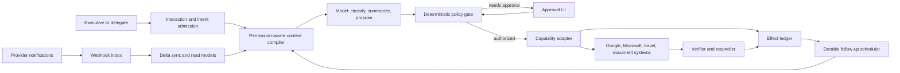

# Executive Operations Agent

> **Status:** Production blueprint  
> **Last researched:** 2026-08-31  
> **Scope:** A personal or executive operations agent that can coordinate inboxes, calendars, tasks, documents, travel, meetings, and long-running follow-up without confusing model initiative with delegated authority.

An executive operations agent sits unusually close to a person's identity, relationships, schedule, private records, and money. A useful system must do more than call productivity APIs. It must know **which principal it represents, which account and tenant an action targets, what has actually been authorized, whether the underlying state is still fresh, and whether a side effect really happened**.

The recommended design is therefore not a free-running personal assistant. It is a constrained operations system in which:

1. provider change feeds maintain local, permission-aware read models;
2. an LLM interprets requests and proposes typed plans;
3. deterministic policy evaluates identity, authority, freshness, and risk;
4. approvals bind to the exact effect that will be committed;
5. narrow capability adapters perform the write;
6. an effect ledger and reconciler determine the real provider outcome; and
7. durable follow-up state survives restarts, delayed replies, and human handoffs.

## Non-negotiable invariants

- **The model proposes; policy authorizes.** Model confidence is never a permission signal.
- **Principal, delegate, tenant, account, and send identity are separate fields.** Never infer one from another.
- **Untrusted content cannot grant authority.** Email, documents, transcripts, web pages, and tool metadata are data, even when they contain instructions.
- **Approval is effect-specific and expires.** It includes recipients or attendees, acting identity, resource, amount, currency, material terms, and the version of the facts reviewed.
- **Commit-time revalidation is mandatory.** Recheck resource version, recipients, price, availability, and policy immediately before a consequential write.
- **Unknown outcomes are reconciled, not blindly retried.** This is essential for mail sends, bookings, sharing, and any provider operation without a usable idempotency primitive.
- **Provider state is authoritative.** Summaries, embeddings, and conversational memory are caches with provenance, not a source of truth.
- **Every enabled operation is separately qualified.** A connected provider or broad connector does not authorize or prove the semantics of each read, write, callback, retry, or cancellation.
- **Compaction, restart, handoff, and provider/model switch never carry truth by prose.** Rehydrate authoritative ledgers and provider state, verify invariants, and resume only the next safe action.
- **Relationships and sensitive attributes are not inferred.** Interaction frequency, tone, co-attendance, and document access cannot create trust, priority, consent, or durable relationship facts.
- **Every effect is attributable.** Audit records preserve the human principal, delegated actor, service principal, tenant, provider account, approval, request, and provider receipt.
- **No raw payment credentials, passwords, MFA secrets, or identity documents enter model context.** Use provider-hosted or tokenized collection surfaces.
- **No broad unattended autonomy at launch.** Expand only from observed, workflow-specific evidence.

## Guide map

| Guide | Production question answered |
|---|---|
| [01 — Purpose, operating model, and autonomy](01-purpose-operating-model-and-autonomy.md) | What should this agent own, and where must initiative stop? |
| [02 — Reference architecture, runtime, and technology](02-reference-architecture-runtime-and-technology.md) | What components, language, model, framework, and persistence choices fit the system? |
| [03 — Identity, authority, and approvals](03-identity-authority-and-approvals.md) | Who is acting for whom, under what capability and approval? |
| [04 — State, memory, priorities, and follow-up](04-state-memory-priorities-and-follow-up.md) | What state is authoritative, how is context assembled, and how does work survive time? |
| [05 — Inbox, calendar, tasks, and documents](05-inbox-calendar-tasks-and-documents.md) | How do core productivity workflows work under real provider semantics? |
| [06 — Travel, meetings, and high-impact boundaries](06-travel-meetings-and-high-impact-boundaries.md) | How should booking, payment, recording, consent, and consequential follow-up be constrained? |
| [07 — Tool contracts, idempotency, and reconciliation](07-tool-contracts-idempotency-and-reconciliation.md) | How are side effects expressed, deduplicated, verified, and recovered? |
| [08 — Security, privacy, tenancy, and audit](08-security-privacy-tenancy-and-audit.md) | How are private data, secrets, tenants, prompt injection, and accountability protected? |
| [09 — Evaluation, observability, deployment, and roadmap](09-evaluation-observability-deployment-and-roadmap.md) | What evidence is required to ship, operate, and safely expand the system? |

The companion [research packet](../../research/packets/executive-operations-agent-blueprint.md) records the evidence base, API-version baseline, disagreements, limitations, and refresh triggers.

## Recommended first production slice

Start with one provider ecosystem and delegated per-user OAuth. Ship:

- a measured deterministic/manual baseline and a written reason the selected workflow needs model interpretation;
- read-only morning and pre-meeting briefings;
- inbox triage proposals and reply drafts;
- scheduling proposals and tentative holds;
- task capture with explicit source provenance;
- an approval surface that shows the exact external effect;
- provider sync, effect ledger, reconciliation, and audit from day one.

Do **not** include autonomous sending, purchasing, external document sharing, meeting recording, bulk operations, application-wide mailbox access, or cross-tenant aggregation in the first slice. These are later capabilities, not configuration toggles.

## Canonical foundations

This blueprint specializes rather than duplicates the repository's canonical material:

- [Agentic systems](../../foundations/agentic-systems.md)
- [Tool contracts](../../tools/tool-contracts.md)
- [Tool results, artifacts, and provenance](../../tools/tool-results-artifacts-and-provenance.md)
- [Durable execution](../../runtime/durable-execution.md)
- [Agent state and event contracts](../../runtime/agent-state-and-event-contracts.md)
- [Idempotency and side effects](../../reliability/idempotency-and-side-effects.md)
- [Delegation, handoffs, and shared state](../../orchestration/delegation-handoffs-and-shared-state.md)
- [Context engineering](../../context-memory/context-engineering.md)
- [Memory architecture](../../context-memory/memory-architecture.md)
- [Agent threat model](../../security/agent-threat-model.md)
- [Prompt injection and untrusted data](../../security/prompt-injection-and-untrusted-data.md)
- [Permissions, sandboxing, and secrets](../../security/permissions-sandboxing-and-secrets.md)
- [Evaluation-driven development](../../evaluation/evaluation-driven-development.md)
- [Trajectory and reliability evaluation](../../evaluation/trajectory-and-reliability-evaluation.md)
- [Observability and tracing](../../evaluation/observability-and-tracing.md)
- [Deployment, release, and incident response](../../operations/deployment-release-and-incident-response.md)
