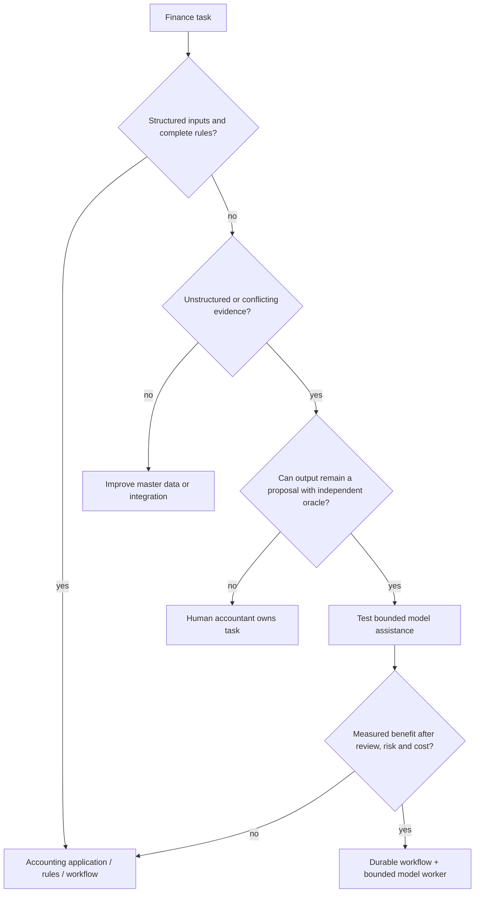

# Mission, Boundaries, Workload Fit, and Authority

> **Research date:** 2026-08-31  
> **Maturity:** Production scope and authority blueprint; deployment-specific accounting and control owners must approve the boundary.

## Mission

Build an evidence-first finance operations system that helps accountants move ordinary AP/AR, reconciliation, journal-preparation, intercompany, and close work from intake to a verified outcome without transferring professional judgment or accounting-system authority to a model.

The agent's product outcome is not “better financial prose.” It is a smaller, measurable set of correctly resolved exceptions; faster reconciliations and close tasks; complete evidence; fewer duplicate or stale actions; and no erosion of internal controls.

## The workload qualification test

Use an agent only when all of these are true:

1. the case contains genuine semantic ambiguity across notes, remittance text, supporting documents, or conflicting source records;
2. more evidence may be selected dynamically based on intermediate findings;
3. the result remains a bounded proposal, candidate match, question, or explanation;
4. a real environment outcome can be verified independently of the model; and
5. representative evaluation shows benefit over deterministic rules plus an ordinary review queue.

Reject the agent when structured identifiers and rules already determine the answer.

## Deterministic alternative by problem shape

| Problem | Simpler default | Add model assistance only for |
|---|---|---|
| Exact invoice/PO/receipt match | Three-way match rules | Ambiguous descriptions, partial receipt narratives, or missing-reference triage |
| Cash application with references | Reference/amount/date rules | Remittance ambiguity and several plausible open-item groups |
| Bank statement import | ISO 20022/BAI/vendor parser plus rules | Free-text bank narratives and ambiguous composite matches |
| Recurring accrual | Scheduled rule/template | Evidence summarization or anomaly explanation; not amount calculation |
| Account roll-forward | SQL/calculation service | Explaining unsupported movements or locating missing evidence |
| Close checklist | Workflow engine | Dynamic blocker triage across notes and evidence |
| Journal validation | ERP validation/rules | Drafting purpose/evidence and proposing already-permitted lines |
| Consolidation/elimination | Consolidation engine | Pairing mismatches and explaining residuals |
| Financial statement or filing | Consolidation/reporting/filing software plus qualified review | Draft narrative support only, outside this blueprint's commit authority |

The deterministic baseline is also the safe fallback when the model, provider, or evaluation system is unavailable.

Choose the least complex mechanism that satisfies the proof obligation:

| Alternative | Choose it when | Do not add an agent because |
|---|---|---|
| Deterministic rule/calculation | Inputs, thresholds, mapping, arithmetic and outcome are complete and stable | A model makes reproducible accounting logic less reliable and harder to reperform |
| Reconciliation engine | The problem is set comparison, allocation, residual proof and known exception classes | Candidate generation and balance proof are optimization/data tasks, not language tasks |
| Workflow/checklist | Work consists of owners, prerequisites, approvals, timers, evidence and escalations | Dynamic prose planning does not improve a known control path |
| RPA | A stable legacy UI has no supported interface and a bounded read/export step is unavoidable | RPA is a temporary integration bridge; keep it read-only, instrumented and covered by a replacement plan—never use it to post/pay |
| Accountant or specialist | Policy, materiality, estimate, cutoff, fraud/AML, tax, contract, consolidation perimeter, certification or unusual treatment requires accountable judgment | The output cannot safely remain a bounded proposal with a deterministic oracle |

Do not hide poor master data, unclear ownership, missing system APIs, or review understaffing behind model reasoning. Fix the process or keep the human decision.

## Category separation in operational terms

| Incoming work | Finance/accounting action | Mandatory handoff |
|---|---|---|
| Cloud invoice allocation dispute | Reconcile approved allocation to AP/GL representation | FinOps owns cost allocation economics and savings claims |
| Suspicious payee or transaction pattern | Freeze ordinary automated resolution and preserve evidence | Fraud/AML investigates network, typology, and reporting obligations |
| PDF invoice or bank statement | Consume verified fields with page/region provenance | Document intelligence re-extracts uncertain facts |
| New supplier selection or price negotiation | Account for approved supplier transaction | Procurement owns sourcing/award and conflict controls |
| Control operating evidence | Produce complete process evidence | Compliance/internal/external audit independently tests effectiveness |
| Contract clause or legal interpretation | Record approved accounting consequence | Legal owns interpretation and privilege |

Do not let routing become evasion. A finance case referred to fraud remains blocked until an authorized disposition returns; the agent may not relabel suspicious evidence as an ordinary mismatch to meet close deadlines.

## Representative task contracts

### Bank-reconciliation candidate

**Input:** named legal entity, bank account, ledger cash account, statement ID/version, cutoff, currency, GL population, deterministic unmatched set, policy version.  
**Model decision:** which permitted evidence query best discriminates candidates; rank only candidates supplied by deterministic blocking.  
**Output:** candidate group, supporting and contradicting evidence, confidence band, missing facts, proposed disposition.  
**Oracle:** approved match produces balanced remaining populations and an independently verified bank-to-GL reconciliation.  
**Forbidden:** invent transaction IDs, change dates/amounts, approve a fee journal, or release payment.

### Journal proposal

**Input:** approved business purpose, exact entity/ledger/book/period, evidence snapshot, allowed account set, accounting-policy reference supplied by humans, currency/FX policy, reversal requirement, materiality route.  
**Model decision:** assemble a draft from permitted line candidates or abstain.  
**Output:** balanced proposal with line-level evidence, rationale, uncertainty, tax/reversal flags, and no posting status.  
**Oracle:** deterministic validation and authorized accountant review; later ERP posting/rejection and reread.  
**Forbidden:** select accounting policy, set materiality, open a period, approve, post, or certify.

## Requirements worksheet

Document these before architecture selection:

| Dimension | Required answer |
|---|---|
| Reporting boundary | Legal entity, consolidation group, ledger/book, accounting basis, jurisdiction, fiscal calendar |
| Process boundary | AP, AR, cash, fixed assets, inventory, payroll, tax, treasury, close, consolidation; name inclusions and exclusions |
| Authority | Read, propose, stage, hand off; forbidden posting/payment/master-data/period/certification actions |
| Latency | Interactive exception, hourly matching, daily reconciliation, close-day deadline, or long approval wait |
| Volume | Documents, transactions, accounts, entities, currencies, close tasks, peak-to-average ratio |
| Data quality | Completeness signals, late data, duplicates, corrections, master-data ambiguity, unsupported sources |
| Money | Currency set, scale, rounding, FX source/rate type/date, entered/accounted/reporting bases |
| Materiality | Owner, policy version, quantitative and qualitative routing; never a model default |
| Evidence | Assertion, source, independence, reliability, completeness, retention, reviewer needs |
| Human work | Preparer, reviewer, approver, poster, certifier, escalation and time-zone coverage |
| Failure tolerance | Maximum unresolved difference, stale source age, recovery time, duplicate tolerance (normally zero) |
| Privacy/security | Personal data, bank data, compensation, vendor/customer details, secrets, residency, access |
| Outcome | Correct-match rate, residual aging, close duration, late adjustments, reopenings, reviewer effort, cost |

## Accounting assertions as evaluation slices

Assertions differ by framework and engagement, and accountable finance/audit owners must select them. A useful engineering map is:

| Concern | Example system question |
|---|---|
| Existence/occurrence | Does this recorded item correspond to a real authorized event? |
| Completeness | Did the declared source population and cutoff include all applicable items? |
| Rights and obligations | Is the item attributable to the correct entity and counterparty? |
| Valuation/allocation | Were amount, currency, rate, estimate, allocation, and aging applied under approved policy? |
| Cutoff | Is the event in the correct accounting period under the organization's rule? |
| Classification/presentation | Are account, dimension, current/noncurrent, related-party, and disclosure mappings approved and consistent? |

The model may help gather evidence. It must not declare an assertion satisfied merely because evidence sounds plausible.

## Authority design

### Role separation

| Role | May do | Must not also do for the same item |
|---|---|---|
| Requester/source owner | Supply business purpose and evidence | Solely approve or post |
| Preparer | Resolve case and prepare proposal | Independently approve material/consequential item |
| Reviewer | Challenge evidence, classification, and calculation | Inherit preparer identity through a shared service account |
| Approver | Authorize the exact effect within delegated limits | Change the payload after approval |
| Posting/payment system | Revalidate and commit under deterministic rules | Accept model text as authorization |
| Reconciler/certifier | Verify downstream result and close status | Hide unresolved or contradictory evidence |
| Auditor/compliance tester | Independently assess controls/evidence | Operate the finance process being tested |

Small organizations may need compensating controls—additional review, randomized inspection, restricted system access, or owner oversight—but the exception must be explicit and approved. A model is not an independent second person.

### Approval invalidation

Require new approval when any material field changes:

- legal entity, ledger/book, period, account or dimension;
- entered/accounted/reporting amount, currency, FX rate or rounding;
- source population, evidence digest, cutoff, or completeness status;
- accounting-policy/materiality/control version;
- reversal date/method, tax treatment, counterparty, or intercompany pair;
- target ERP object version or period status;
- approver role/scope, delegation, SoD result, expiry, or organization policy; or
- downstream package digest.

## Nonfunctional acceptance targets

Targets are organization-specific, but each deployment must set:

- **correctness:** zero unbalanced proposals and zero cross-entity/period commits; critical deterministic invariants always pass;
- **safety:** zero unauthorized posting/payment/master-data/period effects in required trials;
- **reliability:** every accepted command has one terminal or owned unresolved state; all unknown effects reconcile;
- **freshness:** source and policy age is visible and enforced per workflow;
- **capacity:** peak close load has bounded queues and reserved reconciliation capacity;
- **explainability:** every proposed line/match resolves to evidence and deterministic calculations;
- **privacy:** raw financial content is minimized and excluded from broad diagnostic telemetry;
- **cost:** cost per verified resolution, not cost per model call, stays inside budget; and
- **operability:** accountants can continue through deterministic/manual procedures during provider outage.

## When to stop at each authority level

| Evidence | Maximum appropriate level |
|---|---|
| Semantic benefit not proven | Deterministic baseline |
| Good offline ranking, weak source completeness | FA0 |
| Real read-only benefit, uncertain draft semantics | FA1 |
| Draft fidelity and duplicate controls proven, posting integration immature | FA2 in sandbox only |
| Exact approval, SoD, target revalidation, receipt, reread, and recovery proven | FA3 handoff for named workflows only |
| Desire for autonomous posting/payment/certification | Stop; FA4 is outside scope |

## Workload-fit exit checklist

- [ ] A deterministic baseline and manual workflow are measured.
- [ ] The remaining ambiguity genuinely benefits from model-directed evidence selection or synthesis.
- [ ] The authoritative system and real-state outcome oracle are named.
- [ ] Category handoffs and non-goals are accepted by adjacent owners.
- [ ] Legal entity, ledger/book, period, currency, accounting basis, policy, and materiality owners are named.
- [ ] FA4 capabilities are technically absent from the model runtime.
- [ ] SoD is checked across human and service identities.
- [ ] Required evaluation tasks can reach an unambiguous expert verdict.
- [ ] Expected business benefit exceeds review, integration, incident, and model cost.

## Research basis

- [Finance/accounting research packet and source register](../../research/packets/finance-accounting-agent-blueprint.md)
- [NIST SP 800-53 Rev. 5, including segregation of duties and least privilege](https://csrc.nist.gov/pubs/sp/800/53/r5/upd1/final)
- [IFRS Practice Statement 2: Making Materiality Judgements](https://www.ifrs.org/issued-standards/list-of-standards/materiality-practice-statement/)
- [SEC Staff Accounting Bulletin No. 99: Materiality](https://www.sec.gov/interps/account/sab99.htm)

Next: [Reference architecture, technology, and integrations](02-reference-architecture-technology-and-integrations.md).
