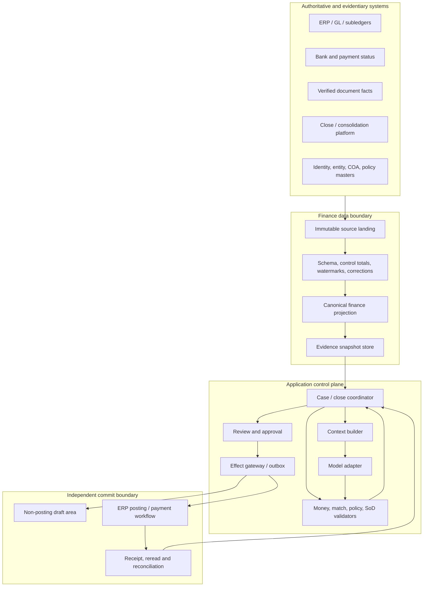
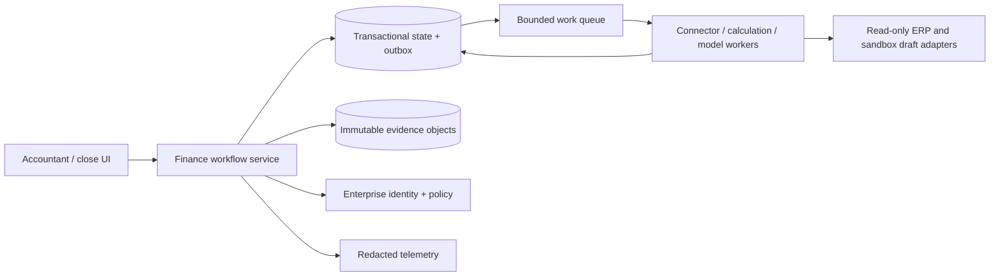

# Reference Architecture, Technology, and Integrations

> **Research date:** 2026-08-31  
> **Maturity:** Production integration blueprint; verify every provider API against the deployed edition, version, tenant, and region.

## Selected architecture

Use a deterministic finance control plane around a bounded model worker:

- native ERP/accounting/bank/document APIs and exports provide observations and receipts;
- immutable landing plus completeness controls preserve what was received;
- a finance canonical model resolves entity, ledger, account, period, document, transaction, and money identities;
- deterministic services calculate, validate, match, apply policy, enforce SoD, and authorize effects;
- a durable coordinator owns cases, close tasks, waits, deadlines, approvals, and recovery;
- a context builder sends only evidence required for one bounded judgment;
- the model returns a typed proposal or abstention; and
- existing accounting/payment workflows, not the model runtime, retain commit authority.



## Component contract

| Component | Owns | Must not own |
|---|---|---|
| Connector/landing | Source calls/files, raw bytes, schema/version, delivery metadata | Accounting interpretation or silent normalization |
| Completeness service | Control totals, page/file manifests, watermarks, duplicate/correction detection | Declaring missing data immaterial |
| Canonical projection | Stable cross-source identifiers and typed facts | Overwriting raw source or becoming the ERP ledger |
| Calculation/match services | Decimal arithmetic, balance rules, deterministic candidates and scores | Accounting-policy or materiality judgment |
| Evidence store | Immutable snapshots, digests, provenance, access and retention | Sampled diagnostics |
| Coordinator | Workflow state, ownership, deadlines, approvals, effects, terminal outcome | Monetary truth or hidden conversational state |
| Context builder | Purpose-limited selection, trust/freshness labels, token budget, compaction | Credentials, unrestricted queries, policy mutation |
| Model worker | Evidence-backed proposal, ranking, explanation, abstention | Authorization, posting, materiality, certification |
| Policy/SoD service | Current access, limits, conflicts, approval requirements | Inferring identity from model text |
| Effect gateway | Canonicalize, revalidate, dispatch, receipt and reconciliation state | Granting broader downstream API access to the model |
| Audit evidence service | Unsampled control records and export package | Treating trace data as complete business evidence |

## Architecture decision table

| Path | Durability | Control | Integration burden | Best fit | Decision |
|---|---|---|---|---|---|
| Custom synchronous loop | Low | High for small surface | Low initially | Offline/read-only ranking | Use only Stage 1 or very short FA0 tasks |
| Database + queue + explicit state machine | Medium/high | High | Moderate | First real reconciliation/case workflow | Recommended starting production shape |
| Durable workflow engine | High | High if semantics are understood | Higher operational and versioning burden | Long close calendars, approvals, timers, recovery | Adopt when observed requirements justify it |
| ERP-native workflow + external model activity | Product-dependent | Strong near posting | Vendor-specific | Mature ERP process with supported extension point | Prefer when audit/control evidence is adequate |
| Close/reconciliation SaaS as coordinator | Product-dependent | Often strong for finance work | Connector and commercial dependency | Existing strategic platform | Qualify APIs, state, exports, SoD, retention, DR |
| RPA/browser automation | Fragile | Weak target/effect semantics | High maintenance | Temporary read-only legacy bridge | Reject for posting/payment; replace with supported interface |
| Multi-agent orchestration | Complex | More handoff/authority risk | High | Independently governed, separable specialist services | Reject for initial design |

See [custom loop versus framework versus workflow engine](../../comparisons/custom-loop-vs-framework-vs-workflow-engine.md) for reusable runtime trade-offs.

## First deployment topology

Do not start with microservices for each accounting noun. One deployable service plus workers can preserve the boundaries:



Split services later only for materially different credentials, data residency, scaling, or failure isolation. A separate effect worker is justified early because it holds different credentials and has stricter approval/reconciliation semantics.

## Integration classes

### ERP and accounting systems

Use the supported interface closest to the authoritative record. Representative current surfaces show why adapters must be versioned and tested:

| System pattern | Example official surface | Engineering consequence |
|---|---|---|
| SAP S/4HANA | Synchronous and asynchronous journal-posting SOAP services; asynchronous requests use message identifiers and confirmations | Keep posting API outside the model; pin communication scenario/version; reconcile confirmation and accounting document ID |
| Oracle Fusion Financials | Versioned REST resources for journal batches/headers and release-specific schemas | Pin resource version and runtime customizations; treat batch completion, approval, posting, and errors as distinct states |
| Dynamics 365 Business Central | Journal and journal-line resources plus a bound posting action | Expose line/draft creation separately from `post`; the model credential must never reach the bound posting action |
| NetSuite | REST/SOAP journal records, external IDs, asynchronous jobs, optional idempotency keys | Define external-ID namespace, batch limits, job polling, and postcondition rereads; do not assume all operations share idempotency |
| Xero | Manual-journal drafts/posts, journal reads, explicit scopes, rate limits, and short-lived idempotency caching | Prefer draft status; maintain application idempotency beyond provider key retention; queue pagination and reread results |

These examples establish mechanics, not a recommended vendor list. Generate adapter code from the current official schema where practical, record account/tenant configuration, and test the exact licensed deployment.

### Bank and payment integrations

Prefer read-only statement and status channels for the agent. ISO 20022 provides versioned message definitions, not a promise that every bank implements the same message version or usage guideline.

- preserve bank account identity, statement/message ID, sequence, version, creation time, entry status, booking/value dates, currency, amount, debit/credit indicator, references, and raw artifact digest;
- distinguish report (`camt.052`), statement (`camt.053`), and debit/credit notification (`camt.054`) semantics where used;
- pin bank/community usage guidelines, not just “ISO 20022”; and
- treat payment initiation/status, host-to-host files, and open-banking APIs as separate authority classes.

The model may read purpose-limited payment status for reconciliation. It must not create or release payment instructions, change beneficiary/bank data, or reuse an account-information consent for money movement.

### Document and e-invoice integrations

Consume a verified fact contract from [document intelligence](../document-intelligence-agent/README.md), including original digest, document/page/region provenance, extraction release, confidence, and reviewer corrections. For structured invoices, validate the applicable syntax and jurisdictional profile deterministically. OASIS UBL, EN 16931, and Peppol profiles evolve independently; the 2026 EN 16931 transition is a concrete reason to pin rules and jurisdiction rather than accept “valid XML.”

Never let invoice notes, embedded URLs, or attachment text become agent instructions. Original and normalized records remain linked; a corrected extraction invalidates affected matches and approvals.

### Close, reconciliation, and reporting platforms

Commercial products such as BlackLine, FloQast, Trintech, and Workiva can provide established task, reconciliation, journal, consolidation, reporting, and audit surfaces. They can reduce custom workflow, but they do not remove application responsibility.

Qualify each product for:

- API and export coverage for the licensed modules;
- legal-entity/account/period identity and stable external keys;
- read, draft, approve, post, certify, and admin permission separation;
- event delivery, pagination, rate/concurrency limits, ordering, and correction behavior;
- idempotency, async jobs, receipts, audit logs, and deletion/retention;
- sandbox/test tenant, backup/export, outage fallback, and contract exit;
- data residency, subprocessors, model use, and sensitive-content controls; and
- behavior under close peak, bulk backfill, and partial integration failure.

Reject a platform extension if it only offers broad API keys, hides approval/effect lineage, cannot export evidence, or requires the agent to share an administrator/poster identity. Vendor marketing about AI or “autonomous close” is not control evidence.

## Third-party connector decision

| Choice | Prefer when | Main risk | Required guardrail |
|---|---|---|---|
| Native API/official SDK | Critical accounting semantics and current support matter | More adapters | Contract tests and version owner |
| Managed finance connector | Product supports exact objects and evidence needed | Hidden transformations or lag | Raw landing, mapping manifest, reconciliation, exit export |
| iPaaS | Organization already operates it with strong identity/monitoring | Broad credentials and opaque retries | Per-flow identity, no generic model tool, semantic idempotency |
| File/SFTP | Bank/legacy interface is authoritative | Partial files, replays, naming ambiguity | Manifest, digest, sequence, atomic arrival, archive, control totals |
| Browser/RPA | No supported read interface exists | Stale UI, wrong account, unreconciled effects | Read-only temporary bridge with visual/state oracle and replacement plan |

## Tool and connector admission contract

Before any connector reaches production, record:

```yaml
connector:
  id: sap-s4-ledger-read
  owner: finance-platform
  product_release: "S/4HANA Cloud 2602"
  api_release: "Journal Entry Item Read API/pinned schema"
  edition_plan_modules: "Public Edition / licensed finance modules"
  region_base_url: "deployment-specific"
  tenant_and_entity_scope: ["tenant_acme", "entity_IN01"]
  identity: workload://finance-read-prod
  operations_manifest: finance-connectors/sap-s4-read/operations-v4
  forbidden_operations: [post_journal, open_period, change_master_data]
  data_classes: [confidential_financial]
  retention: "organization policy reference"
  conformance_tests: evidence://connector-tests/...
  reviewed_at: 2026-08-31
```

Discovery metadata and tool descriptions are hints. The application-owned registry determines actual operation, authority, schema, version, and tests.

## Operation-level capability manifests

Qualify operations, not products. The same product may expose harmless reads, authoritative writes, irreversible actions, and plan-gated audit exports behind one credential. Every callable operation has a manifest such as:

```yaml
operation_capability:
  capability_id: business-central.purchase-invoice.read.v2
  adapter_release: bc-adapter-12
  product:
    name: Dynamics 365 Business Central
    edition_plan_modules: deployment-specific
    tenant_environment_region: [tenant-guid, Production, region]
    api_and_schema: [v2.0, pinned-openapi-digest]
  operation:
    method_path: GET /companies({companyId})/purchaseInvoices({id})
    authority: observe
    accounting_semantics: unposted_purchase_invoice_read
    side_effect_class: none
  scope:
    companies: [company-guid]
    legal_entities: [entity_IN01]
    allowed_fields: [id, vendorId, invoiceDate, currencyCode, status, totals]
  consistency:
    freshness: source-reread-required
    pagination: not_applicable
    finality: mutable_until_posted
    correction_model: provider-versioned-resource
  delivery:
    timeout_ms: 15000
    rate_and_concurrency: measured-tenant-budget
    retry_class: read-bounded
    idempotency: read-only
    webhooks: none
  proof:
    completeness_or_absence: exact-id-read
    provenance: [provider-request-id, response-digest, etag, observed-at]
    reconciliation: map-posted-successor-and-reread
  prohibited_sibling_actions:
    - POST .../purchaseInvoices({id})/Microsoft.NAV.post
  qualification_evidence: evidence://connector/bc/purchase-invoice-read/2026-08-31
```

The manifest records plan/edition/module availability, tenant and environment, region/base URL, API and schema release, permission/scopes, object state, pagination, rate/concurrency budget, timeout, webhook behavior, finality, idempotency scope/lifetime/cached-error behavior, correction semantics, evidence fields, and a tested non-authority list. A provider label such as `draft`, `approved`, `posted`, `complete`, or `settled` is mapped to an internal meaning only after qualification.

## Required capability rows by system class

These are candidate surfaces to qualify, not endorsements or a claim that every plan exposes them:

| System class | Minimum read capabilities | Separately qualified mutations | Default excluded authority | Current official examples and limits to verify |
|---|---|---|---|---|
| ERP, GL, AP, and AR | Legal entity/ledger/COA/period; journals and lines; invoices/open items; distributions; payment/accounting status | Internal non-posting proposal or provider draft only where isolation is proven | Post, delete posted history, open period, approve invoice, apply cash, change master data | SAP synchronous/async journal services; Oracle Fusion 26B versioned resources/runtime customizations; Business Central draft resources and distinct bound `post`; NetSuite account concurrency/async/external IDs; Xero plan/scopes/rate limits |
| Banking and payment | Accounts, statements/transactions, consent status, instruction/status/returns | None in the agent plane; approved intent may enter an independent treasury workflow | Create/release/recall payment, change beneficiary, reuse read consent for payment | ISO 20022 plus bank usage guide; Open Banking UK v4 account-consent creation is documented as non-idempotent; Stripe key retention, cached first results, duplicate/out-of-order webhooks, and API-versioned event shapes |
| Expense and spend | Card transaction, receipt, expense/report, accounting export and reimbursement status | Comment/request-evidence or isolated coding proposal | Reimburse, issue card, change limit, create vendor, initiate bill payment | Brex separates Expenses, Accounting, Transactions, Payments, and Team scopes and changes APIs on a rolling schedule; Ramp exposes multiple bill/pay/vendor/approval surfaces, sandbox and OpenAPI—qualify each, never the product name |
| Tax | Rate/result read, estimate/calculation, transaction lookup, jurisdiction evidence | Commit, adjust, refund, lock, or void only in a tax-owned deterministic workflow | Tax interpretation, return approval, filing, nexus or treatment decision | AvaTax v2 distinguishes unrecorded estimate types from recorded/committed transactions and uses company + transaction code + type identity; product subscription and role requirements apply |
| Document, OCR, and e-invoice | Original bytes/digest, page/region text, extracted fields/confidence, processor/model version, human corrections, syntax/profile validation | Submit analysis and obtain async result; no accounting mutation | Treat extraction as verified invoice, approve, pay, or let document text select tools | Azure Document Intelligence `2024-11-30` GA returns an operation location; Google Document AI has processor versions, regions, release channels and page quotas; UBL/Peppol profiles require pinned rule releases |
| E-signature | Envelope/document/recipient IDs, status, certificate and event history | Send/void only in a legal-owned agreement workflow, outside finance agent authority | Treat `completed` as accounting approval, policy adoption, or payment authorization | DocuSign account-level Connect availability can be plan-dependent; notifications may skip intermediate states and retry—reread the envelope and validate signers/document digest |
| Reconciliation, close, and workflow | Reconciliations/items, tasks/dependencies, evidence, process runs, audit/activity export | Update one exact task/reconciliation disposition under human role policy | Certify reconciliation/close/control, alter sign-off, erase audit history | FloQast services/scopes and region-specific host; Workiva `X-Version`, integration-user permissions, scopes, 2026 API migration, rate/time/payload limits; BlackLine module/API coverage must be checked in the licensed tenant |
| Audit and evidence systems | Activity/audit events, immutable artifacts/manifests, retention/hold state, export | Append evidence or create successor package | Conclude control effectiveness, delete held evidence, impersonate reviewer/auditor | Workiva Activities requires scopes and admin role; close/vendor audit claims are not evidence of completeness; preserve an internal export and digest |

## Connector qualification suite

Admission requires evidence for each manifest row:

1. **Availability:** prove the exact operation exists in the licensed plan/module, tenant, environment, and region; record base URL, feature flags, deprecation/sunset, support path, and schema digest.
2. **Authority:** enumerate granted and denied operations with a real token; negative-test sibling posting, payment, master-data, period, approval, certification, admin, and delete actions.
3. **Identity and time:** round-trip canonical IDs, source versions, effective dates, status times, and posted-successor mappings; reject display-name joins.
4. **Completeness:** exhaust pagination, cursors, expanded children, files, async jobs, and incremental windows; detect repeated cursors, late rows, deletes, corrections, and offset drift with control totals.
5. **Finality:** map every provider status to internal provisional/accepted/applied/settled/returned/reversed meanings and prove the authoritative reread. Webhook receipt alone never establishes finality.
6. **Idempotency and ambiguity:** measure key scope/lifetime, parameter comparison, cached errors, duplicate callbacks, ordering, and timeout-after-application; prove internal intent lookup and semantic reconciliation after the provider window expires.
7. **Partial failure:** force mixed-success batches, quota exhaustion, token expiry, and schema changes; persist per-item results and never replay proven successes.
8. **Security and data handling:** verify tenant/entity filters, secrets path, scopes, webhook signature/replay controls, egress, residency, subprocessors, logs, retention/deletion/hold, and sensitive-field minimization.
9. **Operations:** load-test close peaks within provider limits, exercise outage/manual import/export, rotate/revoke credentials, restore state, and prove evidence export without vendor UI access.
10. **Change control:** rerun contract fixtures in a sandbox before API/model/rule deadlines, canary the entire adapter release, and automatically quarantine incompatible responses.

A connector is qualified only for the tested tuple `(operation, plan/module, tenant/environment, region, API/schema release, permission set)`. Passing one read operation does not admit another read, a draft operation, or any mutation.

## Model and framework strategy

- Start with one provider-neutral model adapter and strict structured output.
- Route deterministic calculations, entity resolution, policy, matching constraints, and validation away from the model.
- Use a smaller model for bounded classification only after slice-specific evaluation; use a more capable model for complex evidence synthesis only when measured benefit justifies cost.
- Do not use a mutable “latest” model alias in a controlled release without a snapshot/version record and regression gate.
- Provider-hosted state, background runs, tool execution, or memory are optional mechanisms. The application still owns run state, data map, deletion, effect policy, and evidence.
- A framework is acceptable when its cancellation, tool, checkpoint, approval, telemetry, and version semantics pass adoption tests. Do not expose its generic tool registry directly to finance users or the model.

## Adoption tests

- [ ] Kill a worker during source pagination; completeness and resume remain correct.
- [ ] Replay the same bank file, webhook, and ERP export; no source row or case is duplicated.
- [ ] Change a schema/optional field and prove quarantine or compatible parsing.
- [ ] Revoke the connector identity while a close task waits; resume reauthorizes rather than using stale access.
- [ ] Prove the model runtime cannot call posting, payment, period, bank-master, or admin operations.
- [ ] Create a draft then lose the response; reconciliation finds the exact downstream object without duplicating it.
- [ ] Export the complete evidence and audit trail without relying on sampled traces.
- [ ] Operate the manual/deterministic fallback during model and connector outage.

## Research basis

- [Finance/accounting research packet and provider source register](../../research/packets/finance-accounting-agent-blueprint.md)
- [SAP S/4HANA Cloud journal-entry API](https://help.sap.com/docs/SAP_S4HANA_CLOUD/b978f98fc5884ff2aeb10c8fdeb8a43b/f5c8d0579212c525e10000000a4450e5.html)
- [Oracle Fusion Cloud Financials journal batches API](https://docs.oracle.com/en/cloud/saas/financials/26b/farfa/api-journal-batches.html)
- [Business Central journal resource](https://learn.microsoft.com/en-us/dynamics365/business-central/dev-itpro/api-reference/v1.0/resources/dynamics_journal)
- [NetSuite asynchronous request execution](https://docs.oracle.com/en/cloud/saas/netsuite/ns-online-help/article_0127092747.html)
- [Xero Journals API](https://developer.xero.com/documentation/api/accounting/journals)
- [ISO 20022 message catalogue](https://www.iso20022.org/catalogue-messages)

Next: [Ledger, entity, period, money, and currency semantics](03-ledger-entity-period-money-and-currency-semantics.md).
