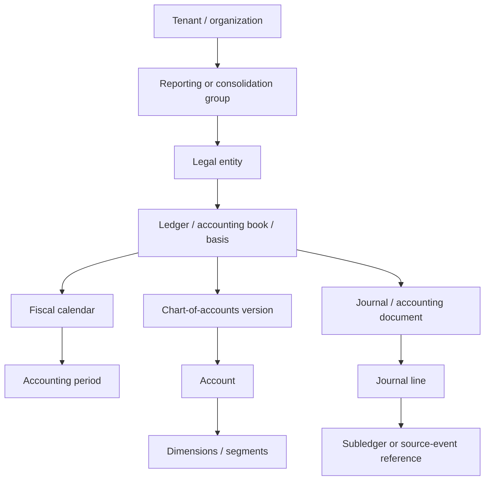

# Ledger, Entity, Period, Money, and Currency Semantics

> **Research date:** 2026-08-31  
> **Maturity:** Production semantic blueprint; the organization's adopted standards, books, COA, calendars, and FX policies remain authoritative.

Accounting correctness starts with identity and arithmetic. A plausible narrative cannot repair a journal assigned to the wrong entity, book, period, account, currency, or chart version.

## Authoritative truth model

There is no single generic “finance database.” Name the source of truth per fact and preserve its version:

| Fact | Authoritative owner | Agent projection |
|---|---|---|
| Legal entity, branch, company code | Entity/ERP master under governed change | Canonical ID plus effective-dated source key |
| Consolidation group and control conclusion | Approved consolidation/accounting governance | Read-only versioned group membership |
| Ledger, accounting book, accounting basis | ERP configuration and finance policy | Exact ledger/book ID and basis label |
| Chart and account master | ERP/COA governance | Effective-dated account ID, attributes, allowed dimensions |
| Accounting period and open status | ERP period-control module | Calendar/period ID, boundaries, current status and version |
| Posted journal and balance | ERP general ledger | Immutable reference plus extraction snapshot |
| AP/AR/fixed asset/inventory/payroll item | Respective subledger | Source item ID/version and GL link |
| Bank transaction/balance | Bank statement/status source | Statement/entry ID, sequence, status and raw digest |
| Payment status | Approved payment/bank system | Read-only status and reference for reconciliation |
| FX rate | Approved treasury/accounting rate source | Rate ID, type, quote basis, date/time, source and release |
| Materiality and accounting policy | Qualified management/governance | Read-only version and routing outcome |
| Workflow state and approval | Finance coordinator/approval service | Authoritative application record |
| Model proposal | Model-output artifact | Non-authoritative, versioned, evidence-linked candidate |

The canonical projection supports joins and validation; it does not supersede the original ledgers. When sources conflict, store the conflict and block affected completion.

## Identity hierarchy



Do not compress this path into `account=6100` or `period=Aug`. The same display value can mean different things across entities, books, charts, calendars, and time.

## Canonical identity contract

```json
{
  "tenant_id": "tenant_acme",
  "reporting_group_id": "group_global_v2026_07",
  "legal_entity_id": "entity_IN01",
  "source_company_code": "IN01",
  "ledger_id": "ledger_IN01_PRIMARY_IFRS",
  "accounting_basis": "IFRS",
  "book_type": "primary",
  "chart_id": "coa_global",
  "chart_version": "2026-04-01",
  "account_id": "acct_610500_travel",
  "source_account_code": "610500",
  "dimensions": {
    "cost_center": "CC-120",
    "profit_center": "PC-IND",
    "intercompany_partner": null
  },
  "period_id": "period_IN01_2026_08",
  "source_versions": {
    "entity_master": 32,
    "ledger_config": 18,
    "account_master": 4021,
    "period_status": 77
  }
}
```

Every alias resolver returns zero, one, or several canonical candidates with evidence. Only one exact permitted candidate may proceed. Never select “the closest” company, account, vendor, customer, or period.

## Effective-time and record-identity contract

Finance records need both **business-valid time** and **system-known time**. `valid_from`/`valid_to` answer when a fact governed the business; `recorded_at`/`superseded_at` answer when the platform learned or replaced it. Keep both because a master-data correction learned in September must not silently rewrite what an August close worker was allowed to know. Every replay or evaluation declares an `as_of_recorded_at` cutoff and excludes later corrections unless the test is explicitly about late evidence.

All canonical records carry `tenant_id`, `canonical_id`, `source_system`, `source_key`, `source_version`, `valid_from`, `valid_to`, `recorded_at`, `supersedes_id`, `status`, and `status_observed_at` where the source exposes them. Absence is explicit; it is never filled from a current display label. The following noun-specific identities are minimums:

| Record | Canonical identity and version | Effective-time rule | Invalid shortcut |
|---|---|---|---|
| Legal entity | Organization + legal-entity ID + governed source key/version; jurisdiction and lifecycle are attributes | Membership, ownership, name, jurisdiction, and activation use separate effective intervals | Company name, locale, email domain, or ERP company label |
| Book, ledger, and subledger | Separate book/ledger IDs with accounting basis, functional currency, balancing configuration; subledger ID plus source partition | Configuration version is pinned for the event/period; later configuration does not reinterpret posted history | “Primary,” tenant default ledger, or control-account code alone |
| Chart, account, and dimension | Chart ID/version + account ID; dimension type/value/set IDs and source versions | Account/dimension validity is checked at economic and posting dates under policy; successor mappings are new versions | Account label/code or free-text cost center without chart/entity scope |
| Accounting period | Calendar ID/version + period ID + period-status version | Period boundaries are calendar facts; open/close state is an observed, changing control fact re-read before effect | Month name, posting timestamp month, or “current period” |
| Business transaction | Source namespace + immutable business-event ID + event version; source rows link to it without replacing it | Event, service/delivery, document, posting, settlement, and ingestion times remain distinct | Amount/date/counterparty hash as the sole ID |
| Invoice and payment | Invoice ID/version scoped to entity and supplier/customer; payment instruction, execution, bank entry, settlement, return, and allocation each have separate IDs | Invoice correction and payment status changes append versions/events; `pending`, `accepted`, `settled`, `returned`, and `reversed` are not interchangeable | Invoice number globally; “paid” from one webhook or memo text |
| Journal and line | Journal/accounting-document ID/version + immutable line ID; source event and subledger distribution references | Drafts version by successor; posted lines are immutable in the projection and change through linked correcting entries | Header description + amount, or positional line number after an export reorder |
| Reconciliation and item | Reconciliation run/version + declared population snapshot IDs; item/allocation ID links exact source records and remaining amount | New source snapshot, cutoff, rule release, or correction creates a new run/proposal version | Zero net difference without complete populations and item lineage |
| Close task | Close-run ID + template/task-definition version + task-instance ID + dependency versions | Due clocks, reopenings, evidence requirements, and completion predicates are versioned per run | Checklist label or “done” boolean alone |
| Policy and rule | Governed policy/rule ID + immutable release + applicability predicate + approver | `effective_from`, `effective_to`, jurisdiction/entity/book scope, adoption decision, and retroactivity are explicit | Latest document, retrieved text, historical majority behavior, or model memory |
| Evidence | Artifact ID + content digest + source record/version + capture/transformation release | Evidence states `observed_at`, source-as-of, valid interval if applicable, and later correction linkage | Mutable URL, screenshot, prompt excerpt, or filename alone |
| Approval | Approval ID + proposal/evidence digest + policy version + approver identity/role-at-decision | Decision, expiry, revocation, delegation, and invalidating facts are timed; resume rechecks current eligibility | Chat assent, silence, group mailbox, or prior-period approval |
| Effect | Intent ID/version + attempt ID + idempotency key + provider request/object IDs | Intent precedes dispatch; acceptance, application, finality, read-back, and discovery times are separate | HTTP status, callback receipt, or locally marked success alone |
| Correction and reversal | New transaction/effect ID linked by `corrects_id`, `reverses_id`, or `supersedes_id` with reason and approval | Original remains as-of its history; corrective treatment and effective period are independently approved | Editing/deleting the original or negative amount without reversal semantics |
| Audit package | Manifest ID/version + content digest + case/event high-water mark + complete version pins | Package states preparation/review times and the exact as-of boundary; later additions create a signed successor | “Latest folder,” sampled trace, or regenerated narrative without a manifest |

Use immutable canonical IDs for joins and display labels only for people. If a source reuses an identifier after deletion, namespace it by source incarnation or reject the connector. If two sources disagree on identity or effective time, retain both assertions, mark the conflict, and block any dependent proposal or close predicate.

## Chart-of-accounts contract

An account record needs more than a code and label:

- canonical and source IDs;
- chart and version/effective interval;
- account type and normal balance where the source defines them;
- legal-entity/book availability;
- posting allowed/blocked status;
- required, allowed, and forbidden dimensions;
- reconciliation owner/type/frequency;
- subledger/control-account status;
- intercompany and elimination behavior;
- currency restrictions;
- tax/revaluation/translation flags where approved;
- deprecation and successor mapping; and
- source record version and extract time.

Do not let the model post to a control account, retained earnings, bank account, or reserved system account merely because a vendor API accepts a text account code. Provider constraints differ; for example, Xero rejects some reserved accounts for manual journals. The application registry is stricter than the provider's broad schema.

XBRL Global Ledger can be evaluated as an interchange vocabulary for heterogeneous detail, but it does not eliminate organization-specific charts, extension mappings, or source reconciliation. Do not introduce it unless a concrete interoperability need and consumer exist.

## Accounting-period contract

Represent a period independently from timestamps:

```json
{
  "period_id": "period_IN01_2026_08",
  "calendar_id": "cal_IN01_GREGORIAN_MONTHLY",
  "fiscal_year": 2026,
  "period_number": 8,
  "period_name": "Aug-26",
  "period_kind": "regular",
  "start_local": "2026-08-01",
  "end_local_exclusive": "2026-09-01",
  "calendar_timezone": "Asia/Kolkata",
  "status": "open_for_adjustment",
  "status_version": 77,
  "soft_close_at": "2026-09-04T18:00:00+05:30",
  "hard_close_at": null,
  "cutoff_policy_version": "cutoff-IN-12",
  "late_entry_route": "controller_review"
}
```

Keep at least these times distinct:

| Time | Meaning |
|---|---|
| Business/event date | When the underlying event occurred under source semantics |
| Document/invoice date | Date asserted on the document |
| Service/delivery period | Economic interval represented by the item |
| Booking/posting date | Date recorded by the accounting system |
| Accounting period | Fiscal bucket selected under policy |
| Bank booking/value date | Bank record dates with different settlement semantics |
| Source creation/update time | System processing timeline |
| Ingestion time | When the platform observed the record |
| Approval/commit time | Control and effect timeline |

The model may highlight a potential cutoff issue. Only an approved deterministic policy and authorized accountant select the accounting period. Revalidate period status immediately before staging/handoff.

## Exact-money contract

Never use binary floating point for authoritative money. Keep decimal value as a string or language decimal type and make currency explicit.

```json
{
  "entered": {"amount": "1250.375", "currency": "BHD", "scale": 3},
  "accounted": {"amount": "276430.25", "currency": "INR", "scale": 2},
  "reporting": {"amount": "3300.44", "currency": "USD", "scale": 2},
  "fx": {
    "rate_id": "fx_2026_08_31_BHD_INR_SPOT_01",
    "rate": "221.06974810",
    "quote": "INR per BHD",
    "rate_type": "approved_spot",
    "effective_at": "2026-08-31T16:00:00+05:30",
    "source": "treasury-rate-set-44"
  },
  "rounding": {
    "mode": "HALF_EVEN",
    "stage": "line_then_document",
    "policy_version": "money-IN01-9"
  }
}
```

### Money invariants

1. `amount` is never accepted without currency and semantic kind.
2. Entered, functional/accounted, and presentation/reporting currency amounts are different facts.
3. ISO 4217 codes and minor-unit metadata come from a versioned authoritative list; minor units do not by themselves define ledger precision or invoice rules.
4. Rates include source, rate type, quote direction, precision, effective date/time, and policy version.
5. Rounding occurs only at documented stages under one named rule.
6. Formatting and currency symbols are presentation concerns, not identity.
7. Negative value, debit/credit indicator, and reversal status are not conflated.
8. Tolerance is a policy outcome, not a hidden epsilon.
9. Crypto-assets, commodities, points, statistical units, or high-precision tax bases use an explicitly separate unit contract.
10. Summation and balance checks use full stored precision, then apply approved rounding exactly where policy requires.

ISO 4217 identifies currency codes and minor-unit relationships and is maintained by SIX. It does not decide which functional currency, exchange rate, accounting treatment, or rounding stage applies. Peppol/EN 16931 profiles may impose their own invoice decimal rules. Pin both the currency-list release and the applicable document profile.

## Journal proposal schema

```json
{
  "proposal_id": "jprop_01K...",
  "purpose": "August electricity accrual",
  "tenant_id": "tenant_acme",
  "legal_entity_id": "entity_IN01",
  "ledger_id": "ledger_IN01_PRIMARY_IFRS",
  "period_id": "period_IN01_2026_08",
  "journal_type": "accrual_proposal",
  "accounting_policy_ref": "policy://accruals/electricity/v7",
  "materiality_route": "controller_review_required",
  "entered_currency": "INR",
  "lines": [
    {
      "line_id": "1",
      "account_id": "acct_624100_utilities",
      "dimensions": {"cost_center": "CC-120"},
      "debit": "425000.00",
      "credit": "0.00",
      "evidence_ids": ["ev_meter_88", "ev_contract_9"]
    },
    {
      "line_id": "2",
      "account_id": "acct_211700_accrued_expense",
      "dimensions": {"cost_center": "CC-120"},
      "debit": "0.00",
      "credit": "425000.00",
      "evidence_ids": ["ev_calc_44"]
    }
  ],
  "reversal": {"required": true, "date": "2026-09-01", "method": "full"},
  "source_snapshot_id": "evsnap_close_IN01_2026_08_104",
  "behavior_release": "finacct-2026.08.1",
  "status": "proposed"
}
```

The schema deliberately has no `posted=true` field controlled by the model. Status changes come from the workflow and downstream receipts.

### Deterministic journal validation

Validate before review and again at handoff:

- exact entity, ledger, chart, accounts, dimensions, and period exist and are permitted;
- source and policy versions are current enough;
- entered and accounted debit totals equal credit totals by required currency/balancing segment;
- no line uses an unsupported control/system account or forbidden combination;
- tax, intercompany, related-party, project, cost-center, and segment requirements pass;
- period is in the correct allowed status;
- reversal requirement and date are consistent with policy;
- duplicates and already-posted economic events are checked by semantic identity;
- evidence is complete and still accessible;
- requester/preparer/reviewer/approver/poster conflicts pass SoD;
- approval binds the exact canonical payload digest; and
- target ERP validation/dry run succeeds where supported.

## Double-entry and subledger-to-ledger relationships

An accounting event may create several records. Preserve the graph:


Do not manufacture a journal to fix an AP/AR difference before determining whether the source subledger item, application, master data, or interface is wrong. Repair at the authoritative layer when possible; otherwise use an approved correction with explicit reason and residual impact.

## Source completeness contract

Every population snapshot records:

- connector and source release;
- entity/ledger/subledger/account/period filters;
- extraction start/end and source-as-of;
- pagination/file/message IDs and high-water mark;
- expected and observed row/document counts;
- entered/accounted totals by currency and debit/credit;
- opening/closing balance or other control total where available;
- duplicate, reject, late-arrival, and correction counts;
- completeness state: `complete`, `provisional`, `incomplete`, or `unknown`;
- original artifact digests and transformation release; and
- named owner and exception route.

`complete` means complete under a documented source contract for the declared cutoff—not universally final. A reopened period or late source correction creates a new snapshot and stales affected proposals, approvals, reconciliations, and close conclusions.

## Standards and organizational-policy uncertainty

- IFRS, US GAAP, local GAAP, tax books, statutory books, and management books can require different treatments. Never infer the basis from locale.
- IFRS 18 is issued and applies for annual periods beginning on or after 2027-01-01 unless earlier adopted; an implementation in 2026 must record whether it has been adopted and which presentation/policy mappings apply.
- IAS 8 distinguishes policy changes, estimate changes, and prior-period errors, with different treatment. The agent may assemble evidence but cannot classify the case authoritatively.
- IAS 21 introduces functional, foreign, and presentation-currency semantics. The agent cannot choose functional currency or rate policy.
- Materiality includes qualitative and quantitative context; neither IFRS Practice Statement 2 nor SEC SAB 99 supports a universal numeric threshold.
- Local e-invoicing, retention, tax, bank, filing, and audit rules can override or add requirements. Store the jurisdiction and authoritative interpretation used.

## Semantic acceptance checklist

- [ ] Every record joins through canonical tenant, entity, ledger/book, period, account, and source IDs.
- [ ] Effective dates and versions prevent current master data from rewriting historical meaning.
- [ ] Period and event/document/posting/booking/value/ingestion times remain distinct.
- [ ] Money uses exact decimals with explicit currency, scale, FX, quote, rounding, and policy.
- [ ] Entered, accounted, and reporting amounts are not overwritten into one value.
- [ ] Journal proposals balance and pass account/dimension/period/SoD/duplicate/evidence rules.
- [ ] Raw evidence and source completeness survive normalization.
- [ ] Corrections create lineage and invalidation rather than silent mutation.
- [ ] Accounting basis, standards adoption, jurisdiction, materiality, and policy uncertainty are visible.

## Research basis

- [Finance/accounting research packet and standards source register](../../research/packets/finance-accounting-agent-blueprint.md)
- [IAS 8 — Basis of Preparation of Financial Statements](https://www.ifrs.org/issued-standards/list-of-standards/ias-8-basis-of-preparation-of-financial-statements/)
- [IAS 21 — The Effects of Changes in Foreign Exchange Rates](https://www.ifrs.org/content/dam/ifrs/publications/pdf-standards/english/2022/issued/part-a/ias-21-the-effects-of-changes-in-foreign-exchange-rates.pdf?bypass=on)
- [ISO 4217:2015 currency codes](https://www.iso.org/standard/64758.html)
- [SIX currency-code maintenance](https://www.six-group.com/en/products-services/financial-information/market-reference-data/data-standards.html)

Next: [AP, AR, matching, and reconciliation](04-ap-ar-matching-and-reconciliation.md).
