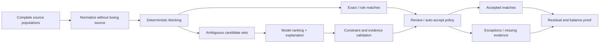
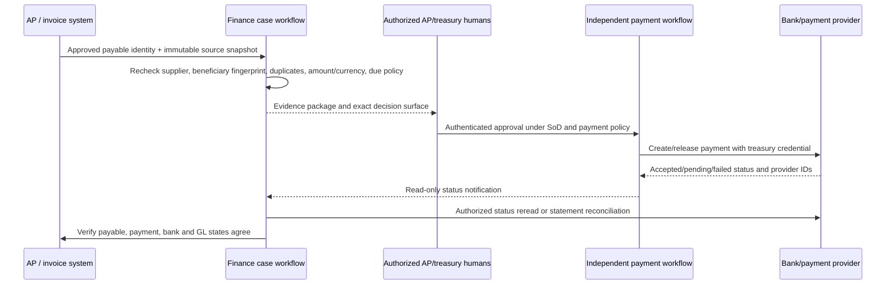
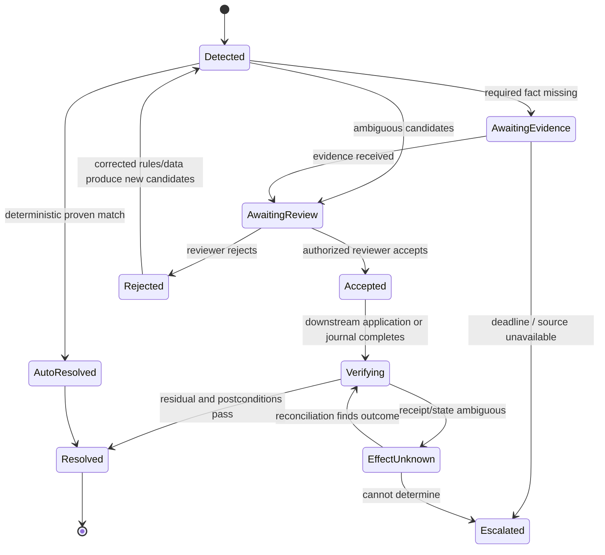

# AP, AR, Matching, and Reconciliation

> **Research date:** 2026-08-31  
> **Maturity:** Production workflow blueprint; matching tolerances, write-off/refund authority, and document/accounting policies are organization-specific.

## Design principle

Matching is a constrained search problem before it is a language problem. Deterministic rules generate valid candidates and enforce money/entity/period constraints. The model is allowed to rank or explain ambiguous candidates; it must never invent a source item or bypass a hard constraint.

## Reconciliation contract

Every reconciliation names two or more populations and a proof obligation:

```json
{
  "reconciliation_id": "rec_bank_IN01_110100_2026_08",
  "type": "bank_to_gl",
  "legal_entity_id": "entity_IN01",
  "ledger_id": "ledger_IN01_PRIMARY_IFRS",
  "account_id": "acct_110100_main_bank",
  "period_id": "period_IN01_2026_08",
  "currency": "INR",
  "left_population": "snapshot://bank/statement-884/v2",
  "right_population": "snapshot://gl/IN01/110100/2026-08/v4",
  "opening_balance": "15890442.20",
  "left_closing_balance": "17190410.75",
  "right_closing_balance": "17185410.75",
  "rules_release": "bank-match-12",
  "tolerance_policy": "bank-INR-3",
  "materiality_policy": "materiality-IN01-2026",
  "status": "difference_open",
  "difference": "5000.00"
}
```

The difference is calculated, not generated by the model.

## Matching pipeline



### Hard constraints

Typical hard constraints include:

- tenant and legal entity;
- account/subledger/customer/vendor scope;
- compatible currency and sign/debit-credit semantics;
- exact amount or an approved deterministic tolerance;
- permitted date/value-date window;
- candidate availability and unmatched status;
- no duplicate use of one source line unless one-to-many policy allows it;
- valid document/payment/reference types;
- period and cutoff policy;
- counterparty/master-data status; and
- aggregate match group balancing.

The model cannot relax a hard constraint. A human policy owner changes the versioned rule.

### Model-visible features

Provide minimized, typed features rather than raw exports:

- normalized remittance/reference tokens with original evidence link;
- approved counterparty aliases and confidence from master-data service;
- exact amounts/currencies and date deltas;
- invoice/open-item numbers and deterministic edit distance;
- known fee, withholding, discount, chargeback, split, netting, and transfer patterns;
- support/contradiction flags; and
- source freshness, completeness, and unresolved-correction warnings.

Do not send bank credentials, full statements, unrelated counterparties, unbounded ERP notes, or hidden policy text to the model.

## Candidate-match output

```json
{
  "match_proposal_id": "match_01K...",
  "reconciliation_id": "rec_bank_IN01_110100_2026_08",
  "left_ids": ["bank_entry_9921"],
  "right_ids": ["gl_line_818", "gl_line_819"],
  "match_type": "one_to_many",
  "left_total": {"amount": "104500.00", "currency": "INR"},
  "right_total": {"amount": "104500.00", "currency": "INR"},
  "hard_constraints": {"passed": true, "release": "bank-match-12"},
  "evidence": {
    "supporting": ["ev_remittance_44", "ev_reference_82"],
    "contradicting": ["ev_date_delta_5d"],
    "missing": []
  },
  "confidence_band": "review_recommended",
  "proposed_disposition": "accept_match",
  "model_release": "finacct-ranker-7"
}
```

Use calibrated bands tied to review policy, not a decorative percentage. Automatic acceptance, if ever allowed, is a deterministic policy for a narrowly proven match class and never a model decision alone.

## AP workflow

### AP in scope

- verify invoice identity and duplicate candidates;
- compare verified invoice facts with PO, receipt, contract-reference metadata, vendor master, tax result, and prior invoices;
- explain price, quantity, freight, tax, currency, date, and reference differences;
- request missing evidence;
- route exceptions and draft internal communications;
- prepare, but not approve, account/dimension or accrual suggestions; and
- reconcile invoice/accounting/payment status after authoritative systems act.

### AP outside authority

- create/change vendor or bank master;
- determine tax treatment or contract obligation;
- approve invoice, override tolerance, release payment, select payment method/date, or initiate payment;
- resolve suspected fraud; or
- source/select suppliers.

### AP decision table

| Condition | Deterministic action | Model role | Human/owner |
|---|---|---|---|
| Exact duplicate key/digest/reference | Block and create duplicate case | Summarize differences | AP reviewer disposes |
| Exact three-way match within approved rules | Continue existing AP workflow | None required | Existing approval/payment controls |
| Amount/quantity mismatch with clear arithmetic | Calculate variance and policy route | Explain evidence | Buyer/requester/AP resolves |
| Ambiguous service-period/coding note | Produce permitted account candidates | Rank/explain; abstain if insufficient | Accountant selects treatment |
| Vendor bank-detail change appears in invoice | Block | Flag as hostile/high risk | Independent vendor-master verification |
| Suspicious cross-vendor pattern | Preserve case/evidence | No investigative conclusion | Fraud/AML referral |

Document intelligence supplies extracted fields; AP validation must not convert extraction confidence directly into payment confidence.

### Invoice and match exception walkthrough

1. Ingestion stores the original invoice digest, extraction processor/version, page/region evidence, delivery channel, and source-as-of. It resolves exactly one tenant, legal entity, supplier master version, invoice identity, currency, and applicable PO/receipt population or blocks.
2. Deterministic controls check duplicate keys and similarity candidates, invoice arithmetic, tax-result reference, PO lines, goods/service receipts, tolerance policy, supplier status, bank-detail-change indicators, period/cutoff, and existing AP state.
3. Exact valid matches continue through the existing AP workflow without a model. An ambiguous residual becomes a case over a frozen snapshot; the model receives only permitted candidates and may explain price, quantity, service-period, reference, or missing-evidence differences.
4. The output separates supporting, contradicting, missing, and stale facts. It cannot alter the invoice, PO, receipt, supplier, tax result, tolerance, due date, or payment destination.
5. An eligible reviewer accepts, rejects, requests evidence, or creates a successor coding/accrual proposal. Any source, master, policy, amount, currency, period, or evidence change invalidates the disposition.
6. The AP system independently validates/approves under its controls. Finance rereads invoice validation, accounting distribution, posting reference, payment block, and exception state; the case closes only when the declared oracle and residual checks pass.

No-match, duplicate, bank-change, suspicious-pattern, tax-policy, contract, and materiality cases remain open with a named owner. Deadline pressure never converts them into matches.

## AR workflow

### AR in scope

- customer/open-item resolution;
- remittance interpretation;
- candidate one-to-one, one-to-many, many-to-one, short-pay, discount, fee, withholding, and unapplied-cash grouping;
- aging and follow-up evidence;
- dispute-case summary; and
- reconciliation of authoritative cash application and residual.

### AR outside authority

- write off balances, grant credit, change terms/limits, refund, alter customer master, send legal demand, or post cash application;
- decide revenue recognition or bad-debt estimate; or
- contact a customer without an approved communication workflow.

### Ambiguous cash application

Use deterministic optimization to enumerate groups that balance under policy. The model may use remittance text to rank a small candidate set. If several groups remain plausible, retain unapplied cash and ask for evidence. Close pressure is not evidence.

## Payment approval and status-reconciliation walkthrough

This is an observation and handoff flow, not payment autonomy:



The finance agent never creates the payee, changes bank details, selects the payment rail/date, supplies approval, or releases/recalls funds. A new beneficiary fingerprint, invoice-borne bank instruction, sanctions/fraud signal, split payment, returned item, webhook-only success, or ambiguous provider response blocks normal completion and routes to the appropriate AP, treasury, vendor-master, fraud/AML, or recovery owner. `approved`, `submitted`, `accepted`, `settled`, `returned`, and `reconciled` are separate states with separate timestamps and evidence.

## Reconciliation types

| Type | Populations | Key residual risk | Completion oracle |
|---|---|---|---|
| Bank to GL | Bank statement/entries vs cash-account GL | Missing file/entry, timing, fee, duplicate, wrong bank account | Opening + movements = closing on both sides; explained residuals |
| Subledger to GL | AP/AR/assets/inventory/payroll balances vs control account | Interface rejection, cutoff, mapping, direct GL post | Subledger control total equals GL under declared snapshot |
| Balance sheet | GL account vs support/roll-forward | Unsupported stale items, wrong classification, estimate | Balance fully supported or exception approved under policy |
| Intercompany | Entity A vs counterparty entity B | Currency, timing, partner/mapping, unrecorded side | Paired differences resolved and elimination result verified |
| Payment | Approved AP/payment records vs bank/payment status and GL | Duplicate, rejected/returned, unknown status | Payment and accounting status agree with authoritative identifiers |
| Clearing/suspense | Source events vs clearing GL and downstream application | Aged/unowned residue | Each item clears or has owned documented exception |

## Exception lifecycle



An exception stores reason, owner, service level, materiality route, affected assertions, supporting/contradicting evidence, candidate history, dispositions, correction lineage, and close impact.

## Reconciliation walkthrough

For a bank-to-GL run, freeze the bank statement/version and GL population at a declared cutoff; prove opening balance, movement totals, closing balance, row counts, currencies, and pagination/file completeness. Run exact and approved deterministic rules first. For each ambiguous residual, construct disjoint candidate sets and let the model rank without relaxing constraints. The reviewer disposes each proposal; accepted matches update allocation state through optimistic concurrency so two workers cannot consume the same item. Recompute both residual populations and the balance equation after every disposition. Fees, interest, timing items, errors, and missing entries remain typed exceptions; a journal is a separate approved workflow. A source correction or late item creates a successor run and reopens affected conclusions rather than mutating the signed reconciliation.

## Population and residual invariants

- Accepted match groups are disjoint unless the rule explicitly models partial allocation.
- Every allocation amount has exact currency and never exceeds remaining source amount.
- Source-to-match allocation plus residual equals original amount at stored precision.
- Reversals/returns create linked new events; they do not delete accepted history.
- Re-running the same rule release and snapshot reproduces candidates and deterministic scores.
- New evidence creates a new proposal version and invalidates prior approval when material.
- A reconciliation cannot be `complete` while a material effect is `unknown`.
- A zero difference is insufficient if either population is incomplete or two errors offset.

## Evaluation slices

Create balanced fixtures for:

- exact, near, one-to-many, many-to-one, partial, duplicate, timing, fee, withholding, discount, and return cases;
- same amount across several counterparties;
- same reference reused across periods/entities;
- OCR-confusable amount/reference;
- missing page, incomplete bank file, late subledger batch, and duplicate export;
- mixed currency and wrong quote direction;
- bank-detail-change injection and malicious memo text;
- valid candidate absent, requiring abstention;
- reviewer correction and subsequent rule/model release; and
- a fraudulent-looking case that must be referred without investigative conclusion.

Report candidate recall, top-1/top-k ranking, accepted-match precision, abstention quality, false-auto-match rate, residual aging, reviewer effort, and downstream correction/reopenings. Candidate recall is meaningless if the deterministic generator excludes the true match; evaluate generator and ranker separately.

## Reconciliation acceptance checklist

- [ ] Source populations and cutoff are complete or visibly qualified.
- [ ] Deterministic blocking and constraints precede model ranking.
- [ ] Candidate groups balance exactly under named money/tolerance rules.
- [ ] Supporting, contradicting, missing, and stale evidence are shown.
- [ ] No invoice or remittance content can alter authority or policy.
- [ ] AP approval/payment, AR write-off/refund, vendor/customer master, and fraud investigation remain outside scope.
- [ ] Residuals, unapplied items, and rejected candidates retain owners and deadlines.
- [ ] Completion uses authoritative downstream state and balance proof.

## Research basis

- [Finance/accounting research packet and source register](../../research/packets/finance-accounting-agent-blueprint.md)
- [ISO 20022 message catalogue](https://www.iso20022.org/catalogue-messages)
- [OASIS Universal Business Language 2.4](https://docs.oasis-open.org/ubl/UBL-2.4.html)
- [Peppol BIS Billing 3.0 validation rules](https://docs.peppol.eu/poacc/billing/3.0/rules/ubl-peppol/)
- [PCAOB AS 1105: Audit Evidence](https://pcaobus.org/oversight/standards/auditing-standards/details/AS1105)

Next: [Close, journals, intercompany, and consolidation](05-close-journals-intercompany-and-consolidation.md).
