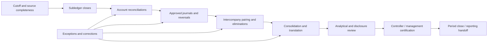
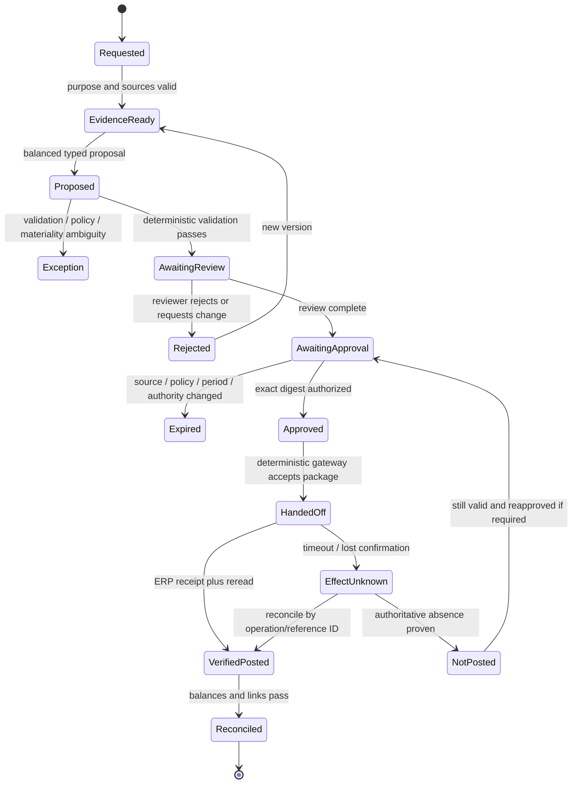

# Close, Journals, Intercompany, and Consolidation

> **Research date:** 2026-08-31  
> **Maturity:** Production workflow blueprint; accounting policy, group perimeter, materiality, approvals, posting, and certification remain externally governed.

## The close is a controlled dependency graph

Period close is not one agent run. It is a governed set of tasks across entities, ledgers, subledgers, reconciliations, estimates, approvals, postings, consolidation, reporting, and certification. The coordinator may prioritize and explain work; deterministic state and accountable owners decide whether a gate is satisfied.



The model can propose which evidence or owner is most likely to unblock a task. It cannot mark an upstream control complete because a downstream deadline is near.

## Close-run schema

```json
{
  "close_run_id": "close_group_global_2026_08",
  "reporting_group_id": "group_global_v2026_07",
  "period_id": "group_period_2026_08",
  "accounting_basis": "IFRS",
  "close_calendar_version": "close-cal-18",
  "policy_bundle": "close-policy-2026.08",
  "materiality_policy": "materiality-group-2026",
  "entities": ["entity_IN01", "entity_US01"],
  "state": "reconciliations_in_progress",
  "state_version": 92,
  "source_completeness": "qualified",
  "open_material_exceptions": 2,
  "pending_effects": ["effect_journal_188"],
  "certification_state": "not_started",
  "behavior_release": "finacct-2026.08.1"
}
```

Close state is distinct from ERP period status. A workflow may be complete while the period remains open for an authorized reason, or a period may be technically closed despite unresolved workflow/control deficiencies. Record both.

## Close task contract

Each task includes:

- legal entity, ledger/book, period, process/account scope, and dependency IDs;
- preparer/reviewer/certifier roles and SoD constraints;
- due time, calendar/time zone, escalation, and allowed late route;
- required source-completeness state and evidence list;
- deterministic completion predicate;
- materiality/policy/control versions;
- exceptions, proposed/approved/unknown effects, and downstream reread;
- reopen/correction policy; and
- perform/review actors and timestamps.

A checkbox with an attachment is not enough if the completion predicate requires a balance, source total, reviewer challenge, or downstream state.

## Journal preparation and handoff

### Journal lifecycle



### Proposal requirements

Every journal proposal states:

- business purpose and event identity;
- accounting-policy reference supplied by the organization;
- entity, ledger/book/basis, chart, period, journal category, and source;
- exact lines, dimensions, entered/accounted currencies, FX and rounding;
- line-level evidence and calculation IDs;
- whether it is recurring, accrual, allocation, correction, reclassification, elimination, top-side, or other approved type;
- materiality route and qualitative factors flagged;
- reversal requirement, date, method, and original link;
- preparer identity (including model release as an assisting component);
- duplicate key and target preconditions; and
- unsupported/contradictory/missing facts.

PCAOB AS 2401 highlights journal entries and other adjustments as a management-override risk and specifically calls out period-end, unusual, round-number, seldom-used-account, intercompany, and outside-normal-process characteristics. Use these as risk and evaluation signals, not as a model rule that decides fraud.

### Journal proposal through verified posting

1. A human-owned request names the business event, purpose, entity, book, period, accounting-policy reference, evidence requirement, and reversal expectation. Missing policy or materiality judgment routes to the controller before a proposal exists.
2. The platform freezes complete source snapshots and uses deterministic services to calculate accrual/allocation amounts, allowed accounts/dimensions, currency treatment, duplicate fingerprint, balance, and reversal dates. The model may synthesize evidence or choose among prevalidated line candidates; it cannot invent a rate or policy.
3. Validation creates immutable proposal version `n` and a digest. A reviewer challenges evidence and classification; an authorized approver signs the exact digest under SoD. Any edit creates `n+1` and invalidates prior decisions.
4. The deterministic gateway rereads period, account/dimension, source/policy, approver eligibility, aggregate materiality route, duplicate/effect ledger, target tenant/environment, and payload digest. It then hands the already-approved intent to the existing ERP workflow; the model has no posting credential.
5. `accepted` is not `posted`. Persist the provider request and document IDs, reread header/lines/status, compare semantic fields, link any rejection, and reconcile the GL/subledger/close task. A timeout becomes `EffectUnknown` and follows the recovery flow.
6. Only the accountable accountant/workflow marks the case complete. If the journal is recurring or reversing, successor clocks and expected downstream documents remain open until verified.

## Materiality routing

Materiality is contextual and human-owned. The system may calculate policy inputs and route; it does not decide a universal threshold.

| Condition | Automated behavior | Required owner |
|---|---|---|
| Amount below quantitative screen and no qualitative flag | Apply approved workflow route only | Policy owner remains accountable |
| Aggregate uncorrected differences approach limit | Block closure/approval route and show aggregate | Controller/materiality owner |
| Intentional, unlawful, control-override, trend, covenant, segment, related-party, compensation, or disclosure factor | Qualitative escalation regardless of amount | Qualified management/legal/audit as applicable |
| Accounting policy/estimate/error classification uncertain | Preserve facts and alternatives; no conclusion | Qualified accountant/controller |
| Cross-period or multi-entity accumulation unknown | Recompute aggregate before disposition | Controller |

IFRS Practice Statement 2 is non-mandatory guidance and SEC SAB 99 is a US SEC staff interpretation for its context. Neither supplies an agent-safe percentage. Store applicable framework, organizational policy, decision maker, rationale, and effective date.

## Correction and reversal decision surface

The agent may prepare evidence for these choices but cannot select the accounting treatment:

| Finding | Possible route | Required evidence |
|---|---|---|
| Proposed/draft error before posting | Replace proposal/draft | Version history and reviewer disposition |
| Posted entry needs mechanical reversal | Linked reversal plus corrected entry | Original receipt, policy, period status, approval, rereconciliation |
| Current-period classification error | Approved reclassification/correction | Affected accounts/assertions and downstream report impact |
| Prior-period error | IAS 8/local-GAAP/materiality analysis; possible restatement | Reliable information available at the time, periods affected, management decision |
| New information changes estimate | Prospective treatment may apply under framework | Evidence distinguishing new development from prior error |
| Accounting-policy change | Framework/transition analysis | Authoritative standard, applicability, approval and retrospective/prospective requirements |

Never “fix” history by updating or deleting the original journal. A correction is a new controlled event linked to the original and propagated through reconciliations, consolidation, reporting, evidence, and outcome metrics.

### Human override contract

An override is a governed decision, not a free-text bypass. Record `override_id`, exact control/rule and release, case/proposal/effect digest, authenticated decision maker and authority-at-time, reason code and rationale, supporting and contradicting evidence, affected assertions, quantitative and qualitative impact, expiry/scope, compensating review, and later outcome. The system still enforces non-overridable boundaries: tenant/entity/environment, exact money, balance, immutable history, forbidden agent authority, payload-bound approval, and unknown-effect reconciliation.

Overrides never train or update policy automatically. Review them by person, team, rule, entity, close day, amount/risk class, and realized correction. Repeated overrides can indicate a bad rule, data defect, understaffed review queue, management-override risk, or a policy exception; a named owner determines which before changing behavior.

## Intercompany contract

Intercompany matching requires bilateral identity:

```json
{
  "pair_id": "ic_IN01_US01_INV884_2026_08",
  "period_id": "group_period_2026_08",
  "side_a": {
    "entity_id": "entity_IN01",
    "counterparty_entity_id": "entity_US01",
    "document_id": "AP-884",
    "entered": {"amount": "100000.00", "currency": "USD"},
    "accounted": {"amount": "8312500.00", "currency": "INR"}
  },
  "side_b": {
    "entity_id": "entity_US01",
    "counterparty_entity_id": "entity_IN01",
    "document_id": "AR-550",
    "entered": {"amount": "100000.00", "currency": "USD"},
    "accounted": {"amount": "100000.00", "currency": "USD"}
  },
  "difference_classes": ["timing", "fx_translation"],
  "evidence_snapshot_id": "evsnap_ic_88",
  "status": "awaiting_bilateral_review"
}
```

### Difference taxonomy

- missing/unrecorded side;
- wrong counterparty or legal entity;
- invoice/credit-note/reference mismatch;
- amount, quantity, tax, fee, or withholding difference;
- currency, rate type/date, translation, or rounding difference;
- accounting-period/cutoff timing;
- account/classification or profit-center/segment mapping;
- settlement/netting difference;
- consolidation-scope or ownership change;
- unrealized profit or policy-specific elimination difference; and
- source incompleteness or late correction.

The model may explain a probable class. Deterministic calculations prove the amount, and accountable teams agree the disposition.

### Intercompany exception walkthrough

1. Freeze both entities' AP/AR/GL populations, partner mappings, local periods, entered/functional currencies, rate sets, and the approved group-scope version.
2. Deterministically block by bilateral entity pair, source document/reference, currency, date window, and exact or policy-approved amount relationships; preserve each side's local identifiers and evidence.
3. If the pair differs, calculate separate transaction, translation, rounding, tax, timing, and classification components. The model may summarize the most supported difference class and ask the other entity for one bounded fact.
4. Each entity's accountable preparer/reviewer disposes its side. Neither side's silence nor local close completion is acceptance by the counterparty. Changed evidence creates a successor pair version.
5. Any local journal, settlement/netting, or elimination is a separate approved effect with its own entity/book/period and read-back. The consolidation engine, not the model, applies approved group rules.
6. Completion requires both local source states, paired residual, elimination/consolidation result, translation totals, and all open differences to reconcile. Otherwise the pair remains owned and visible in the close critical path.

## Consolidation support

IFRS 10 makes control the basis for consolidation and treats the group as a single economic entity. The agent cannot infer group membership from vendor/customer relationships or names. Use an approved, effective-dated consolidation scope that records ownership/control conclusions and policy owner.

Support functions may include:

- validate entity package completeness and mapping version;
- reconcile local ledger trial balance to consolidation input;
- trace translation rates and currency-reserve movements;
- match intercompany balances/transactions and explain residuals;
- prepare elimination candidates and supporting evidence;
- detect mapping/period/version inconsistencies;
- compare consolidation output with entity submissions and prior roll-forwards; and
- assemble open-issue and late-adjustment packages.

Excluded functions include deciding control, functional currency, accounting policy, elimination treatment, non-controlling interest, acquisition accounting, impairment, tax, disclosure, materiality, or final consolidation certification.

### Consolidation evidence chain

```mermaid
flowchart LR
    TB["Entity trial balance snapshot"] --> MAP["Approved account mapping"]
    MAP --> FX["Approved translation rates / method"]
    FX --> PKG["Entity consolidation package"]
    PKG --> IC["Intercompany matching"]
    IC --> ELIM["Approved eliminations"]
    ELIM --> CONS["Consolidation engine result"]
    CONS --> VERIFY["Roll-forward, balance and disclosure checks"]
    VERIFY --> CERT["Controller / management certification"]
```



Every arrow records source/target totals, release, actor, time, transformation, exceptions, and reconciliation status.

## Close execution walkthrough

At close start, instantiate the approved task template into a versioned run and pin entity scope, ledgers, calendars, policy/materiality bundle, mappings, rate sources, dependencies, owners, and clocks. Ingestion tasks prove cutoff and completeness before dependent reconciliations can complete. The coordinator schedules ready work and explains blockers but cannot waive dependencies. Journal, intercompany, and consolidation steps advance only on their own authoritative receipts and deterministic predicates. A reviewer signs each controlled task; the controller sees all unresolved, waived, late, unknown-effect, corrected, and reopened items before certification. Closing the ERP period and certifying the close are distinct human/deterministic actions. A late source correction creates a successor snapshot, stales affected sign-offs, and follows the documented reopen route rather than editing the completed run.

## Close outcome metrics

Do not optimize only “days to close.” Measure:

- time from cutoff to source completeness, subledger close, reconciliation, consolidation, and certification;
- percentage of balances reconciled by risk band and due time;
- number/value/age of unresolved differences and unsupported balances;
- manual journals, late journals, post-close adjustments, reversals, and reopenings;
- intercompany matched value and aged residual by cause;
- evidence completeness and first-pass reviewer acceptance;
- reviewer correction/override and agent abstention rates;
- downstream restatement or audit-adjustment linkage;
- control exceptions and SoD violations; and
- verified accountant hours and system/model cost per completed close.

A faster close with more late adjustments, unsupported balances, or control bypass is a regression.

## Close acceptance checklist

- [ ] Close tasks have deterministic predicates, dependencies, owners, deadlines, and evidence.
- [ ] Workflow close and ERP period status are distinct and both verified.
- [ ] Journal proposals are balanced, evidence-linked, versioned, approved exactly, and posted only by independent systems.
- [ ] Materiality uses accountable policy and qualitative as well as quantitative routing.
- [ ] Intercompany records bind both legal entities, currencies, periods, and source documents.
- [ ] Consolidation scope, FX, mappings, eliminations, and certification remain human/system-owned.
- [ ] Corrections and reversals link to originals and trigger downstream rereconciliation.
- [ ] Realized outcomes include adjustments, reopenings, residuals, control exceptions, and cost—not speed alone.

## Research basis

- [Finance/accounting research packet and source register](../../research/packets/finance-accounting-agent-blueprint.md)
- [IFRS 10 — Consolidated Financial Statements](https://www.ifrs.org/issued-standards/list-of-standards/ifrs-10-consolidated-financial-statements/)
- [IFRS 18 — Presentation and Disclosure in Financial Statements](https://www.ifrs.org/content/dam/ifrs/publications/pdf-standards/english/2025/issued/part-a/ifrs-18-presentation-and-disclosure-in-financial-statements.pdf?bypass=on)
- [PCAOB AS 2401: Consideration of Fraud in a Financial Statement Audit](https://pcaobus.org/oversight/standards/auditing-standards/details/AS2401)
- [PCAOB AS 1215: Audit Documentation](https://pcaobus.org/oversight/standards/auditing-standards/details/AS1215)

Next: [State, events, context, memory, and planning](06-state-events-context-memory-and-planning.md).
