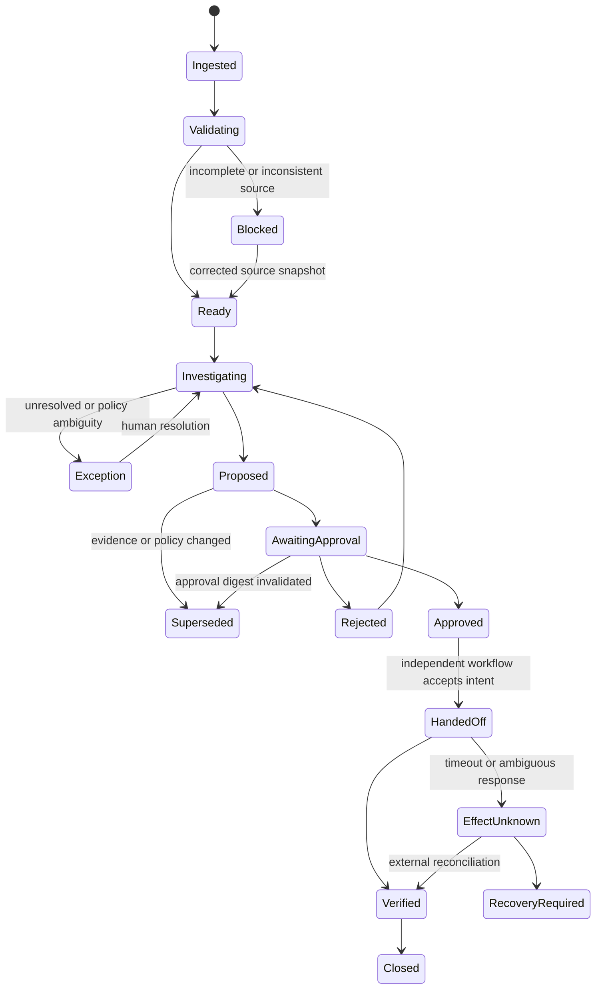

# State, Events, Context, Memory, and Planning

> **Research date:** 2026-08-31  
> **Maturity:** Production design reference; field names and retention periods require organization-specific approval.

A finance agent must resume from durable accounting state, not from a reconstructed chat transcript. The runtime should treat model context as a disposable view over authoritative records. Money, entity, period, evidence, approvals, and external effects remain typed state outside the model.

Use the repository-wide [state and event contracts](../../runtime/agent-state-and-event-contracts.md), [durable execution](../../runtime/durable-execution.md), [context engineering](../../context-memory/context-engineering.md), [compaction and continuity](../../context-memory/compaction-and-continuity.md), and [memory architecture](../../context-memory/memory-architecture.md) as the general baseline. This guide adds accounting-specific invariants.

## 1. Separate the records that answer different questions

| Record | Question answered | Authority | Mutable? |
|---|---|---|---|
| Source snapshot | What did the ERP, subledger, bank, or document system expose? | Source-system export plus ingestion manifest | Append-only; supersede with a new version |
| Accounting case | What discrepancy or task is being resolved? | Finance workflow service | Yes, under optimistic concurrency |
| Close task | What must be completed, by whom, for which close? | Close orchestration system | Yes, with controlled transitions |
| Proposal | What accounting action does the agent recommend? | Proposal service | Immutable after submission; revise by creating a successor |
| Approval | Who approved exactly which proposal under which role? | Approval service | Append-only; revoke through a new event |
| Effect intent | What external mutation was authorized? | Effect ledger | Append-only state transitions |
| Evidence manifest | Which inputs, calculations, decisions, and outputs support the conclusion? | Evidence store | Content-addressed and append-only |
| Telemetry | How did the runtime behave? | Observability system | Operational, sampled, retention-limited |
| Model context | What does the model need for this turn? | Context builder | Ephemeral and reproducible |

Do not use telemetry as accounting evidence, a vector store as a ledger, a prompt as an approval, or a conversation summary as an effect record.

## 2. Canonical case identity

Every record and event must carry enough identity to prevent cross-entity, cross-period, or cross-tenant contamination.

```json
{
  "tenant_id": "tn_7f4",
  "legal_entity_id": "LE-IN-01",
  "book_id": "PRIMARY_IFRS",
  "accounting_period_id": "2026-08",
  "case_id": "rec_01K4...",
  "case_type": "bank_reconciliation",
  "state_version": 17,
  "source_snapshot_ids": ["erp_20260831_193000", "bank_20260831_190000"],
  "policy_version": "acct-policy-2026.4",
  "workflow_version": "fin-agent-1.3.2"
}
```

`legal_entity_id`, `book_id`, and `accounting_period_id` are never inferred from an account name, filename, email thread, or model memory. The workflow rejects ambiguous or missing identity.

## 3. State machine

The case service, not the model, enforces legal transitions.



Terminal case status does not imply that the ledger is correct. `Verified` means a read-back matched the approved intent; `Closed` means the owning finance workflow accepted the result.

## 4. Event envelope and ordering

Use an immutable event envelope compatible with the shared runtime contract and CloudEvents-style metadata.

```json
{
  "event_id": "evt_01K4...",
  "event_type": "finance.proposal.submitted.v1",
  "occurred_at": "2026-08-31T14:23:05.182Z",
  "recorded_at": "2026-08-31T14:23:05.731Z",
  "tenant_id": "tn_7f4",
  "aggregate_type": "accounting_case",
  "aggregate_id": "rec_01K4...",
  "expected_state_version": 16,
  "new_state_version": 17,
  "correlation_id": "close_2026_08_LE_IN_01",
  "causation_id": "evt_01K3...",
  "actor": {"type": "agent_runtime", "id": "fin-agent-prod"},
  "payload_ref": "sha256:...",
  "schema_version": 1
}
```

Required behavior:

- append events before acknowledging a durable transition;
- reject a write when `expected_state_version` is stale;
- make event consumers idempotent by `event_id`;
- preserve both business occurrence time and ingestion time;
- order only within an aggregate unless the workflow explicitly defines a wider barrier;
- never fabricate a total order across the ERP, bank, and document systems;
- retain raw payloads according to their own policy while preserving a stable digest and provenance record.

## 5. State, event, effect, and telemetry boundaries

| Boundary object | Contains | Must not contain |
|---|---|---|
| State | Current typed business facts and status | Unbounded dialogue or hidden reasoning |
| Event | A fact about a transition that occurred | A request to perform an unrecorded effect |
| Effect intent | Authorized target, operation, payload digest, idempotency key | Broad credentials or an inferred approval |
| Evidence | Source references, transformations, calculations, decision basis | Secrets or mutable links without digests |
| Telemetry | Latency, token counts, error classes, trace correlations | Full invoices, bank narrations, tax identifiers by default |

The transaction boundary is local: update the case and append its outbox event atomically. External accounting systems do not participate in that database transaction. Delivery and read-back reconciliation handle the gap.

## 6. Context assembly

Build context deterministically for a named task. A useful priority order is:

1. immutable authority boundary and tool permissions;
2. tenant, legal entity, book, period, currency, and case identity;
3. current state version and unresolved blockers;
4. governing policy excerpts with version and effective dates;
5. exact source records needed for the decision;
6. prior proposals, approvals, rejections, and effects for this case;
7. retrieval candidates with provenance and trust labels;
8. output schema and completion checks;
9. optional explanatory history.

Each context item should be labeled:

```yaml
context_item:
  item_id: ci_01K4...
  class: source_record       # source_record | policy | evidence | prior_decision | user_note
  trust: authoritative       # authoritative | corroborating | untrusted | contradicted
  source_system: erp-primary
  source_record_id: JE-94831
  source_version: "7"
  effective_from: 2026-01-01
  retrieved_at: 2026-08-31T14:22:01Z
  content_digest: sha256:...
  permitted_uses: [reconcile, propose]
```

Free-text invoices, emails, attachment text, bank descriptions, and copied ticket notes are untrusted data even when they came through an authenticated connector. Their text cannot grant permission or override policy.

## 7. Compaction contract

Compaction reduces narrative, never accounting precision. Preserve these facts losslessly:

```yaml
compaction_receipt:
  receipt_version: 1
  tenant_id: tn_7f4
  entity_book_period: [LE-IN-01, PRIMARY_IFRS, 2026-08]
  state_version: 17
  source_event_high_watermark: 1884
  version_pins:
    behavior_release: finance-agent/2026-08-31.4
    workflow_schema: finance-case/7
    policy_bundle: acct-policy-2026.4
    connector_manifests: [erp-primary/7.1, bank-feed/4.0]
    context_compiler: finance-context/6
    compactor: finance-compactor/3
  exact_amounts:
    - {currency: INR, minor_units: 259900, scale: 2, role: unmatched_bank_total}
  immutable_ids:
    source_snapshots: [erp_20260831_193000, bank_20260831_190000]
    proposals: [jp_01K4...]
    effect_intents: []
  approvals:
    - {approval_id: appr_01K5..., proposal_digest: "sha256:...", state: active, expires_at: 2026-09-01T10:00:00Z}
  active_clocks:
    - {clock_id: review-sla, deadline: 2026-09-01T09:00:00Z, timezone: Asia/Kolkata, policy: close-calendar/18}
    - {clock_id: approval-expiry, deadline: 2026-09-01T10:00:00Z, policy: approval-policy/9}
  pending_effect_ids: []
  unknown_effect_ids: []
  assertions:
    - {assertion: occurrence, status: supported, evidence_ids: [ev_14, ev_19]}
  open_contradictions:
    - "Bank value date and ERP posting date cross the configured cut-off."
  blockers:
    - code: POLICY_DECISION_REQUIRED
  next_allowed_actions: [request_accountant_review]
  next_safe_action: request_accountant_review
  prohibited_actions: [post_journal, initiate_payment, certify_close]
  omitted_refs:
    - {kind: prior_narrative, refs: [event://1-1700], reason: reconstructible_not_decision_relevant}
    - {kind: large_evidence, refs: [evidence://bank-statement-884], reason: retained_by_digest}
  invariant_hash: sha256:...
  source_digest: sha256:...
```

After compaction, and again before resume, fail closed through this sequence:

1. load the case at `state_version` and verify `source_event_high_watermark` is present with no gap for the aggregate;
2. recompute `source_digest` and `invariant_hash` from typed durable state, never from receipt prose;
3. verify every version pin is available, integrity-protected, compatible, and still approved for replay;
4. reauthorize the worker and recheck tenant/entity/book/period scope, current period status, approval role/expiry/revocation, and every active clock;
5. query the effect ledger and external systems for all pending or unknown IDs; a missing effect record blocks resume;
6. resolve every omitted reference through its immutable ID/digest and reload it when the next action depends on it;
7. compare `next_safe_action` with the current state-machine transition and capability policy; and
8. issue a new resume event with the verified receipt digest and current fencing token.

Identity, exact totals, debit-credit equality, approval binding, open contradictions, clock deadlines, and effect state must remain unchanged unless a recorded successor event explains the change. Any gap, mismatch, expired pin, inaccessible evidence, stale approval, unknown effect, or illegal next action moves the case to `RecoveryRequired`; a model is never allowed to repair the receipt.

## 8. Memory classes and their limits

| Memory lifetime | Use; reject | Retention and deletion | Poisoning controls | Evaluation controls |
|---|---|---|---|---|
| Turn/scratch memory | Use current tool result, immediate instruction, disposable calculation note; reject approvals, policy, durable money/effects | Destroy at turn end; legal hold never relies on it because authoritative artifacts are stored elsewhere | Trust-label tool/document text, isolate instructions from data, schema-validate, forbid promotion | Injection fixtures, exact-value round trip, and proof that a new turn cannot retrieve it |
| Working/run memory | Use intermediate calculations and candidate sets; reject source-of-truth balances and final case state | Destroy at run end; durable checkpoints hold only typed required state | Tenant/entity filters, typed decimals, bounded inputs, recompute rather than accept cached prose | Restart mid-calculation, cross-tenant canary, deterministic recomputation, context-pressure tests |
| Session memory | Use navigation and non-authoritative conversation continuity; reject authorization, identity resolution, materiality and accounting conclusions | Expire with session and delete from caches/provider state under data map; export only if a separate record rule applies | No automatic write from user/document claims; label provenance; exclude secrets and broad finance history | New-session isolation, stale-instruction tests, deletion propagation, false-approval probes |
| Durable workflow/task memory | Use case state, blockers, proposals, approvals, clocks, effect and recovery status; reject untyped hidden dialogue as state | Retain by case/evidence schedule; append corrections; delete derived indexes only when policy and holds allow | State-machine writes, optimistic versioning/fencing, digest-bound approvals, immutable effect ledger | Event replay, crash-window matrix, compaction receipt, hold/deletion, stale approval and unknown-effect tests |
| Domain knowledge memory | Use approved effective-dated policy, COA semantics, connector manifests, reviewed rules; reject inferred policy and raw unreviewed cases | Retain releases for replay/audit horizon; supersede, expire, and delete only under governed record policy | Named owner, source/digest/signature, scope/effective dates, two-person promotion, rollback | Historical-as-of replay, policy conflict, expired release, malicious document and connector drift suites |
| Long-term/preference memory | Use explicit display, accessibility, routing and notification preferences; reject account coding, risk tolerance, materiality, approval or supplier/bank data | Purpose/consent schedule with view/export/correct/delete path; holds apply only when legally mapped | Separate namespace/ACL, never infer from behavior, no cross-user inheritance, provenance/expiry | Preference deletion/export, impersonation, policy-confusion and cross-user isolation tests |
| Episodic/outcome memory | Use curated de-identified resolved cases, corrections, incidents and outcomes for evaluation/improvement; reject direct automatic reuse as a current decision | Governed corpus lifecycle, time-based expiry and deletion/hold propagation to embeddings/derivatives/providers | Permissioned curation, label disagreement, de-identification, temporal split, no auto-promotion to rules | Leakage/contamination audits, future-information exclusion, entity/time holdouts, challenge-set access logs |

Semantic/vector retrieval and caches are rebuildable projections over approved records, not additional memory lifetimes. They return source IDs for verification and must pass poisoning, permission, correction, and deletion tests. Raw cross-tenant “agent memory” is rejected. Never let the agent autonomously promote a user statement, email, prior case, or generated explanation into accounting policy. Promotion requires a named owner, review, effective date, provenance, and rollback path.

Deletion and retention must be applied to the source record and every derived store: caches, vector indexes, replay fixtures, evaluation corpora, model-provider logs, exports, and backups according to their approved schedules. A tombstone should prevent deleted material from being re-indexed.

## 9. Planning policy

Finance work benefits from explicit, bounded plans—not open-ended autonomous planning.

### 9.1 Fixed workflow templates

Use deterministic templates for recurring work:

- bank reconciliation: snapshot → validate → generate candidates → score → explain → review → verify;
- journal proposal: identify adjustment → validate assertions → construct balanced lines → policy review → approval → handoff → read-back;
- close task: dependency check → evidence collection → completion assessment → reviewer sign-off;
- intercompany difference: pair records → normalize currency/time → classify difference → route to entity owners.

The template service defines allowed steps, maximum attempts, timeouts, and escalation. The model may choose among allowed evidence queries or propose a classification; it cannot invent a new effect step.

### 9.2 Dynamic planning budget

Permit dynamic substeps only for evidence gathering within a case:

```yaml
planning_budget:
  max_model_turns: 8
  max_tool_calls: 20
  max_retrieval_items: 40
  max_wall_clock_seconds: 180
  allowed_capabilities: [read_ledger, read_bank, read_policy, calculate, propose]
  prohibited_capabilities: [post, pay, certify, change_policy, create_user]
  stop_on:
    - identity_ambiguity
    - source_incompleteness
    - policy_conflict
    - approval_required
    - repeated_no_progress
```

Do not add multi-agent orchestration merely to mimic organizational roles. A deterministic workflow with separately authenticated human roles is simpler, easier to audit, and safer. Consider specialized workers only after measured queue or expertise isolation needs, and keep one authoritative case state.

## 10. Long waits, clocks, and handoff

Approvals, bank settlement, missing invoices, close dependencies, and intercompany responses can wait hours or days. A sleeping process or model session is not a clock. Persist each timer with `clock_id`, type, start, deadline, business calendar, time zone, pause policy, escalation route, and the state/policy version that created it.

- Recompute due times through the pinned close/business calendar; never add a duration to local wall time and assume daylight-saving or holidays are correct.
- On wake, authenticate the actor, acquire a new fence, reload durable state, verify the compaction receipt, and recheck approvals, period status, source freshness, cancellation, and effects before any next step.
- A timeout creates an event and an owned escalation; it does not imply approval, rejection, non-application, immateriality, or permission to change period.
- Human handoff carries the case ID, exact decision requested, eligible role, deadline, evidence/contradiction summary, proposal digest, and allowed dispositions. Free-form chat is notification only; the authoritative decision returns through the workflow service.
- Cancellation revokes future planning and dispatch. It cannot cancel a request already accepted by an external system; the effect reconciler continues until outcome or recovery ownership is explicit.
- Restart rebuilds timers from durable records and deduplicates wakes by `(clock_id, scheduled_version)`. A late wake from an old schedule is fenced.

## 11. Concurrency and stale work

- Lease work with an expiry and heartbeat; lease ownership does not grant posting authority.
- Compare source snapshot versions before accepting a proposal or approval.
- Invalidate approval when proposal payload, policy version, entity, book, period, currency, source snapshot, or material supporting evidence changes.
- Detect duplicate open cases using a stable business fingerprint.
- Fence a resumed worker using `state_version` so a timed-out worker cannot overwrite newer work.
- Treat close-period locks and ERP status as dynamic facts; re-read them immediately before handoff.

## 12. Failure handling

| Failure | Safe response |
|---|---|
| Context budget exhausted | Compact under the contract, assert invariants, or reload a narrower view |
| Conflicting source systems | Preserve both versions, block automated conclusion, route the conflict |
| Event delivered twice | Ignore the duplicate by event ID and preserve the first processing result |
| Worker resumes after lease loss | Fence its writes and discard uncommitted output |
| Policy changes mid-case | Mark proposal stale; re-evaluate under the effective policy |
| Memory retrieval returns another entity | Reject on identity filters, raise a security event, inspect index isolation |
| Model proposes an unplanned effect | Schema/permission rejection; record as a policy violation metric |
| Case appears complete but effect is unknown | Reconcile externally; never redispatch blindly |

## 13. Production checklist

- [ ] Durable state can recreate every context without a chat transcript.
- [ ] Entity, book, period, currency, and tenant are explicit on every finance aggregate.
- [ ] Case transitions and concurrency checks are enforced outside the model.
- [ ] Events are immutable, versioned, idempotently consumed, and causally linked.
- [ ] Context items carry provenance and trust labels.
- [ ] Compaction preserves exact amounts, approvals, contradictions, and effect status.
- [ ] Every memory class has an owner, retention rule, promotion rule, and deletion path.
- [ ] Retrieval indexes cannot create policy or cross tenant boundaries.
- [ ] Plans are bounded by allowed steps, attempts, time, and effect permissions.
- [ ] Stale proposals and approvals are invalidated deterministically.
- [ ] External effect state is reconciled after timeout or restart.

## Strong sources

- [NIST SP 800-53 Rev. 5, including AC-5 and AC-6](https://csrc.nist.gov/pubs/sp/800/53/r5/upd1/final)
- [PCAOB AS 1215: Audit Documentation](https://pcaobus.org/oversight/standards/auditing-standards/details/AS1215)
- [PCAOB AS 1105: Audit Evidence](https://pcaobus.org/oversight/standards/auditing-standards/details/AS1105)
- [W3C Trace Context](https://www.w3.org/TR/trace-context/)
- [OAuth 2.0 Security Best Current Practice, RFC 9700](https://datatracker.ietf.org/doc/html/rfc9700)
