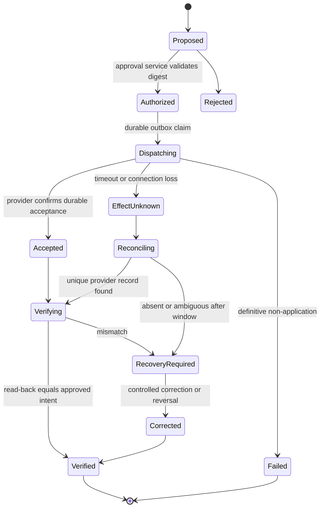
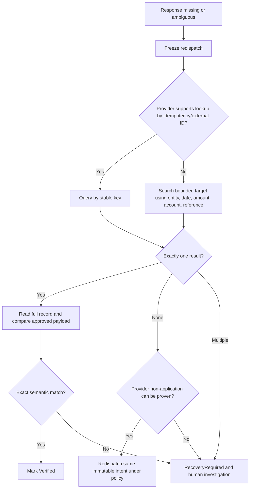

# Tools, Effects, Idempotency, Reconciliation, and Recovery

> **Research date:** 2026-08-31  
> **Maturity:** Production design reference; connector behavior must be verified against the deployed API version and tenant configuration.

The dangerous moment is not when an agent writes a bad explanation. It is when a retry, timeout, stale approval, or mis-scoped credential produces an incorrect journal, payment, master-data change, or close status. Keep external effects behind deterministic, separately authorized services and reconcile every ambiguous outcome.

This guide extends the shared [tool contracts](../../tools/tool-contracts.md), [tool results, artifacts, and provenance](../../tools/tool-results-artifacts-and-provenance.md), [idempotency and side effects](../../reliability/idempotency-and-side-effects.md), and [durable execution](../../runtime/durable-execution.md).

## 1. Capability model

| Capability | Examples | Agent ceiling | Enforcement point |
|---|---|---|---|
| Observe | Read ledger lines, bank transactions, invoice metadata, policy | Allowed within case scope | Connector authorization and row filters |
| Calculate | Sum, age, translate, match, hash, validate balance | Allowed through deterministic libraries | Calculation service |
| Propose | Draft match set, exception classification, journal payload | Allowed; immutable proposal | Proposal service |
| Stage | Create a draft in a staging area that cannot affect books or cash | Allowed only where rollback and isolation are proven | Staging connector |
| Request approval | Route exact proposal digest to eligible reviewer | Allowed | Workflow service |
| Handoff approved intent | Submit to an independent posting/payment workflow | Exceptional FA3 capability | Effect gateway plus fresh authorization |
| Commit | Post journal, release payment, change vendor bank details, certify close/file | Not an agent capability | Human/deterministic system of record |

A provider API exposing a `post`, `pay`, or `approve` endpoint does not make that endpoint appropriate for the agent credential.

## 2. Tool contract

Every tool declares its authority, scope, inputs, output provenance, timeouts, and side-effect semantics.

```yaml
tool_contract:
  name: erp.read_journal_lines
  version: 3
  authority: read
  allowed_callers: [finance-agent-investigator]
  input_schema: journal-read-v3.json
  required_scope_keys: [tenant_id, legal_entity_id, book_id, period_id]
  output_schema: journal-lines-v3.json
  pagination: cursor
  consistency: provider_documented
  timeout_ms: 15000
  retry:
    max_attempts: 3
    retryable: [timeout_before_response, 429, 502, 503, 504]
  provenance:
    record_request_digest: true
    record_response_digest: true
    record_provider_request_id: true
  effects: none
```

Tool output must separate transport success from semantic completeness:

```json
{
  "status": "success",
  "completeness": "partial",
  "records": [],
  "next_cursor": "opaque",
  "source_as_of": "2026-08-31T14:00:00Z",
  "source_version": "etag:71ac",
  "provider_request_id": "req-8821",
  "warnings": ["result_set_paginated"],
  "content_digest": "sha256:..."
}
```

The agent cannot treat `success + partial` as a complete trial balance or complete journal population.

## 3. Effect intent

Create an immutable intent only after approval. Bind it to the exact proposal and authority context.

```json
{
  "effect_intent_id": "fx_01K4...",
  "operation": "journal_handoff",
  "tenant_id": "tn_7f4",
  "legal_entity_id": "LE-IN-01",
  "book_id": "PRIMARY_IFRS",
  "period_id": "2026-08",
  "target_system": "erp-primary",
  "target_environment": "production",
  "proposal_id": "jp_01K4...",
  "proposal_digest": "sha256:...",
  "approval_ids": ["appr_01K5..."],
  "policy_version": "acct-policy-2026.4",
  "source_snapshot_ids": ["erp_...", "bank_..."],
  "idempotency_key": "tenant/LE-IN-01/2026-08/jp_01K4/v1",
  "expires_at": "2026-09-01T10:00:00Z",
  "requested_by": {"type": "workflow", "id": "close-orchestrator"},
  "payload_ref": "sha256:..."
}
```

Before dispatch, independently revalidate: approval eligibility and freshness, period status, payload digest, entity/book/currency, policy version, SoD constraints, source version policy, target environment, and absence of a terminal result for the idempotency key.

## 4. Effect state machine



`HTTP 200` is not proof that the books reflect the intended result. `HTTP 500` is not proof that no result exists. Only provider-defined durable acceptance plus read-back verification determines outcome.

## 5. Multi-system choreography and restart

Do not attempt a distributed transaction across the case database, ERP, close platform, tax service, and bank. Make the local decision atomic, then drive external steps as an explicit saga whose compensations are accounting-domain actions rather than database rollback:

1. In one local transaction, persist the immutable approved intent, current preconditions, idempotency key, effect state, and outbox record.
2. A separately authorized worker claims the outbox row with a lease/fencing token, revalidates authority and dynamic facts, records `Dispatching`, and calls exactly one manifest operation.
3. Persist the raw receipt/request ID before invoking any dependent system. If the response is missing or ambiguous, stop the saga at `EffectUnknown`; do not dispatch step two.
4. Reread and semantically verify step one. Only then create a distinct intent for a dependent close-task update, tax commit, or evidence export. Each step has its own approval rule, key, result, and recovery owner.
5. When a later step fails, keep successful earlier truth. Use an approved domain compensation—cancel an isolated draft, unapply under source rules, reverse/correct a journal, void/adjust a tax transaction, or reopen a task—only after determining that compensation is valid. Some effects, especially payment settlement, have no automatic compensation.
6. On cancellation, stop undispatched intents and continue reconciling dispatched ones. On restart, rebuild work from intent/effect state, reacquire fences, reload connector manifests, and resolve every ambiguous attempt before retry.
7. Handoff transfers ownership, not hidden state: record recipient role/team, exact decision, evidence manifest, deadline, effect status, and acknowledgement. The originating run remains responsible until the workflow records acceptance.

An operation is never marked “rolled back” merely because the local workflow returned to an earlier state. External truth and linked corrective records remain visible.

## 6. Idempotency design

Idempotency is a business contract, not merely a header.

| Operation | Stable identity | Duplicate behavior | Verification |
|---|---|---|---|
| Source ingestion | Source system + account + source record ID + version | Upsert identical version; supersede changed version | Snapshot counts, totals, cursor and digest |
| Case creation | Tenant + entity + book + period + case type + business fingerprint | Return existing open case | Case service lookup |
| Match proposal | Snapshot digests + policy/rule version + candidate identity | Return existing immutable proposal | Proposal digest equality |
| Journal proposal | Entity + book + period + proposal lineage/version | Never mutate submitted proposal | Recalculate balance and digest |
| Approval request | Proposal digest + approval policy version | Reuse active request | Approval service state |
| Effect handoff | Approved intent ID/version | Return stored result or reconcile | Provider ID and read-back |
| Notification | Case + milestone + recipient + template version | Suppress duplicate | Delivery ledger |

Provider idempotency is only one layer:

- [Stripe](https://docs.stripe.com/api/idempotent_requests) stores the first result for an idempotency key and documents parameter comparison; this behavior is provider-specific.
- [Xero](https://developer.xero.com/documentation/guides/idempotent-requests/idempotency/) documents a six-minute idempotency window and notes that errors can be cached. That is too short to serve as the finance system's durable effect ledger.
- NetSuite supports `X-NetSuite-idempotency-key` for documented asynchronous request paths, but the integration must still persist its own intent and verify the created record.

Generate keys before dispatch, persist them durably, reuse the same key only for the same immutable intent, and never generate a new key merely because a response was lost.

## 7. Retry classifier

| Outcome | Retry? | Required action |
|---|---:|---|
| Validation or authorization rejection | No | Correct proposal, permissions, or approval |
| Rate limit with retry guidance | Yes, bounded | Honor delay, apply jitter, preserve key |
| Timeout before connection established | Usually | Retry under same intent/key within policy |
| Timeout after request may have arrived | Not blindly | Mark `EffectUnknown`; query/reconcile first |
| Provider 5xx | Depends on provider semantics | Reconcile before retry when application is possible |
| Duplicate-key response | No mutation retry | Retrieve original result and verify |
| Period closed or account invalid | No | Route to accountant; never auto-change accounting period/account |
| Partial batch result | Per item | Persist each result; retry only definitively unapplied items |

Use capped exponential backoff with jitter and a retry budget. Retries must not outlive the approval or the period-specific authorization.

## 8. Reconciliation after ambiguous effects



Comparison is semantic, not textual: line accounts, debit/credit amounts, currencies, exchange-rate basis, dimensions, posting date, reversal metadata, legal entity, book, and provider status must match the approved intent. A description difference may be tolerable only if policy says so.

### Unknown-effect recovery walkthrough

When a journal handoff times out after bytes may have reached the ERP, freeze the intent and all dependent close tasks. Load the exact approved digest, provider request/external/idempotency identifiers, target entity/book/period, connector release, and dispatch window. Query by stable identifier; if unavailable, perform a bounded semantic search that cannot match across entity/book/period. Exactly one candidate must match header, lines, currencies, dimensions, dates, reversal metadata, and status. If one matches, record discovery evidence and continue read-back reconciliation. If none appears, wait through the provider's documented processing/visibility window and prove non-application before same-intent retry. Multiple or mismatched candidates become a finance/connector incident; no model chooses one. Preserve the case through restart and close escalation until a human owns the residual risk.

## 9. Connector-specific constraints

Current APIs demonstrate why connector behavior belongs in versioned configuration:

| Platform | Observed current behavior | Design consequence |
|---|---|---|
| SAP S/4HANA Cloud | Documents synchronous and asynchronous journal-entry APIs; asynchronous processing returns confirmations separately | Use async for documented high-volume paths; correlate every confirmation and reconcile rejects |
| Oracle Fusion Financials | Versioned REST resources expose journal batches | Pin/test the quarterly API version and query batch status; do not infer posting from submission alone |
| Business Central | Journal lines and a separate bound `post` action exist | Give agent read/draft access without the posting action; posting remains separately authorized |
| NetSuite | Async batch requests support bounded record counts and idempotency headers; external IDs are available | Chunk deterministically, persist per-item result, use external identity, and observe account-specific concurrency |
| Xero | Journals are paginated by offset; partial pages are not necessarily terminal; manual journals have draft/posted distinctions and rate limits | Continue until documented end condition, respect rate/concurrency limits, and avoid granting post authority |

Provider documentation changes. Record connector version, API release, enabled features, account configuration, and research date in every production compatibility matrix.

## 10. Corrections and reversals

Never “fix” a posted accounting result by editing evidence history or deleting the effect record.

| Condition | Response |
|---|---|
| Proposal wrong but not handed off | Supersede with a corrected proposal; invalidate approvals |
| Draft exists in isolated staging | Cancel/replace using the staging system's supported workflow and retain linkage |
| Posted journal is wrong | Accountant determines correction/reversal under policy; create linked compensating transaction |
| Payment instruction accepted | Stop autonomous action; use treasury/payment-provider recall or investigation procedure |
| Duplicate posting | Prove duplicates by provider IDs and payloads; human-authorized reversal; retain both records |
| Posting in wrong period/entity/book | Escalate immediately; never auto-reclassify across an accounting boundary |
| Source record was later corrected | Reopen or create a successor case; preserve original evidence and conclusion as-of time |

Correction records include `corrects_effect_id`, reason code, discoverer, discovery time, approved corrective payload, authorizers, provider identifiers, read-back evidence, and financial-statement impact assessment. Whether to reverse, adjust prospectively, or restate depends on policy and applicable accounting requirements; the agent does not decide that policy.

### Verified reversal walkthrough

1. An authorized accountant classifies the issue under applicable policy and decides whether a draft replacement, unapply, current-period correction, linked reversal, or broader prior-period process is appropriate.
2. Freeze the original proposal, approval, provider record and reread, affected reconciliations/reports, current period status, and evidence available at discovery. Aggregate impact and qualitative flags route to the required approvers.
3. Create a new immutable corrective proposal with `corrects_effect_id`/`reverses_effect_id`, exact lines, date/period, reason, tax/intercompany/reversal relationships, and downstream repair plan. Never reuse the original intent or approval.
4. Independently validate and approve the corrective digest, dispatch through a new effect intent/key, and apply the same unknown-outcome controls.
5. Reread both original and corrective records; prove the intended net accounting result and reconcile every affected subledger, GL, bank/payment, close, consolidation, tax, and evidence link.
6. Record reopenings, control implications, reviewer override, root cause, incident/fixture IDs, and whether reports or certifications require human action. The audit package exposes both transactions and their full lineage.

## 11. Cancellation and zombie workers

- Cancellation stops new work; it does not erase an already dispatched request.
- A worker must re-check lease, case version, approval validity, and cancellation immediately before dispatch.
- After dispatch, the outbox/effect reconciler owns completion even if the originating run is cancelled.
- Late responses update the effect ledger through a fenced consumer; they do not revive a superseded proposal.
- Period close or connector credential revocation moves pending intents to explicit review, not silent abandonment.

## 12. Failure matrix

| Failure mode | Detection | Containment | Recovery |
|---|---|---|---|
| Duplicate bank event | Source key/digest collision | Quarantine changed duplicate | Investigate provider correction/version semantics |
| Partial pagination | Completeness flag/cursor invariant | Block reconciliation conclusion | Resume from durable cursor and re-total |
| Rate-limit storm | Connector metrics and 429 class | Circuit break and fair queue | Gradual resume within provider budget |
| Expired approval | Dispatch guard | Reject effect | Revalidate and obtain fresh approval |
| Cross-entity tool call | Scope assertion | Deny and security alert | Inspect credential/context isolation |
| Effect applied, record failed | Outbox/effect mismatch | Freeze duplicate dispatch | Provider lookup and evidence reconstruction |
| Provider record differs | Read-back comparator | Mark recovery required | Controlled correction/reversal |
| Connector schema drift | Contract test/canary parse failure | Disable affected version | Adapt, replay fixtures, staged release |
| Tool output prompt injection | Trust label and structured parser | Exclude instruction-like text from control context | Security triage and fixture addition |

## 13. Production checklist

- [ ] Tools expose least-authority capabilities rather than a generic ERP client.
- [ ] Read results state completeness, cursor, as-of time, version, and provenance.
- [ ] Effect intents bind exact proposal, approvals, entity/book/period, target, and expiry.
- [ ] An internal durable effect ledger exists even when the provider offers idempotency.
- [ ] Unknown outcomes reconcile before redispatch.
- [ ] Read-back verifies accounting semantics, not only HTTP status.
- [ ] Retries are classified, capped, jittered, and constrained by approval lifetime.
- [ ] Partial batches persist item-level outcomes.
- [ ] Cancellation and zombie-worker fencing are tested.
- [ ] Corrections and reversals preserve lineage and require appropriate human authority.
- [ ] Connector versions, limits, and tenant-specific configuration are tested continuously.

## Strong sources

- [AWS Builders' Library: Making retries safe with idempotent APIs](https://aws.amazon.com/builders-library/making-retries-safe-with-idempotent-APIs/)
- [Stripe: Idempotent requests](https://docs.stripe.com/api/idempotent_requests)
- [Stripe: Webhooks and duplicate or unordered delivery](https://docs.stripe.com/webhooks)
- [Xero: Idempotency](https://developer.xero.com/documentation/guides/idempotent-requests/idempotency/)
- [Xero: OAuth limits](https://developer.xero.com/documentation/guides/oauth2/limits/)
- [SAP journal-entry API documentation](https://help.sap.com/docs/SAP_S4HANA_CLOUD/b978f98fc5884ff2aeb10c8fdeb8a43b/f5c8d0579212c525e10000000a4450e5.html)
- [Oracle Fusion Financials journal batches API](https://docs.oracle.com/en/cloud/saas/financials/26b/farfa/api-journal-batches.html)
- [Business Central journal API](https://learn.microsoft.com/en-us/dynamics365/business-central/dev-itpro/api-reference/v1.0/resources/dynamics_journal)
- [NetSuite asynchronous request execution](https://docs.oracle.com/en/cloud/saas/netsuite/ns-online-help/article_0127092747.html)
