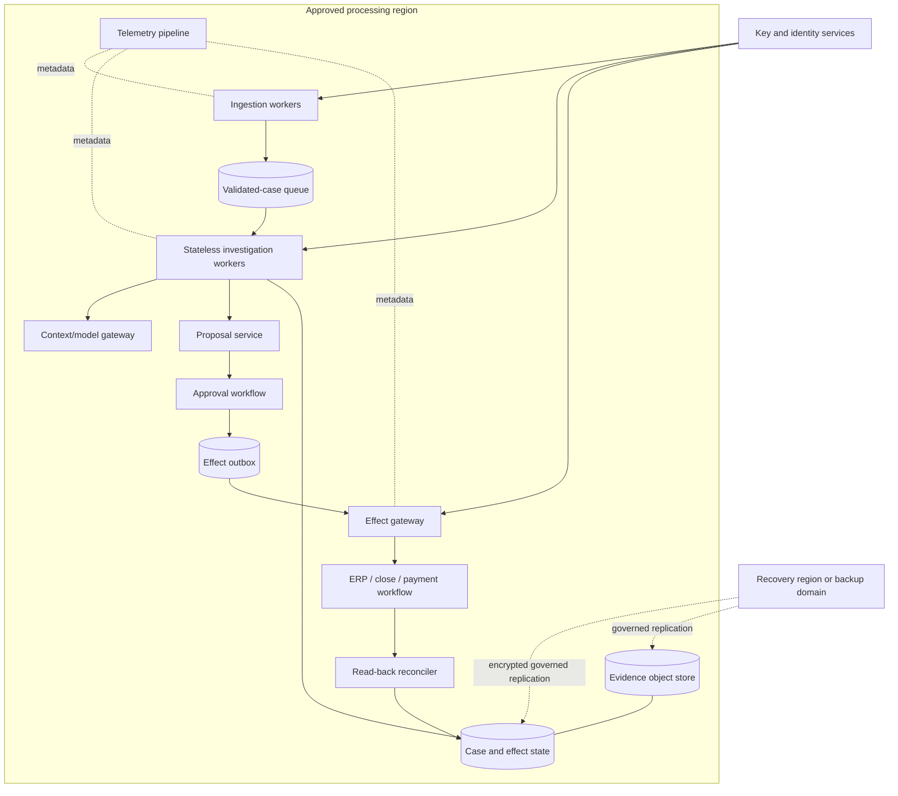
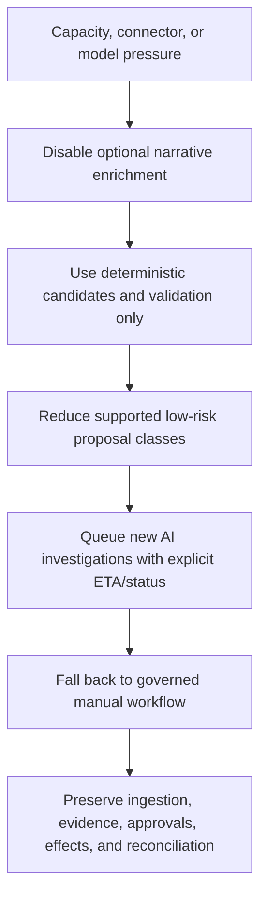
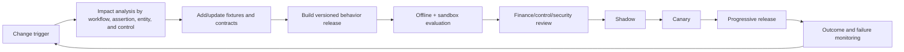

# Deployment, Capacity, Cost, Incidents, and Continuous Evolution

> **Research date:** 2026-08-31  
> **Maturity:** Production operations blueprint; targets and topology must be adapted to the organization's close calendar, jurisdictions, providers, and continuity requirements.

Finance workloads are bursty, deadline-bound, and recovery-sensitive. Production design must survive period-close peaks, connector outages, model degradation, and ambiguous external effects without relaxing accounting controls. Scale throughput by partitioning and deterministic work management—not by granting more autonomy.

Use the shared [deployment, release, and incident response](../../operations/deployment-release-and-incident-response.md), [queues, scheduling, and backpressure](../../operations/queues-scheduling-and-backpressure.md), and [scaling, capacity, and SLOs](../../operations/scaling-capacity-and-slos.md) as general baselines.

## 1. Environment model

| Environment | Data | External effects | Purpose |
|---|---|---|---|
| Local/unit | Synthetic | Stubs only | Contract and calculation development |
| Evaluation | Synthetic/de-identified governed fixtures | Deterministic simulators | Repeated suites, attack/fault cases |
| Integration sandbox | Provider sandbox/test tenant | Sandbox only | Connector compatibility and pagination/idempotency |
| Shadow production | Production reads under approved scope | Disabled; intents quarantined | Compare decisions and measure load |
| Canary production | Narrow entity/workflow cohort | Capability-specific; normally proposal-only | Validate real operations with rapid rollback |
| General production | Approved entities/workflows | Only explicitly released authority tier | Controlled service |
| Forensic/recovery | Minimal copied evidence under incident approval | Disabled | Investigation and replay |

Never reuse production effect credentials in development or evaluation. Verify target tenant, legal entity, book, and environment at both credential issuance and effect dispatch.

## 2. Deployment topology



Key properties:

- stateless model workers; durable case, event, effect, and evidence stores;
- queues isolate ingestion, investigation, approval wait, effect dispatch, and reconciliation;
- connector-specific worker pools prevent one provider's outage from exhausting all capacity;
- read and effect credentials are separate;
- evidence replication follows residency, retention, and legal-hold rules;
- every worker is fenced by lease and state version.

## 3. Capacity model

Estimate capacity from measured workflow distributions, not average daily volume.

```text
required_worker_concurrency
  = peak_arrival_rate_per_second
    × p95_service_time_seconds
    × retry_and_variance_factor
    ÷ target_utilization
```

Then constrain the result by provider rate/concurrency limits, database capacity, model quota, review capacity, and evidence-storage throughput. A faster proposal tier does not improve the close if human review or source extraction is the bottleneck.

### 3.1 Work classes

| Queue | Priority basis | Concurrency boundary | Degradation behavior |
|---|---|---|---|
| Source validation | Close criticality and freshness | Connector/account | Preserve ingestion; defer enrichment |
| Reconciliation | Close dependency, age, risk | Entity/account family | Run deterministic matching first |
| Journal proposal | Close dependency and review window | Entity/book/period | Queue; never bypass approvals |
| Intercompany | Consolidation deadline and entity pair | Pair/group | Preserve both-side evidence; route stale differences |
| Approval waiting | Human role and expiry | Not model workers | Notify/escalate through governed workflow |
| Effect dispatch | Approved intent expiry and criticality | Connector/effect type | Pause safely on ambiguity/outage |
| Effect reconciliation | Unknown-effect age | Connector | Highest operational priority; no blind retries |
| Explanatory enrichment | User value | Global budget | Shed first |

Use weighted fair queues so the largest entity cannot starve smaller entities. Reserve capacity for effect reconciliation and incident recovery. Apply backpressure at ingestion; do not permit unbounded in-memory work.

### 3.2 Close-calendar planning

For each entity and period, record expected transaction count, bank feeds, journal population, close tasks, critical dependencies, time zones, provider limits, review staffing, and historical arrival curves from pre-close through post-close. Load test the highest credible overlapping close—not only the largest single entity.

### 3.3 Required close-load experiments

Set targets before the run and retain queue/connector/database/model/reviewer evidence:

| Experiment | Load and fault | Required measurements and pass evidence |
|---|---|---|
| Overlapping close peak | Highest credible concurrent entity/period arrival curve plus backfill | Per-class throughput/latency, queue age/depth, fairness, source freshness, reviewer backlog, provider 429s, DB/object saturation; no hard-gate failure |
| Connector brownout | One ERP/bank slows, returns 429/5xx, repeats cursors and later recovers | Bounded retry amplification, isolated pool, circuit state, preserved cursor/totals, other entities' SLOs, orderly catch-up |
| Model quota/outage | Throttle and remove every configured model route | Deterministic work continues, AI queue is bounded, manual fallback ETA is visible, no authority expansion or evidence loss |
| Reviewer scarcity | Remove a role/time-zone cohort and expire approvals | Queue/escalation behaves by policy, no auto-approval, expiry invalidates dispatch, remaining reviewers are not silently overloaded |
| Unknown-effect storm | Inject timeouts after possible application for a controlled synthetic batch | Redispatch freezes, reserved reconciliation capacity meets target, every intent reaches verified/not-applied/owned recovery, duplicates remain zero |
| Evidence/storage impairment | Slow reads, corrupt one object, deny one replica | Digest failure blocks dependent completion, verified replica/fallback works, no trace is substituted for evidence |
| Region/zone loss | Fail the primary processing/storage domain within the approved exercise boundary | Fencing, restore integrity, achieved RTO/RPO by record class, pending-effect reconciliation, read-only then canary resume |

Capacity is inadequate if the technical queues drain by creating an unreviewable human backlog, if small entities starve, or if recovery work competes away the reserved capacity needed to determine external truth.

## 4. Cost model

Measure cost per verified business outcome:

```text
cost_per_verified_resolution
  = (model inference
     + deterministic compute
     + connector/API
     + queue/database/object storage
     + observability/evaluation
     + review and exception labor
     + incident/rework allocation)
    / verified resolutions
```

Segment by workflow and difficulty. Include failed runs, duplicate ingestion, human review, and rework. Token cost per run alone systematically understates finance operating cost.

Safe cost controls:

- deterministic normalization, matching, and validation before model calls;
- retrieve small, relevant, typed evidence rather than entire ledgers or document sets;
- cache immutable policy/source representations by version and tenant-safe key;
- route simple classification/explanation to a qualified lower-cost model only after evaluation;
- cap turns, tool calls, and output length;
- batch read-only enrichment where provider semantics allow it;
- turn off noncritical narrative enrichment during close peaks;
- preserve safety/evidence graders and effect reconciliation even under budget pressure.

Do not cut cost by dropping source completeness checks, approval verification, exact money validation, evidence retention, or unknown-effect reconciliation.

## 5. Safe degradation order



Never degrade by granting the agent posting authority, skipping review, weakening SoD, silently using stale source data, changing periods, or treating unknown effects as failed.

## 6. Availability, continuity, and recovery

Set RTO and RPO separately for:

- case/event state;
- effect ledger/outbox;
- evidence artifacts and manifests;
- policy/configuration and behavior releases;
- source snapshots that can or cannot be recreated;
- telemetry and evaluation artifacts.

The effect ledger and approval/evidence linkage generally need stronger loss protection than replayable telemetry. Exact targets depend on business impact, close deadlines, source replayability, residency, and cost.

Recovery procedure:

1. restore durable stores and verify integrity/digests;
2. fence pre-failure workers and rotate affected credentials;
3. rebuild derived queues and indexes from authoritative events/state;
4. reconcile every `Dispatching`, `Accepted`, `EffectUnknown`, and `Verifying` intent against external systems;
5. validate entity/book/period/source completeness;
6. resume read-only/deterministic work first;
7. resume proposal generation by canary cohort;
8. re-enable effect handoff only after approval and effect-ledger integrity are proven.

Test restoration and semantic effect reconciliation, not only backup creation.

### 6.1 Recovery evidence and load

A disaster-recovery exercise inventories the pre-failure counts and digests of cases, events, approvals, intents by state, evidence manifests/objects, clocks, policies, releases, and connector cursors. After restore, reconcile those counts and every nonterminal effect to each external system before measuring success. Record achieved RPO/RTO separately for replayable source data, case/event state, effect ledger, approvals/evidence, and telemetry. Then replay the close-peak experiment while the system catches up; a restore that meets idle RTO but collapses under backlog is not proven. Region failover must honor data residency, legal hold, encryption-key access, connector allowlists, provider regional endpoints, and single-writer fencing.

## 7. SLO design

| Service objective | Indicator | Error-budget rule |
|---|---|---|
| Source readiness | Validated snapshot freshness/completeness | Pause dependent conclusions when violated |
| Investigation responsiveness | Ready-to-proposal/exception latency | Shed enrichment before critical workflows |
| Approval delivery | Approval request delivery and age | Escalate through owned workflow; do not auto-approve |
| Effect safety | Unknown-effect age and duplicate-effect count | Unknowns page; duplicate effects are incidents, not budgeted noise |
| Evidence availability | Manifest/object retrieval and digest verification | Block certification support if unavailable |
| Close support | Critical-path tasks with timely evidence | Prioritize critical path under queue policy |
| Security/control | Cross-boundary access and forbidden effects | Target zero; incident on occurrence |

Report SLOs by close phase and provider. Monthly averages can conceal a failure during the two-hour period that matters.

## 8. Incident classification

| Incident | First containment | Evidence to preserve | Recovery owner |
|---|---|---|---|
| Suspected duplicate/wrong journal | Disable affected effect capability; freeze related intents | Intent, approvals, payload, provider IDs, read-backs, traces | Finance operations + engineering |
| Suspected payment/master-data effect | Disable capability and follow treasury/fraud incident procedure | Complete authorization and provider trail | Treasury/security/legal as applicable |
| Cross-tenant/entity exposure | Revoke credentials, isolate connector/index, stop affected workloads | Access logs, context manifests, source/effect IDs | Security/privacy + finance |
| Prompt-injection success/attempt | Block content/path, restrict egress/tools | Original artifact under controlled access, parsed form, trace | Security + product owner |
| Connector schema drift | Disable connector version; stop conclusions | Raw response digest/sample, schema errors, version | Integration owner |
| Source incompleteness | Mark cases blocked; withdraw stale proposals | Cursors, totals, snapshot manifest | Data/finance owner |
| Approval-control failure | Suspend effect gateway | Proposal/approval digests, identity/role history | Control owner + IAM |
| Model quality regression | Roll back behavior release; proposal-only/manual fallback | Evaluation slice, traces, release manifest | Product/model owner |
| Close capacity exhaustion | Apply priority/degradation plan | Queue age, throughput, provider/model limits | Incident commander + close owner |
| Evidence corruption/unavailability | Block dependent completion; switch verified replica | Digests, storage/access events, hold state | Records/platform owner |

Follow [NIST SP 800-61 Rev. 3](https://csrc.nist.gov/pubs/sp/800/61/r3/final) within the organization's broader incident program. Finance and legal/control owners determine transaction correction, disclosure, certification, and notification obligations.

## 9. Unknown-effect incident runbook

1. Stop redispatch for the immutable intent and related batch.
2. Confirm target environment, connector version, request time, idempotency/external ID, and provider request ID.
3. Query the provider using the stable key; if unavailable, perform a bounded semantic search.
4. Require exactly one semantic match before marking applied.
5. Compare entity, book, period, accounts, dimensions, currencies, amounts, dates, description policy, and status.
6. If absent, prove non-application under provider semantics before same-intent retry.
7. If multiple or mismatched, route to finance and connector owners; do not guess.
8. If correction/reversal is needed, create a linked, separately approved workflow.
9. Reconcile related totals and close dependencies.
10. Add the failure to fault tests and update the connector runbook.

## 10. Behavior release manifest

A model name is not a complete release. Version every component that can change behavior.

```yaml
behavior_release:
  release_id: fin-agent-1.3.2
  model_routes:
    investigation: model-route-2026-08-2
  prompt_templates:
    bank_reconciliation: rec-prompt-12
  context_builder: context-fin-8
  compaction_contract: finance-compact-4
  tool_contracts:
    erp.read_journal_lines: 3
    bank.read_transactions: 2
  connector_adapters:
    erp-primary: adapter-7.1
  schemas:
    journal_proposal: 5
    evidence_manifest: 3
  policies:
    accounting: acct-policy-2026.4
    approvals: approval-policy-9
    retention: records-2026.2
  matching_rules: bank-match-11
  retrieval_index: policy-index-20260829
  evaluation_suite: finance-eval-18
  artifact_digests: {bundle: "sha256:..."}
  approved_by: [finance_product_owner, control_owner, security_owner]
  rollback_release: fin-agent-1.3.1
```

Sign or otherwise integrity-protect manifests and artifacts. Record the release on every case, proposal, approval, effect, and evidence manifest.

## 11. Release progression and rollback

1. contract/unit tests;
2. offline accounting/security/trajectory/fault suites;
3. provider sandbox contract tests;
4. shadow production with all effects disabled;
5. canary by explicit entity/workflow/capability;
6. progressive cohort expansion with outcome/control monitoring;
7. general availability only within the approved authority tier.

Rollback means restoring the previous full behavior manifest, invalidating incompatible in-flight proposals, fencing old workers, and reconciling dispatched effects. Reverting only the model while retaining a changed prompt, schema, connector, or policy is not a reliable rollback.

Database/schema changes use expand-migrate-contract patterns where practical. Event and evidence readers remain compatible for the approved retention horizon or use tested migrations that preserve digests and lineage.

## 12. Continuous evolution

### 12.1 Change triggers

- accounting-policy or reporting-standard change;
- legal entity, book, COA, calendar, currency, bank, or ERP migration;
- provider API/version/authentication/rate-limit change;
- close-process or approval-role change;
- new model/prompt/context/retrieval/memory behavior;
- production error, override pattern, incident, audit/control finding, or drift signal;
- new jurisdiction, data residency, retention, or model-provider term.

### 12.2 Change process



Do not let the agent self-edit prompts, accounting policy, approval thresholds, tool permissions, memory, or evaluation gates in production. It may propose a change with evidence; named owners review and release it.

## 13. Third-party operational posture

For ERP, bank, close, document, and model providers:

- maintain owner, contract, data-flow, regions, subprocessors, scopes, API versions, quotas, support path, maintenance windows, recovery behavior, and exit plan;
- test pagination, webhooks, duplicate delivery, idempotency lifetime, asynchronous results, bulk partial failure, token expiry, and schema evolution;
- preserve an internal source/effect/evidence record rather than relying on vendor history alone;
- define a manual fallback and export path;
- do not treat vendor statements such as “audit-ready,” “AI-powered,” or “automated close” as evidence that the organization's controls operate effectively.

## 14. Production checklist

- [ ] Environments and credentials are isolated; production targets are asserted twice.
- [ ] Runtime workers are stateless and all work/effects survive restart.
- [ ] Queues are bounded, fair by entity/tenant, and reserve unknown-effect capacity.
- [ ] Capacity tests model overlapping close peaks and provider limits.
- [ ] Cost is measured per verified resolution including review and rework.
- [ ] Degradation preserves controls, evidence, and effect reconciliation.
- [ ] RPO/RTO values exist per state/evidence class and restore tests prove them.
- [ ] Incident runbooks cover duplicate/wrong effects, exposure, injection, drift, and close overload.
- [ ] Releases version the entire behavior bundle and use shadow/canary progression.
- [ ] Rollback fences workers, invalidates stale proposals, and reconciles effects.
- [ ] Changes to policy, memory, prompts, tools, and models require owned review.
- [ ] Third-party outages and exit paths have tested manual fallbacks.

## Strong sources

- [NIST SP 800-61 Rev. 3: Incident Response Recommendations and Considerations for Cybersecurity Risk Management](https://csrc.nist.gov/pubs/sp/800/61/r3/final)
- [W3C Trace Context](https://www.w3.org/TR/trace-context/)
- [AWS Builders' Library: Making retries safe with idempotent APIs](https://aws.amazon.com/builders-library/making-retries-safe-with-idempotent-APIs/)
- [NIST AI Risk Management Framework](https://www.nist.gov/itl/ai-risk-management-framework)
- [COSO: Achieving Effective Internal Control Over Generative AI](https://www.coso.org/generative-ai)
