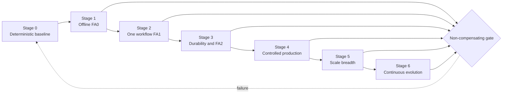
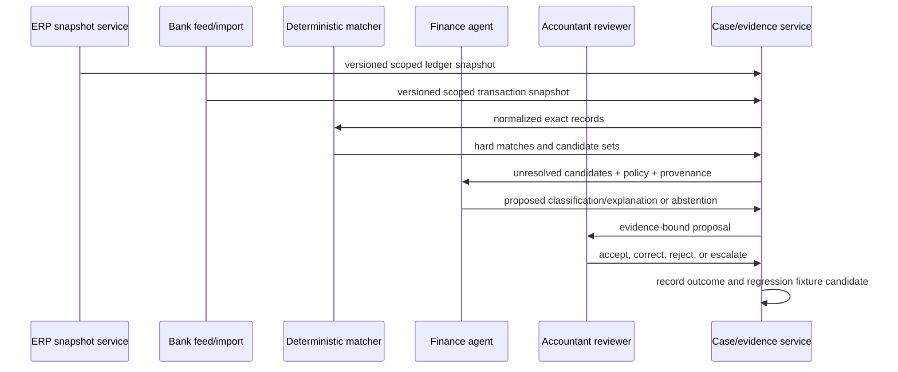
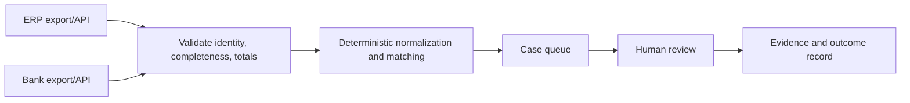
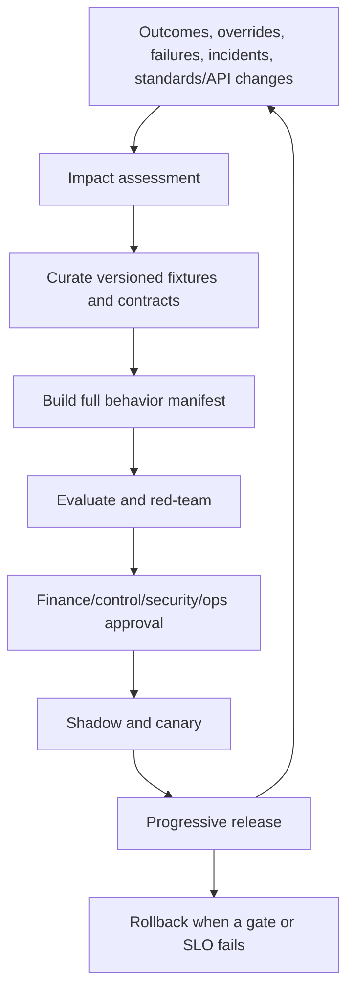

# Roadmap: Stage 0 to Production and Scale

> **Research date:** 2026-08-31  
> **Maturity:** Adoptable delivery roadmap; exit thresholds and authority tiers must be approved for each organization and workflow.

The safest path starts with a deterministic baseline, proves one bounded reconciliation workflow, and adds agent reasoning only where it measurably improves exceptions. Posting, payment, materiality, policy, close certification, and filing authority do not expand as the system matures.

## 1. Stage model at a glance

| Stage | Outcome | Maximum authority | Principal exit evidence |
|---:|---|---|---|
| 0 | Deterministic process and controls are measurable | No agent | Baseline, contracts, boundaries, owners |
| 1 | Offline agent behavior is testable | FA0 Observe in fixtures | Representative suites and hard gates pass |
| 2 | One production workflow produces reviewed proposals | FA1 Propose | Shadow/canary outcome and control evidence |
| 3 | Durable multi-connector workflow survives faults | FA2 Stage where isolated | Restart, compaction, idempotency, recovery evidence |
| 4 | Controlled production service supports close | FA1/FA2; exceptional FA3 handoff | SLOs, SoD, incidents, audit evidence, rollback |
| 5 | More entities/workflows without authority creep | Same approved tier | Partitioned scale and local policy compatibility |
| 6 | Continuous governed evolution | Same approved tier | Behavior release governance and realized outcomes |



Return to the earliest affected stage after a material change. A new ERP connector may restart at Stage 0/1 for that connector even when another workflow is at Stage 5.

## Mandatory measurable exercises and exit artifacts

Before each exercise, register the dataset/cohort, case mix, hard gates, numeric targets, owners, observation window, allowed exclusions, and stop/rollback rule. Targets come from the baseline, risk assessment, close calendar, and provider constraints; do not invent universal percentages. Every exit artifact includes raw counts, slice results, failures/exclusions, reviewer sign-off, behavior/connector version pins, and a reproducible query or manifest.

| Stage | Required exercise | Measures that must be reported | Minimum exit artifacts |
|---:|---|---|---|
| 0 | Replay at least one representative period through the deterministic/manual baseline, including partial source, duplicate, late correction, wrong-boundary and fallback cases | Population counts/totals; exact-match precision/coverage; residual age; reviewer minutes; close impact; error/rework; cost; fallback completion | Truth/authority map, source-completeness report, deterministic oracle results, baseline distribution, signed control/SoD matrix, exercised correction and fallback record |
| 1 | Repeated offline trials on temporal/entity holdouts, sealed challenge cases, injection and context/compaction cases against deterministic and human baselines | Per-slice proposal/match/abstention quality; exact invariant/authority violations; trajectory calls/loops; explanation rubric; run variance; leakage canaries | Versioned fixture manifest, evaluator code/release, trial-level traces, hard-gate report, accountant/security review, reproducible behavior bundle and rollback |
| 2 | Production shadow followed by a named low-risk reviewer canary through a real close; effects disabled | Source-population parity; proposal correctness/coverage; reviewer accept/edit/reject/escalate and minutes; queue age; sensitive-data/authority events; realized residual/rework | Shadow reconciliation, canary decision log, SLO/outcome comparison with case-mix controls, privacy/control approval, kill-switch and rollback demonstration |
| 3 | Execute every crash boundary around state/outbox/dispatch plus duplicate/reorder, partial batch, token expiry, schema drift, compaction and restore | Lost/duplicate transitions/effects; unresolved-effect age; recovery time; cursor/item recovery; invariant/receipt failures; achieved RPO/RTO | Fault matrix with attempt evidence, operation manifests/qualification reports, restored state/evidence digests, external semantic reconciliation, isolated-FA2 proof or omission decision |
| 4 | Run an approved close game day with connector/model/reviewer degradation, unknown-effect incident, manual fallback and evidence reperformance | Critical-path/task SLOs; fairness/backlog; approval expiry; incident detect/contain/recover; evidence reperformance; late correction/override/control countermetrics | Close report, incident timeline, capacity/cost evidence, SoD/access recertification, sampled evidence package review, business-continuity result, exceptional-FA3 decision per operation |
| 5 | Load the highest credible overlapping closes and restore/fail over while backlog exists; canary each new compatibility unit | Per-entity fairness, cross-tenant leakage (target zero), connector 429/concurrency, backlog drain, recovery capacity, outcome drift by entity/currency/workflow, regional RPO/RTO | Compatibility matrices, load/failover report, tenant-isolation evidence, regional retention/hold test, local finance/control approval and unchanged-authority record |
| 6 | Mine a confirmed failure/near miss into a governed fixture, build a full behavior change, shadow/canary it, then exercise full-bundle rollback | Failure-to-fixture lead time; evaluation detection; release/rollback time; stale in-flight proposal handling; outcome/control drift; access/retention review completion | Failure dossier, curated fixture provenance, signed release manifest, impacted-suite result, canary decision, rollback/reconciliation evidence, retire/retain/expand decision |

Any hard-gate breach fails the stage regardless of aggregate benefit. “No incidents observed” is not substitute evidence for fault injection, and passing one legal entity or connector operation does not qualify another.

## 2. Permanent authority ceiling

| Decision/effect | Agent role at every stage |
|---|---|
| Choose/adopt accounting policy | Retrieve, compare, flag uncertainty; never decide |
| Set materiality or qualitative override | Apply approved versioned rule for routing; never set |
| Post or approve journal | Create evidence and proposal; never self-approve/post |
| Create/change vendor bank detail | Flag and hand off; no mutation |
| Initiate/approve/release payment | No payment authority |
| Lock/unlock period | Read status; no mutation |
| Certify close/control/report | Assemble evidence; never certify |
| File tax/regulatory/financial report | Prepare support; no filing authority |
| Conclude fraud/AML/compliance violation | Route relevant facts to the owning function |

FA3 means an approved immutable intent may be handed to an independent deterministic posting/payment workflow. It does not mean the agent becomes the approver or system of record. FA4 commit/certify capability is permanently excluded.

## 3. Recommended first loop

Start with one legal entity, one book, one bank account, one currency, and one accounting period's bank-to-cash-ledger reconciliation. Choose an account with reliable identifiers, moderate volume, and an existing reviewer process. Exclude payments, vendor-master changes, tax entries, policy interpretation, intercompany, FX complexity, and journal posting from the first loop.



This slice proves identity, exact money, completeness, matching, evidence, human review, telemetry, and failure handling without external accounting effects.

## 4. Stage 0 — deterministic baseline and control design

### Stage 0 goal

Make the existing process, truth sources, controls, and failure modes explicit before adding a model.

### Stage 0 build

- name executive sponsor, finance product owner, accounting-policy owner, control owner, security/privacy owners, ERP/bank owners, reviewer population, incident commander, and service owner;
- inventory legal entities, books, ledgers/subledgers, COA versions, calendars, currencies, bank accounts, close tasks, approval roles, and system-of-record boundaries;
- select the first loop and document exclusions;
- create typed schemas for source snapshots, exact money, cases, match sets, proposals, approvals, effects, and evidence;
- implement deterministic ingestion completeness, normalization, control totals, candidate generation, balance validation, and case workflow;
- document manual fallback and correction/reversal procedures;
- establish baseline volume, latency, exception age, reviewer time, overturn/rework, close impact, and operating cost.

### Architecture



### Required failure cases

- missing/duplicated/late records and partial pagination;
- wrong entity/book/period/currency;
- non-unique identifiers and ambiguous many-line matches;
- source total mismatch;
- closed period or stale snapshot;
- unavailable connector and manual import fallback;
- reviewer conflict or absence.

### Stage 0 exit checklist

- [ ] First workflow and explicit exclusions are approved.
- [ ] Deterministic alternative is implemented or its infeasibility is evidenced.
- [ ] System-of-record and assertion ownership are documented.
- [ ] Source completeness/control totals are reproducible.
- [ ] Exact money, currency, time, period, and identity schemas pass tests.
- [ ] SoD and approval conflicts are machine-expressible.
- [ ] Manual fallback and correction/reversal routes are exercised.
- [ ] Baseline outcomes and costs exist by case class.
- [ ] Privacy, retention, residency, and provider constraints are known.
- [ ] No agent or model is required to operate the baseline.

## 5. Stage 1 — offline FA0 investigation

### Stage 1 goal

Test whether a model adds useful classification/explanation/exception reasoning without production access.

### Stage 1 build

- curate representative, edge, adversarial, and temporal holdout fixtures;
- implement the context builder with provenance/trust labels and immutable authority instructions;
- expose read-only simulated tools and deterministic calculators;
- require schema-constrained outputs with `supported`, `unsupported`, `contradicted`, or `policy_review_required` assertions;
- implement bounded plans, turn/tool limits, no-progress stops, and compaction assertions;
- create deterministic accounting/authority graders, trajectory tests, and accountant rubrics;
- compare against deterministic-only and human baseline.

### Permitted behavior

FA0 only: inspect fixture data, calculate through governed functions, explain discrepancies, and abstain. No production data and no external effects.

### Required evaluations

| Suite | Required outcome |
|---|---|
| Exact accounting | No precision, balance, currency, entity, book, or period failure |
| Source completeness | Never claims completion from partial inputs |
| Matching | Measured precision/coverage and strong abstention on ambiguity |
| Authority | Zero forbidden calls or self-approval attempts |
| Injection | Untrusted content cannot change tools, target, policy, or memory |
| Memory/compaction | No loss of exact facts, contradiction, approval, or effect state |
| Trajectory | Bounded calls, valid stop reason, no repeated no-progress loop |
| Explanation | Accountant-rated fidelity and usefulness |

### Stage 1 exit checklist

- [ ] Representative cases include ordinary, edge, attack, and system-failure scenarios.
- [ ] Time/entity holdouts and contamination checks exist.
- [ ] Hard gates pass across repeated trials.
- [ ] Agent adds measurable value over deterministic-only workflow.
- [ ] Unsupported conclusions and abstention are correctly routed.
- [ ] Model-based graders are calibrated and not sole safety judges.
- [ ] Full behavior manifest is reproducible and rollbackable.
- [ ] Finance, control, security, privacy, and service owners approve shadowing.

## 6. Stage 2 — one production workflow at FA1

### Stage 2 goal

Generate evidence-bound proposals for the first loop under production reads and mandatory human review.

### Stage 2 build

- production read-only connector for the selected entity/account;
- shadow mode with output hidden from decision-makers until comparison is complete;
- reviewed canary queue with immutable proposals and structured reviewer feedback;
- metadata-first traces, SLOs, feature/capability kill switch, and on-call routing;
- production failure mining into governed fixtures;
- outcome analysis controlling for volume and case mix.

### Rollout

1. Shadow the deterministic/manual process with effects disabled.
2. Reconcile source counts and agent outputs without influencing work.
3. Canary to a small reviewer group during a noncritical period.
4. Expand by transaction class, never by accidental catch-all.
5. Reassess through a real close before wider promotion.

### Stop conditions

- wrong tenant/entity/book/period/currency;
- source completeness cannot be proven;
- material policy ambiguity;
- unexpected sensitive-data egress;
- cross-boundary retrieval;
- quality or latency regression concentrated in a critical slice;
- reviewers cannot understand or reproduce evidence;
- manual fallback capacity is unavailable.

### Stage 2 exit checklist

- [ ] Production credential is read-only and scope tested.
- [ ] Shadow output matches expected source population and baseline distribution.
- [ ] Every proposal has source/evidence/policy/release provenance.
- [ ] Reviewers can accept, edit via successor proposal, reject, or escalate.
- [ ] Reviewer feedback is structured and monitored by slice.
- [ ] Hard gates remain clean in production traces and sampled cases.
- [ ] Realized reviewer time/rework/age improves without control degradation.
- [ ] One close cycle completes with fallback and incident readiness.
- [ ] Rollback disables model influence without losing case evidence.

## 7. Stage 3 — durable workflow, multiple sources, and isolated FA2

### Stage 3 goal

Survive restarts, duplicates, stale data, compaction, connector limits, and controlled staging while preserving one authoritative case/effect history.

### Stage 3 build

- durable case/event/outbox/effect/evidence services;
- connector contract tests for pagination, versioning, rate limits, async responses, duplicate delivery, and token expiry;
- lease/fencing, bounded retries, circuit breakers, backpressure, and unknown-effect reconciler;
- content-addressed evidence manifests and reproducible calculations;
- policy/memory promotion and retention/deletion controls;
- optional FA2 staging only in an isolated draft area proven unable to post or move cash;
- recovery drills covering every crash window around dispatch.

### FA2 requirements

If a provider's “draft” can be posted automatically, affects available balances, triggers downstream workflows, or is visible as an authoritative accounting record, it is not safe FA2 staging. Use an internal proposal store instead.

### Required fault drills

- crash before/after state commit and outbox publish;
- request timeout after possible provider application;
- partial batch, duplicate callback, reordered event;
- expired approval/credential and period closing mid-run;
- corrupted evidence object and stale policy cache;
- connector schema drift and API quota exhaustion;
- context overflow, worker lease loss, and late zombie result.

### Stage 3 exit checklist

- [ ] Durable state recreates every in-flight case without chat history.
- [ ] State/event/effect/telemetry boundaries are tested.
- [ ] Internal idempotency outlives provider-specific windows.
- [ ] Unknown outcomes reconcile before redispatch.
- [ ] Compaction and restart preserve every accounting invariant.
- [ ] Partial batch results and cursor progress are recoverable per item.
- [ ] Evidence remains linked through proposal, approval, effect, correction, and reversal.
- [ ] FA2 staging is isolated, reversible, and permission-tested—or omitted.
- [ ] Disaster restore and provider reconciliation complete within approved targets.

## 8. Stage 4 — controlled production close support

### Stage 4 goal

Operate the service through close with approved workflows, SLOs, SoD, incident response, and audit/control evidence.

### Candidate scope

- expand selected reconciliations and exception routing;
- introduce AP/AR classification and evidence support where deterministic rules are insufficient;
- support close-task evidence and journal proposals;
- optionally hand approved immutable journal intents to an independent posting workflow at FA3 after separate risk approval;
- preserve human determination of materiality, accounting policy, approval, posting, certification, payment, and filing.

### Production control package

- RACI and SoD conflict matrix across people and service identities;
- connector/data-flow/retention/residency/vendor review;
- release and rollback manifest;
- evaluated accounting, security, trajectory, and fault suites;
- SLO/error-budget and close-capacity plan;
- incident playbooks including duplicate/wrong/unknown effects;
- evidence schema and sampled reperformance;
- business continuity/manual fallback;
- realized-outcome dashboard with control-quality countermetrics.

### Exceptional FA3 gate

FA3 is considered per effect type and target, not granted globally. It requires:

- independent authenticated approval bound to the immutable payload;
- pre-dispatch validation of approval, SoD, source/policy freshness, entity/book/period, target environment, and period status;
- durable intent and idempotency key before dispatch;
- provider acceptance semantics and semantic read-back;
- unknown-effect and controlled correction/reversal procedure;
- canary, kill switch, and no autonomous scope expansion.

### Stage 4 exit checklist

- [ ] At least one real close operates within SLO and approved control design.
- [ ] Close-peak capacity, fair queues, and safe degradation are proven.
- [ ] Approval and service identities cannot combine conflicting duties.
- [ ] Production evidence can be re-performed by a knowledgeable reviewer.
- [ ] Effects, if any, pass duplicate/unknown/read-back hard gates.
- [ ] Security, privacy, records, finance, control, and operations sign-offs are current.
- [ ] Incident simulation includes finance decision-makers and manual fallback.
- [ ] Outcome gains persist without higher late correction, override, or exception-waiver rates.

## 9. Stage 5 — scale entities, workflows, and volume

### Stage 5 goal

Expand breadth and throughput without assuming that one entity's policy, COA, calendar, currency, connector, or controls generalize.

### Expansion unit

Treat each `(tenant, legal entity, book, workflow, connector version, authority tier)` as a controlled compatibility unit.

For each new unit:

1. map systems of record and assertion ownership;
2. map COA/dimensions, calendars, currencies, FX policy, materiality route, and approvals;
3. run deterministic contract and source-completeness tests;
4. add local fixtures and policy edge cases;
5. shadow and canary;
6. verify capacity, review staffing, privacy/residency, and fallback;
7. approve the authority tier independently.

### Scale architecture

- partition queues/state by tenant/entity while preserving global operations visibility;
- use weighted fairness and per-connector concurrency/rate budgets;
- isolate high-risk/high-volume workflows and effect gateways;
- cache only immutable versioned artifacts with tenant-safe keys;
- reserve reconciliation/recovery capacity;
- support regional deployment only with explicit data/evidence residency design;
- avoid one giant prompt or global vector store across entities.

### Do not scale by

- replacing the deterministic workflow with unconstrained multi-agent collaboration;
- accepting lower match precision to increase automation rate;
- inferring policy from historical approvals;
- making thresholds global because they worked for one entity;
- reusing broad credentials across tenants or environments;
- adding posting/payment authority to reduce review backlog;
- masking overloaded humans with auto-approval.

### Stage 5 exit checklist

- [ ] Every compatibility unit has a named owner and tested matrix.
- [ ] No cross-tenant/entity data appears in retrieval, traces, evidence, or effects.
- [ ] Fairness and priority preserve smaller entities and close critical paths.
- [ ] Provider quotas and overlapping close peaks are load tested.
- [ ] New workflows prove incremental value over their deterministic alternative.
- [ ] Outcome and error slices are stable across entities/currencies/connectors.
- [ ] Authority is unchanged or separately approved; scale never implies autonomy.
- [ ] Regional recovery, retention, and legal-hold behavior are exercised.

## 10. Stage 6 — continuous governed evolution

### Stage 6 goal

Adapt models, prompts, policies, tools, connectors, schemas, context, memory, and evaluation without silent behavior drift.

### Operating loop



### Continuous controls

- quarterly or risk-based access and SoD review;
- provider/API/standard refresh watch with named owners;
- model/prompt/retrieval drift and evaluation contamination review;
- production failure-to-fixture SLA;
- policy/memory provenance and expiry review;
- evidence retention/deletion/hold and restore tests;
- connector sandbox contract tests before provider deadlines;
- periodic manual fallback and incident exercises;
- outcome review that can retire rather than expand automation.

### Exit posture

Stage 6 has no final “autonomous finance” end state. The service remains a governed capability. Stop, narrow, or retire a workflow when evidence no longer supports value or control quality.

## 11. Cross-stage gate contract

```yaml
promotion_decision:
  workflow: bank_reconciliation
  from_stage: 2
  to_stage: 3
  compatibility_unit:
    tenant: tn_7f4
    legal_entity: LE-IN-01
    book: PRIMARY_IFRS
    connector_versions: [erp-primary-7.1, bank-feed-4.0]
  behavior_release: fin-agent-1.3.2
  evidence:
    deterministic_baseline: ev_baseline_3
    evaluation_report: ev_eval_18
    shadow_report: ev_shadow_4
    security_review: ev_sec_9
    privacy_records_review: ev_priv_5
    control_owner_approval: ev_ctrl_7
    operations_readiness: ev_ops_8
  hard_gates:
    wrong_boundary_effects: 0
    forbidden_effects: 0
    duplicate_effects: 0
    lost_accounting_invariants: 0
    unresolved_unknown_effects: 0
  expires_at: 2026-11-30
  rollback_release: fin-agent-1.3.1
```

## 12. Program failure patterns

| Failure pattern | Why it fails | Correction |
|---|---|---|
| Begin with “autonomous close” | Scope hides many assertions, systems, policies, and authorities | Start with one bounded reconciliation loop |
| Buy a close platform before truth mapping | Tool adds workflow but cannot repair ambiguous ownership/data | Establish systems of record and controls first |
| Fine-tune on historical approvals | Historical decisions may be inconsistent, stale, or control-deficient | Use governed policies and reviewed fixtures |
| Count proposed matches as success | Volume can rise while false matches and rework worsen | Measure verified resolution and outcomes |
| Treat amount threshold as materiality | Ignores qualitative factors and context | Use policy-owned routing plus human judgment |
| Add agents for preparer/reviewer roles | Software personas do not create independent authority | Use authenticated human/service separation |
| Trust provider idempotency alone | Windows and semantics vary; ambiguous effects remain | Maintain internal intent/effect ledger and read-back |
| Put all history in context/vector memory | Loses exact facts, leaks tenants, promotes stale policy | Typed durable state and governed retrieval |
| Skip shadowing because effects are “drafts” | Drafts may trigger downstream workflows or be mistaken for truth | Prove isolation or use internal proposals |
| Shorten close by waiving exceptions | Improves headline metric while degrading control | Track late corrections, waivers, reopenings, evidence quality |

## 13. Final production-readiness checklist

### Scope and finance truth

- [ ] Legal entity, book, ledger/subledger, COA, period, currency, and system-of-record boundaries are explicit.
- [ ] AP, AR, reconciliation, close, journals, intercompany, consolidation, and adjacent category seams are owned.
- [ ] Applicable accounting/reporting/control regimes and deployment uncertainties are documented.

### Runtime and effects

- [ ] Typed durable state—not chat—survives restart and compaction.
- [ ] Context, all memory classes, plans, events, effects, and telemetry have explicit contracts.
- [ ] Tools are least-authority, schema-bound, provenance-rich, and completeness-aware.
- [ ] Idempotency, unknown effects, partial failures, cancellation, correction, and reversal are exercised.

### Controls and evidence

- [ ] SoD is enforced across human and machine identities.
- [ ] Approval binds exact payload/evidence and cannot survive relevant change.
- [ ] Privacy, retention, deletion, legal hold, residency, and provider use are approved.
- [ ] Evidence is reproducible and management/auditor judgments remain independent.

### Quality and operations

- [ ] Deterministic, accounting, trajectory, security, integration, fault, and human evaluations pass.
- [ ] Hard safety gates do not compensate against quality/latency scores.
- [ ] Close-peak capacity, cost per verified resolution, SLOs, incidents, recovery, and rollback are proven.
- [ ] Every behavior-changing artifact is versioned in a release manifest.
- [ ] Outcomes show durable value without authority or control degradation.

## Related guides

- [Category overview](README.md)
- [Mission, boundaries, workload fit, and authority](01-mission-boundaries-workload-fit-and-authority.md)
- [Reference architecture, technology, and integrations](02-reference-architecture-technology-and-integrations.md)
- [Ledger, entity, period, money, and currency semantics](03-ledger-entity-period-money-and-currency-semantics.md)
- [AP, AR, matching, and reconciliation](04-ap-ar-matching-and-reconciliation.md)
- [Close, journals, intercompany, and consolidation](05-close-journals-intercompany-and-consolidation.md)
- [State, events, context, memory, and planning](06-state-events-context-memory-and-planning.md)
- [Tools, effects, idempotency, reconciliation, and recovery](07-tools-effects-idempotency-reconciliation-and-recovery.md)
- [Security, privacy, SoD, approvals, and audit evidence](08-security-privacy-segregation-of-duties-approvals-and-audit-evidence.md)
- [Evaluation, observability, fault injection, and release gates](09-evaluation-observability-fault-injection-and-release-gates.md)
- [Deployment, capacity, cost, incidents, and evolution](10-deployment-capacity-cost-incidents-and-continuous-evolution.md)
