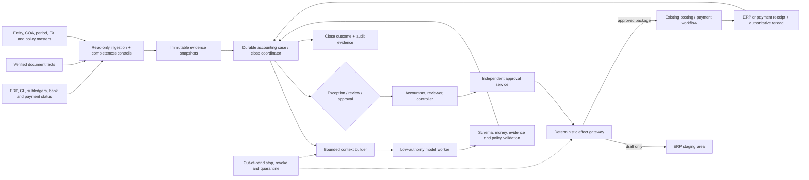

# Finance and Accounting Operations Agent Blueprint

> **Category:** 38 — Finance and accounting operations  
> **Research date:** 2026-08-31  
> **Maturity:** Research-backed production blueprint; every accounting policy, materiality rule, control, connector, retention period, and filing obligation requires organization- and jurisdiction-specific validation  
> **Audience:** Controllers, accounting operations leaders, finance systems engineers, internal-control owners, security reviewers, auditors, platform engineers, and teams evaluating AI-assisted close, AP/AR, and reconciliation workflows

## Bottom line

The safe production design is a **durable accounting workflow with a low-authority reasoning worker**, not an autonomous accountant and not a chat interface with an ERP posting credential.

The ERP, accounting platform, bank, subledger, approved consolidation engine, and deterministic calculation services retain monetary and accounting truth. A case/close coordinator owns work state, deadlines, evidence, approvals, and exceptions. The model may correlate imperfect evidence, rank candidate matches, explain differences, draft a journal proposal, or summarize a close exception. Humans and deterministic accounting systems retain accounting-policy, materiality, posting, payment, close-certification, filing, and management-representation authority.

If stable rules can fully describe the work, use ordinary reconciliation, workflow, and accounting software. Add model-directed execution only where unstructured or conflicting evidence makes a bounded next-step decision materially better than that baseline.

## Scope and ownership

| This blueprint owns | It does not own |
|---|---|
| Legal-entity, ledger/book, chart-of-accounts, subledger, and accounting-period identity in workflow records | The ERP's ledger, subledger, master-data, or period-control authority |
| AP/AR exception support, candidate matching, account reconciliation, journal proposals, close tasks, and evidence assembly | Supplier sourcing/award, contract interpretation, invoice OCR, suspicious-network investigation, or independent control testing |
| Intercompany difference cases, elimination evidence, consolidation support, and roll-forward verification | Determining the group boundary, accounting policy, functional currency, materiality, or consolidation certification |
| Exact approval and posting handoff packages | Posting journals, releasing payments, changing bank details, opening periods, certifying close, filing, or signing representations |
| Correction, reversal, and re-reconciliation workflows | Erasing or silently overwriting a posted accounting history |
| Realized close outcomes: reconciled balances, resolved exceptions, verified postings, timeliness, reopenings, and downstream restatements | Declaring financial statements fairly presented or controls effective |

Required separation from adjacent categories:

- [FinOps and cloud-cost optimization](../finops-cloud-cost-agent/README.md) owns cloud-cost economics, allocation, optimization evidence, and realized savings; this area begins when an approved business event must be represented or reconciled in accounting records.
- [Document intelligence](../document-intelligence-agent/README.md) owns invoice, statement, and attachment extraction with field provenance; this area validates those facts against vendor, PO, receipt, tax, subledger, and ledger context.
- Procurement owns requisitions, sourcing, supplier award, and commercial selection; this area owns the resulting ordinary AP accounting workflow.
- Fraud/AML owns suspicious transaction and entity-network investigation; this area may flag an ordinary reconciliation exception for referral but must not conduct or suppress that investigation.
- [Compliance audit](../compliance-audit-agent/README.md) independently tests controls and evidence; finance operations performs the process and supplies evidence without grading its own control effectiveness.
- [Back-office workflow operations](../back-office-workflow-agent/README.md) supplies generic case mechanics; this blueprint adds double-entry, money, period, materiality, consolidation, correction, and close semantics.

## Definition of done

A finance run is not complete because the model says a balance “looks reconciled” or an API returns `2xx`. Completion requires the applicable deterministic postconditions:

1. entity, ledger/book, accounting basis, chart version, currency, account, and period identities are unambiguous;
2. source populations are complete for the declared cutoff or explicitly qualified as incomplete;
3. debits and credits balance in every required currency/basis and deterministic validations pass;
4. evidence supports the relevant assertion and preserves supporting **and contradicting** facts;
5. required preparer, reviewer, approver, posting, and certification duties remain separated;
6. any approved proposal is bound to an exact payload, source snapshot, policy, target state, and expiry;
7. the deterministic downstream system posts or rejects it and returns a durable identifier;
8. the GL, subledger, bank/payment status, consolidation result, and workflow state reconcile after the effect;
9. corrections and reversals remain linked to the original record; and
10. close outcome, exceptions, unresolved differences, reopenings, and sign-offs are recorded for audit and later evaluation.

## Representative workflows

| Workflow | Useful model contribution | Deterministic/human authority |
|---|---|---|
| AP invoice exception | Compare extracted facts, PO/receipt, vendor history, and policy; explain mismatch; request missing evidence | Invoice schema/tax rules, vendor master, tolerance, payment block/release, and payment approval |
| AR cash application | Rank remittance-to-open-item candidates and explain confidence | Amount/currency/date constraints, unapplied-cash state, write-off policy, and final application |
| Bank reconciliation | Suggest one-to-one, one-to-many, fee, timing, and transfer candidates | Statement completeness, balance arithmetic, match acceptance, adjustment approval, and posting |
| Balance-sheet reconciliation | Assemble roll-forward and support, identify stale items, summarize differences | Account ownership, materiality, reconciliation certification, and clearing/posting |
| Manual journal proposal | Draft balanced lines with cited support, purpose, reversal plan, and uncertainty | Accounting treatment, materiality, approval, ERP validation, posting, and period access |
| Intercompany | Pair counterparty records, explain currency/timing/classification differences, create cases | Counterparty/entity mapping, policy, FX, elimination, settlement, and consolidation certification |
| Period close | Triage task dependencies, blockers, exceptions, and evidence; draft close-status narrative | Period open/close, checklist acceptance, controller sign-off, statements, disclosures, and filing |
| Correction/reversal | Trace original effect, propose correction type, and assemble impact evidence | Error-versus-estimate/policy classification, materiality, reopen/restatement decision, posting, and disclosure |

## Authority ceiling

Grant authority per **legal entity × ledger/book × period × account/process × effect class × amount/risk band**. Never grant it to “the finance agent” as a whole.

| Level | Capability | Default posture |
|---|---|---|
| **FA0 — Observe** | Read a purpose-limited projection; calculate and explain without mutation | Safe starting point after access and data-quality tests |
| **FA1 — Propose** | Create a typed match, exception, evidence request, close task update, or journal proposal in the workflow store | Default useful production ceiling |
| **FA2 — Stage** | Create a reversible, explicitly non-posting draft in an approved accounting workspace | Optional after exact-target, duplicate, period, and SoD tests |
| **FA3 — Approved handoff** | Submit an approved immutable package to an existing deterministic posting/payment/filing workflow; that system independently revalidates and commits | Mature deployments only; the agent never receives the commit credential or authority |
| **FA4 — Commit or certify** | Post, pay, change master data/policy, open or close a period, set materiality, consolidate/certify, file, sign, or attest | Excluded from the agent runtime |

Conversation, retrieved content, historical behavior, model confidence, and prior approval cannot raise this ceiling.

## System context and trust boundaries

The reasoning plane receives evidence references and permitted choices, never raw credentials or a generic ERP/bank SDK. Posting and payment identities live only in pre-existing deterministic control paths outside the model runtime.

## Architecture selection

| Option | Use when | Strength | Reject when |
|---|---|---|---|
| Deterministic reconciliation/workflow only | Rules, tolerances, mappings, and evidence are structured and stable | Cheapest, most reproducible, easiest to audit | Human effort remains dominated by genuine semantic ambiguity |
| Custom bounded loop | One short read-only triage needs a few typed queries | Minimal dependencies and precise control | Work waits for approvals, spans close days, or needs crash-safe recovery |
| Workflow engine plus model activity | Close/reconciliation cases have timers, approvals, retries, and durable handoffs | Explicit lifecycle and recovery | Team cannot operate the engine or the workflow is still small and synchronous |
| Existing close/reconciliation platform plus model extension | The organization already trusts its task, reconciliation, and audit controls | Reuses system-of-record workflow | Product APIs, exports, permissions, or evidence guarantees cannot satisfy the contract |
| Multi-agent roles | Almost never for the first production system | Possible isolation for independently governed specialist services | Roles merely mimic accounting job titles or share the same authority and state |

Recommended default: keep the ERP/accounting platform authoritative, use one durable coordinator, deterministic validation/calculation/matching services, and one stateless or checkpointed model worker. Add a workflow engine only after observed waits and recovery needs justify it. Do not add a “journal agent,” “reconciliation agent,” and “close agent” that negotiate through prose.

### Runtime and language summary

- **Java/.NET:** strong fit when existing ERP integration, enterprise identity, policy, and operations are already standardized there.
- **Python:** strong fit for offline matching experiments, evaluation, data-quality analysis, and constrained statistical services; isolate notebooks and do not make them the posting plane.
- **TypeScript/Node.js:** strong fit for approval/review interfaces and I/O-heavy connector services when decimal and date libraries are explicitly chosen and tested.
- **SQL:** required for deterministic set reconciliation and completeness checks, but expose reviewed parameterized queries rather than arbitrary model-generated SQL.
- **Polyglot:** justified when the organization already has an enterprise integration/runtime standard plus a separate governed analytics stack. It is not a reason to duplicate domain rules.

The language does not determine accounting correctness. Decimal semantics, calendar/period rules, transaction boundaries, connector behavior, and operating competence do.

## Guide map

Read in order for a zero-to-production path:

1. [Mission, boundaries, workload fit, and authority](01-mission-boundaries-workload-fit-and-authority.md)
2. [Reference architecture, technology, and integrations](02-reference-architecture-technology-and-integrations.md)
3. [Ledger, entity, period, money, and currency semantics](03-ledger-entity-period-money-and-currency-semantics.md)
4. [AP, AR, matching, and reconciliation](04-ap-ar-matching-and-reconciliation.md)
5. [Close, journals, intercompany, and consolidation](05-close-journals-intercompany-and-consolidation.md)
6. [State, events, context, memory, and planning](06-state-events-context-memory-and-planning.md)
7. [Tools, effects, idempotency, reconciliation, and recovery](07-tools-effects-idempotency-reconciliation-and-recovery.md)
8. [Security, privacy, segregation of duties, approvals, and audit evidence](08-security-privacy-segregation-of-duties-approvals-and-audit-evidence.md)
9. [Evaluation, observability, fault injection, and release gates](09-evaluation-observability-fault-injection-and-release-gates.md)
10. [Deployment, capacity, cost, incidents, and continuous evolution](10-deployment-capacity-cost-incidents-and-continuous-evolution.md)
11. [Roadmap: Stage 0 to production and scale](11-roadmap-stage-0-to-production-and-scale.md)

The dated [research packet](../../research/packets/finance-accounting-agent-blueprint.md) records the source baseline, evidence-to-decision map, contradictions, limitations, and refresh triggers.

## First bounded production slice

Choose one legal entity, one ledger/book, one open period, one low-risk reconciliation type, and read-only source access. A useful first slice is **bank or clearing-account reconciliation support** with deterministic exact matches and model-ranked ambiguous candidates. Ship:

- immutable source snapshots and population totals;
- deterministic exact/constraint matching before model ranking;
- an exception case with evidence, confidence, and abstention;
- human accept/reject/correct disposition;
- no journal posting or payment tool;
- replayable evaluation from historical reconciliations; and
- verified realized outcome: accepted match correctness, residual aging, close timeliness, and reviewer effort.

Do not begin with manual-journal posting, vendor bank changes, payment release, revenue recognition, tax, consolidation certification, financial statements, or filing.

## Top risks and stop conditions

| Risk | Stop or escalate when |
|---|---|
| Wrong entity/ledger/period/account | Any identifier is inferred from display text, stale mapping, or ambiguous alias |
| Money or FX error | Currency, scale, rate type/date/source, rounding, or balancing basis is missing |
| Incomplete population | Source watermark/control total cannot prove the declared cutoff |
| Management override or SoD collapse | One principal can propose, approve, post, and reconcile; service identities hide human lineage |
| Duplicate or unknown effect | A timeout cannot be reconciled by semantic operation ID and downstream state |
| Stale approval | Source snapshot, period status, amount, account, policy, approver authority, or target version changed |
| Prompt/document injection | Untrusted invoice, memo, attachment, or tool text attempts to change policy, destinations, or instructions |
| Materiality uncertainty | A threshold is missing, qualitative factors apply, or aggregate/cross-period effects are unknown |
| Control or policy conflict | Accounting basis, organizational policy, local rule, and connector behavior disagree |
| Close pressure | Deadline pressure would bypass evidence, review, period controls, or reconciliation |

When in doubt, preserve the evidence, block the effect, and route a small decision surface to the accountable accountant or controller.

## Roadmap summary

| Stage | Outcome | Maximum default authority |
|---|---|---|
| 0 — Qualify | Reproducible deterministic reconciliation/workflow baseline | Offline only |
| 1 — Bounded loop | Typed reasoning over frozen/read-only fixtures | FA0 |
| 2 — Useful MVP | One real entity/process with durable evidence and human disposition | FA1 |
| 3 — Reliable v1 | Durable waits, compaction, connectors, correction, idempotency, reconciliation, recovery | FA1; optional FA2 in sandbox |
| 4 — Production readiness | Identity, SoD, privacy, SLOs, release gates, runbooks, restore, and audit acceptance | Approved FA1/FA2; exceptional FA3 handoff |
| 5 — Scale and resilience | Close peaks, fairness, backpressure, cells/regions only where justified | No increase |
| 6 — Continuous governed evolution | Failure mining and behavior-release promotion with refresh ownership | No increase without a new governance case |

See [the full roadmap](11-roadmap-stage-0-to-production-and-scale.md) for exact exit evidence.

## Refresh triggers

Review the affected guides immediately when an accounting standard, local GAAP/tax/e-invoicing/payment rule, materiality policy, legal-entity/COA/ledger design, ERP/close platform API, bank format, identity model, model/provider boundary, retention obligation, or control owner changes. Also refresh after any close reopening, duplicate/incorrect posting, unexplained reconciliation difference, audit finding, security incident, model regression, or new authority class. Verify pricing, quotas, and product availability at deployment time.

## Canonical repository dependencies

- [Agent state and event contracts](../../runtime/agent-state-and-event-contracts.md)
- [Durable execution](../../runtime/durable-execution.md)
- [Run controls](../../runtime/run-controls.md)
- [Tool contracts](../../tools/tool-contracts.md)
- [Tool results, artifacts, and provenance](../../tools/tool-results-artifacts-and-provenance.md)
- [Context engineering](../../context-memory/context-engineering.md)
- [Memory architecture](../../context-memory/memory-architecture.md)
- [Compaction and continuity](../../context-memory/compaction-and-continuity.md)
- [Idempotency and side effects](../../reliability/idempotency-and-side-effects.md)
- [Agent threat model](../../security/agent-threat-model.md)
- [Prompt injection and untrusted data](../../security/prompt-injection-and-untrusted-data.md)
- [Permissions, sandboxing, and secrets](../../security/permissions-sandboxing-and-secrets.md)
- [Trajectory and reliability evaluation](../../evaluation/trajectory-and-reliability-evaluation.md)
- [Observability and tracing](../../evaluation/observability-and-tracing.md)
- [Deployment, release, and incident response](../../operations/deployment-release-and-incident-response.md)
- [Scaling, capacity, and SLOs](../../operations/scaling-capacity-and-slos.md)
