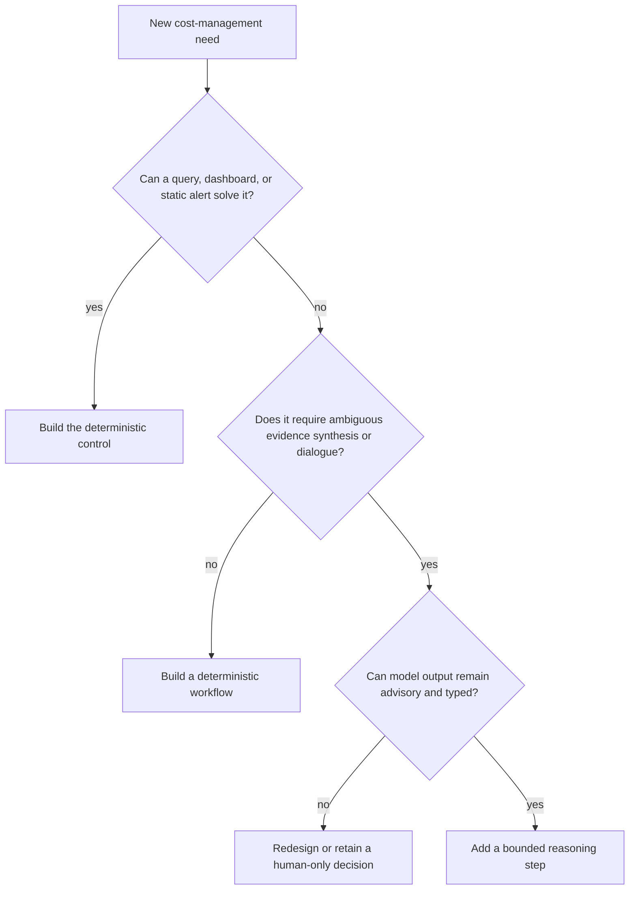

# Mission, Boundaries, and Workload Fit

The FinOps agent exists to shorten the path from fragmented cost observations to an accountable, evidence-backed decision. It should be introduced only where deterministic reports and alerts cannot handle the ambiguity, cross-system evidence gathering, or explanation burden economically.

## Mission and success criteria

The agent performs five bounded jobs:

1. Assemble cost, ownership, utilization, change, service-health, and commercial evidence for a defined scope.
2. Maintain explicit allocation coverage and unresolved-cost queues.
3. Turn detector signals into deduplicated anomaly cases with evidence-backed hypotheses.
4. Draft forecasts, budget guardrails, rightsizing proposals, and commitment scenarios without making the financial or operational decision.
5. Track approved handoffs and verify realized cost and service-health outcomes.

Success is measured by better decisions, not by model activity. Useful outcome measures include allocation coverage, anomaly time-to-detect and time-to-acknowledge, forecast bias, recommendation acceptance, verified realized savings, and the absence of harmful SLO or security regressions.

## Workload qualification

Start with the lowest-complexity mechanism that can satisfy the need.

Good model-assisted workloads include explaining a cross-service spike, summarizing conflicting utilization and deployment evidence, drafting owner questions, or comparing commitment scenarios. Poor workloads include summing invoice lines, converting currencies, enforcing a budget, selecting a purchase, or executing an infrastructure change.

### Deterministic-versus-model boundary

Split the workload before choosing technology. The model never absorbs a deterministic responsibility merely because the surrounding investigation uses a model.

| Subproblem | Authoritative implementation | Bounded model contribution | Reject the model contribution when |
|---|---|---|---|
| Billing-scope and resource identity | Provider-native identifiers, effective-dated hierarchy snapshots, catalog reconciliation | Explain an unresolved mapping and draft an owner question | It invents an identifier, treats a display name as identity, or crosses tenant/scope |
| Money and unit economics | Decimal arithmetic over a declared cost basis, currency policy, allocation release, and denominator release | Explain drivers already calculated and cite the exact result | It calculates, converts, rounds, or silently changes the denominator |
| Anomaly detection | Provider/statistical/rule detector with a versioned configuration and frozen input snapshot | Rank allowed follow-up questions and draft labeled hypotheses | It claims cause, suppresses a signal, or omits contradicting evidence |
| Forecast and commitment scenario | Statistical forecast or contract simulator with backtests and explicit assumptions | Compare precomputed scenarios and expose uncertainty | It creates authoritative numbers or chooses a purchase |
| Rightsizing safety | Deterministic eligibility gates over current target, utilization, SLO, resilience, security, and commercial evidence | Summarize trade-offs and missing evidence | A required precondition is absent, stale, or contradicted |
| Allocation and policy | Effective-dated rules approved by a named policy owner | Suggest a draft mapping with provenance | It activates/backdates a rule or hides residual cost |
| Approval and effect | Authenticated policy service, exact digest binding, adapter, receipt, and reconciler | Draft the human-readable request | It interprets chat as approval or infers a timed-out effect succeeded |

The model boundary is successful when disabling the model removes explanation quality or investigation speed but does **not** remove reproducible amounts, policy enforcement, approval validity, case recovery, or effect safety.

### Stage-0 deterministic baseline

Before adding a model, implement a query or workflow for at least one representative task. Record:

- analyst time and number of system hops;
- data freshness and missing-data rate;
- allocation coverage and unresolved ownership;
- detector precision, recall proxy, and alert volume;
- forecast baseline error and bias;
- time from recommendation to accountable decision;
- false or unsafe proposal rate.

The model is justified only if it materially improves a measured problem that cannot be solved more reliably with rules, SQL, a dashboard, or a conventional workflow.

Do not deploy an agent when the organization cannot supply a stable billing-scope inventory, accountable owners, a declared cost basis, materiality thresholds, review capacity, or an independently reproducible baseline. Adding a conversational layer to unresolved financial semantics increases confidence without increasing truth.

## Responsibility model

| Decision or action | Agent | FinOps | Service owner | Infrastructure/change owner | Finance/procurement | Security |
|---|---:|---:|---:|---:|---:|---:|
| Collect and normalize cost observations | R | A | I | I | I | C |
| Approve allocation policy | C | A/R | C | I | C | I |
| Triage anomaly evidence | R | A | C | C | I | C |
| Adopt forecast or budget | C | R | C | I | A | I |
| Accept a rightsizing change | C | C | A | R | I | C |
| Purchase a commitment | C | R | C | I | A | I |
| Execute infrastructure mutation | I | C | A | R | I | C |
| Verify cost and SLO outcome | R | A | A | C | I | C |
| Post accounting or chargeback entry | I | C | I | I | A/R | I |

`R` means responsible for work, `A` accountable, `C` consulted, and `I` informed. “Agent” is never the accountable party.

## Authority tiers

The runtime enforces an authority ceiling independently of prompts.

| Tier | Permitted examples | Required control |
|---|---|---|
| F0 — compute | Read tenant-scoped aggregates, calculate deterministic metrics, generate a typed explanation | Read-only identities, query limits, evidence citations |
| F1 — record | Create or update an internal case, save a draft, attach evidence | Idempotency key, tenant authorization, audit event |
| F2 — communicate | Send an approved internal notification or create a review ticket | Policy gate, destination allowlist, exact payload digest |
| F3 — bounded configuration | Apply an approved **alert-only** budget configuration where the organization explicitly enables it | Named approver, target-version precondition, preview, reconciliation |
| F4 — excluded | Stop/delete/resize resources, grant permissions, disable billing, post ledger entries, buy commitments | No runtime tool or credential exists |

F3 is optional and should not appear before the reliable-v1 stage. Organizations may hold the production ceiling at F2 indefinitely.

## Owned artifacts

The FinOps domain owns:

- normalized cost-and-usage observations and their lineage;
- allocation rule definitions and coverage reports, not accounting postings;
- anomaly cases, forecast artifacts, budget proposals, and optimization cases;
- commercial scenarios for commitments, not purchases;
- approval records for its bounded effects;
- savings-verification reports and unresolved-outcome queues.

It references but does not own service catalogs, SLO definitions, security policy, infrastructure desired state, procurement contracts, or ledgers.

## Non-goals and hard prohibitions

- Do not infer a resource is safe to stop because usage appears low. Missing metrics, seasonal load, disaster-recovery roles, licensing, or a latent dependency can invalidate the inference.
- Do not treat a provider recommendation as an instruction. It is one observation with provider-specific assumptions and a limited validity window.
- Do not present list-price estimates as invoice savings.
- Do not combine currencies unless an approved, versioned foreign-exchange policy supplies rate, source, and valuation time.
- Do not treat a tag, resource name, ticket, invoice description, or retrieved document as trusted instructions.
- Do not convert chat acknowledgements into financial or operational approval.
- Do not hide unallocated, late, corrected, estimated, or disputed amounts.
- Do not claim “realized savings” until the post-change baseline, observation window, corrections, and service-health constraints are evaluated.

## Representative journeys

### Spend anomaly

1. A provider detector or deterministic rule emits an observation.
2. The case service deduplicates it and freezes cited aggregates.
3. The agent gathers ownership, recent changes, utilization, and comparable-period evidence.
4. A typed hypothesis lists supporting and contradicting evidence.
5. The accountable owner acknowledges, dismisses with a reason, or requests a bounded ticket.
6. The system tracks resolution and later labels the case for evaluation.

### Rightsizing opportunity

1. A provider or internal analyzer produces a recommendation observation.
2. Deterministic filters check scope, age, service tier, seasonality, commitments, licenses, SLO telemetry, and security constraints.
3. The agent explains trade-offs and drafts a change hypothesis.
4. The service owner and infrastructure change process decide and execute outside the agent.
5. The FinOps workflow verifies cost change and SLO health over an agreed window.

### Commitment scenario

1. Deterministic services calculate eligible usage, coverage, utilization, volatility, and alternative horizons.
2. The agent drafts scenarios with downside and uncertainty.
3. FinOps validates assumptions; finance/procurement owns the decision.
4. No purchase endpoint, billing administrator credential, or delegated purchase tool exists in the agent runtime.

## Definition of a safe workload

A workload may advance beyond proof of concept only when:

- authoritative calculations are deterministic and independently reproducible;
- the evidence needed to review the output is retained;
- every effect is inside a documented authority tier;
- the runtime can identify the tenant, policy version, actor, target, amount, currency, and proposal digest;
- missing or stale data causes abstention or bounded degradation;
- humans can reject, override, and appeal recommendations;
- model failure cannot silently create a financial commitment or infrastructure mutation;
- offline fixtures and production telemetry can reveal harmful behavior.

Continue with the [reference architecture and technology decisions](02-reference-architecture-and-technology-decisions.md), then implement the detailed controls in [state, context, memory, tools, and reliability](06-state-context-memory-tools-and-reliability.md).
