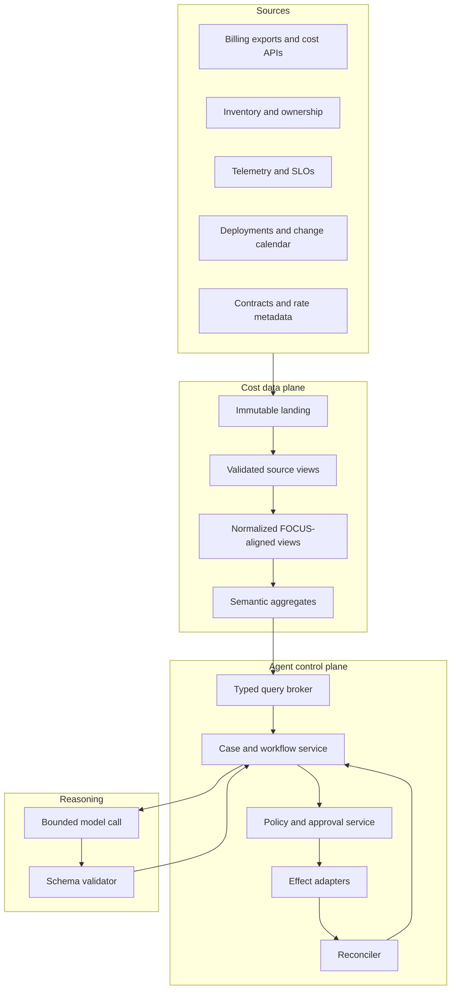

# Reference Architecture and Technology Decisions

The selected design is a deterministic FinOps control plane with a low-authority reasoning component. It keeps raw evidence, money calculations, policy, approval, and effects outside the model, while using the model where ambiguity and explanation justify it.

## Component architecture



### Authoritative boundaries

| Component | Authoritative for | Never delegates to the model |
|---|---|---|
| Raw landing and manifest | Delivered bytes, digest, source, version, delivery time | Artifact identity or retention |
| Normalization and semantic layer | Typed amounts, units, currencies, dimensions, revisions | Arithmetic or schema conformance |
| Analytical services | Allocations, anomaly metrics, forecasts, scenarios, savings baselines | Final numerical result |
| Case/workflow service | Current state, deadlines, owners, attempt and effect status | State transition authority |
| Policy/approval service | Applicable rule, approver, proposal digest, target constraints | Permission decisions |
| Effect adapter and reconciler | Submission, provider receipt, observed external state | Whether an ambiguous call succeeded |
| Language model | Explanations, hypotheses, question selection, proposal drafts | Truth, approval, identity, money, or effect state |

## Technology decisions

These are capability decisions, not a mandatory vendor stack.

| Area | Default | Rationale and constraints |
|---|---|---|
| Billing ingestion | Provider-native scheduled exports first; APIs for bounded lookup and reconciliation | Exports preserve detail and reduce rate-limit pressure. APIs do not replace raw delivery manifests. |
| Storage | Object storage or equivalent immutable landing plus a warehouse/lakehouse suited to existing operations | Keep raw artifacts recoverable; partition normalized data by tenant, provider, billing scope, and time. |
| Cost schema | FOCUS-aligned canonical view plus provider extensions and exact source-version metadata | Interoperability without hiding provider gaps or falsely claiming conformance. |
| Monetary computation | SQL or typed service using fixed-point/decimal arithmetic | Repeatable, testable, independent of model behavior. |
| Kubernetes cost | OpenCost when cluster allocation is required, reconciled to provider billing | OpenCost is useful allocation evidence; on-demand/list-price output alone is not invoice truth. |
| Workflow | Database-backed state machine and queue for the MVP; adopt a durable workflow engine when waits, retries, timers, and recovery justify it | Avoid premature infrastructure, but do not implement long waits in model context or process memory. |
| Reasoning | One provider-neutral model adapter with typed input/output and a release manifest | Keeps authority stable and makes model changes testable. |
| Policy | Deterministic policy-as-data evaluated outside prompts | Thresholds, approver mappings, and financial rules need versioning and review. |
| Observability | Structured application events, immutable audit/evidence records, metrics, and sampled distributed traces | Telemetry is useful but never the sole source of business truth. |

No FinOps SaaS is mandatory. An organization may add one if its lineage, exportability, tenancy, correction behavior, security, contract, and lock-in characteristics pass the same adapter contract.

## Integration contracts

### Required

- Cloud and AI provider cost-and-usage exports or organization-level usage/cost APIs.
- Resource inventory, billing hierarchy, service catalog, and accountable-owner directory.
- Service telemetry with approved SLO or criticality metadata.
- Deployment and change events for causal evidence.
- Budget, ticket/change, and notification systems needed by enabled workflows.
- Contract, rate, commitment, and currency policy sources where recommendations depend on them.

### Optional

- Provider anomaly and rightsizing recommendation feeds.
- OpenCost for Kubernetes allocation.
- Carbon, unit-economics, or business-metric feeds when an accountable owner defines the semantic contract.
- A third-party FinOps platform as an evidence source or destination, not as implicit truth.

### Connector requirements

Every connector declares:

- supported tenant and billing scopes;
- authentication method and least-privilege permissions;
- source schema/version and pagination or export semantics;
- freshness, late-arrival, correction, and deletion behavior;
- rate limits, timeouts, retry classes, and reconciliation lookup;
- idempotency or deduplication key;
- fields considered untrusted content;
- monetary precision and currency behavior;
- evidence and audit retention requirements.

## Provider compatibility strategy

FOCUS 1.4 was ratified in June 2026, but provider-delivered FOCUS datasets do not advance in lockstep. Current public documentation describes AWS FOCUS 1.2 data exports, Azure tooling centered on FOCUS 1.2, and a Google Cloud FOCUS 1.2 Preview dataset. The integration therefore uses four layers:

1. **Immutable provider source** — original bytes or linked-dataset reference and delivery manifest.
2. **Source-native typed view** — faithful to the provider's documented schema and version.
3. **FOCUS-aligned canonical view** — maps only semantics the source actually supports.
4. **Extension/gap view** — preserves provider fields, missing semantics, and mapping assumptions.

The canonical schema may adopt useful 1.4 vocabulary for internal datasets, including correction and delivery metadata, but it must not label a mapped provider feed “FOCUS 1.4 conformant” unless it passes the applicable conformance requirements.

### Dated provider-surface qualification

The following baseline was rechecked against primary documentation on **2026-08-31**. It is an adapter test plan, not a promise that every account, agreement, region, or tenant exposes the same features.

| Surface | Semantics that must be preserved | Suitable use | Deployment-specific limits and prohibited assumptions |
|---|---|---|---|
| AWS Data Exports CUR 2.0 and FOCUS 1.2 | Export definition/query, table configuration, billing-period partition, execution/manifest, file list, source schema, and create-new versus overwrite mode | Primary detailed AWS ingestion | CUR 2.0 refreshes at least daily; AWS may update the prior period during the first two weeks. Overwrite mode destroys provider-side versions unless the landing process snapshots each manifest and file digest. Do not equate availability with invoice finality. |
| AWS Cost Explorer | Exact metric such as unblended, amortized, or net amortized cost; time range, granularity, filters, grouping, billing view, page set, and request time | Bounded aggregate lookup and cross-check | Cost Explorer and Bills/invoices can differ in amortization, grouping, timing, rounding, refunds, credits, and taxes. It is not a substitute for detailed export or invoice evidence. |
| AWS Cost Optimization Hub and Compute Optimizer | Recommendation ID, source, action, generated/refreshed time, resource ARN, configuration, 14-day usage basis where documented, before/after-discount estimate, and unused net-amortized commitment impact | Opportunity signal and savings-estimate comparison | A Cost Optimization Hub recommendation ID is valid for at most 24 hours and recommendations refresh daily. Actions include stop, delete, scale-in, rightsize, upgrade, migrate, and commitment purchase. The adapter is read-only and re-fetches before review. |
| Azure Cost Management Exports and Cost Details | Billing scope/offer, dataset (`ActualCost`, `AmortizedCost`, or FOCUS), schema/API version, run history, partition/file identity, and rerating state | Primary Azure ingestion | Open-period values are estimated and can be rerated; taxes and credits are not generally part of Cost Management cost views. Export schema versions are selectable. Daily overwrite and historical reruns need immutable landing and overlap detection. |
| Azure FinOps hubs/toolkit | Hub release, versioned database function, source path/scope, and source FOCUS version | Optional ingestion/semantic layer when the organization operates it | FinOps hubs v12 documents FOCUS 1.2 support and ingestion of Azure's `1.2-preview` dataset. Overlapping scopes duplicate cost. Unversioned functions can change columns; use versioned functions and pin the toolkit release. |
| Azure Advisor and benefit recommendations | Recommendation identity, target, lookback, term, scope, observed metrics, generation time, and cost basis | Rightsizing or commitment evidence | Advisor VM rightsizing uses selected 7–90-day lookbacks and retail-rate savings; Azure portal savings-plan recommendations use a 30-day view while the API supports 7/30/60-day scenarios. Recommendation refresh after a purchase can lag by scope. Never treat a portal card as a contract quote or change approval. |
| Google Cloud Billing BigQuery standard/detailed/FOCUS export | Billing account, immutable table/dataset identity, schema, `export_time`, usage interval, `invoice.month`, project number/ID, adjustment information, row digest, and query watermark | Primary Google Cloud ingestion | FOCUS is 1.2 Preview. There is no delivery-latency guarantee. Standard/detailed exports append corrections; late usage can land in a later invoice month. Regional dataset location affects backfill. Query by invoice month for invoice alignment and by usage time for operational analysis. |
| Google Cloud FinOps hub and Recommender | Billing/project scope, recommender ID, full recommendation name, subtype, `lastRefreshTime`, state, `etag`, impacts, operation groups, and mutually-exclusive group | Opportunity signal and recommendation-state cross-check | Hub results vary with billing/project permissions; some billing-account features disappear with project-only access. Recommendation content reflects the last refresh and active recommendations may change. The `etag` is a precondition, not approval. Hub estimates may omit existing CUD effects for a resource. |
| Google Cloud budgets and anomalies | Budget/anomaly identity, billing scope, thresholds, current-cost/forecast payload, notification event identity, and observation time | Alert ingestion and approved alert-only configuration | Pub/Sub is at-least-once and may reorder. Alerts-only budgets do not cap spend. Spend-cap budgets are Preview and intentionally excluded from this blueprint because enforcement semantics and service coverage require separate operational governance. |
| OpenCost | Deployment/release, cluster UID, query window, aggregation, resolution, idle/shared settings, price source, and allocation versus usage basis | Kubernetes workload allocation and near-real-time evidence | The allocation API commonly begins from on-demand pricing; provider billing integrations have different freshness and coverage. `max(request, usage)` allocation, idle sharing, network/storage coverage, and float source values must remain visible. Reconcile totals to provider billing before calling them billed or realized cost. |
| Provider carbon/sustainability exports | Account/scope, usage period, location/service, scope and market/location basis, model/methodology version, refresh time, unit, and assurance status | A separate sustainability constraint or reporting signal | Carbon is an estimate, not a cost proxy. AWS publishes monthly with methodology versions and material lag; Azure tooling has contract/account and export constraints; Google may revise current and historical estimates and states customer reports are not third-party assured. Never optimize carbon and cost into one score without an approved weighting policy. |

Primary links and the exact dated status are maintained in the [research packet](../../research/packets/finops-agent-blueprint.md). Connector conformance fixtures must capture the account's real response, permissions, fields, pagination, correction style, and commercial configuration before production use.

### Enterprise evidence and workflow adapters

These integrations enrich or carry a decision; none silently becomes financial truth.

| Adapter class | Qualified surfaces | Required contract |
|---|---|---|
| Observability/SLO | OpenTelemetry-compatible metrics, logs, and traces; Prometheus-compatible utilization; an organization's SLO service | Pin semantic-convention/instrumentation release, metric name/unit/aggregation, sampling, source resource identity, and query window. OpenTelemetry signal APIs can be stable while individual semantic-convention groups remain development or mixed status. Telemetry cannot replace complete audit/effect state. |
| Inventory/service catalog | Cloud-native inventory plus a governed CMDB such as ServiceNow IRE, or a catalog such as Backstage | Read native object identity, source/feed, observation time, ownership, criticality, and catalog revision. ServiceNow writes use IRE and source-native keys rather than direct table updates; Backstage entities are organizational abstractions and require reconciliation to provider resources. A catalog display name is never a resource ID. |
| ITSM/change | ServiceNow incident/change APIs or Jira Cloud REST issue APIs, selected by the existing operating process | The effect adapter allowlists project/table/type/fields, writes a stable operation correlation field, stores returned object ID/version, and reconciles by that correlation. Jira creation permissions/fields are project-specific and rate limited; do not assume a generic create call is idempotent. A ticket state is not proof that infrastructure changed. |
| Workflow runtime | Database state machine plus transactional outbox, or an evaluated durable workflow product | Must persist waits/timers, fence attempts, expose cancellation, distinguish activity retry from business retry, and allow effect reconciliation after rollback. Product claims such as “exactly once” do not remove the need for semantic operation IDs at external APIs. |

### Third-party FinOps platform adapters

A third-party platform may reduce ingestion and reporting work, but its normalized cost, allocation, and recommendation semantics are another versioned source. Qualify the exact licensed edition and API, not the marketing category.

| Example surface | What it can contribute | Qualification boundary |
|---|---|---|
| Vantage REST/OpenAPI, cost exports, optional FOCUS CSV | Cost/report snapshots, resources, commitments, anomalies, and recommendations | Record workspace/report/filter, export time, provider field availability, amortization setting, exchange-rate behavior, and API/schema version. “FOCUS export” does not prove the upstream source or transformation is equivalent to the provider feed. |
| Finout Cost and Virtual Tags APIs | Cross-source cost query and virtual allocation metadata | Record rule order, default/unallocated value, update time, source dimensions, and API limits. Its Virtual Tags API currently documents no reallocation support, so UI and API capabilities must not be assumed identical. |
| Flexera One Cloud Cost Optimization APIs | Bill connections, billing centers, adjustments, budgets, and recommendations | Preserve raw versus adjusted metric and rule program. Some allocation-rule edits reallocate all historical cost; this conflicts with the blueprint's immutable decision evidence unless snapshots and effective-dated internal mappings isolate the change. |
| IBM Apptio Cloudability API | Cost, rightsizing, and container/commitment evidence depending on edition | Regional base URL and permissions vary. Preserve rightsizing basis/lookback and vendor-account scope; never assume one API token can safely serve all tenants or that snoozing a vendor recommendation closes an internal case. |

Adopt a third party only when raw-source exit, correction replay, allocation-rule export, tenant isolation, deletion/retention, rate limits, receipts, and contract termination have been tested. If it cannot reproduce a material amount from source evidence, use it as a convenience view rather than the authoritative cost plane.

See [cost data, allocation, and evidence](03-cost-data-allocation-and-evidence.md) for the concrete record contracts.

## Planning and orchestration

The top-level workflow is deterministic:

```text
ingest -> validate -> normalize -> analyze -> create_or_update_case
       -> assemble_context -> reason -> validate_proposal
       -> policy_gate -> approval_wait -> submit_effect
       -> reconcile -> verify_outcome -> close_or_escalate
```

The workflow engine selects transitions. The model can propose a bounded next analytical query from an allowlist, but the query broker enforces tenant, row, column, cost, and time limits. Replanning occurs only after a typed result or explicit state transition; the model cannot invent tools or loop indefinitely.

Start with a single reasoning agent. Provider adapters, forecast services, allocation engines, and policy evaluators are modules or services, not personas. Add a specialist agent only after offline evaluation proves that the added coordination cost and failure surface produce a material gain.

## Third-party evaluation checklist

Before adding a SaaS or external model service, verify:

- data residency, subprocessors, training/retention terms, deletion, and export format;
- tenant isolation and support for row-level authorization;
- whether negotiated prices, contracts, resource names, and AI usage metadata leave the trust boundary;
- lineage from displayed cost to provider artifact and correction revision;
- documented API stability, pagination, rate limits, and replay behavior;
- ability to retrieve receipts and reconcile ambiguous writes;
- contract exit plan and recovery of evidence, policy, and case history;
- measurable operational benefit over the existing stack.

## Rejected baseline designs

| Design | Why it is rejected |
|---|---|
| Chatbot with direct billing and cloud-admin APIs | Combines untrusted input, reasoning uncertainty, financial data, and destructive authority. |
| Model-generated SQL executed without a broker | Allows cross-tenant leakage, scan-cost blowouts, semantic drift, and irreproducible amounts. |
| Browser automation over provider consoles | Fragile selectors, poor auditability, interactive session authority, and ambiguous outcomes. |
| One universal normalized table with no raw source | Erases corrections and provider-specific semantics and prevents later reprocessing. |
| Multi-agent provider “experts” by default | Adds handoff and consistency failure without solving a capability boundary. Typed adapters are simpler. |
| Vector memory of all invoices, tickets, and chats | Creates stale financial policy, confidentiality, prompt-injection, retention, and provenance risks. |
| Automatic recommendation execution | Provider recommendations lack the organization's full service, security, commercial, and change context. |
| Budget enforcement through shutdown or permission actions | A spending signal is not sufficient authority to interrupt service or change access. |

## Deployment shape by maturity

| Maturity | Shape |
|---|---|
| Prototype | Read-only snapshot, local/offline analytical fixtures, no external effects |
| MVP | One isolated non-production tenant, managed database, queue, object store, warehouse views, ticket sandbox |
| Reliable v1 | Durable workflows or equivalent, connector reconciliation, structured compaction, policy service, recovery drills |
| Production | Per-environment identities, tenant isolation, release gates, SLOs, on-call runbooks, data governance |
| Scale | Partitioned queues/cells, fairness, quotas, regional recovery, capacity and cost controls |

The [zero-to-production roadmap](10-zero-to-production-roadmap-and-acceptance.md) defines the exit gate for each transition.
