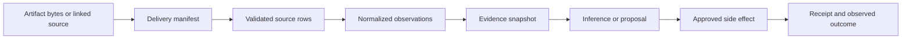

# Cost Data, Allocation, and Evidence

FinOps reasoning is only as reliable as its cost semantics. Provider data is delivered late, corrected, estimated, priced under different agreements, and organized under provider-specific hierarchies. The design therefore treats delivery and correction state as first-class evidence rather than pretending every row is a final invoice fact.

## Evidence layers



| Layer | Meaning | Mutable? |
|---|---|---|
| Observation | A provider row, metric, recommendation, deployment, or owner record at a stated time | Append a new revision; do not silently rewrite the cited one |
| Evidence | Addressable observation set plus query, policy, source, and digest metadata | Immutable after a decision cites it |
| Inference | Hypothesis, forecast, scenario, classification, or recommendation derived from evidence | Versioned and replaceable |
| Decision | An accountable human or deterministic policy disposition bound to a proposal digest | Append-only correction or revocation |
| Side effect | An intended external change with submission and reconciliation state | State transitions are append-only events |

Never store model prose as the only representation of an observation, amount, approval, or effect.

## Canonical identity and version semantics

An internal surrogate ID makes joins convenient; it does not replace the provider or business identity. Every domain object carries `tenant_id`, an object kind, a stable identity, an observed or effective version, provenance, and supersession state. Display names are attributes.

| Domain object | Stable identity | Version or observation boundary | Supersession and safety rule |
|---|---|---|---|
| Account, subscription, project, and billing scope | `tenant_id + provider + native_scope_kind + native_scope_id`; use the AWS 12-digit account ID, Azure subscription/billing-scope resource ID, and Google project number/billing-account ID where applicable | Hierarchy snapshot ID, observed time, source revision, lifecycle state, parent/billing relationship, and effective interval | An AWS account can move OUs, an Azure subscription can move management groups/tenants under governed operations, and a Google project can move folders/organizations without becoming a new cost identity. Version the relationship. Never key on alias, project display name, or subscription name. |
| Billing export | Connector ID + provider export/dataset definition + billing scope + source schema/version | AWS execution/manifest and billing-period partition; Azure export run/schema/partition; Google immutable table plus maximum `export_time`/query watermark; artifact digest in every case | A new delivery is a new artifact even if it covers the same period. Link it as identical, supplemental, or superseding according to documented delivery/correction style. |
| Billing line item or cost observation | Source-native line ID when documented; otherwise immutable artifact ID + physical row locator/ordinal + row digest | Source schema, charge/usage interval, billing/invoice period, delivery revision, correction/adjustment reference, and mapping release | Do not deduplicate different rows merely because dimensions and amount match. Preserve negative, reversal, remonetization, credit, refund, tax, and rounding rows. A normalized revision points to its exact source row. |
| Resource | Provider-native fully qualified resource identity plus the containing account/subscription/project and provider type | Inventory snapshot/revision, existence interval, observed configuration digest, and provider concurrency token where exposed | Names can be reused. Kubernetes uses cluster identity + object UID; Azure resource IDs change on a move, so record predecessor/successor lineage rather than assuming continuity; deleted and recreated objects are different occurrences. |
| Workload and service | Stable ID from the authoritative service catalog, not a resource tag or display name | Catalog release, effective interval, owner/criticality/SLO revisions, and mapping release to resources | Many resources can map to a service and the mapping can change. Historical cost retains the effective mapping used for that period and decision. |
| Tag, label, or annotation observation | Source object identity + key namespace + exact key + observed value | Observation/effective time, source snapshot, inheritance mode, and normalization release | Tags are untrusted and time-varying. Do not backfill a current value into historical usage unless a named allocation policy explicitly creates a derived restatement. Preserve case and Unicode normalization decisions. |
| Allocation rule | Stable `allocation_rule_id` assigned by the policy domain | Monotonic rule version, effective interval, rule-set release, approver, input/driver release, and canonical digest | Editing creates a new version. Backdating is a controlled restatement with materiality review; it never mutates evidence already shown to an approver. |
| Budget and forecast | Budget: provider object/native ID + scope. Forecast: internal `forecast_id` bound to scope, as-of time, horizon, method, cost snapshot, and scenario-set digest | Budget provider API version, observed hash/etag where exposed, and internal proposal digest. Forecast release, data snapshot, scenario versions, intervals, and valid-through time | A budget target and an alert are distinct. Updating amount, threshold, recipients, action, scope, cost basis, or target version invalidates prior approval. A new forecast supersedes rather than overwrites its predecessor. |
| Anomaly signal and case | Signal: provider/detector ID + detector family/configuration + affected scope + source event time. Case: internal `case_id` plus deterministic dedupe key | Signal revision/arrival, detector release, evidence snapshot, case state version, and policy release | Correlation merges signals into one case but never erases source identities. Provider feedback/dismissal is an observation, not the internal case disposition. |
| Commitment and commitment recommendation | Purchased commitment: provider contract/order/commitment ID + payer/billing scope. Recommendation: provider recommendation/generation ID plus product, benefit scope, term, payment option, and lookback | Contract lifecycle/term/quantity/rate revision. Recommendation generation timestamp, source refresh, configuration, and response digest; Google also supplies recommendation name/etag/last-refresh semantics | A commitment is not a recommendation. Re-fetch recommendations after their source validity window or a purchase. Expiry, exchange, scope, sharing, auto-renew, and provider model migration remain versioned attributes. |
| Rightsizing recommendation and proposal | Source recommendation ID/name + source system; internal `proposal_id` with a canonical proposal digest | Source generated/refresh time and etag/version; target configuration digest; utilization/SLO windows; analysis, policy, and model releases; expiry | A source refresh or target drift stales the internal proposal. Approval never follows a provider recommendation ID alone; it binds the exact proposal and target precondition. |
| Approved effect | Semantic `operation_id` over tenant, effect type, business object, target, and intended version; attempts have separate random IDs | Intent hash, proposal/approval/policy versions, target precondition, attempt/lease epoch, adapter release, receipt, and reconciliation observation | Same operation with a different intent is a conflict. Timeout becomes `outcome_unknown`; a new attempt is permitted only after reconciliation and policy. |
| Realized-savings verification | `verification_id` keyed by change correlation ID, baseline release, comparison method, and declared pre/post windows | Cost snapshots, allocation/pricing/currency releases, demand normalizer, service-health window, verification release, reviewer, and completeness state | Provider corrections, allocation restatements, or a changed comparison method create a superseding verification. Never rewrite the figure a prior report cited. |

Four identity invariants prevent most reconciliation defects:

1. A provider ID and an internal ID are stored separately.
2. An object identity and its mutable hierarchy, display name, tags, owner, configuration, and lifecycle state are stored separately.
3. A source revision and an internal mapping/analysis release are stored separately.
4. A recommendation, proposal, approval, effect attempt, observed target state, and verified outcome are separate objects linked by digests and correlation IDs.

## Delivery manifest

Each delivered artifact or query snapshot has an identity independent of its contents.

```yaml
artifact_id: art_01K...
tenant_id: tenant_acme
provider: aws
billing_scope: "payer:123456789012"
dataset: focus_1_2
source_schema_version: "FOCUS-1.2+AWS"
delivery_period:
  start: 2026-08-30T00:00:00Z
  end: 2026-08-31T00:00:00Z
received_at: 2026-08-31T04:18:22Z
artifact_digest: "sha256:..."
source_locator: "evidence://tenant_acme/aws/..."
completeness: provisional
supersedes_artifact_id: null
mapping_release: finops-normalizer-2026-08-15
```

The semantic ingestion key is provider, dataset, tenant, billing scope, delivery period, source revision identifier where available, and artifact digest. A repeated delivery with identical identity is a no-op. A changed digest is a correction candidate, never an in-place overwrite.

## Normalized cost observation

```json
{
  "observation_id": "costobs_01K...",
  "tenant_id": "tenant_acme",
  "provider": "gcp",
  "source_artifact_id": "art_01K...",
  "source_row_ref": "row:8841021",
  "source_schema_version": "gcp-focus-1.2-preview",
  "charge_period": {"start": "2026-08-30T00:00:00Z", "end": "2026-08-30T01:00:00Z"},
  "billing_period": "2026-08",
  "service": "Compute Engine",
  "resource_id": "projects/p1/zones/z1/instances/vm1",
  "charge_category": "Usage",
  "billed_cost": {"amount": "14.382700", "currency": "USD"},
  "effective_cost": {"amount": "12.910000", "currency": "USD"},
  "consumed_quantity": {"amount": "1.000000", "unit": "hour"},
  "delivery_status": "provisional",
  "correction_ref": null,
  "provider_extensions": {"invoice_month": "202608"}
}
```

Amounts are strings at API boundaries and fixed-point/decimal internally. Floating-point binary arithmetic is prohibited for authoritative money calculations.

## Cost-basis and charge-semantics contract

The word `cost` is rejected at an authoritative API boundary unless it is qualified. Every amount uses a declared basis and inclusion policy.

| Basis | Meaning | Typical use | Mandatory exclusions/disclosures |
|---|---|---|---|
| List/on-demand reference | Public or contract reference price before specified discounts | Opportunity comparison and normalized demand scenarios | Not billed cost; record price list, effective time, SKU, region, quantity, and whether contract prices were used |
| Billed/cash cost | Charge basis aligned to the provider bill or cost-and-usage dataset without amortizing future-benefit purchases | Invoice-oriented reporting and cash planning | State whether credits, refunds, taxes, support, marketplace, and adjustments are included; provider cost tools may not equal invoice totals |
| Effective/amortized cost | Commitment purchase/fee spread and attributed to covered usage under an explicit amortization policy | Management reporting, allocation, and unit economics | Preserve upfront/recurring fee, unused commitment, negation/covered lines, term, allocation method, and the original cash view |
| Net cost | A named cost basis after an explicit set of discounts, credits, or refunds | Approved internal reporting | “Net” is not universal. Publish the inclusion set and never subtract the same benefit twice |
| Allocated cost | A qualified source basis transformed by an allocation rule release | Showback/chargeback evidence and unit cost | Preserve pre-allocation basis, driver, unallocated amount, residual, and restatement status |
| Invoice payable | Amount on an issued invoice/statement, including its invoice-specific components | Finance reconciliation reference | The agent may link and reconcile it but does not certify, pay, or post it |

For each aggregate, retain a machine-readable inclusion policy such as:

```yaml
cost_basis_id: effective_cost_v4
source_metric: provider_native_net_amortized
includes: [usage, recurring_commitment_fee, amortized_upfront_fee, negotiated_discount]
excludes: [tax, support, marketplace, promotional_credit, refund]
unused_commitment_treatment: separate_bucket
currency_policy_version: fx-none-same-currency-v1
rounding_policy_version: money-6dp-bankers-v2
```

Do not map provider charge types by sign alone. A negative amount can be a credit, refund, negation, correction, or allocation reversal, each with different reconciliation meaning. Taxes can be absent from management-cost views even when they are payable. AWS Cost Explorer and Bills, Azure Cost Management and invoices, and Google usage-time versus invoice-month queries all have documented semantic differences; adapter fixtures must reconcile each enabled view independently.

## FOCUS compatibility rules

- Store the exact source dataset and version. “FOCUS” without a version is insufficient lineage.
- Run schema and semantic checks appropriate to the delivered version.
- Preserve provider extensions under a namespaced extension contract.
- Record absent, derived, defaulted, and lossy fields in a mapping report.
- Keep correction and delivery handling even when the provider represents them outside a FOCUS dataset.
- Treat billing-period, contract-commitment, and invoice-detail datasets as distinct from cost-and-usage observations when adopting FOCUS 1.4 concepts.
- Keep anomaly, forecast, case, approval, and effect schemas separate; FOCUS does not standardize the complete agent workflow.

The [research packet](../../research/packets/finops-agent-blueprint.md) records the current provider-version evidence and refresh triggers.

## Monetary integrity

### Amortization, credits, refunds, and taxes

Amortization is a deterministic attribution view over a purchase and its eligible usage, not a rewrite of the cash charge. Keep both views and prove conservation at the commitment and billing-scope levels.

```text
cash commitment fees
= allocated amortized fee
 + explicit unused commitment fee
 + approved rounding residual
```

The allocator must understand the provider's covered-usage and negation/reversal line semantics so the benefit is not counted twice. Record term, purchase and effective times, payment option, benefit scope/sharing, eligible dimensions, recurring/upfront fees, unused quantity/cost, and the allocation release. Do not smear a fee into periods before the commitment existed or after it expired.

Credits and refunds remain separate charge objects with program/type, source reference, issue time, applicable billing or usage period when known, scope, currency, and allocation policy. A general promotional credit, a service credit for an incident, a refund, and a correction are not equivalent. Taxes remain separate because provider analytical views can omit them or show a post-refund amount while invoices retain different presentation. A cost-optimization KPI states whether each class is included; it never improves “savings” by silently reallocating or excluding an unfavorable class.

### Currency

Never aggregate currencies by stripping the currency dimension. If cross-currency reporting is authorized, a conversion record includes:

- source and target currency;
- rate as a decimal string;
- rate provider and policy version;
- valuation timestamp and applicable interval;
- rounding mode and precision;
- original amount retained alongside converted amount.

The model cannot select an exchange rate or rounding policy.

### Time

Keep usage/charge time, invoice or billing period, export delivery time, and correction time distinct. A late charge may belong to an earlier usage period and a later invoice period. Dashboards and anomaly comparisons must state which time semantics they use.

### Estimated and corrected data

Open billing periods are provisional. A dataset's freshness does not imply completeness. Maintain states such as `missing`, `partial`, `provisional`, `corrected`, `invoice_aligned`, and `disputed` according to documented provider behavior and organizational reconciliation policy.

When a correction arrives:

1. preserve the prior artifact and normalized revision;
2. link the superseding artifact and affected observation set;
3. recompute downstream aggregates under a new snapshot identifier;
4. mark affected open cases, forecasts, and savings reports stale;
5. do not silently alter evidence cited by a closed decision;
6. create a correction note and, if material, require re-review.

## Allocation model

Allocation is a versioned policy transformation, not model classification.

```yaml
allocation_rule_id: alloc_shared_k8s_004
version: 7
effective_from: 2026-07-01T00:00:00Z
effective_to: null
source_scope:
  provider: azure
  billing_accounts: ["ba-001"]
  predicate: "service_name = 'Azure Kubernetes Service'"
method: weighted_usage
driver:
  dataset: opencost_allocation
  measure: cpu_request_core_hours
fallback: explicit_unallocated
rounding: largest_remainder
approved_by: finops-policy-board
approval_ref: apr_01K...
```

### Rule order

1. Direct contractual or account/subscription/project ownership.
2. Verified service/resource mapping from the service catalog.
3. Valid, effective-dated labels or tags.
4. Versioned shared-cost formula with an accountable owner.
5. Explicit `unallocated` or `shared_pending_policy` bucket.

The agent may suggest a mapping from evidence but cannot activate it. Historical allocation is never rewritten merely because a current tag changed; rules and source metadata are effective-dated.

### Shared and Kubernetes costs

For Kubernetes, record whether allocation uses requests, usage, or another driver. Provider cluster-cost exports and OpenCost can differ in price basis, coverage, timing, and network/storage treatment. Reconcile allocated totals to the provider billing scope and surface the residual.

Use an invariant such as:

```text
source_scope_cost = sum(allocated_cost) + explicit_unallocated_cost + documented_rounding_residual
```

The allowed residual threshold is policy, not model judgment.

### Shared-cost and unit-economics pipeline

Use two explicit transformations rather than one opaque “allocated cost” query:

```text
qualified source cost
  -> direct ownership and commitment-benefit attribution
  -> shared-pool construction
  -> driver-based split
  -> explicit unallocated and rounding residual
  -> business-unit denominator join
  -> unit-cost observation
```

Each shared pool declares its source cost basis, eligibility predicate, excluded charges, driver, zero/missing-driver policy, time grain, and recipient set. Requests, usage, revenue, transactions, seats, or another business metric are not interchangeable drivers. Kubernetes allocation additionally records cluster UID, object UID, query window/resolution, request-versus-usage rule, idle treatment, and provider-price basis.

A unit-cost record contains:

- numerator cost snapshot, allocation release, currency, and exact period;
- denominator dataset, metric ID, unit, owner, event-time rule, completeness, and release;
- join key and coverage for both numerator and denominator;
- formula, zero/negative denominator behavior, precision, and confidence/warnings;
- late-data and restatement policy for both sides.

Never publish `$ / request`, `$ / customer`, or `$ / model invocation` when the denominator is incomplete, mixes environments, or uses a different event-time window. If a late billing correction or business-event backfill is material, supersede the unit-cost observation and mark dependent anomaly/forecast evidence stale.

## Allocation evidence and quality

For each result retain:

- cost snapshot and allocation policy version;
- rule that matched and inputs used;
- owner/service identifiers and their source revisions;
- allocated and unallocated amounts by currency;
- residual and rounding details;
- coverage, ambiguity, and stale-mapping indicators;
- reviewer and exception expiry where applicable.

Allocation coverage alone can be gamed by broad default mappings. Pair it with mapping freshness, direct-versus-inferred share, unresolved material cost, and sampled human accuracy.

## AI cost ingestion

Direct model-provider cost and usage APIs require an isolated ingestion broker. Organization/admin credentials stay in a secret manager and are usable only by that broker; they never enter model context or general agent tools.

Reconcile three levels without conflating them:

1. Provider-reported billed or organization cost.
2. Provider usage dimensions such as model, workspace/project, input/output/cache tokens, or tool type where exposed.
3. Internal request attribution such as product, feature, tenant, environment, run, and accountable team.

Internal token-price multiplication is an estimate. Provider cost is closer to billing evidence but can be delayed, aggregated, credited, or corrected. Preserve both and explain the gap.

## Data quality gates

An analytical run abstains, degrades, or carries an explicit warning when:

- a required export has not arrived within its source-specific freshness envelope;
- the artifact digest or schema is invalid;
- a billing scope overlaps another configured export;
- the source schema/version is unsupported;
- a material amount has no currency or invalid precision;
- corrections are unresolved;
- owner or service mappings are stale beyond policy;
- SLO/utilization evidence required for a rightsizing decision is missing;
- a warehouse query exceeds its tenant or byte-scan budget.

## Validation checklist

- [ ] Raw artifacts are immutable, encrypted, tenant-scoped, and digest-addressed.
- [ ] Source and mapping versions are queryable for every normalized row.
- [ ] Fixed-point/decimal arithmetic and rounding tests cover material paths.
- [ ] Currency conversion is policy-driven and fully reversible to the original amount.
- [ ] Late, estimated, corrected, and disputed states are visible.
- [ ] Allocation rules are effective-dated, approved, replayable, and residual-balanced.
- [ ] Unallocated cost is explicit and cannot be hidden by the model.
- [ ] AI provider admin credentials are isolated from the reasoning runtime.
- [ ] Evidence snapshots survive source corrections and support decision replay.
- [ ] Data-quality failures exercise abstention and escalation paths.

The analytical consumers of these records are defined in [anomalies, forecasting, budgets, and planning](04-anomalies-forecasting-budgets-and-planning.md).
