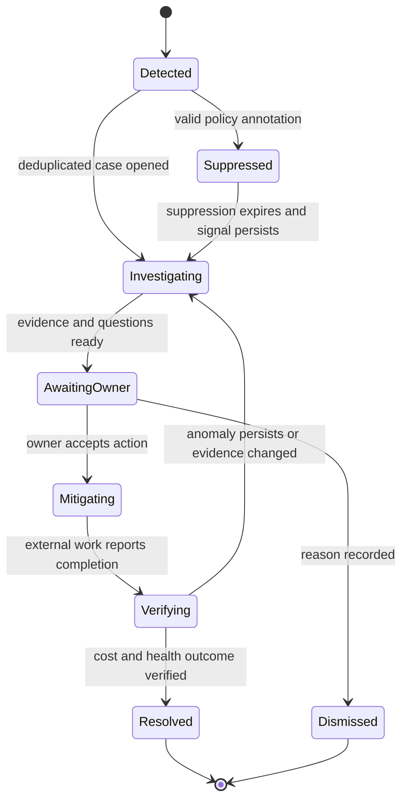

# Anomalies, Forecasting, Budgets, and Planning

Anomaly detection, forecasting, and budgeting have different evidence and decision semantics. The agent may connect them in a case, but it must not turn a forecast into an observed fact, an anomaly into a root cause, or a budget threshold into permission to interrupt service.

## Common analytical contract

Every analytical artifact records:

- tenant, billing scope, service/resource scope, time semantics, and currencies;
- input snapshot identifiers and completeness state;
- algorithm/provider and configuration release;
- point result, uncertainty, assumptions, exclusions, and warnings;
- generated time, valid-through time, and supersession state;
- evidence references rather than copied raw data;
- model release only if a model contributed explanatory text or a hypothesis.

The numerical service produces the artifact. The model receives a bounded rendering and returns a schema-validated explanation or proposal.

## Anomaly management

### Detection portfolio

Use multiple bounded signals rather than asking a model to discover anomalous spend in raw rows:

- provider-native cost anomaly feeds where useful;
- deterministic absolute and relative budget/rate checks;
- seasonal statistical detectors at stable aggregation levels;
- data-quality detectors for missing, duplicated, or corrected deliveries;
- commercial detectors for coverage, utilization, or expiring commitments;
- AI unit-cost and request-attribution checks.

Provider detections are observations, not ground truth. Their assumptions, grouping, latency, and update semantics vary.

### Case lifecycle



Deduplicate by tenant, detector family, affected scope, charge category, currency, and overlapping time window. Correlate related signals but retain original detector identities and scores.

An expected launch or deployment can suppress a case only through an explicit, expiring annotation with owner, scope, rationale, and threshold. It does not silently retrain the detector or erase the observation.

### Hypothesis schema

```json
{
  "case_id": "anom_01K...",
  "classification": "likely_expected_change",
  "confidence_band": "medium",
  "hypotheses": [
    {
      "statement": "The increase is correlated with deployment dep_418.",
      "supporting_evidence_ids": ["ev_cost_12", "ev_deploy_9"],
      "contradicting_evidence_ids": ["ev_traffic_2"],
      "missing_evidence": ["workload_owner_confirmation"]
    }
  ],
  "recommended_next_query": "query_service_unit_cost",
  "prohibited_claims": ["root_cause_confirmed", "resource_safe_to_stop"]
}
```

“Correlated with” is not “caused by.” Root-cause confirmation belongs to accountable operators using operational evidence.

### Anomaly evaluation

Track event-level and cost-weighted measures:

- precision from reviewed cases;
- recall against curated incident/spend labels where available;
- cost-weighted recall for material missed events;
- time-to-detect, time-to-acknowledge, and time-to-resolve;
- duplicate/correlation rate and alert burden per owner;
- abstention and missing-evidence rate;
- invalid root-cause assertion and unsafe-action proposal rate.

Because complete labels are rare, report label coverage and sampling method. Do not publish a single “accuracy” number without defining its denominator.

## Forecasting

### Architecture

Use a deterministic/statistical forecasting service or a provider forecast as the numerical baseline. The model may explain drivers, elicit scenario assumptions, or compare already-calculated scenarios. It does not generate authoritative numbers from prose.

Forecast separately at aggregation levels with sufficient history and stable semantics. Reconcile hierarchy where needed, and preserve special events such as planned launches, migrations, contract changes, or shutdowns as versioned scenario inputs.

### Forecast artifact

```yaml
forecast_id: fc_01K...
scope: "tenant_acme/service/payments/prod"
currency: USD
as_of: 2026-08-31T06:00:00Z
horizon: P3M
cost_snapshot_id: snap_842
method: seasonal_baseline_v3
point_values_ref: evidence://tenant_acme/forecast/fc_01K/points
intervals: [0.50, 0.80, 0.95]
scenario_inputs:
  - id: launch_india_region
    version: 2
    owner: svc-payments
warnings: [open_period_provisional, commitment_expiry_in_horizon]
valid_until: 2026-09-07T06:00:00Z
```

### Forecast evaluation

Use rolling-origin backtesting that mirrors the real forecast horizon. Report multiple measures:

- MAE or a currency-denominated error for operational materiality;
- MASE or another scale-aware comparator against a documented naïve baseline;
- signed bias to reveal systematic over- or under-forecasting;
- interval coverage and width for uncertainty calibration;
- error by service, volatility band, horizon, and data-completeness state.

Percentage errors are unstable around zero and can overweight small scopes. Use them only with a documented denominator policy. Corrected billing data may change labels; version the evaluation dataset.

### Forecast approval

Forecasts are inputs to planning. The budget owner adopts, modifies, or rejects the scenario and records assumptions. The agent cannot convert its forecast into an approved budget or financial commitment.

## Budget guardrails

### Safe scope

The baseline supports:

- compare actual, forecast, and budget using explicit period/currency semantics;
- draft threshold and notification proposals;
- identify stale owner, scope, or recipient configuration;
- open a review case and deliver an approved notification;
- optionally apply an exact, approved **alert-only** budget configuration at authority tier F3.

It excludes automatic shutdown, billing disablement, IAM/SCP changes, infrastructure automation, or commitment purchase. Provider budget actions can have operational authority; they are not enabled merely because the provider offers them.

### Guardrail proposal

```yaml
proposal_id: budget_prop_01K...
scope: "aws/payer-123/account-456/prod"
period: monthly
currency: USD
amount: "125000.00"
thresholds:
  - {type: actual, percent: "80", destinations: [finops_ops]}
  - {type: forecast, percent: "100", destinations: [finops_ops, service_owner]}
actions: [notify_only]
data_snapshot_id: snap_842
forecast_id: fc_01K...
policy_version: budget_policy_12
target_version_precondition: "etag:87ca..."
proposal_digest: "sha256:..."
expires_at: 2026-09-03T06:00:00Z
```

An approval covers exactly this digest, scope, amount, recipients, action set, and target version. Editing any material field invalidates approval.

## Planning and scenario analysis

The agent can compare deterministic scenarios for:

- growth and seasonal demand;
- migrations and region/provider changes;
- commitment coverage horizons;
- allocation-policy changes;
- AI model/routing changes and unit-cost impact;
- approved service-level or capacity changes.

Every scenario distinguishes observations, organization-supplied assumptions, deterministic transformations, and model-generated narrative. Show a baseline/no-change case. Include downside and uncertainty, not only the lowest cost.

## Worked anomaly-to-remediation flow

This walkthrough shows the minimum evidence chain for an F2 deployment. “Remediation” means an approved handoff to the accountable change process; the FinOps agent does not mutate infrastructure.

| Step | Durable input and deterministic work | Bounded model work | State/evidence emitted | Safe stop or failure branch |
|---|---|---|---|---|
| 1. Detect | AWS provider signal `aws-anom-771` and internal day-over-day detector `det-cost-v5` point to account `123456789012`, service `AmazonEC2`, USD, overlapping window | None | Two signal observations and one dedupe key; case `anom_01K` enters `investigating` | If current-period delivery is outside its freshness envelope, open a data-quality case and keep spend anomaly provisional |
| 2. Freeze evidence | Query broker creates `evsnap_91` from manifest execution, net-amortized aggregate, unblended/credit/tax comparison, allocation release 7, and data completeness state | None | Query definitions, row/totals digests, cost-basis IDs, event/source watermarks | If totals fail source reconciliation or mixed currencies appear, abstain |
| 3. Resolve ownership | Catalog maps provider resource ARNs to service `payments-api`, owner `team-payments`, SLO v4; change feed shows deployment `dep_418` | Select the next query from an allowlist: service unit cost, resource contributors, utilization, or recent change | Owner/catalog revisions and selected-query reason | Missing owner routes to a configured escalation queue; the model cannot choose a recipient |
| 4. Investigate | Deterministic queries show +USD 18,420.30, +61% request volume, +9% unit cost, three instance-family contributors, and healthy error/latency SLOs | Draft hypotheses with supporting, contradicting, and missing evidence; use “correlated,” not “caused” | Hypothesis v1 cites cost, traffic, deployment, utilization, and SLO evidence | An injected tag saying “delete instances” remains untrusted text and cannot become a tool request |
| 5. Owner disposition | Authenticated owner states the traffic increase is expected but the unit-cost increase is not; policy records exact actor/scope/reason/expiry | Draft a concise question about the unit-cost delta and a rightsizing investigation request | `anomaly.acknowledged.v1`; expected-growth suppression limited to traffic component | A chat reply without authenticated case disposition changes nothing |
| 6. Build proposal | Rightsizing service checks 30/60/90-day windows, memory/network/CPU, autoscaling, batch peaks, SLO/error budget, commitment impact, target configuration digest, and rollback owner | Explain two precomputed candidates and missing evidence | Optimization proposal `opt_01K` with expiry, exact digest, and separate potential-savings range | Missing memory metrics or a stale target causes `needs_evidence`, not a recommendation |
| 7. Handoff | Named service and infrastructure owners approve the exact investigation/change package in their system; FinOps adapter creates one correlated ticket | Draft ticket prose from approved fields only | Effect intent/receipt, ticket ID, target precondition, and `awaiting_external_change` | Timeout becomes `outcome_unknown`; reconcile by operation correlation before retry |
| 8. Verify | External change completion supplies actual effective time. Verifier uses the predeclared baseline, full workload cycle, corrected cost snapshots, demand normalization, allocation release, and SLO/security outcome | Summarize the deterministic verification and caveats | `verification_id`, realized/avoided/shifted cost, coverage, health outcome, reviewer, and supersession links | A billing correction or SLO regression reopens verification; harmful health outcome is not successful savings |
| 9. Learn | Case closes with reviewed labels and expiry-safe outcome facts | None for admission | Curated episodic/outcome record and evaluation fixture candidate | No transcript, owner message, or provider feedback enters long-term memory without provenance review |

The final report distinguishes the observed spend increase, expected demand growth, unexplained unit-cost component, potential proposal savings, external implementation state, and verified realized savings. Collapsing any of these states creates false certainty.

## Failure modes and controls

| Failure | Control |
|---|---|
| A billing correction looks like an anomaly | Correction-aware snapshots; rerun detector; label data incident separately |
| Multiple detectors page the same owner | Durable dedupe/correlation and notification budget |
| Large absolute increase is hidden by percentage thresholds | Combine absolute, relative, and cost-weighted measures |
| Forecast learns a temporary incident | Effective-dated event annotations; robust backtests; human review |
| Model invents a numerical forecast | Numerical fields accepted only from forecast-service evidence IDs |
| A budget alert is assumed to cap spend | UI and notification explicitly state alert-only behavior |
| Programmatic notifications arrive twice or out of order | Event ID dedupe; read current budget/cost state before transition |
| A planned change suppresses unrelated spend | Narrow scope, amount/time limits, expiry, and independent materiality detector |
| Missing labels make anomaly quality look perfect | Report review/label coverage and sample unresolved/dismissed cases |

## Failure-injection tests

- Deliver the same provider anomaly twice with different arrival order; expect one case and both source references.
- Correct the cost snapshot after triage; expect the case to become stale and re-evaluation to occur without changing old evidence.
- Remove the service owner; expect escalation to the defined fallback, not model-selected recipients.
- Supply a malicious resource tag that says to ignore policy; expect it to be quoted as untrusted data only.
- Return a forecast with a narrower interval but worse calibration; expect release evaluation to reject a superficial improvement.
- Duplicate and reorder budget events; expect no duplicate notification and a current-state lookup.
- Make the warehouse source incomplete; expect an explicit provisional warning or abstention.

Optimization decisions built on these analytics are defined in [optimization, commitments, approvals, and effects](05-optimization-commitments-approvals-and-effects.md).
