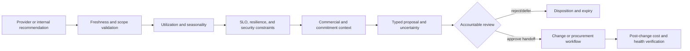
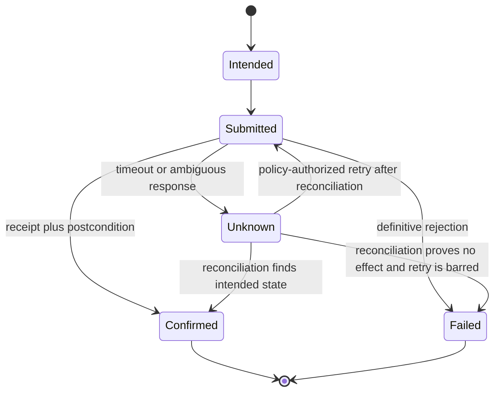

# Optimization, Commitments, Approvals, and Effects

Optimization is constrained decision support. A lower-cost state is not automatically a better state: it can reduce resilience, breach an SLO, weaken security, violate a license or contract, move cost elsewhere, or consume scarce engineering capacity. The agent must make those constraints visible and abstain when required evidence is absent.

## Optimization evidence pipeline



Provider recommendations are short-lived observations. Store their generation time, provider identifier, assumptions, lookback, estimated savings basis, and expiry. Re-fetch or recompute them before review if their validity window has passed.

## Recommendation classes

| Class | Agent output | Decision/execution owner |
|---|---|---|
| Idle or unused resource | Evidence pack and investigation proposal | Service owner; infrastructure change process |
| Rightsizing | Candidate configurations, savings range, headroom and SLO risks | Service owner and infrastructure owner |
| Schedule or autoscaling | Bounded schedule/policy proposal with workload constraints | Service owner and infrastructure owner |
| Storage/data lifecycle | Access-pattern evidence and retention-policy question | Data owner, security/legal, infrastructure owner |
| Architecture change | Scenario and engineering-cost caveat | Architecture/service leadership |
| Rate/commitment optimization | Coverage/utilization scenarios and downside | FinOps plus finance/procurement |
| Allocation cleanup | Versioned rule proposal | FinOps policy owner |
| AI cost optimization | Unit-cost evidence and provider/model routing scenario | Product/model owner under quality and safety gates |

The FinOps agent never operates a general cloud control-plane tool. If an infrastructure agent or automation exists, the handoff is an exact reviewed proposal into that domain's own policy, validation, and approval process.

## Service-safe rightsizing

### Required evidence

Before recommending a production change, gather or explicitly mark missing:

- accountable service and change owner;
- environment, criticality, SLO, error budget, and resilience role;
- utilization dimensions appropriate to the resource, not CPU alone;
- peak, percentile, seasonality, batch windows, and forecast growth;
- deployment or incident changes during the observation window;
- autoscaling, quotas, startup behavior, and capacity headroom;
- commitment, reservation, license, data-transfer, and related-resource effects;
- security, compliance, backup, disaster-recovery, and retention constraints;
- estimated implementation and rollback cost.

Provider rightsizing preferences and lookback windows can improve the initial signal but cannot supply missing organizational context.

The eligibility gate is executable policy, not a prose checklist:

| Gate | Pass evidence | Abstain/invalidate when |
|---|---|---|
| Target identity and freshness | Provider-native identity, current existence epoch, configuration digest/etag or equivalent, recommendation refresh time | Resource was moved, recreated, resized, autoscaling policy changed, or source recommendation expired |
| Utilization window | Metric IDs/units, aggregation, missing-sample coverage, workload cycles, peaks/percentiles, seasonality, and deployment exclusions | Window omits a known peak/batch/DR exercise, coverage is below policy, or only CPU is available for a memory/network/storage-bound target |
| Owner and service impact | Current service/catalog revision, accountable owner, SLO/error-budget, criticality, dependency/resilience role | Owner is unresolved, SLO is missing for production, or resource serves backup/failover/licensing/security duties not represented in telemetry |
| Capacity and rollback | Forecast headroom, quotas, startup/autoscaling behavior, rollback configuration, change window, rollback owner | Proposed target cannot meet policy headroom, rollback is not feasible, or quota/capacity is unverified |
| Commercial integrity | Current effective/list basis, commitment coverage and unused impact, licenses, data transfer, dependent-resource and engineering costs | Estimate ignores a material commitment/license/transfer shift or mixes price bases |
| Security and compliance | Current policy, data/retention/backup constraints, security owner disposition where required | Change weakens an applicable control or evidence is stale/missing |

A “low utilization” state can open an investigation with partial evidence. It cannot cross the production proposal gate until every required gate has an explicit pass or approved exception with expiry.

### Proposal schema

```json
{
  "proposal_id": "opt_01K...",
  "class": "rightsizing",
  "target": {"provider": "azure", "resource_id": "/subscriptions/.../vm1", "observed_version": "etag:19"},
  "current_configuration": "Standard_D16s_v5",
  "proposed_configuration": "Standard_D8s_v5",
  "cost_effect": {"low": "820.00", "expected": "960.00", "high": "1010.00", "currency": "USD", "period": "P1M"},
  "service_constraints": {"slo_ref": "slo://payments/api/v4", "required_headroom_percent": "35"},
  "evidence_ids": ["ev_util_31", "ev_cost_88", "ev_slo_14", "ev_change_4"],
  "missing_evidence": [],
  "risk": "medium",
  "rollback_owner": "team-payments-platform",
  "expires_at": "2026-09-07T00:00:00Z",
  "policy_version": "opt-policy-23",
  "proposal_digest": "sha256:..."
}
```

The cost range is deterministic and states whether it uses negotiated effective cost, list price, or another basis. The proposal cannot claim savings after expiry or target-version drift.

## Commitment and rate optimization

Commitments require financial authorization and carry vacancy, lock-in, exchangeability, and demand uncertainty. The agent produces scenarios only.

Each scenario includes:

- eligible usage definition and exclusions;
- historical lookback and forecast horizon;
- existing commitment inventory, utilization, and coverage;
- term, payment option, flexibility/exchange constraints, and effective rate;
- hourly or monetary commitment under consistent units;
- no-purchase baseline;
- break-even, expected savings, downside, and vacancy under demand scenarios;
- currency, tax/credit exclusions, price source, and calculation release;
- organizational concentration, provider lock-in, and migration plans;
- finance/procurement reviewer and proposal expiry.

Provider APIs can expose recommendations with documented lookbacks and terms, but their result remains one scenario input. The production runtime has no purchase endpoint or billing/purchasing credential.

### Provider commitment surfaces are not equivalent

| Provider surface | Preserve | Material limitation |
|---|---|---|
| AWS Cost Explorer Savings Plans/reservation recommendations | Generation/recommendation IDs, payer versus linked-account scope, 7/30/60-day lookback, term, payment option, product, currency, existing commitments, hourly detail where retrieved | Reservation recommendations assume historical usage represents future usage and do not forecast. Billing transfer/custom pro forma data can produce estimates that differ from CUR, Cost Explorer, or Bills. |
| Azure savings-plan and reservation recommendations | Billing/benefit scope, 1/3-year term, 7/30/60-day API lookback, provider simulations, negotiated on-demand basis, coverage/utilization, refresh time | Portal and Advisor views can use different lookbacks; purchases can take days to propagate to all recommendation scopes. Azure savings plans cannot generally be canceled or exchanged, and local-currency payment can vary with exchange rate under some agreements. |
| Google Cloud CUD recommendation and analysis | Resource- versus spend-based product, billing/project scope, recommender name/etag/refresh, stable-usage versus maximum-savings variant, eligible services/regions, sharing, term, cost/discount model | Spend-based and resource-based recommendations have different API/export availability. CUD analysis is cost-based and explicitly does not determine reservation effectiveness; existing commitments and recommendation estimates require separate reconciliation. |

### Worked commitment-decision flow

The following provider-neutral example is deliberately simplified to make the decision contract testable. It is **not** a quote. Production calculation runs hourly at the provider's SKU/eligibility/sharing granularity.

The frozen inputs are:

- 60 days of residual eligible on-demand-equivalent demand after current commitments, with source snapshot and hourly completeness checks;
- a one-year candidate charging USD 70/hour and covering USD 93.333333/hour of the modeled on-demand-equivalent demand (25% simplified discount);
- deterministic demand scenarios of USD 55/hour contraction, USD 110/hour expected, and USD 150/hour growth;
- no upfront fee in the illustration; taxes, credits, engineering cost, and currency conversion excluded and disclosed;
- `commit-sim-v8`, forecast `fc_01K`, contract catalog `rates-2026-08-31`, and scenario-set digest `sha256:...`.

| Scenario | No-purchase annual cost | Candidate annual cost | Candidate savings/(loss) | Interpretation |
|---|---:|---:|---:|---|
| Contraction: USD 55/hour | USD 481,800 | USD 613,200 | **(USD 131,400)** | Vacancy dominates; reject or reduce the commitment |
| Expected: USD 110/hour | USD 963,600 | USD 759,200 | **USD 204,400** | Positive only if demand and eligibility assumptions hold |
| Growth: USD 150/hour | USD 1,314,000 | USD 1,109,600 | **USD 204,400** | Savings are capped by covered eligible demand; excess remains on demand |

The workflow proceeds as follows:

1. The provider recommendation is ingested with its exact scope, generation, lookback, term, payment option, currency, and recommendation identity.
2. The simulator independently reconstructs current eligible demand, existing coverage/utilization, queued purchases, expiries, and purchase-sharing rules. A mismatch outside tolerance opens a data-quality case.
3. FinOps supplies versioned migration, demand, and concentration assumptions. The model may explain the three outputs but cannot alter them.
4. The proposal shows the no-purchase case, break-even demand of USD 70/hour under this simplified model, downside loss, expected savings, coverage, vacancy, expiry, and excluded tax/credit/FX/engineering effects.
5. Finance/procurement accepts, changes, or rejects the scenario in its own purchasing process. The FinOps runtime sends no purchase request and never stores a purchasing credential.
6. If an external purchase occurs, its provider commitment/order identity, actual terms, scope, exchange/renewal rules, and effective time are ingested as new evidence. The recommendation is not reused as the contract record.
7. Post-purchase verification measures hourly utilization, coverage, unused commitment, on-demand spill, effective discount, demand deviation, and invoice-aligned cost. A later commitment recommendation is evaluated only after the provider's documented propagation lag.

The exercise fails if the reviewer cannot reproduce every cell, change a scenario without a model call, or trace the purchased contract separately from the recommendation and proposal.

## Approval design

### Approval record

```yaml
approval_id: apr_01K...
tenant_id: tenant_acme
actor_id: user_784
actor_role_at_decision: finops-operator
decision: approve
proposal_id: budget_prop_01K...
proposal_digest: "sha256:..."
policy_version: budget_policy_12
allowed_effect: create_or_update_alert_only_budget
target_scope: "aws/payer-123/account-456/prod"
target_version_precondition: "etag:87ca..."
amount_limit: {amount: "125000.00", currency: USD}
decided_at: 2026-08-31T08:14:00Z
expires_at: 2026-09-03T08:14:00Z
reason: "Approved for Q4 planning cycle"
```

Approval validity is evaluated at execution time. A valid identity alone is insufficient: the actor must have the required tenant/scope role, separation-of-duties rules must pass, the proposal and policy must still match, and expiry/target preconditions must hold.

### Approval matrix

| Effect | Minimum disposition |
|---|---|
| Save draft or update case | Deterministic policy |
| Notify a configured internal group | Policy or named owner depending on materiality |
| Create a review/change ticket | Named owner for external commitments or sensitive contents |
| Apply alert-only budget configuration | Exact approval, target precondition, preview, reconciler |
| Resize/stop/delete resource | Handoff only; infrastructure process owns approval and execution |
| Purchase commitment | Scenario only; finance/procurement process owns decision and execution |
| Post allocation/chargeback to ledger | Evidence export only; accounting system/process owns posting |

Messages such as “looks good,” emoji reactions, or ticket comments are not approval unless an authenticated approval service binds them to the exact proposal and policy.

## Side-effect protocol

Every enabled write follows [idempotency and side effects](../../reliability/idempotency-and-side-effects.md):

1. Build a canonical payload and `intent_hash`.
2. Derive a stable semantic `operation_id` from tenant, effect type, business object, target scope, and intended version—not from an attempt UUID.
3. Write effect intent and approval reference atomically with the state transition/outbox record.
4. Submit through a least-privilege adapter with the operation key if supported.
5. Store provider receipt and raw response evidence.
6. Read current external state and reconcile against the intended postcondition.
7. Mark `succeeded`, `failed`, or `outcome_unknown`; never infer success from a timeout.



### Example operation identity

```text
operation_id = H(
  tenant_id,
  "ticket.create",
  optimization_case_id,
  destination_project,
  proposal_digest
)
```

If the same operation ID arrives with a different intent hash, fail closed and escalate an idempotency conflict.

## Handoff to infrastructure or procurement

A handoff package contains the evidence snapshot, exact proposal, assumptions, risk, accountable owners, validity/expiry, target version, verification plan, and a stable correlation identifier. Receiving systems perform their own current-state validation and approval. The FinOps agent does not interpret acceptance of a ticket as completion of a change or purchase.

## Realized-savings verification

“Potential,” “approved,” “implemented,” and “realized” savings are different states.

Verification requires:

- external completion evidence and actual effective time;
- pre-change baseline and comparison method fixed before evaluation;
- post-change observation window long enough for workload cycles;
- corrections, demand, seasonality, allocation changes, and price changes handled;
- avoided costs separated from billed-cost reduction;
- service SLO, incident, security, and capacity outcomes checked;
- rebound or shifted costs included;
- currency and commercial basis consistent;
- accountable owner review for material results.

The verifier publishes coverage as well as value. A result such as “USD 42,000 realized” is incomplete without the eligible scopes reviewed, post-change hours observed, missing/late data, service-health coverage, allocation/currency releases, and excluded taxes/credits/refunds. Potential, approved, implemented, verified, superseded, and harmful are distinct states.

If service health regresses, the outcome is harmful even when billed cost falls. Escalate to the owning incident/change process and do not count the result as successful optimization.

## Anti-patterns

- Ranking opportunities solely by headline savings.
- Treating zero CPU as proof that a resource is unused.
- Recommending spot/preemptible capacity without workload interruption constraints.
- Ignoring commitment coverage when estimating rightsizing savings.
- Buying a commitment because recent utilization is high.
- Reusing an approval after amount, target, policy, evidence, or configuration drift.
- Blindly retrying a timed-out ticket, budget update, or notification.
- Claiming savings from a deleted baseline or a changed allocation rule.
- Sending service identifiers, negotiated rates, or prompt-injected tags to an unapproved external model.

The contracts that make this workflow recoverable are specified in [state, context, memory, tools, and reliability](06-state-context-memory-tools-and-reliability.md).
