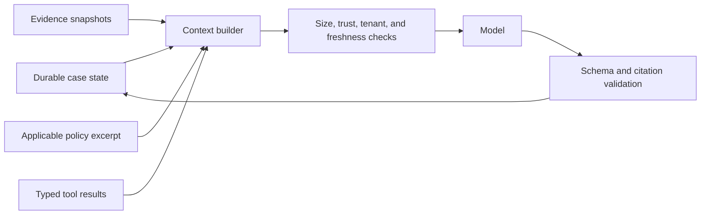

# State, Context, Memory, Tools, and Reliability

Long-running FinOps work crosses delayed exports, owner responses, approvals, corrections, and external change processes. Conversation history cannot be the workflow database. Durable typed state, append-only events, evidence references, and explicit effect reconciliation are required before the agent handles production decisions.

## State model

Follow the repository's [agent state and event contracts](../../runtime/agent-state-and-event-contracts.md). Keep these records distinct:

| Record | Purpose | Authoritative? |
|---|---|---|
| Command | Requested operation, actor, tenant, scope, and dedupe identity | Input evidence |
| Run state | Current workflow step, policy, deadlines, owner, and state version | Yes |
| Domain event | Accepted business transition such as `anomaly.acknowledged` | Yes |
| Evidence object | Immutable source/query snapshot and provenance | Yes for what was observed |
| Effect intent | Exact desired external action and approval binding | Yes |
| Effect receipt | Provider response and external identifiers | Yes for submission evidence |
| Delivery record | Queue/webhook attempt state | Yes for delivery |
| Trace/log/metric | Operational diagnosis | No; sampled telemetry is not business state |

Use conversation, run, attempt, step, tool-call, operation/effect, event, case, evidence-snapshot, and tenant identifiers consistently.

## Case state contract

```json
{
  "case_id": "anom_01K...",
  "case_type": "cost_anomaly",
  "tenant_id": "tenant_acme",
  "billing_scope": "aws:payer-123/account-456",
  "state": "awaiting_owner",
  "state_version": 14,
  "owner_id": "team-payments",
  "policy_version": "anomaly-policy-9",
  "cost_snapshot_id": "snap_842",
  "evidence_snapshot_id": "evsnap_91",
  "analysis_release": "anomaly-triage-2026-08-15",
  "model_release": "finops-explainer-17",
  "proposal_digest": "sha256:...",
  "pending_effect_ids": [],
  "next_deadline": "2026-08-31T12:00:00Z",
  "updated_at": "2026-08-31T08:22:41Z"
}
```

Transitions use compare-and-swap on `state_version`. Queue messages carry the expected version; stale consumers cannot overwrite newer decisions. A transactional outbox publishes events/effect intents with the state transition.

## Domain event envelope

Use a CloudEvents-compatible envelope where it fits the platform, with a typed domain payload:

```json
{
  "specversion": "1.0",
  "id": "evt_01K...",
  "source": "finops-agent/case-service",
  "type": "com.example.finops.anomaly.proposal_ready.v1",
  "subject": "tenants/tenant_acme/cases/anom_01K",
  "time": "2026-08-31T08:22:41Z",
  "datacontenttype": "application/json",
  "data": {
    "tenant_id": "tenant_acme",
    "case_id": "anom_01K...",
    "state_version": 14,
    "proposal_digest": "sha256:...",
    "evidence_snapshot_id": "evsnap_91",
    "policy_version": "anomaly-policy-9"
  }
}
```

The event type is versioned. Consumers ignore unknown optional fields and reject incompatible major payload changes. Event delivery may be at least once; handlers must deduplicate by event ID and business operation identity.

## Typed plan and effect contracts

The controller persists the plan separately from model prose. A plan step can select only a registered capability and declares what evidence or state transition proves completion.

```yaml
plan_id: plan_01K...
plan_schema_version: 2
case_id: anom_01K...
state_version_at_creation: 14
authority_ceiling: F2
controller_release: finops-controller-12
budgets: {steps: 8, tool_calls: 12, warehouse_bytes: 500000000, model_units: 40000, wall_clock: PT5M}
steps:
  - step_id: gather_service_constraints
    capability: service_constraints.read.v2
    input_ref: evidence://.../service-request
    preconditions: [tenant_authorized, case_version_14]
    completion: evidence_object_with_catalog_revision
    on_missing: await_owner
  - step_id: draft_hypotheses
    capability: model.hypothesis_draft.v3
    depends_on: [gather_service_constraints]
    completion: schema_and_citation_valid
stop_conditions: [authority_required, no_progress, budget_exhausted, stale_state, cancelled]
plan_digest: sha256:...
```

Plans are immutable after execution begins. Replanning creates `plan_revision + 1`, states why, preserves completed evidence, and cannot increase authority or budgets beyond deterministic policy.

An effect record is also typed:

```yaml
effect_id: eff_01K...
effect_schema_version: 2
operation_id: op_sha256_...
effect_type: ticket.create
tenant_id: tenant_acme
business_object: optimization_case/opt_01K
target: {system: jira-cloud, project_id: "10021", issue_type_id: "10102"}
intent_payload_ref: evidence://.../canonical-ticket.json
intent_hash: sha256:...
proposal_digest: sha256:...
approval_id: apr_01K...
approval_digest: sha256:...
target_version_precondition: project-config:v17
state: outcome_unknown
attempts:
  - {attempt_id: att_01K, lease_epoch: 4, submitted_at: 2026-08-31T08:30:00Z, result: timeout}
receipt_refs: []
reconciliation: {next_at: 2026-08-31T08:35:00Z, method: search_operation_correlation}
cancellation_epoch: 0
adapter_release: jira-ticket-v6
```

`effect_id` identifies the internal record, `operation_id` identifies the business intent, and `attempt_id` identifies one transport try. Conflating them makes duplicate effects likely.

## Context assembly

The model receives a bounded decision packet, never unrestricted warehouse or cloud access.



The packet labels each field as trusted control data, verified evidence, derived metric, organization-supplied assumption, or untrusted content. It includes only the minimum rows/aggregates and policy needed for the task.

Every item also carries provenance: source system and native identity, source/schema version, observed/effective time, evidence ID/digest, query or transformation release, completeness/correction status, tenant/scope, classification, and expiry. A citation validator resolves each output claim back to an allowed packet item; a URL or prose label is not provenance by itself.

### Context budget priority

Retain, in order:

1. tenant, actor, authority ceiling, case/run identity, state version, and policy release;
2. exact monetary values, currencies, units, time windows, source versions, and completeness warnings;
3. proposal/effect identity, approval state, target preconditions, and unknown-outcome status;
4. evidence citations, supporting and contradicting observations, unresolved questions, and deadlines;
5. concise prior reasoning notes and user-facing prose.

Discard duplicated prose and replace large raw results with evidence references plus deterministic summaries.

## Compaction and continuity

Compaction is a durable, schema-validated snapshot, not an unconstrained model summary.

```yaml
continuity_version: 4
receipt_id: cpt_01K...
previous_receipt_digest: sha256:...
tenant_id: tenant_acme
case_id: anom_01K...
state_version: 14
workflow_epoch: 5
event_high_watermarks:
  case_events: {sequence: 8821, event_id: evt_01K...}
  approval_events: {sequence: 410, event_id: evt_01J...}
source_high_watermarks:
  aws_cur_2_0: {billing_period: 2026-08, execution_id: exec_771, manifest_digest: sha256:...}
  service_catalog: {revision: cat-219, observed_at: 2026-08-31T08:20:00Z}
  slo_store: {revision: slo-payments-v4, observed_at: 2026-08-31T08:21:00Z}
authority_ceiling: F2
versions:
  state_schema: finops-case-v3
  event_schema: finops-events-v2
  evidence_schema: finops-evidence-v4
  connector: aws-cur2-v11
  mapping: finops-normalizer-2026-08-15
  allocation: allocation-rules-7
  currency: fx-none-same-currency-v1
  analysis: anomaly-triage-2026-08-15
  policy: anomaly-policy-9
  tool_registry: finops-tools-12
  context_builder: ctx-finops-2026-08-31-2
  prompt_model: finops-explainer-17
plan: {plan_id: plan_01K..., plan_revision: 2, plan_digest: sha256:..., next_step_id: await_owner}
decisions:
  - {decision_id: dec_4, status: pending_owner, proposal_digest: "sha256:..."}
approvals:
  - {approval_id: apr_01K..., decision: approve, proposal_digest: "sha256:...", effect: ticket.create, expires_at: 2026-09-03T08:14:00Z, revalidation: required}
money:
  - {amount: "18420.30", currency: USD, kind: observed_increase, window: "2026-08-29/P1D"}
evidence_snapshot_id: evsnap_91
evidence_snapshot_digest: sha256:...
source_warnings: [open_period_provisional]
unresolved_questions: ["Was deployment dep_418 expected to double traffic?"]
effects:
  - {effect_id: eff_01K..., operation_id: op_sha256_..., state: outcome_unknown, intent_hash: sha256:..., approval_id: apr_01K..., attempt_id: att_01K..., next_reconcile_at: 2026-08-31T08:35:00Z}
deadlines: [{type: owner_ack, at: 2026-08-31T12:00:00Z}]
cancellation: {epoch: 0, requested: false}
next_safe_action:
  capability: effect.reconcile.v2
  operation_id: op_sha256_...
  required_state_version: 14
  not_before: 2026-08-31T08:35:00Z
invariants:
  names: [tenant_scope, money_exactness, approval_binding, effect_uniqueness, authority_ceiling]
  canonical_input_digest: sha256:...
  invariants_hash: sha256:...
receipt_digest: sha256:...
```

Treat this snapshot as a compaction receipt. Validate both per-stream event and per-source high-watermarks; a single global offset is insufficient when exports, catalogs, approvals, and telemetry advance independently. Recompute `invariants_hash` from the canonical tenant/scope, exact money, approval, effect, and authority fields before resuming. The original events and evidence remain available for replay.

Resume only the declared `next_safe_action`. An `outcome_unknown` effect always makes reconciliation the next safe action; it cannot be compacted into “retry ticket.” If the receipt digest, invariant hash, required schema/release, state version, evidence pointer, or source watermark is unavailable, stop and rebuild from durable events rather than guessing from conversation history.

See [compaction and continuity](../../context-memory/compaction-and-continuity.md) for general design guidance.

## Memory policy

The production design has **exactly seven named memory lifetimes**. A database table, cache, vector index, transcript, or model context must declare one of these lifetimes; “memory” without a lifetime is rejected.

| Lifetime | Permitted use | Explicitly reject | Retention and deletion | Required poisoning test |
|---|---|---|---|---|
| **Turn/scratch** | Parsing, temporary candidate mappings, and reasoning inside one bounded model call | Authority, exact approval/effect state, durable amount, secret, or reusable policy | Process/model-call lifetime only; zero on completion, failure, and cancellation; provider cache retention must satisfy the model contract | Insert an instruction in a tag/ticket and verify it cannot change system instructions, tool scope, output schema, or later turns |
| **Working/run** | Typed plan, budgets, tool results, evidence references, validation errors, and unresolved questions for one run/attempt | Hidden chain-of-thought as business state, uncited raw rows, cross-run policy, or completed effect outcome inferred from prose | Checkpoint only fields needed for restart until run close plus short diagnostic retention; delete/redact under case and privacy policy while durable evidence remains | Corrupt a tool result, reorder steps, and inject an unauthorized scope; schema/provenance checks must stop the run and a replay must rebuild it |
| **Session** | Authenticated analyst scope, active case, clarifications, locale, and presentation settings | Approval carryover, tenant switching from prompt text, financial thresholds, owner role, or unseen-case retrieval | Bound to tenant + actor + authentication session and a short expiry; revoke on logout/role change and support actor-requested deletion where policy allows | Reuse a session token after tenant/role change and insert “remember my approval”; authorization is re-resolved and the approval is absent |
| **Durable workflow/task** | Authoritative run/case state, commands, events, approvals, effects, receipts, deadlines, cancellations, continuity receipts, and corrections | Conversation transcript as state machine, sampled trace as audit, mutable in-place history, or vector similarity for transition choice | Retain by workflow/audit policy with append-only corrections, legal hold, encryption, and tenant-scoped deletion/tombstone procedure; effect/audit evidence may outlive UI prose | Replay duplicate/reordered events, stale workers, altered approval digest, and `outcome_unknown`; exactly one legal transition/effect survives |
| **Domain knowledge** | Versioned provider schemas, cost taxonomy, allocation/currency/policy rules, service catalog, SLOs, commitments, contract metadata, and approved tool registry | Facts learned implicitly from chat, current tag treated as historical, web text as policy, or a provider recommendation as truth | Source-owned/effective-dated; retain superseded versions needed for replay; deletion follows source and evidence dependencies, with rebuild after correction | Introduce a forged policy page, stale owner mapping, or malicious catalog description; provenance/owner/signature/effective-date checks quarantine it |
| **Long-term/preference** | Low-risk user presentation/cadence preferences and explicitly curated, expiring operational exceptions | Materiality, risk appetite, currency/FX, allocation, approver rights, purchase preferences, target scope, or raw invoice/ticket/vector recall | Opt-in where required; minimal fields, named owner, review/expiry, user visibility, correction and deletion propagation, no indefinite default | Store “always ignore spikes from project X” as a preference; policy must reject it, quarantine the entry, and prove deletion from indexes/caches |
| **Episodic/outcome** | Reviewed closed-case trajectories, forecast residuals, anomaly dispositions, incidents, and verified optimization outcomes for evaluation and candidate learning | Automatic online policy/model update, unreviewed thumbs-up, potential savings as outcome, or unresolved/harmful case labeled successful | Minimize/de-identify, preserve provenance and label disagreement, set retention/review/expiry, support source-linked deletion and eval-corpus tombstones | Flip a harmful outcome to positive or delete its source; admission review/quarantine must block training/retrieval and invalidate derived corpus versions |

Long-term/preference and episodic/outcome memory are derived data. They never override current provider evidence, domain knowledge, workflow state, or approval. Every admitted entry records source/evidence IDs, tenant and subject scope, schema, collection method/reviewer, confidence or disagreement, effective and expiry times, classification, retention basis, deletion key, and derived-index locations.

## Tool surface

Expose narrow typed tools, for example:

- `get_cost_aggregate(scope, period, metric, currency_policy, snapshot_id)`
- `get_allocation_explanation(observation_id, allocation_release)`
- `get_service_constraints(service_id, as_of)`
- `get_change_events(service_id, window)`
- `get_anomaly_signal(signal_id)`
- `calculate_commitment_scenarios(scope, parameters, snapshot_id)`
- `create_case(case_type, semantic_key, evidence_snapshot_id)`
- `draft_ticket(case_id, proposal_digest)`
- `submit_approved_ticket(operation_id, intent_hash, approval_id)`
- `reconcile_effect(operation_id)`

The model does not construct arbitrary SQL, URLs, provider method names, tenant filters, identities, or destinations. The query broker maps allowed parameters to reviewed queries and enforces row/column policy, scan budgets, timeouts, and result-size limits.

### Tool result envelope

```json
{
  "status": "ok",
  "tool_release": "cost-query-8",
  "tenant_id": "tenant_acme",
  "evidence_id": "ev_cost_88",
  "data": {"amount": "18420.30", "currency": "USD"},
  "freshness": {"as_of": "2026-08-31T04:00:00Z", "state": "provisional"},
  "warnings": ["open_period_provisional"],
  "untrusted_fields": []
}
```

Error results distinguish invalid input, forbidden scope, missing evidence, stale source, rate limit, timeout, definitive external rejection, and outcome unknown.

## Planning and loop controls

The deterministic controller owns the plan template, step budget, wall-clock deadline, tool budget, query scan budget, and authority ceiling. A reasoning step can choose among enumerated next queries or abstain. Stop when:

- required evidence is missing or stale;
- the answer is already deterministic;
- the case needs human judgment;
- tool, token, cost, retry, or time budget is reached;
- two equivalent queries make no material progress;
- output fails schema/citation/policy validation;
- cancellation or a newer state version fences the run.

See [run controls](../../runtime/run-controls.md) and [planning and replanning](../../orchestration/planning-and-replanning.md).

## Idempotency and reconciliation

Apply semantic idempotency at every boundary:

| Boundary | Semantic identity | Reconciliation |
|---|---|---|
| Export ingestion | Provider, tenant/scope, dataset/version, delivery period, source revision, digest | Compare manifests and downstream row counts/totals |
| Case creation | Tenant, case type, detector family, affected scope, correlation window | Read active/closed cases and merge under policy |
| Notification | Case, material state transition, destination, payload digest | Delivery provider lookup or durable local receipt |
| Ticket creation | Case, destination project, proposal digest | Search by operation key/external correlation field |
| Alert-only budget update | Tenant/scope, budget object, proposal digest, target version | Read provider budget and compare postcondition |
| Savings verification | Change correlation ID, baseline release, observation window, snapshot revision | Recompute under same configuration; supersede on corrections |

Timeout is not failure. For a non-idempotent or weakly idempotent external API, query current state before retrying. If state cannot be proven, hold `outcome_unknown`, page the owner when material, and prevent conflicting operations.

## Cancellation and takeover

Cancellation is a durable command with actor, reason, requested time, expected state version, and monotonically increasing `cancellation_epoch`.

1. Atomically mark cancellation requested and fence new plan/tool/effect submissions at the case boundary.
2. Revoke or expire worker leases; every worker checks state version and cancellation epoch before and after external I/O.
3. Cancel in-flight reads/model calls where supported, but treat cancellation acknowledgements as transport evidence only.
4. For an effect not yet submitted, mark it cancelled. For a submitted or ambiguous effect, preserve the intent and reconcile it; cancellation cannot un-send a request.
5. If an external action succeeded, invoke only a separately authorized compensating workflow. Never call an ad hoc “undo” from model reasoning.
6. A takeover creates a higher workflow/lease epoch and resumes from durable state plus the continuity receipt. The old worker can record late results but cannot transition state.

The case reaches `cancelled` only when no effect is pending or unknown. Otherwise it remains `cancelling_reconciliation` with a deadline and owner.

## Recovery and replay

- Resume from durable state and immutable evidence, not hidden model context.
- Fence all old attempts after cancellation, takeover, or state-version change.
- Rebuild derived views and model output from source snapshots and release manifests.
- Replay read-only analysis freely; replay side effects only through operation-state reconciliation.
- Use dead-letter queues as diagnostic holding areas with owned remediation, not permanent storage.
- Test restoration of state, evidence pointers, policy releases, and encryption keys.
- Throttle replay/backfill separately from live work; recovery that saturates the warehouse, provider API, or reconciliation workers is not a successful recovery.

## Reliability acceptance checks

- [ ] Process restart during an approval wait loses no state.
- [ ] Duplicate and reordered events produce one valid business transition.
- [ ] A stale worker cannot submit an effect after cancellation or owner rejection.
- [ ] The same operation ID with a different intent hash fails closed.
- [ ] A timeout produces `outcome_unknown` and reconciliation, not an immediate duplicate.
- [ ] Compaction preserves exact money, currencies, units, warnings, approvals, and pending effects.
- [ ] Every model claim in an approved proposal resolves to evidence or an explicitly labeled assumption.
- [ ] Replay reproduces deterministic amounts and identifies the behavior/model release.

Security requirements for these records and tools are defined in [security, tenancy, and financial controls](07-security-tenancy-and-financial-controls.md).
