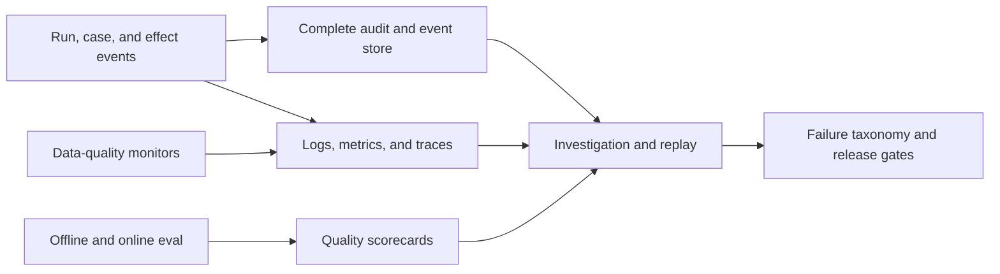

# Observability, Evaluation, and Failure Injection

The agent needs two independent evidence systems: a complete business/audit event trail for decisions and effects, and operational telemetry for diagnosis and SLOs. Sampled traces cannot prove that every approval or notification occurred; the audit ledger should not be overloaded with high-volume debug data.

## Observability model

Use W3C Trace Context or the platform's compatible propagation for request correlation, while preserving domain identifiers explicitly. Redact prompts, cost details, resource names, approval contents, and secrets according to classification.

### Signal separation contract

| Signal | Answers | Cardinality/retention | Must not be used as |
|---|---|---|---|
| Metrics | Is freshness, correctness, queueing, latency, cost, or error rate outside its envelope? | Low-cardinality aggregates; operational retention | Per-case audit, exact money, approval, or effect proof |
| Traces | Which distributed operations and dependencies consumed time or failed? | Sampled/redacted spans; shorter diagnostic retention | Complete workflow history or evidence that an unsampled effect did not occur |
| Logs | What structured diagnostic detail explains a component event? | Access-controlled, redacted, rate-limited; identifiers in fields rather than metric labels | Source of truth for state transitions, secrets, or raw billing archives |
| Domain/audit events | Who/what changed business state, under which policy/proposal/effect identity? | Complete, integrity-protected, tenant-scoped retention and export | High-volume debug stream or sampled observability |
| SLO/error-budget records | Did a named service/workflow meet a user-relevant objective over a window? | Versioned objective, SLI query/release, window, exclusions, and burn history | Model-quality score or permission to skip a safety invariant |
| Evaluation records | Does a behavior release beat baselines without safety regression across declared slices? | Versioned corpus, labels, scorer, release, and comparison | Online availability SLO or automatic policy update |

Propagate `trace_id` for diagnosis and domain IDs for business correlation. The workflow database can link to a sampled trace; it never depends on the trace being retained.

## Signals and example objectives

The target values below are **illustrative starting points**, not universal FinOps benchmarks. Derive production objectives from measured provider delivery behavior, business materiality, staffing, and tenant contracts.

| Concern | SLI | Example objective/window |
|---|---|---|
| Data delivery | Freshness by provider/dataset/scope | 99% of expected daily artifacts within the source-specific envelope over 30 days |
| Data integrity | Valid artifacts and balanced normalized totals | 99.9% valid; material residuals page immediately |
| Allocation | Direct/approved allocated amount ÷ eligible amount | Target by domain; unallocated material cost always visible |
| Anomaly | Cost-weighted recall on reviewed labeled events | Release gate plus trend, not a lone production SLO |
| Anomaly operations | Time to detect and acknowledge material cases | Tiered by materiality and business hours/on-call contract |
| Forecast | MASE, signed bias, interval coverage by horizon | Must beat documented naïve baseline without material calibration regression |
| Optimization safety | Approved proposals with harmful SLO/security regression | Zero tolerance for agent-caused bypass; investigate every event |
| Savings | Verified realized savings with intact SLOs | Report amount and verification coverage, never raw proposal total |
| Effects | Duplicate and unresolved material effects | No duplicate effect; unknown outcomes reconciled within effect-specific target |
| Runtime | Successful bounded runs, p95 latency, queue age | Per workflow class, not one blended average |
| Agent cost | Warehouse scan, model, storage, and connector cost per case/outcome | Budgeted and visible by tenant and workflow |

Avoid vanity metrics such as number of recommendations, total “potential savings,” tool calls, or model tokens without an outcome denominator.

## Required structured telemetry

Emit low-cardinality metrics and structured, redacted events for:

- artifact expected/received/validated/corrected and source freshness;
- normalization totals, residuals, currency/schema failures, and allocation coverage;
- case transitions, materiality, owner routing, acknowledgement, and disposition;
- forecast release/horizon/error/coverage after labels mature;
- proposal creation, abstention, policy rejection, approval, expiry, and drift;
- tool class, duration, result class, rate limit, scan bytes, and evidence size;
- model release, prompt/context release, input/output units, latency, schema/citation failures, and cost;
- effect intent, attempt, provider receipt, unknown outcome, reconciliation latency, and duplicate prevention;
- realized-savings verification and service-health outcome.

Never put tenant, resource, case, user, or operation IDs into unbounded metric labels. Put them in secured structured events/traces.

## Evaluation layers

### Deterministic component tests

- Money precision, rounding, currency-policy, time-window, and unit conversions.
- FOCUS/provider mapping, missing-field, schema drift, extension preservation, and correction handling.
- Allocation conservation, rule precedence, effective dates, and explicit residuals.
- Deduplication, version fencing, transition invariants, idempotency conflicts, and reconciliation.
- Authorization, tenant filtering, approval binding, expiry, and separation of duties.

### Analytical tests

- Detector replay on labeled anomalies, known non-anomalies, corrections, seasonality, and missing data.
- Forecast rolling-origin backtests across horizons, volatility bands, and completeness states.
- Rightsizing and commitment calculations against independently reviewed fixtures.
- Realized-savings recomputation under demand, price, allocation, and correction changes.

### Model behavior tests

- Evidence fidelity: every factual claim and exact amount resolves to an allowed evidence ID.
- Observation/inference separation: no hypothesis is presented as confirmed cause.
- Scope and authority: no excluded infrastructure, purchase, accounting, or permission action is proposed as executable.
- Missing-evidence behavior: abstains or asks the correct owner rather than fabricating.
- Numerical fidelity: does not alter decimals, currencies, intervals, or units.
- Contradiction handling: cites both supporting and contradicting evidence.
- Prompt-injection resistance across resource metadata, tickets, contracts, and retrieved text.
- Consistency across paraphrases and supported model/provider releases.
- Context/compaction continuity under long cases.

### End-to-end trajectory tests

Evaluate the path, not just the final prose:

1. Was the correct tenant and policy loaded?
2. Were only necessary queries/tools used?
3. Were source freshness and correction warnings honored?
4. Did the system stop when evidence or authority was insufficient?
5. Was the proposal typed, cited, and policy-valid?
6. Was approval bound to the exact digest?
7. Were retries and unknown outcomes reconciled safely?
8. Was the final state and outcome evidence complete?

See [trajectory and reliability evaluation](../../evaluation/trajectory-and-reliability-evaluation.md).

## Evaluation corpus

Maintain versioned, access-controlled fixtures representing:

- AWS, Azure, Google Cloud, Kubernetes/OpenCost, and direct AI-provider observations actually enabled;
- provider schema versions, extensions, late deliveries, corrections, credits, refunds, commitments, taxes, and invoice-period boundaries;
- multiple currencies, very small denominators, zero usage, daylight-saving/time-zone edges, leap day, and month/year boundaries;
- shared-cost allocation, stale tags, conflicting ownership, and unresolved residuals;
- anomaly true/false positives, planned changes, incident spikes, slow ramps, and detector storms;
- forecasts with regime change, seasonality, sparse history, and corrections;
- safe, unsafe, ambiguous, expired, and target-drifted recommendations;
- duplicate, reordered, lost, delayed, and ambiguous external effects;
- prompt injection, cross-tenant requests, poisoned feedback, and malicious attachments.

Production examples must be de-identified or access-controlled according to policy. Preserve label provenance and disagreement; do not force ambiguous cases into false ground truth.

## Baselines, slices, and decision metrics

Declare the comparator before running a candidate. At minimum retain:

| Workflow | Required baselines | Primary decision metrics | Safety/quality guardrails |
|---|---|---|---|
| Allocation explanation | Current deterministic report and analyst workflow | Analyst time, unresolved material cost, explanation correctness | Conservation, rule/effective-date fidelity, no invented owner |
| Anomaly triage | Provider detector alone, internal deterministic detector, and human process | Cost-weighted reviewed recall, precision, TTD/TTA, owner burden | Unsupported-cause rate, duplicate notification, correction handling, abstention |
| Forecast narrative | Naïve/statistical numerical baseline with no model narrative | Reviewer comprehension/action time; numerical forecast remains scored by MAE/MASE/bias/coverage | Exact-value fidelity, no invented assumption, scenario provenance |
| Rightsizing review | Provider recommendation plus deterministic eligibility filter | Review time, accepted-safe proposal yield, verified outcome coverage | Missing-precondition pass rate must be zero; harmful SLO/security outcome gate |
| Commitment scenario | No-purchase baseline and provider recommendation | Reproducibility, downside visibility, decision time, post-purchase utilization/coverage | No purchase authority, exact term/scope/currency, stale/queued-purchase handling |

Report every primary metric across predeclared slices: provider/surface/schema version; workflow and authority tier; billing scope/tenant class; cost magnitude/materiality; currency and cost basis; open versus closed/corrected period; direct versus shared/unallocated cost; service criticality; utilization-data coverage; recommendation age/lookback; commitment product/term/scope; model/context/tool release; language/locale; and normal versus degraded dependency state.

Small or sensitive slices use confidence intervals or counts and suppress identifying detail; they are not silently blended away. A global improvement cannot ship when a critical slice violates a money, tenant, approval, or harmful-action invariant.

## Release gates

Define gates by workflow and risk tier. A release should fail if it:

- regresses a critical authorization, tenant-isolation, money, approval, idempotency, or harmful-action invariant;
- fails to reproduce deterministic results;
- worsens a primary anomaly/forecast metric beyond its predeclared tolerance without an accepted trade-off;
- increases unsupported numerical or causal claims;
- reduces appropriate abstention on missing/stale evidence;
- increases warehouse/model cost or latency beyond the declared budget without outcome benefit;
- cannot replay or explain changed behavior by release identifiers.

Use offline comparison, shadow traffic, then a narrow canary. Advisory-only fallback is acceptable when it cannot expand authority. A model/provider change cannot inherit production traffic solely because it passes generic benchmarks.

## Online evaluation

Combine:

- deterministic production invariants on every run;
- shadow comparisons for candidate releases;
- stratified human review by workflow, materiality, tenant, model release, and disposition;
- delayed outcome labels for anomaly resolution, forecast actuals, and savings verification;
- monitoring for evidence/citation, abstention, owner override, and escalation trends;
- controlled user feedback with provenance and poisoning review.

Do not optimize directly on easy-to-game signals such as acceptance clicks. A high acceptance rate may reflect poor review, notification fatigue, or automation bias.

## Failure-injection matrix

| Injection | Expected behavior | Evidence to verify |
|---|---|---|
| Duplicate artifact and reordered pages | No duplicate normalized amount; manifest remains complete | Ingestion key, row/totals invariant, audit event |
| Source stops mid-period | Freshness alert; dependent results provisional or abstained | Data SLI, warning in case, no unsafe proposal |
| Correction changes a closed case | Original decision unchanged; superseding snapshot and materiality review | Evidence links and correction event |
| Warehouse returns another tenant's row | Broker denies/filters and opens security incident | Authorization log without sensitive row content |
| Provider recommendation expires mid-review | Proposal invalidated and refreshed | Valid-through and new proposal digest |
| SLO feed disappears | Production rightsizing abstains | Missing-evidence reason and no change handoff |
| Approval payload changes one cent | Approval rejected because digest differs | Policy decision and conflict event |
| Effect request times out after provider accepted it | `outcome_unknown`, reconcile, no blind duplicate | Single external object and effect ledger |
| Queue redelivers after cancellation | State/version fence stops the worker | Stale-attempt event |
| Model returns invalid schema or uncited amount | Repair within bounded budget, then deterministic fallback/abstention | Validation errors and stop reason |
| Malicious ticket tells model to reveal rates | Content treated as data; no secret or unauthorized output | Injection test result and output review |
| Model provider becomes unavailable | Advisory run queues or deterministic report continues; no authority expansion | Degradation state and SLO |
| Anomaly storm creates 100× signals | Correlate, prioritize, enforce owner notification and queue budgets | Backpressure and suppressed-duplicate metrics |
| Compaction drops a currency or approval | Snapshot validation fails and run stops | Continuity validator event |
| Poisoned feedback labels harmful proposal good | Quarantine/lineage check; no automatic policy update | Feedback provenance and corpus version |

## Failure taxonomy

Classify failures at least by data delivery, data semantics, analytical method, model reasoning, context/compaction, connector/tool, policy/authorization, approval, effect/reconciliation, dependency, capacity, security/privacy, and human-process failure. Preserve primary and contributing causes. Map each incident or eval failure to a fixture, control change, runbook change, or explicitly accepted risk.

## Evaluation checklist

- [ ] Baselines and release thresholds were declared before comparison.
- [ ] Deterministic invariants block releases independently of average scores.
- [ ] Metrics are stratified and include uncertainty/label coverage.
- [ ] Evaluation covers the full trajectory and delayed real outcomes.
- [ ] Fixtures cover provider versions, corrections, currencies, and tenant isolation.
- [ ] Model output is tested for evidence, authority, numerical fidelity, and injection.
- [ ] Failure injection exercises duplicate, reordered, stale, unknown-outcome, and recovery paths.
- [ ] Shadow/canary releases have rollback criteria and named owners.
- [ ] Production feedback cannot silently train policy or memory.
- [ ] Audit evidence and operational telemetry are independently recoverable.

Deployment and incident operations are detailed in [deployment, scaling, incidents, cost, and evolution](09-deployment-scaling-incidents-cost-and-evolution.md).
