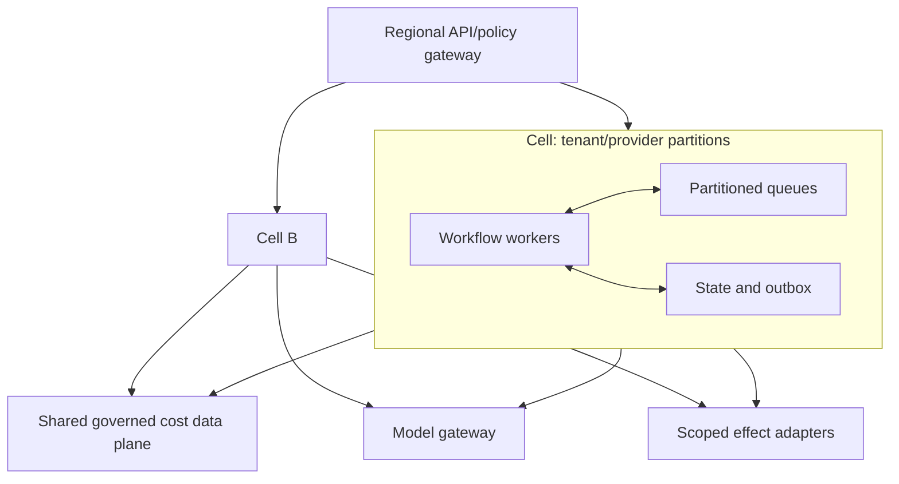

# Deployment, Scaling, Incidents, Cost, and Evolution

Production readiness means predictable behavior under stale exports, provider limits, traffic bursts, model outages, corrections, and operator mistakes—not simply deploying an endpoint. Release, capacity, recovery, and cost controls must preserve the same authority ceiling used in testing.

## Deployment topology

Separate environments, identities, data stores, keys, queues, model configurations, and effect destinations. Production data must not be copied to lower environments without an approved de-identification path.



Cells are optional until scale or blast-radius needs justify them. Begin with a simple isolated deployment; retain tenant/provider partition keys so later separation does not require changing business identity.

## Release artifact

Deploy a behavior release manifest containing:

- application/container revision;
- database, event, evidence, and tool schema versions;
- provider connector and FOCUS mapping releases;
- allocation, currency, analytical, policy, and context-builder releases;
- model provider, exact model identifier, parameters, prompt/template, and output schema;
- evaluation corpus and scorecard versions;
- feature flags, enabled authority tier, and tenant rollout set;
- migration, rollback, and compatibility declarations.

Pin exact production behavior where providers permit it. If a model alias can change underneath the application, treat it as unpinned risk and monitor/evaluate accordingly.

## Release progression

1. Validate schemas, migrations, deterministic fixtures, security invariants, and offline eval.
2. Replay production-like read-only cases.
3. Shadow candidate analytical/model behavior with no external effects.
4. Canary low-materiality advisory cases for selected internal tenants.
5. Expand by workflow and tenant while monitoring predefined rollback signals.
6. Enable bounded effects separately; never couple model rollout to authority expansion.
7. Preserve the previous compatible release and tested rollback path.

Database/event compatibility must support mixed versions during rollout. Rollback cannot erase already-issued effect intents; reconciliation continues under a compatible control-plane release.

## Queues, fairness, and backpressure

Partition by tenant, provider, billing account/scope, dataset, and workload class as appropriate. Apply weighted fair scheduling so a large export or anomaly storm cannot starve material cases from other tenants.

Separate queues or reserved capacity for:

- ingestion and normalization;
- anomaly/case workflows;
- interactive read-only analysis;
- approvals and deadlines;
- effects and reconciliation;
- outcome verification and evaluation labels.

Effects and reconciliation require reserved capacity; otherwise an incident that increases analysis traffic can prevent the system from learning whether writes succeeded.

### Backpressure policy

When capacity is constrained:

1. preserve reconciliation, cancellation, security, and material approval deadlines;
2. preserve ingestion manifests while delaying noncritical enrichment;
3. coalesce duplicate anomaly signals and batch scheduled reports;
4. prefer deterministic cached aggregates over model explanations;
5. defer low-materiality optimization scans;
6. reject new low-priority work with a retry-after contract before accepting unbounded backlog;
7. never drop a durable effect intent or silently skip a correction.

Use per-tenant concurrency, query-byte, model-unit, and notification budgets plus provider-specific token buckets. Honor documented API backoff hints and cap retries.

## Capacity and degradation

Model capacity from delivered rows/bytes, billing scopes, cases, queries, model units, effect volume, and correction/replay load. Include month-end, annual planning, provider outage recovery, and anomaly storms.

| Dependency failure | Safe degradation |
|---|---|
| Model unavailable | Continue deterministic dashboards/detections; queue or omit explanation; no broader fallback authority |
| Warehouse slow | Serve explicitly stale cached aggregates where policy allows; halt material decisions requiring freshness |
| One provider export late | Isolate affected scopes; continue other scopes; mark totals incomplete |
| Owner directory unavailable | Keep cases durable; use preconfigured escalation only; do not guess recipients |
| Ticket/notification provider unavailable | Retain one effect intent and reconcile/retry under policy |
| SLO telemetry unavailable | Do not advance production rightsizing proposals |
| Policy/approval service unavailable | Fail closed for effects; read-only evidence may continue |

Define load shedding at the admission boundary, not after expensive queries or model calls.

### Capacity and recovery-load worksheet

Size each queue/dependency from measured service time and the sum of live, burst, correction, and recovery traffic:

```text
required_capacity(class)
  >= peak_live_arrival_rate
   + admitted_backfill_rate
   + admitted_replay_rate
   + reserved_reconciliation_rate
```

For each workload class record tenant/provider partitions, daily and month-end rows/bytes, correction frequency and affected-period fan-out, cases per signal, p50/p95 query/model/adapter time, retry amplification, warehouse bytes, model units, evidence bytes, and downstream quotas. Then test steady state, 10× anomaly burst, previous-period correction, one-year backfill, regional restore, and replay concurrent with live traffic.

Backfill and replay use explicit admission tokens and can be paused. Reconciliation, cancellation, security events, and current manifests have reserved capacity. Autoscaling from queue depth alone is unsafe when the bottleneck is a provider quota or warehouse scan budget; scale only within dependency and cost envelopes.

## Service objectives and error budgets

Define SLOs by workflow class using the SLIs in [observability, evaluation, and failure injection](08-observability-evaluation-and-failure-injection.md). Data freshness objectives must match provider guarantees and observed behavior rather than imposing one global number. Separate availability from correctness: a fast but incomplete cost answer is not successful.

An exhausted error budget can pause feature/model rollout, reduce advisory scope, or disable optional effects. It never justifies skipping authorization or reconciliation.

## Incident runbooks

Every runbook names severity criteria, incident commander, finance/FinOps/service/security contacts, first safe action, evidence to preserve, customer/owner communication, recovery validation, and follow-up owner.

| Incident | First safe actions | Recovery proof |
|---|---|---|
| Missing/late cost feed | Mark affected scopes incomplete; stop dependent decisions; inspect delivery, not model | Expected artifacts arrive, manifests validate, downstream snapshots rebuild |
| Duplicate or bad correction | Pause affected normalization; preserve artifacts; isolate mapping release | Totals reconcile and cited decisions are marked stale/superseded correctly |
| Wrong allocation | Freeze affected reporting/handoff; identify rule/version and material scope | Replay balances, correction reviewed, prior evidence retained |
| Cross-tenant exposure | Disable implicated path/model egress; preserve access logs; invoke security/privacy process | Root control fixed, access scope determined, isolation tests pass |
| Compromised AI admin key | Revoke/rotate, disable fetcher, inspect provider audit/usage | New scoped credential, safe backfill, no secret in telemetry |
| Anomaly storm | Coalesce and rate limit; reserve material/security/reconciliation capacity | Queue age recovers, owner burden reviewed, missed material cases sampled |
| Duplicate/unknown effect | Fence target operation; reconcile external state before retry | Exactly one intended external state and complete receipt/ledger |
| Harmful recommendation/SLO regression | Stop similar recommendations; notify service/change owner; follow their rollback/incident process | Service health restored, affected cohort evaluated, release/control gated |
| Bad model/provider release | Disable release or roll back advisory path; preserve run samples | Offline and canary gates pass on replacement; no authority drift |
| Cost runaway in the agent | Apply query/model admission limits; retain security/reconciliation paths | Unit-cost and budget return to bounds; root workload attributed |

Do not rewrite evidence during an incident. Corrections are linked as new records.

### Operator execution rules

- Use an authenticated runbook action that emits a command/audit event; do not edit workflow/effect rows by hand.
- Prefer narrow controls: pause one connector/scope/mapping release, disable one behavior release, or lower one authority flag before a global stop.
- A global effect kill switch blocks new submissions but leaves reconciliation and cancellation workers running.
- Preserve the current release manifest, source artifacts, continuity receipt, effect ledger, trace references, and affected tenant/scope list before repair.
- Every manual requeue names the event/effect IDs, expected state version, reason, operator, maximum count, and reconciliation precheck.
- Restore service only after deterministic reconciliation, tenant isolation, invariant checks, and the incident-specific fixture pass; a healthy HTTP endpoint is not recovery proof.

For an unknown ticket/budget effect, the first action is `fence operation -> read durable intent -> query external state by correlation -> compare exact postcondition`. For a bad cost correction, it is `freeze affected mapping/scope -> preserve both artifacts -> quantify downstream decisions -> rebuild a superseding snapshot`. For agent-cost runaway, it is `throttle new analysis/model work -> retain ingestion manifests and reconciliation -> identify tenant/query/release -> enforce scan/model budget`.

## Backup and disaster recovery

Classify data by recoverability:

- provider exports may be re-deliverable, but retention and historical backfill vary;
- allocation/policy/approval/effect state is organization-owned and must be backed up;
- audit records and proposal digests are critical evidence;
- derived aggregates/model prose can generally be rebuilt if source releases remain available.

Document recovery point and time objectives for each. Test restoration, not only backup creation. A regional recovery validates tenant policy, state-version fencing, outbox position, effect locks, receipts, evidence digests, encryption keys, and connector credentials before accepting work. Never replay an effect queue blindly after restore.

| Data/state class | Example recovery objective | Recovery proof |
|---|---|---|
| Effect intents, approvals, case/event state | Near-zero accepted-state loss; restore before any new write authority | Latest committed state/event/outbox sequence present, operation locks fenced, unknown effects reconciled |
| Audit/evidence manifests and proposal digests | No silent loss within required retention | Digest inventory matches backup, sampled source artifacts open, decision citations resolve |
| Raw provider exports | RPO based on provider redelivery/backfill limits, with local immutable retention covering the gap | Expected-period manifest set is complete or affected scopes are explicitly marked missing |
| Policies, mappings, currency and behavior releases | Restore every release needed to replay retained decisions | Canonical digests and signatures match; representative decisions reproduce |
| Derived aggregates and model prose | Rebuildable within workflow-specific RTO | Rebuild from pinned evidence/releases matches deterministic totals; prose is regenerated or omitted |

Disaster-recovery acceptance includes the recovery traffic itself: queue fairness, provider throttles, warehouse budget, reconciliation latency, and live-data freshness must stay within the declared degradation policy while restore/backfill runs.

## Cost of the FinOps agent

The system itself needs a budget and unit economics.

Track by tenant and workflow:

- raw and normalized storage/retention;
- warehouse bytes scanned, slots/compute, materialization, and egress;
- provider/API calls and third-party licenses;
- OpenCost and service-telemetry collection;
- queue/workflow and evidence/audit retention;
- model input/output/cache units and provider cost;
- logs, metrics, traces, and evaluation replay;
- human review and incident effort where measured.

Controls include partition pruning, incremental correction-aware processing, pre-aggregated semantic views, query byte estimates/limits, bounded result sets, model calls only for selected ambiguity, prompt/result caching only under tenant/release/evidence keys, trace sampling with complete audit events, and retention tiers.

Report `cost_per_ingested_million_rows`, `cost_per_reviewed_anomaly`, `cost_per_forecast_scope`, `cost_per_verified_optimization`, and model/warehouse share. Do not claim ROI from unverified potential savings.

## Model and provider changes

A change to model, provider, system prompt, tool schema, context builder, compaction, safety filter, or routing policy is a behavior release.

- Run the relevant offline corpus and critical invariants.
- Compare evidence fidelity, abstention, unsafe proposals, trajectory, latency, and cost.
- Shadow and canary by tenant/workflow/materiality.
- Keep policy and authority external and unchanged.
- Define rollback and provider-outage behavior before rollout.
- Verify retention, residency, training, rate limits, and data-processing terms.
- Reassess context minimization if the provider boundary changes.

Routing can use a smaller/cheaper model for low-risk explanation only if evaluation proves adequacy. High-cost or unavailable models may fall back to deterministic reports; they must not fall back to a less-controlled model with more authority.

## Continuous evolution

Run a governed loop:

```text
production signal -> triage -> reproducible failure fixture
                  -> control/code/data change -> offline comparison
                  -> shadow/canary -> monitored release -> outcome label
```

Monitor provider schema and API releases, FOCUS versions, pricing semantics, IAM role changes, model deprecations, data drift, allocation coverage, detector/forecast drift, owner overrides, feedback poisoning, and evaluation staleness. Assign owners and refresh dates.

Deprecation requires identifying affected tenants/cases, freezing new use, migrating durable state/evidence references, maintaining read access for audit retention, reconciling all effects, revoking credentials, and verifying data deletion/retention contracts.

## Production operations checklist

- [ ] Behavior release manifest makes every material decision path reproducible.
- [ ] Shadow, canary, rollback, migration, and mixed-version paths are tested.
- [ ] Queue partitions, quotas, fairness, reserved reconciliation capacity, and load shedding are measured.
- [ ] Safe degradation never increases authority or hides stale/incomplete data.
- [ ] SLOs cover data correctness/freshness, runtime, effects, and agent cost.
- [ ] Runbooks cover data, tenant, key, model, effect, recommendation, and cost incidents.
- [ ] Backup restoration proves effect fencing and evidence integrity.
- [ ] Agent unit cost and ROI use verified outcomes, not potential savings.
- [ ] Model/provider changes pass workflow-specific evaluation.
- [ ] Continuous failure mining, refresh ownership, and deprecation procedures operate.

The staged implementation and exact acceptance gates are in the [zero-to-production roadmap](10-zero-to-production-roadmap-and-acceptance.md).
