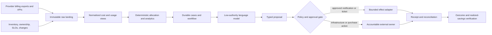

# FinOps and Cloud-Cost Agent Blueprint

This blueprint specifies a production FinOps agent that turns cloud and AI cost data into attributable evidence, anomaly cases, forecasts, guardrails, and approval-gated optimization proposals. It is deliberately a **decision-support and controlled-workflow system**, not a financial authority or an infrastructure operator.

The agent owns the evidence chain from a provider cost observation to a reviewed recommendation and verified outcome. Human service owners, FinOps practitioners, finance, procurement, security, and infrastructure operators retain their existing accountability.

## Category boundary

| In scope | Outside the agent's authority |
|---|---|
| Normalize and reconcile cloud and AI cost observations | Post accounting entries, reconcile the general ledger, or certify invoices |
| Attribute costs using versioned allocation rules | Decide accounting policy or perform bookkeeping |
| Detect, deduplicate, and triage anomalous spend | Assert that infrastructure is correct or safe to change |
| Produce forecasts, scenarios, and budget guardrail proposals | Approve budgets or make financial commitments |
| Evaluate rightsizing and commitment recommendations | Stop, resize, delete, or reconfigure production resources |
| Open approved tickets and send bounded notifications | Purchase reservations, savings plans, or committed-use discounts |
| Verify realized savings and service-health outcomes | Waive security controls, SLOs, or owner approval |

The controlling principle is:

> Cost optimization is valid only when the relevant service SLOs, security requirements, contractual constraints, and accountable human approvals remain satisfied.

See the repository's [agent category registry](../../research/agent-blueprint-category-registry.md) for the canonical ownership boundary.

## Reference architecture

The raw evidence store, monetary calculations, policy engine, approval service, and effect adapters are authoritative. The language model explains evidence, generates hypotheses, and drafts typed proposals; it never becomes the source of truth for amounts, approvals, or effect state.

## Documents

Read these in order for a build sequence, or jump directly to the operating concern you own.

1. [Mission, boundaries, and workload fit](01-mission-boundaries-and-workload-fit.md) — jobs, non-goals, authority tiers, and the deterministic-baseline test.
2. [Reference architecture and technology decisions](02-reference-architecture-and-technology-decisions.md) — component boundaries, providers, third parties, orchestration, and rejected designs.
3. [Cost data, allocation, and evidence](03-cost-data-allocation-and-evidence.md) — FOCUS compatibility, ingestion, corrections, allocation, lineage, and monetary integrity.
4. [Anomalies, forecasting, budgets, and planning](04-anomalies-forecasting-budgets-and-planning.md) — analytical services and the limited role of model reasoning.
5. [Optimization, commitments, approvals, and effects](05-optimization-commitments-approvals-and-effects.md) — service-safe recommendations, approval binding, handoffs, and savings verification.
6. [State, context, memory, tools, and reliability](06-state-context-memory-tools-and-reliability.md) — contracts, compaction, planning, idempotency, reconciliation, and recovery.
7. [Security, tenancy, and financial controls](07-security-tenancy-and-financial-controls.md) — identities, isolation, prompt injection, secrets, evidence retention, and accountability.
8. [Observability, evaluation, and failure injection](08-observability-evaluation-and-failure-injection.md) — SLIs, traces, audit evidence, offline/online evaluation, and adversarial tests.
9. [Deployment, scaling, incidents, cost, and evolution](09-deployment-scaling-incidents-cost-and-evolution.md) — releases, queues, backpressure, SLOs, runbooks, disaster recovery, and model changes.
10. [Zero-to-production roadmap and acceptance](10-zero-to-production-roadmap-and-acceptance.md) — explicit stages 0–6, exit gates, and launch checklists.

The supporting [research packet](../../research/packets/finops-agent-blueprint.md) records the evidence base, current-version findings, disagreements, rejected options, source register, and refresh triggers.

## Cross-cutting invariants

Every stage preserves these invariants:

- **Observation is not truth by itself.** Preserve its provider, scope, event time, delivery time, source version, currency, and revision status.
- **Evidence is immutable and addressable.** A recommendation cites durable evidence identifiers and digests, not copied prose.
- **Inference is labeled.** Hypotheses, forecasts, scenarios, recommendations, and confidence remain distinct from observed facts.
- **Side effects are explicit.** Each intended effect has a semantic operation identifier, exact payload digest, approval binding, receipt, and reconciliation state.
- **Money is deterministic.** Fixed-point or decimal arithmetic, explicit currencies, versioned foreign-exchange policy, and repeatable queries produce authoritative amounts.
- **Authority does not grow through conversation.** Prompt content, memory, retrieved documents, and tool results cannot grant permissions.
- **Unknown outcome is a first-class state.** A timeout after submission triggers reconciliation; it does not justify an immediate retry.
- **No hidden optimization objective.** Security and service-health constraints dominate savings, and humans own financial and operational decisions.

## Minimum viable production contract

A production deployment is not merely a chat interface over a billing API. At minimum it has:

- immutable raw artifacts and a documented completeness/correction model;
- typed normalized records with source-version metadata;
- versioned allocation, currency, forecast, and policy configurations;
- durable run, case, approval, and effect state;
- least-privilege provider identities and tenant-isolated queries;
- deterministic analytical services with repeatable tests;
- a bounded model context assembled from cited aggregates;
- approval gates bound to an exact proposal and target version;
- idempotent effect adapters with reconciliation;
- independent audit evidence, operational telemetry, SLOs, and incident runbooks;
- offline replay evaluation and guarded release procedures.

## Canonical engineering guides

This blueprint specializes rather than duplicates the repository's canonical guidance:

- [Agent state and event contracts](../../runtime/agent-state-and-event-contracts.md)
- [Execution boundaries](../../runtime/execution-boundaries.md)
- [Durable execution](../../runtime/durable-execution.md)
- [Run controls](../../runtime/run-controls.md)
- [Tool contracts](../../tools/tool-contracts.md)
- [Context engineering](../../context-memory/context-engineering.md)
- [Memory architecture](../../context-memory/memory-architecture.md)
- [Compaction and continuity](../../context-memory/compaction-and-continuity.md)
- [Idempotency and side effects](../../reliability/idempotency-and-side-effects.md)
- [Permissions, sandboxing, and secrets](../../security/permissions-sandboxing-and-secrets.md)
- [Evaluation-driven development](../../evaluation/evaluation-driven-development.md)
- [Observability and tracing](../../evaluation/observability-and-tracing.md)
- [Deployment, release, and incident response](../../operations/deployment-release-and-incident-response.md)
- [Queues, scheduling, and backpressure](../../operations/queues-scheduling-and-backpressure.md)
