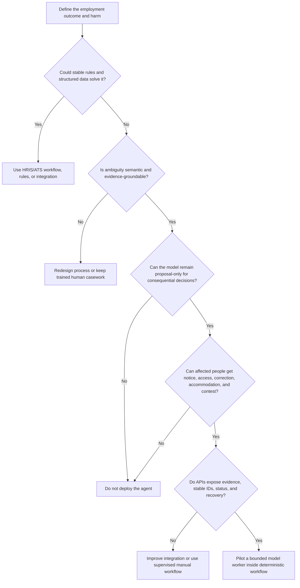

# Workload Fit, Authority, and Staged Requirements

> **Purpose:** Qualify the problem, inventory employment consequences, define human ownership, and set Stage 0–6 exit gates before selecting models or frameworks.

## Start from the employment outcome

The unit of value is not “HR questions answered.” It is a correctly coordinated employment process whose decision owner, evidence, policy version, effective time, accessibility path, downstream state, and audit record are defensible.

Write the operating contract before building:

```yaml
workload: new-hire-coordination
business_owner: people-operations
authoritative_systems: [ats, hris]
affected_people: [candidate, employee]
jurisdictions: [resolved-at-admission]
model_roles: [extract, compare, summarize, draft, propose]
human_decisions: [select-candidate, approve-offer, approve-employment-change]
prohibited_model_roles: [rank-for-selection, reject, hire, fire, promote, set-pay]
maximum_effect: approved-low-impact-administration
completion_oracle: reconciled-required-tasks-and-no-blocking-exceptions
```

This is a framework-neutral declaration, not a production schema. The production form must be versioned and enforceable outside the prompt.

## Decompose work by the right owner

| Activity | Examples | Correct owner |
|---|---|---|
| Intake | Authenticate source, resolve tenant/legal entity, validate required envelope | Deterministic admission service |
| Identity | Match candidate, person, worker, employment, position, requisition | Master-data/HRIS resolver with ambiguity outcome |
| Calculation | Notice deadline, retention date, salary band arithmetic, SLA | Tested deterministic function |
| Policy | Required approvals, interview steps, local notice, worker-type eligibility | Effective-dated rule/policy service |
| Semantic work | Extract resume evidence, compare notes to rubric, summarize conflict | Bounded model worker with citations and abstention |
| Employment decision | Hire, reject, terminate, promote, discipline, compensate, accommodate | Authorized human under organizational policy |
| Workflow | Timers, assignment, wait, resume, escalation, cancellation | Durable coordinator/case system |
| Authorization | Actor may view or perform action on this person/resource now | Policy and downstream authorization services |
| Effect | Create draft, schedule, send, update, request downstream task | Narrow adapter/effect gateway |
| Access change | Create/disable identity, grant/revoke entitlement | IAM—not this agent |
| Verification | Read after write, correlate receipts, compare expected/actual state | Deterministic reconciler |
| Legal advice/audit | Interpret obligation; independently assess control | Legal/compliance—not this agent |

If stable rules and workflow own nearly every row, build ordinary software. An agent is justified only for residual semantic variation that materially improves a measured outcome.

## Fit decision tree



## Consequence inventory

Treat “recommendation” as consequential when it materially narrows a person's opportunity or predictably anchors a human decision. Hiding an automated score behind a human click does not restore meaningful ownership.

| Consequence class | Examples | Agent posture |
|---|---|---|
| Administrative, no person impact | Detect duplicate task, summarize queue, classify connector error | May propose; narrow pre-authorized action can be earned |
| Communication/reputation | Candidate email, interview reschedule, manager reminder | Draft by default; exact approval based on content/recipient risk |
| Opportunity-shaping | Search result order, shortlist, screening flag, interview score summary | Evidence support only; no opaque ranking or silent exclusion |
| Terms/status | Offer, pay, promotion, performance action, leave, termination | Human decision and exact policy-controlled effect |
| Medical/accommodation | Disability inquiry, accommodation need, medical restriction | Separate confidential process; qualified human owner |
| Identity/access | Joiner/mover/leaver signal | Emit authenticated minimal facts; IAM decides and executes |

## Requirements catalog

### Functional contract

- admit only named HR workflows and purposes;
- preserve candidate, person, worker, employment, requisition, application, position, and case identities separately;
- resolve applicable policy from location, legal entity, worker type, effective date, and process stage;
- compile evidence with source, timestamp, version, and access decision;
- distinguish missing, withheld, redacted, not applicable, conflicting, stale, and unreadable information;
- collect human decisions independently of model recommendation;
- stage exact effect intents with preconditions, expiry, idempotency identity, and compensating path;
- reconcile downstream state rather than equating dispatch with success;
- expose accessible notice, accommodation, correction, contest, and manual alternatives;
- propagate retention, deletion, hold, and vendor-erasure obligations with proof.

### Quality attributes

| Attribute | Requirement question | Example acceptance measure |
|---|---|---|
| Employment correctness | Did the right person, requisition, policy, and effective date govern? | Zero cross-person or wrong-effective-date commits in critical suite |
| Human ownership | Could the reviewer decide without model anchoring? | Independent score captured before model summary for selection workflows |
| Fairness | Are errors and outcomes acceptable across relevant groups and intersections? | Predeclared per-use metrics and severe-tail gates pass |
| Accessibility | Can people complete an equivalent process with assistive technology/accommodation? | WCAG target plus manual disability-led usability tests pass |
| Reliability | Can multi-day work survive crash, duplicate delivery, and vendor outage? | No lost cases; all unknown effects reconciled within risk window |
| Timeliness | Are start, notice, interview, and termination deadlines met? | Deadline SLO counts completed or safely escalated cases |
| Privacy | Was only purpose-necessary data viewed, sent, remembered, and retained? | Field-purpose denial and deletion/hold propagation tests pass |
| Contestability | Can affected people understand, correct, and challenge material data/use? | Request SLO and evidence-complete review path pass |
| Auditability | Can a reviewer reconstruct facts, rules, decisions, effects, and versions? | Evidence-bundle completeness and replay interpretation pass |
| Cost | Does benefit exceed model, vendor, review, integration, incident, and exception cost? | Cost per correctly completed case beats baseline |

## Human decision ownership contract

A human is meaningful only if all of the following hold:

| Property | Enforceable requirement |
|---|---|
| Authority | Authenticated role may decide for the exact legal entity, job, person, and action |
| Competence | Required HR, interviewer, assessment, accessibility, or manager training is current |
| Independence | Conflicts and prohibited role combinations are checked; audit remains separate |
| Evidence access | Reviewer sees original evidence, provenance, conflicts, missingness, and rubric—not only a summary |
| Time | SLA and workload allow real review; approval expiry prevents queued rubber stamping |
| Alternatives | Reviewer can reject, correct, request evidence, recuse, escalate, or choose no action |
| Non-anchoring | For selection, independent observations/scores are recorded before model synthesis where feasible |
| Accountability | Actor, reason code, comments, policy version, record versions, and timestamp are durable |
| Contest | Correction, appeal, accommodation, and re-review route is named and protected from retaliation |

The model may check that the package is complete. It may not decide that the human's reason is lawful, unbiased, or sufficient.

## Policy and jurisdiction admission

Never infer a jurisdiction from language, IP address, or model knowledge. Resolve it from governed facts and let policy owners define applicability.

```text
jurisdiction_profile = resolve(
  employer_legal_entity,
  job_or_work_location,
  worker_residence_if_applicable,
  worker_type,
  union_or_collective_agreement,
  process_stage,
  effective_at
)
```

The resolver must return `resolved`, `multiple_applicable`, `unknown`, or `conflict`. Only `resolved` and a policy-approved `multiple_applicable` merge may continue. The agent must not choose the most convenient law or interpret conflicts. Legal owns interpretation; the application records its versioned result.

## Stage 0 — qualify the problem

### Build

1. Map the current process, decision points, data fields, actors, accessibility paths, vendors, and failure costs.
2. Implement or measure the deterministic baseline: ATS/HRIS workflow, rule table, templates, retrieval, parser, scheduler, or integration.
3. Identify only the residual tasks where variable language/evidence defeats ordinary automation.
4. Complete data-protection, employment-impact, accessibility, security, vendor, and jurisdiction reviews appropriate to the use.
5. Declare prohibited actions and the maximum danger tier.

### Stage 0 exit gate

- [ ] The model-directed task beats a deterministic/single-call/manual baseline on predeclared quality or effort.
- [ ] Every consequential decision and effect has a named non-model owner.
- [ ] Job-related purpose, evidence source, candidate/employee notice, accommodation, correction, and contest paths are defined.
- [ ] The system can operate manually or deterministically during provider outage.
- [ ] Privacy, legal, labor, accessibility, assessment, and security owners accept the scoped pilot.
- [ ] Any inability to obtain validation evidence, status lookup, deletion proof, or stable identities blocks deployment.

## Stage 1 — first bounded loop

Use one model worker, a small fixed tool set, read-only projections, typed output, explicit `complete|abstain|escalate`, and hard limits on turns, tokens, records, artifacts, tool calls, and time. Example first loop: assemble a cited requisition-completeness report or interview-kit draft from an already approved job analysis.

No external writes, cross-run memory, background action, broad search, multi-agent delegation, or generic HRIS tool belongs here.

### Stage 1 exit gate

- [ ] Schema, citation, missingness, refusal, deadline, and budget tests pass.
- [ ] Prompt injection in resumes, notes, job descriptions, and web content cannot change tools or authority.
- [ ] Sensitive fields not required for the task never enter context or trace.
- [ ] The loop cannot rank, exclude, select, change status, send, or update a system of record.
- [ ] Representative and adversarial tasks show improvement over Stage 0.

## Stage 2 — useful MVP

Add real ATS/HRIS read projections, a context compiler, ephemeral run working state, accessible reviewer UI, exact draft/approval seams, representative evaluation fixtures, and shadow operation. Permit only reversible drafts or pending administrative tasks.

### Stage 2 exit gate

- [ ] Shadow results meet task quality, evidence support, abstention, privacy, fairness, accessibility, latency, cost, and reviewer-time thresholds.
- [ ] Reviewers can correct source facts without teaching the model an unverified memory.
- [ ] Model proposals are visibly distinct from policy results and human decisions.
- [ ] Affected-person notice and alternate/manual paths work end to end.
- [ ] Candidate/employee records cannot cross tenant, legal entity, requisition, or confidentiality compartments.

## Stage 3 — reliable v1

Add durable case state, compaction from authoritative records, semantic idempotency keys, effect receipts, adapter versioning, webhook deduplication, reconciliation, cancellation, correction, deletion propagation, and crash recovery. Only now consider low-impact approved writes.

### Stage 3 exit gate

- [ ] Duplicate, reordered, missing, late, and replayed events converge to the right lifecycle state.
- [ ] Crash-before-dispatch, crash-after-commit-before-record, timeout, partial multi-system success, and stale approval tests pass.
- [ ] Rehire, concurrent employment, rescinded offer, reversed termination, and future-effective change fixtures pass.
- [ ] Vendor contracts define scopes, versions, limits, receipts, ambiguity queries, retention, subprocessors, and exit.
- [ ] Retention, deletion, legal hold, and backup propagation have observable states and exception owners.

## Stage 4 — production readiness

Add workload identity, delegated actor lineage, least privilege, tenant/legal-entity isolation, content and egress controls, SLOs, distributed traces, privacy-safe audit evidence, release manifests, shadow/canary, rollback, incident command, kill switches, and rehearsed manual fallback.

### Stage 4 exit gate

- [ ] Threat model covers malicious candidates, insiders, compromised vendors, prompt injection, cross-person mix-up, bulk exfiltration, and unauthorized employment effects.
- [ ] Critical authority, discrimination, accessibility, privacy, and identity failures are hard release blockers.
- [ ] Approval revocation, credential revocation, vendor isolation, model disable, queue drain, and evidence preservation drills pass.
- [ ] On-call can distinguish model, policy, state, adapter, vendor, and downstream-system failure without sensitive content in telemetry.
- [ ] Counsel and policy owners sign off on each deployed jurisdiction/use profile; no “global compliance” claim exists.

## Stage 5 — scale and resilience

Add per-tenant and per-workflow admission, bounded queues, priority/deadline scheduling, serialization by person/employment/requisition/effect, worker pools, regional/data-residency boundaries, capacity and cost models, disaster recovery, and safe degradation.

### Stage 5 exit gate

- [ ] Peak requisition, seasonal hiring, acquisition, restructuring, and mass-offboarding loads respect deadlines and aggregate authority limits.
- [ ] One tenant, vendor, manager, requisition, or bulk job cannot starve or expose another.
- [ ] Reconciliation and recovery capacity is reserved independently of normal throughput.
- [ ] Regional failover does not violate residency, legal hold, retention, or encryption-key boundaries.
- [ ] Degraded mode disables model enrichment before it loses lifecycle truth, decisions, or effect receipts.

## Stage 6 — continuous governed evolution

Mine reviewed failures and contests, measure drift, refresh legal/policy profiles, version the complete behavior bundle, test model/tool/schema/vendor changes offline, shadow and canary by risk, and maintain deprecation and in-flight-run migration policy. Do not train automatically on raw decisions, interview notes, complaints, or model outputs.

### Stage 6 exit gate

- [ ] Feedback has provenance, consent/purpose where needed, reviewer disposition, and anti-poisoning controls.
- [ ] Model, prompt, rule, rubric, schema, connector, vendor, retention, and jurisdiction changes are behavioral releases.
- [ ] Subgroup/error, accessibility, authority, recovery, cost, and severe-tail gates pass before promotion.
- [ ] Active cohorts/cases have a documented pin, migrate, quarantine, or restart policy.
- [ ] Owners and dates exist for data, model, vendor, policy, legal, evaluation, and runbook refresh.

## Stage exercises and exit evidence pack

A stage is earned through repeatable evidence, not by enabling features in order:

| Stage | Required exercise | Injected challenge | Exit evidence |
|---|---|---|---|
| 0 — qualify | Run one recruiting or lifecycle process using manual work, deterministic ATS/HRIS workflow, rules/templates/search, single model call and proposed agent loop | Include missing policy, ambiguous identity and an accessibility need | Comparative quality, reviewer time, latency, cost and harm inventory; written decision that an agent is justified—or evidence to stop at deterministic workflow |
| 1 — bounded loop | Produce a cited requisition or interview-kit completeness draft from approved read-only sources | Resume/job-description prompt injection, unavailable evidence and model timeout | Typed output, citations, abstention, zero writes/prohibited fields, hard budget and deterministic/manual completion path |
| 2 — useful MVP | Shadow a real approved recruiting-support flow with an accessible evidence-first reviewer | Nontraditional career history, conflicting source fact, screen reader/keyboard path and candidate correction | Blind baseline comparison, reviewer-calibration evidence, slice report, notice/accommodation/correction path and no hidden decision automation |
| 3 — reliable v1 | Execute a human-approved offer/onboarding task in a simulator with semantic effect identity | Crash after remote commit, duplicate webhook, rescinded offer, backdated assignment and deletion during wait | One business effect, `UNKNOWN` then reconciled receipt, restart-safe compaction, cancellation/correction convergence and complete copy disposition |
| 4 — production | Canary one low-impact workflow in an isolated tenant/cell with real service identities | Credential revocation, vendor/schema drift, trace exporter/redaction failure and malicious attachment | Threat/privacy/accessibility/fairness gates, telemetry separation, kill/manual runbook, behavior bundle, rollback and affected-case inventory |
| 5 — scale | Replay seasonal hiring plus a week-long connector outage beside live effective-time offboarding | Noisy tenant, provider throttling, reviewer shortage, region failover and reconciliation storm | Fair admission, reserved live/recovery capacity, bounded drain time, residency-safe restore, no duplicate effects and SLO/error-budget report |
| 6 — evolve | Turn one closed contest, correction or incident into a governed improvement | Poisoned feedback, revoked rights, cohort/rubric change and candidate deletion after fixture creation | Reviewed failure record and lineage, invalidated derivatives, untouched holdout, shadow/canary, cohort decision, rollback and no authority expansion |

Keep the evidence pack with the released behavior bundle: fixtures and source versions, deterministic and human baselines, repetitions and tail failures, reviewer and accessibility test protocol, policy/jurisdiction approvals, adapter dossiers, effect/recovery receipts, known limitations, owners and refresh dates. A passing average never overrides a critical wrong-person, unfairness, accessibility, privacy or authority failure.

## Rejected complexity

| Temptation | Why rejected | Reconsider only if |
|---|---|---|
| Multi-agent recruiter/manager/legal personas | Adds handoff ambiguity and simulated authority | Independent subsystems have measurable workloads and typed accountability |
| Global employee memory | Creates hidden profiling, staleness, and deletion risk | Narrow explicit preference has a lawful purpose, owner, expiry, and user control |
| Autonomous ranking | Anchors consequential decisions and amplifies proxy errors | Not a target of this blueprint |
| Browser/RPA writes to HRIS | Brittle selectors, weak receipts, broad session authority | No API exists, effect is supervised/reversible, and reconciliation is proven |
| Fine-tune on historical hires | Historical decisions may encode bias and policy drift | Validated, purpose-approved research with representative data and independent governance |
| One universal policy prompt | Cannot represent effective dates or jurisdiction conflict | Never; use governed policy/rule profiles |

## Adoption checklist

- [ ] Outcome, affected population, workload owner, system of record, and harm are named.
- [ ] Deterministic alternative and manual fallback are implemented or measured.
- [ ] Human decision, approval, effect, and independent review roles are separate.
- [ ] Jurisdiction and policy uncertainty fail closed.
- [ ] Accessibility and accommodation are designed before pilot recruitment.
- [ ] Third-party assessment/model claims have local validation and operational evidence.
- [ ] Stage promotion is evidence-based and cannot be bypassed by a business deadline.

## Sources and related guides

- [EEOC employment tests and selection procedures](https://www.eeoc.gov/laws/guidance/employment-tests-and-selection-procedures)
- [U.S. DOJ AI hiring disability guidance](https://www.ada.gov/resources/ai-guidance/)
- [UK responsible AI in recruitment](https://www.gov.uk/government/publications/responsible-ai-in-recruitment-guide/responsible-ai-in-recruitment)
- [NIST AI RMF Core](https://airc.nist.gov/airmf-resources/airmf/5-sec-core/)
- [Custom loop versus framework versus workflow engine](../../comparisons/custom-loop-vs-framework-vs-workflow-engine.md)
- [Run controls](../../runtime/run-controls.md)
